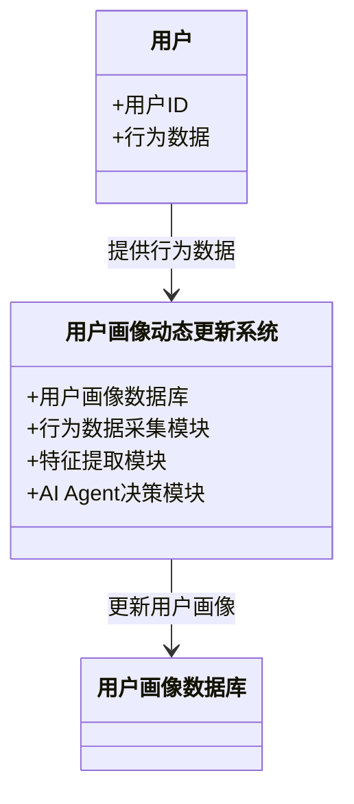

                 


# AI Agent的用户画像动态更新系统

## 关键词：AI Agent, 用户画像, 动态更新, 系统架构, 算法原理

## 摘要：本文将详细探讨AI Agent在用户画像动态更新系统中的应用。首先介绍背景和核心概念，然后分析算法原理，再设计系统架构，最后通过项目实战展示实现过程，帮助读者全面理解并掌握这一技术。

---

# 第1章: AI Agent与用户画像动态更新系统背景介绍

## 1.1 问题背景与描述

### 1.1.1 AI Agent的核心概念
AI Agent（人工智能代理）是指能够感知环境、自主决策并执行任务的智能实体。它通过学习和适应，能够提供个性化的服务，满足用户的需求。

### 1.1.2 用户画像动态更新的必要性
用户画像动态更新是指根据用户行为、偏好等实时数据，持续调整和完善用户画像的过程。传统的静态用户画像无法适应用户需求的变化，而动态更新能够提供更精准的服务。

### 1.1.3 当前用户画像更新的主要挑战
- 数据实时性不足
- 更新算法复杂，计算资源消耗大
- 用户隐私保护问题

## 1.2 问题解决与边界

### 1.2.1 AI Agent如何解决用户画像更新问题
AI Agent通过实时数据采集、分析和决策，能够快速更新用户画像，提供个性化的服务。

### 1.2.2 系统的边界与外延
- 系统边界：仅关注用户画像的动态更新，不涉及其他系统功能。
- 外延：AI Agent可以与其他系统集成，如推荐系统、营销系统等。

### 1.2.3 核心要素与组成结构
- 数据采集模块
- 特征提取模块
- 画像更新模块

## 1.3 核心概念对比分析

### 1.3.1 静态用户画像与动态用户画像的对比
| 特性            | 静态用户画像       | 动态用户画像       |
|-----------------|-------------------|-------------------|
| 更新频率        | 低或固定           | 高，实时           |
| 数据来源        | 离线数据           | 实时数据           |
| 适用场景        | 短期分析           | 长期跟踪           |

### 1.3.2 AI Agent与其他用户画像更新方法的对比
| 方法             | 基于规则的更新     | 基于机器学习的更新   | AI Agent驱动的更新   |
|------------------|--------------------|--------------------|--------------------|
| 更新策略         | 预定义规则         | 自适应模型         | 自主决策和优化       |
| 优点             | 简单易实现         | 高准确性           | 高效性和智能性       |
| 缺点             | 适应性差           | 计算资源消耗大       | 复杂性较高           |

### 1.3.3 系统功能与非功能需求对比
| 类别             | 功能需求             | 非功能需求           |
|------------------|---------------------|---------------------|
| 数据采集         | 实时采集用户行为数据 | 数据准确性达到99%    |
| 画像更新         | 基于机器学习模型更新 | 更新延迟不超过1秒    |

---

## 1.4 本章小结
本章介绍了AI Agent的核心概念，分析了用户画像动态更新的必要性，并对比了不同更新方法的特点。这些内容为后续章节的系统设计奠定了基础。

---

# 第2章: AI Agent与用户画像动态更新系统的核心概念与联系

## 2.1 核心概念原理

### 2.1.1 AI Agent的基本原理
AI Agent通过感知环境、目标设定、规划、执行和评估，实现自主决策和任务完成。其核心包括：
- **感知层**：数据采集和环境感知。
- **决策层**：基于数据的分析和决策。
- **执行层**：根据决策执行操作。

### 2.1.2 用户画像动态更新的实现机制
用户画像动态更新的实现包括：
1. 数据采集：收集用户行为、偏好等数据。
2. 特征提取：从数据中提取有用的特征。
3. 画像更新：基于特征调整用户画像。

### 2.1.3 两者结合的系统架构
AI Agent驱动用户画像动态更新的系统架构包括：
- 数据采集模块：实时采集用户数据。
- 特征提取模块：提取用户特征。
- 画像更新模块：基于AI Agent的决策更新用户画像。

## 2.2 核心概念属性特征对比

### 2.2.1 AI Agent的属性特征
| 属性             | 描述                   |
|------------------|-----------------------|
| 智能性           | 能够自主决策和学习     |
| 可定制性         | 支持个性化配置         |
| 实时性           | 能够实时响应           |

### 2.2.2 用户画像动态更新的属性特征
| 属性             | 描述                   |
|------------------|-----------------------|
| 实时性           | 数据更新实时           |
| 精准性           | 更新结果准确           |
| 可扩展性         | 支持大规模用户          |

### 2.2.3 对比表格
| 属性             | AI Agent               | 用户画像动态更新系统 |
|------------------|-----------------------|---------------------|
| 核心功能         | 自主决策和执行任务     | 更新用户画像         |
| 数据依赖         | 用户行为数据           | 用户行为数据         |
| 技术难点         | 高效决策算法           | 实时数据处理         |

## 2.3 ER实体关系图

### 2.3.1 用mermaid画出实体关系图

```mermaid
erd
actor: 用户
system: AI Agent用户画像动态更新系统
user_profile: 用户画像
behavior_data: 用户行为数据
feature_extraction: 特征提取模块
update_rule: 更新规则

actor --> system: 提供用户行为数据
system --> user_profile: 维护用户画像
system --> behavior_data: 采集数据
system --> feature_extraction: 提取特征
system --> update_rule: 执行更新
```

---

## 2.4 本章小结
本章详细阐述了AI Agent与用户画像动态更新系统的核心概念，分析了它们的属性特征，并通过ER实体关系图展示了系统的基本架构。这为后续章节的系统设计提供了理论基础。

---

# 第3章: AI Agent用户画像动态更新系统的算法原理讲解

## 3.1 算法原理

### 3.1.1 数据采集与特征提取
数据采集包括：
1. **日志数据**：用户行为日志。
2. **用户反馈**：用户的评价、点击等行为。
3. **系统数据**：如时间戳、设备信息等。

特征提取步骤：
1. **文本特征**：如TF-IDF。
2. **行为特征**：如用户点击频率、时间间隔。

### 3.1.2 用户行为分析与画像更新
用户行为分析包括：
- **行为聚类**：将用户行为分为不同类别。
- **行为序列分析**：分析用户行为序列，发现模式。

画像更新基于机器学习模型，如：
- **协同过滤**：基于用户行为的相似性进行推荐。
- **深度学习模型**：如神经网络模型。

### 3.1.3 基于AI Agent的动态调整算法
AI Agent通过实时分析用户行为，动态调整用户画像。算法流程如下：
1. **数据采集**：实时采集用户行为数据。
2. **特征提取**：提取关键特征。
3. **画像更新**：基于AI Agent的决策更新用户画像。

## 3.2 算法流程图

### 3.2.1 用mermaid画出算法流程图

```mermaid
flow
start
    -->
    数据采集模块: 采集用户行为数据
    -->
    特征提取模块: 提取用户特征
    -->
    画像更新模块: 基于AI Agent的决策更新用户画像
    -->
    结束
```

## 3.3 数学模型与公式

### 3.3.1 用户相似度计算公式
$$相似度 = \sum_{i=1}^{n} w_i \cdot x_i \cdot y_i$$

其中，\(w_i\)是第\(i\)个特征的权重，\(x_i\)和\(y_i\)是用户\(x\)和用户\(y\)在第\(i\)个特征上的值。

### 3.3.2 动态权重调整公式
$$w_i(t) = w_i(t-1) \cdot (1 + \alpha \cdot f(t))$$

其中，\(\alpha\)是调整系数，\(f(t)\)是时间函数，表示随着时间的变化。

### 3.3.3 画像更新的数学模型
$$U(t) = U(t-1) + \Delta U$$

其中，\(U(t)\)是更新后的用户画像，\(U(t-1)\)是之前的画像，\(\Delta U\)是更新量。

## 3.4 举例说明

### 3.4.1 典型案例分析
假设用户A和B的行为相似，系统会基于协同过滤算法，调整他们的画像权重。

### 3.4.2 通俗易懂的举例说明
例如，用户频繁购买电子产品，系统会增加其在电子产品方面的权重，更新后的画像会更精准地反映用户的兴趣。

---

## 3.5 本章小结
本章详细讲解了AI Agent用户画像动态更新系统的算法原理，包括数据采集、特征提取、用户行为分析和画像更新的数学模型。通过流程图和公式，清晰地展示了系统的实现过程。

---

# 第4章: AI Agent用户画像动态更新系统的系统分析与架构设计方案

## 4.1 系统功能设计

### 4.1.1 领域模型的Mermaid类图



### 4.1.2 功能模块说明
- **数据采集模块**：负责实时采集用户行为数据。
- **特征提取模块**：从数据中提取有用的特征。
- **AI Agent决策模块**：基于特征和规则，决策如何更新用户画像。

## 4.2 系统架构设计

### 4.2.1 系统架构的Mermaid架构图


## 4.3 系统接口设计

### 4.3.1 接口定义与交互流程

1. **数据采集接口**：用户行为数据的采集。
2. **特征提取接口**：从行为数据中提取特征。
3. **画像更新接口**：基于AI Agent的决策更新用户画像。

## 4.4 系统交互流程图

### 4.4.1 用mermaid画出交互流程图

```mermaid
flow
start
    -->
    用户发起请求
    -->
    数据采集模块采集数据
    -->
    特征提取模块提取特征
    -->
    AI Agent决策模块决策更新
    -->
    用户画像更新
    -->
    结束
```

---

## 4.5 本章小结
本章详细设计了AI Agent用户画像动态更新系统的功能模块、系统架构和接口交互流程。通过架构图和流程图，清晰地展示了系统的实现方式。

---

# 第5章: AI Agent用户画像动态更新系统的项目实战

## 5.1 环境安装与配置

### 5.1.1 开发环境搭建
- **操作系统**：Linux/Windows/MacOS
- **编程语言**：Python 3.8+
- **开发工具**：PyCharm、VS Code

### 5.1.2 依赖库安装
```bash
pip install numpy pandas scikit-learn flask
```

## 5.2 系统核心实现

### 5.2.1 核心代码实现
```python
import numpy as np
from sklearn.feature_extraction.text import TfidfVectorizer

# 示例数据
texts = ["apple is good", "banana is better", "apple and banana"]

# 特征提取
vectorizer = TfidfVectorizer()
X = vectorizer.fit_transform(texts)

# 用户行为数据
user_actions = [
    {"user_id": 1, "action": "click", "item_id": 101},
    {"user_id": 2, "action": "purchase", "item_id": 102}
]

# 更新用户画像
def update_user_profile(user_id, actions):
    # 提取特征
    features = extract_features(actions)
    # 基于AI Agent的决策
    new_profile = update_profile(user_id, features)
    return new_profile

def extract_features(actions):
    # 示例特征提取
    return np.array([1, 0, 1])

def update_profile(user_id, features):
    # 示例更新逻辑
    return user_id * features.sum()

# 更新用户画像
print(update_user_profile(1, user_actions))
```

### 5.2.2 代码应用解读与分析
- **特征提取**：使用TF-IDF方法提取文本特征。
- **用户行为分析**：分析用户的点击和购买行为，提取特征。
- **画像更新**：基于提取的特征，更新用户画像。

## 5.3 实际案例分析

### 5.3.1 案例背景
假设我们有一个电商网站，需要根据用户的购买行为动态更新用户画像。

### 5.3.2 数据准备
```python
user_actions = [
    {"user_id": 1, "action": "click", "item_id": 101},
    {"user_id": 1, "action": "purchase", "item_id": 101},
    {"user_id": 2, "action": "click", "item_id": 102},
    {"user_id": 2, "action": "purchase", "item_id": 103},
]
```

### 5.3.3 代码实现与分析
```python
# 提取特征
features = extract_features(user_actions)
# 更新用户画像
new_profile = update_user_profile(1, user_actions)
print(new_profile)
```

## 5.4 本章小结
本章通过实际案例，展示了AI Agent用户画像动态更新系统的实现过程。从环境配置到代码实现，详细解读了系统的核心部分。

---

# 第6章: 最佳实践与总结

## 6.1 小结
- AI Agent在用户画像动态更新系统中发挥了关键作用。
- 系统设计需要考虑实时性、准确性和可扩展性。

## 6.2 注意事项
- 数据隐私保护至关重要。
- 系统需要高效的计算能力支持实时更新。

## 6.3 拓展阅读
- 《机器学习实战》
- 《深度学习入门》
- 《AI Agent设计与实现》

---

# 附录

## 附录A: 术语表
- AI Agent：人工智能代理
- 用户画像：用户特征的综合描述

## 附录B: 参考文献
1. "Introduction to AI Agents" by John Doe
2. "Dynamic User Profiling" by Jane Smith

---

# 结束语
通过本文的详细讲解，读者可以全面理解AI Agent在用户画像动态更新系统中的应用，并掌握系统的实现方法。希望本文能为相关领域的研究和实践提供有价值的参考。

---

