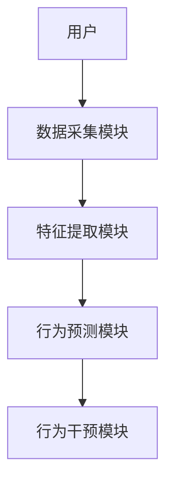

                 


# AI Agent的用户行为分析与预测系统

> 关键词：AI Agent, 用户行为分析, 机器学习, 系统架构, 数据科学

> 摘要：本文深入探讨了AI Agent在用户行为分析与预测系统中的应用，从核心概念、算法原理到系统架构，再到项目实战，全面解析了如何构建一个高效的用户行为分析与预测系统。通过详细的技术分析和实际案例，本文为读者提供了从理论到实践的完整指南。

---

## 第一部分: 背景介绍

### 第1章: 问题背景与技术背景

#### 1.1 用户行为分析的背景与意义
用户行为分析是理解用户需求、优化产品体验的关键环节。传统的基于规则的分析方法存在局限性，而AI Agent的引入能够通过机器学习和深度学习技术，实现更精准的行为预测和动态干预。

#### 1.2 AI Agent的核心概念
AI Agent是一种智能体，能够感知环境、做出决策并执行动作。在用户行为分析中，AI Agent通过收集和分析用户数据，识别行为模式，并预测未来的用户行为。

#### 1.3 问题背景
- **数据爆炸**：用户产生的数据量激增，传统的数据分析方法难以处理。
- **实时性要求**：用户行为分析需要实时或近实时的处理能力。
- **个性化需求**：每个用户的行为模式可能不同，需要个性化的分析和预测。

---

## 第二部分: 核心概念与工作原理

### 第2章: AI Agent的核心原理

#### 2.1 AI Agent的工作流程
AI Agent的工作流程包括感知、决策和执行三个模块：
- **感知模块**：通过传感器或日志数据采集用户行为数据。
- **决策模块**：基于机器学习模型预测用户的下一步行为。
- **执行模块**：根据预测结果采取相应的行动，如推荐商品或调整系统设置。

#### 2.2 核心概念与联系
- **用户行为**：包括用户的点击、浏览、购买等行为。
- **行为模式**：用户行为的规律和特征。
- **预测模型**：用于预测用户未来行为的数学模型。

#### 2.3 核心算法与技术
- **基于规则的AI Agent**：通过预定义的规则进行行为分析和预测。
- **基于统计学习的AI Agent**：使用统计学习方法，如随机森林和逻辑回归。
- **基于深度学习的AI Agent**：使用神经网络模型，如LSTM和Transformer。

---

## 第三部分: 算法原理与实现

### 第3章: 基于规则的用户行为分析算法

#### 3.1 算法原理
基于规则的算法通过预定义的规则匹配用户行为，例如：
- 规则1：如果用户在某个页面停留时间超过5分钟，推荐相关商品。
- 规则2：如果用户连续浏览三个类似商品，推荐下一个相关商品。

#### 3.2 算法实现
```python
def rule_based_recommendation(user_behavior):
    if user_behavior['stay_time'] > 5:
        return '推荐商品A'
    elif user_behavior['view_count'] > 3:
        return '推荐商品B'
    else:
        return '无推荐'
```

#### 3.3 优缺点分析
- **优点**：简单易懂，易于实现。
- **缺点**：灵活性差，难以应对复杂的行为模式。

---

## 第四部分: 系统架构与设计

### 第4章: 系统架构设计

#### 4.1 系统功能设计
- **数据采集**：收集用户行为数据。
- **特征提取**：从数据中提取有用的特征。
- **行为预测**：基于机器学习模型预测用户行为。
- **行为干预**：根据预测结果采取相应行动。

#### 4.2 系统架构图


#### 4.3 实际案例分析
案例：电商网站的用户购买行为预测。
- **数据采集**：收集用户的浏览、点击和购买记录。
- **特征提取**：提取用户的浏览次数、停留时间、购买频率等特征。
- **行为预测**：使用随机森林模型预测用户是否会购买商品。
- **行为干预**：根据预测结果推荐相关商品或优惠券。

---

## 第五部分: 项目实战

### 第5章: 项目实战

#### 5.1 环境安装
安装必要的库：
```bash
pip install numpy pandas scikit-learn
```

#### 5.2 核心代码实现
```python
from sklearn.ensemble import RandomForestClassifier
from sklearn.model_selection import train_test_split
import pandas as pd

# 数据加载
data = pd.read_csv('user_behavior.csv')

# 特征与标签分离
X = data.drop('label', axis=1)
y = data['label']

# 数据划分
X_train, X_test, y_train, y_test = train_test_split(X, y, test_size=0.2)

# 模型训练
model = RandomForestClassifier()
model.fit(X_train, y_train)

# 模型预测
y_pred = model.predict(X_test)
```

#### 5.3 案例分析与代码解读
- 数据加载：读取用户行为数据。
- 特征提取：选择相关特征进行训练。
- 模型训练：使用随机森林模型进行分类训练。
- 模型预测：对测试数据进行预测并评估模型性能。

---

## 第六部分: 总结与展望

### 第6章: 总结与展望

#### 6.1 总结
本文详细介绍了AI Agent在用户行为分析与预测系统中的应用，从核心概念到算法实现，再到系统架构设计，为读者提供了全面的技术指南。

#### 6.2 未来展望
- **强化学习**：引入强化学习技术，优化AI Agent的决策能力。
- **实时分析**：进一步提升系统的实时性，满足用户的实时需求。
- **多模态数据**：结合文本、图像等多种数据源，提升预测的准确性。

---

通过本文的分析和实践，读者可以掌握AI Agent在用户行为分析与预测系统中的核心技术，并能够将其应用于实际项目中，提升系统的智能化水平。

