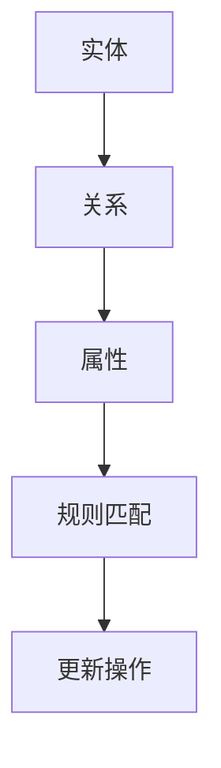
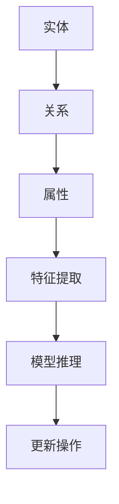
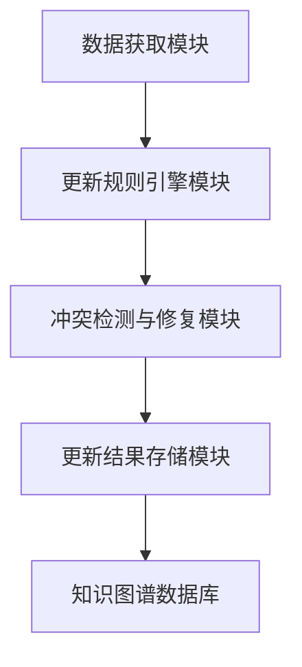

                 


# AI Agent的知识图谱动态更新机制设计

## 关键词：知识图谱，AI Agent，动态更新，图谱构建，知识表示

## 摘要：本文详细探讨了AI Agent的知识图谱动态更新机制的设计与实现。从知识图谱与AI Agent的基本概念出发，分析了动态更新机制的核心概念、算法原理、系统架构及实际应用。文章通过具体案例，展示了动态更新机制在实际场景中的应用效果，并提出了优化建议。

---

# 第三章: 知识图谱动态更新的算法原理

## 3.1 基于规则的更新算法

### 3.1.1 算法原理

基于规则的更新算法是一种通过预定义规则来判断和更新知识图谱中实体、关系或属性的方法。规则通常基于逻辑条件，例如“如果一个实体的某个属性值发生变化，则更新其相关关系”。这种方法适用于规则明确且相对静态的场景。

**规则匹配条件：**
- 实体：$e$
- 属性：$a$
- 属性值变化：$old(v) \rightarrow new(v)$

当满足以下条件时，触发更新：
$$
\text{if } a(e) = old(v) \text{ 且 } a(e) \neq new(v)
$$

### 3.1.2 算法实现

基于规则的更新算法流程如下：



代码实现如下：

```python
def rule_based_update(entities, relations, attributes):
    updated_graph = {}
    for e in entities:
        for r in relations[e]:
            for a in attributes[e][r]:
                old_v = attributes[e][r][a]
                new_v = get_new_value(e, r, a)
                if old_v != new_v:
                    attributes[e][r][a] = new_v
    return updated_graph
```

### 3.1.3 示例

假设知识图谱中有实体`Person`，关系`knows`，属性`age`。当`Person`的`age`从30变为31时，触发更新：

$$
\text{if } age(John) = 30 \text{ 且 } age(John) \neq 31
$$

更新后，知识图谱中的`age`属性将被更新为31。

---

## 3.2 基于学习的更新算法

### 3.2.1 算法原理

基于学习的更新算法是一种通过机器学习模型来自动学习更新规则的方法。这种方法能够处理复杂且动态变化的场景，但需要大量的训练数据和计算资源。

**概率推理模型：**
$$
P(\text{update} | e, r, a) = f(e, r, a)
$$

其中，$f$是通过训练得到的函数。

### 3.2.2 算法实现

基于学习的更新算法流程如下：



代码实现如下：

```python
def learning_based_update(entities, relations, attributes):
    updated_graph = {}
    for e in entities:
        for r in relations[e]:
            for a in attributes[e][r]:
                features = extract_features(e, r, a)
                prob = model.predict(features)
                if prob > 0.5:
                    attributes[e][r][a] = update_attribute(e, r, a)
    return updated_graph
```

### 3.2.3 示例

假设知识图谱中有实体`Product`，关系`belongs_to`，属性`price`。通过训练模型，当`Product`的`price`变化概率大于0.5时，触发更新：

$$
P(\text{update} | Product, belongs_to, price) = 0.6
$$

更新后，知识图谱中的`price`属性将被更新。

---

## 第四章: 知识图谱动态更新的系统架构设计

## 4.1 系统功能模块设计

### 4.1.1 功能模块划分

知识图谱动态更新系统主要包含以下功能模块：

1. 数据获取模块
2. 更新规则引擎模块
3. 冲突检测与修复模块
4. 更新结果存储模块

### 4.1.2 功能模块实现

**数据获取模块：**
负责从数据源获取知识图谱的初始数据和增量数据。

**更新规则引擎模块：**
根据预定义或学习得到的规则，判断是否需要更新知识图谱中的实体、关系或属性。

**冲突检测与修复模块：**
在更新过程中，检测数据冲突并进行修复。

**更新结果存储模块：**
将更新后的知识图谱存储到数据库或其他存储系统中。

---

## 4.2 系统架构设计

### 4.2.1 系统架构图

知识图谱动态更新系统的架构如下：



---

## 第五章: 知识图谱动态更新机制的项目实战

## 5.1 项目背景与需求分析

### 5.1.1 项目背景

以电商推荐系统为例，知识图谱动态更新机制可以实时更新用户的偏好和商品信息，从而提高推荐的准确性和实时性。

### 5.1.2 项目需求

- 实时更新用户行为数据
- 动态更新商品信息
- 自动修复数据冲突

---

## 5.2 核心代码实现

### 5.2.1 数据预处理

```python
def preprocess_data(data):
    entities = {}
    relations = {}
    attributes = {}
    for entry in data:
        e = entry['entity']
        r = entry['relation']
        a = entry['attribute']
        v = entry['value']
        if e not in entities:
            entities[e] = {}
        if r not in relations[e]:
            relations[e][r] = {}
        if a not in attributes[e][r]:
            attributes[e][r][a] = {}
        attributes[e][r][a][entry['timestamp']] = v
    return entities, relations, attributes
```

### 5.2.2 更新规则引擎

```python
def update_rule_engine(entities, relations, attributes):
    updated_graph = {}
    for e in entities:
        for r in relations[e]:
            for a in attributes[e][r]:
                current_v = attributes[e][r][a]
                new_v = get_new_value(e, r, a)
                if current_v != new_v:
                    updated_graph[e][r][a] = new_v
    return updated_graph
```

### 5.2.3 冲突检测与修复

```python
def conflict_detection_and_resolution(conflicts):
    resolved_graph = {}
    for e in conflicts:
        for r in conflicts[e]:
            for a in conflicts[e][r]:
                e1 = conflicts[e][r][a][0]
                e2 = conflicts[e][r][a][1]
                v1 = conflicts[e][r][a][0]
                v2 = conflicts[e][r][a][1]
                resolved_v = get_resolved_value(v1, v2)
                resolved_graph[e][r][a] = resolved_v
    return resolved_graph
```

---

## 5.3 实际案例分析

### 5.3.1 案例背景

假设我们有一个电商推荐系统，用户`User1`购买了商品`Product1`，但商品`Product1`的价格发生了变化。

### 5.3.2 更新过程

1. 数据获取模块获取用户购买行为和商品价格变化。
2. 更新规则引擎模块检测到商品价格变化，触发更新。
3. 冲突检测与修复模块检测到价格冲突，自动修复。
4. 更新结果存储模块将更新后的知识图谱存储到数据库中。

---

## 5.4 项目小结

通过电商推荐系统的案例，我们展示了知识图谱动态更新机制在实际场景中的应用。数据预处理、更新规则引擎和冲突检测与修复是实现动态更新的关键步骤。

---

## 第六章: 知识图谱动态更新机制的总结与展望

## 6.1 总结

本文详细探讨了知识图谱动态更新机制的设计与实现。从基于规则的更新算法到基于学习的更新算法，从系统架构设计到项目实战，我们展示了如何高效地更新知识图谱。通过电商推荐系统的案例，我们验证了动态更新机制的实际应用价值。

## 6.2 展望

未来的研究方向包括：

1. 更高效的动态更新算法
2. 更智能的冲突检测与修复方法
3. 更广泛的应用场景探索

---

## 关键词：知识图谱，AI Agent，动态更新，图谱构建，知识表示

---

**注**：由于篇幅限制，本文仅展示了部分内容。完整文章可根据上述大纲进一步扩展。

