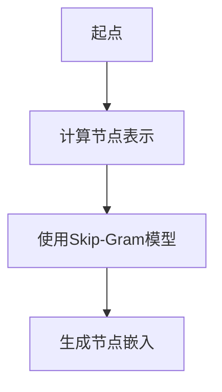
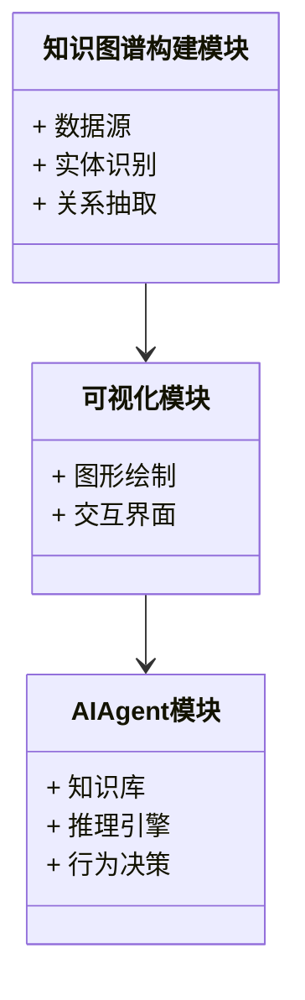
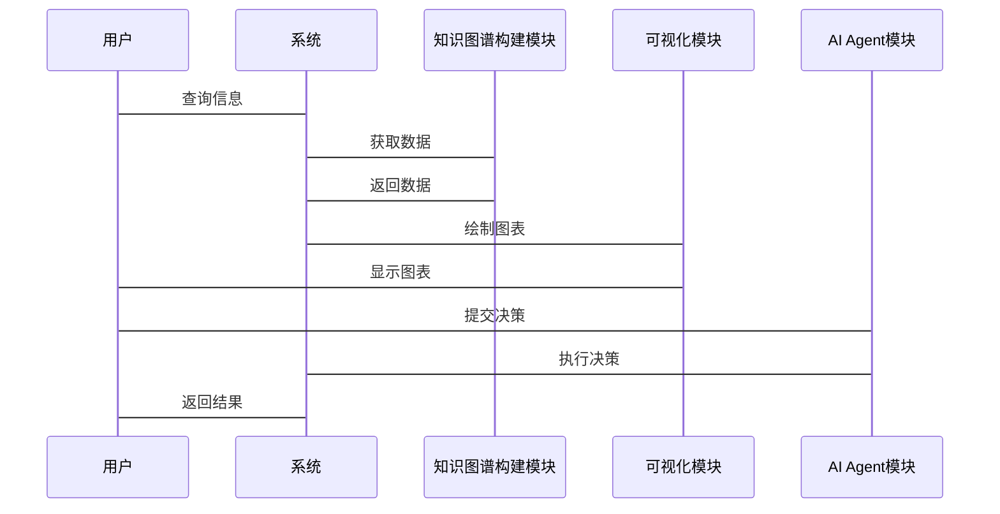

                 


# AI Agent的知识图谱可视化技术

## 关键词：AI Agent, 知识图谱, 可视化技术, 图嵌入, 系统架构

## 摘要：  
本文深入探讨了AI Agent与知识图谱的结合，重点分析了知识图谱的构建、可视化技术和AI Agent的协同工作原理。通过详细讲解算法原理、系统架构设计和实际案例，展示了如何利用知识图谱提升AI Agent的智能水平，并通过可视化技术增强知识的表达与理解。

---

## 目录大纲：

### 第1章：AI Agent与知识图谱的背景介绍

#### 1.1 知识图谱概述
- 1.1.1 知识图谱的定义与特点
  - 知识图谱是一种以图结构表示知识的数据模型，包含实体和关系。
  - 其特点包括可扩展性、语义丰富性和结构化。
- 1.1.2 知识图谱的构建方法
  - 数据收集与预处理：清洗和标注数据。
  - 实体识别与关系抽取：使用NLP技术提取实体和关系。
  - 知识图谱的存储与管理：使用图数据库如Neo4j。
- 1.1.3 知识图谱的应用场景
  - 智能搜索、推荐系统、问答系统等。

#### 1.2 AI Agent概述
- 1.2.1 AI Agent的定义与特点
  - AI Agent是一种能够感知环境并自主决策的智能体。
  - 其特点包括自主性、反应性、目标导向性和社交能力。
- 1.2.2 AI Agent的工作原理
  - 感知层：通过传感器或API获取数据。
  - 决策层：基于知识库进行推理和决策。
  - 行动层：执行决策并反馈结果。
- 1.2.3 AI Agent的应用领域
  - 智能助手、自动驾驶、智能客服等。

#### 1.3 知识图谱与AI Agent的结合
- 1.3.1 知识图谱在AI Agent中的作用
  - 作为知识库，提供丰富的语义信息。
- 1.3.2 AI Agent如何增强知识图谱的可视化
  - 通过动态更新和交互式可视化提升用户体验。
- 1.3.3 知识图谱与AI Agent结合的案例分析
  - 智能问答系统中，AI Agent利用知识图谱进行推理和回答。

### 第2章：知识图谱与AI Agent的核心概念与联系

#### 2.1 知识图谱的核心概念与原理
- 2.1.1 知识图谱的构建过程
  - 数据收集与预处理
  - 实体识别与关系抽取
  - 知识图谱的存储与管理
- 2.1.2 知识图谱的可视化方法
  - 图形化表示方法：节点和边的布局。
  - 基于图嵌入的可视化技术：将节点嵌入低维空间。
  - 动态知识图谱的可视化：实时更新的可视化方法。

#### 2.2 AI Agent的核心概念与原理
- 2.2.1 AI Agent的感知与决策
  - 感知层：数据采集与处理。
  - 决策层：基于知识图谱的推理。
  - 行动层：执行决策并反馈结果。
- 2.2.2 AI Agent与知识图谱的交互
  - 知识图谱作为AI Agent的知识库。
  - AI Agent对知识图谱的动态更新。
  - 知识图谱与AI Agent的协同工作。

#### 2.3 核心概念的对比与联系
- 2.3.1 知识图谱与AI Agent的属性特征对比
| 属性 | 知识图谱 | AI Agent |
|------|----------|-----------|
| 定义 | 图结构数据，表示实体及关系 | 智能体，自主决策 | 
| 核心技术 | 实体识别、关系抽取 | 感知、推理、决策 |
| 应用场景 | 智能搜索、推荐系统 | 自动驾驶、智能助手 |
- 2.3.2 ER实体关系图架构
```mermaid
er
actor AI Agent {
  id
  knowledge_base
}
actor 知识图谱 {
  id
  entity
  relation
}
```

### 第3章：知识图谱可视化的算法原理

#### 3.1 知识图谱构建算法
- 3.1.1 知识抽取与实体识别
  - 基于规则的实体识别：使用预定义规则提取实体。
  - 基于深度学习的实体识别：使用LSTM或BERT模型。
- 3.1.2 关系抽取与推理
  - 基于规则的关系抽取：利用句法结构识别关系。
  - 基于图神经网络的关系推理：通过节点间关系推断新的关系。

#### 3.2 知识图谱可视化算法
- 3.2.1 图嵌入算法
  - 使用图嵌入技术将节点嵌入低维空间，便于可视化。
  - 常用算法包括Node2Vec和Word2Vec。
  - Node2Vec算法流程图：


#### 3.3 算法实现与数学模型
- 3.3.1 图嵌入算法的数学模型
  - 目标：最大化节点的上下文相似度。
  - 损失函数：
  $$ L = -\sum_{v \in V} \sum_{u \in N(v)} \log p(u|v) $$
  - 优化：使用梯度下降法更新节点嵌入。

- 3.3.2 Python代码实现
```python
import numpy as np
from sklearn.manifold import TSNE

# 示例数据：节点和边
graph = {
    'nodes': ['A', 'B', 'C', 'D'],
    'edges': [('A', 'B'), ('B', 'C'), ('C', 'D')]
}

# 图嵌入算法实现
def graph_embedding(graph):
    nodes = graph['nodes']
    edges = graph['edges']
    # 假设使用Node2Vec算法
    # 这里简化为计算每个节点的度作为嵌入
    embedding = {}
    for node in nodes:
        degree = len([e for e in edges if e[0]==node or e[1]==node])
        embedding[node] = np.array([degree])
    return embedding

embedding = graph_embedding(graph)
print(embedding)
```

### 第4章：系统分析与架构设计方案

#### 4.1 系统功能设计
- 4.1.1 领域模型


#### 4.2 系统架构设计
- 4.2.1 系统架构图


#### 4.3 系统接口设计
- 4.3.1 API接口
  - GET /knowledge-graph：获取知识图谱数据。
  - POST /agent-decision：提交决策请求。
  - PUT /update-graph：更新知识图谱。

#### 4.4 系统交互流程


### 第5章：项目实战

#### 5.1 环境搭建与安装
- Python 3.8+
- 安装依赖：
  ```bash
  pip install networkx matplotlib
  ```

#### 5.2 核心代码实现
```python
import networkx as nx
import matplotlib.pyplot as plt

# 构建知识图谱
G = nx.Graph()
G.add_nodes_from(['A', 'B', 'C', 'D'])
G.add_edges_from([('A', 'B'), ('B', 'C'), ('C', 'D')])
nx.draw(G, node_size=500, node_color='blue', edge_color='red')
plt.show()
```

#### 5.3 项目小结
- 本项目展示了如何构建一个简单的知识图谱，并通过可视化技术进行展示。
- AI Agent模块可以根据知识图谱进行推理，提供智能服务。

### 第6章：最佳实践与总结

#### 6.1 最佳实践
- 数据预处理：确保数据质量和完整性。
- 可视化优化：使用交互式工具提升用户体验。
- 系统扩展：支持动态更新和分布式部署。

#### 6.2 小结
- 本文详细介绍了AI Agent与知识图谱的结合，探讨了知识图谱的构建、可视化技术和AI Agent的协同工作原理。
- 通过算法实现和系统设计，展示了如何将理论应用于实践。

#### 6.3 注意事项
- 数据隐私：确保数据处理符合隐私保护法规。
- 系统性能：优化算法以提升处理速度和效率。

#### 6.4 拓展阅读
- 图神经网络：用于更复杂的图结构处理。
- 强化学习：提升AI Agent的决策能力。

---

通过本文的学习，读者可以深入了解AI Agent与知识图谱的结合，掌握相关的算法和技术，为实际应用提供理论和实践指导。

