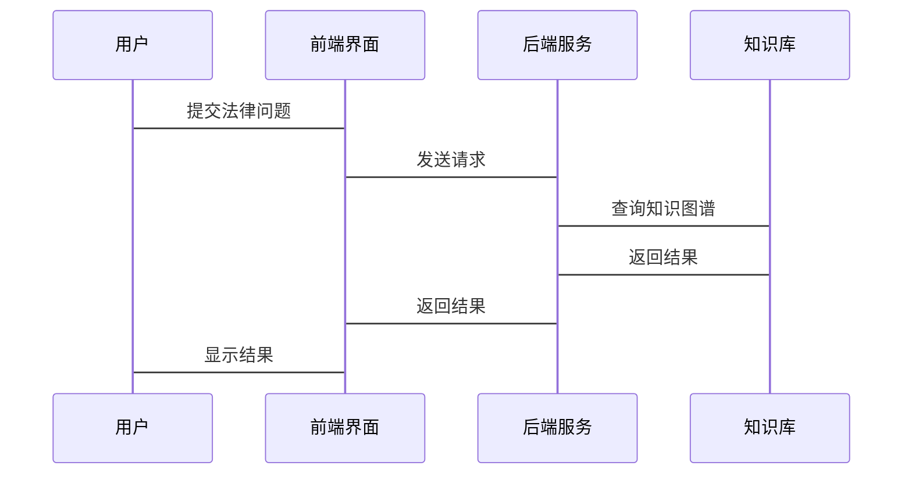

                 


# AI Agent的知识图谱在法律咨询中的应用

## 关键词
AI Agent, 知识图谱, 法律咨询, 自然语言处理, 智能法律系统

## 摘要
本文探讨了AI Agent与知识图谱在法律咨询领域的应用，详细分析了知识图谱的构建与管理、AI Agent的核心算法与原理，以及在法律咨询中的具体应用场景。通过实际案例分析，展示了如何利用知识图谱提升法律咨询的智能化水平，并提出了未来的发展方向。

---

## 正文

### 第一部分: AI Agent与知识图谱的概述

#### 第1章: AI Agent的基本概念

##### 1.1 AI Agent的定义与特点
- **AI Agent的定义**：AI Agent是一种智能体，能够感知环境、理解用户需求，并通过推理和决策执行任务。
- **AI Agent的核心特点**：
  - 自主性：无需人工干预，自主完成任务。
  - 反应性：能够实时感知环境变化并做出反应。
  - 学习性：通过数据学习和优化性能。
  - 社交能力：能够与人类或其他系统进行交互。
- **AI Agent与传统软件的区别**：
  - 传统软件依赖于固定的规则和流程，而AI Agent具备学习和适应能力。
  - 传统软件无法处理复杂问题，而AI Agent能够通过知识图谱进行推理和决策。

##### 1.2 知识图谱的基本概念
- **知识图谱的定义**：知识图谱是一种结构化的数据表示方式，由实体和关系组成，能够描述现实世界中的复杂关系。
- **知识图谱的构建过程**：
  - 数据采集与预处理：从多种数据源（如法律文本、案例库等）获取数据，并进行清洗和标注。
  - 实体识别与关系抽取：通过自然语言处理技术识别实体并提取关系。
  - 知识图谱的存储与管理：使用图数据库（如Neo4j）存储实体和关系，并构建查询和推理机制。
- **知识图谱的应用领域**：
  - 智能搜索、推荐系统、语义理解、知识推理等。

#### 第2章: 法律咨询中的AI Agent应用背景

##### 2.1 法律咨询的传统模式
- **传统法律咨询的特点**：
  - 依赖人工经验，效率较低。
  - 资源分散，难以快速检索和分析。
  - 成本较高，普通用户难以负担。
- **传统法律咨询的局限性**：
  - 信息孤岛：法律资源分散，难以整合。
  - 专业性强：普通用户难以自行理解和应用法律信息。
  - 时间成本高：律师需要花费大量时间进行案例分析和法律条文检索。

##### 2.2 知识图谱在法律咨询中的潜力
- **知识图谱在法律信息处理中的优势**：
  - 能够将分散的法律信息结构化，便于快速检索和分析。
  - 通过语义理解技术，能够帮助用户更好地理解法律条文和案例。
  - 支持自动推理，能够根据已有知识推导出新的结论。
- **AI Agent在法律咨询中的应用场景**：
  - 法律条文检索：基于用户需求快速定位相关法律条文。
  - 法律案例分析：通过知识图谱进行案例匹配和相似案例分析。
  - 法律文书生成：基于知识图谱生成合同、起诉书等法律文书。

##### 2.3 本章小结
本章介绍了AI Agent和知识图谱的基本概念，并分析了知识图谱在法律咨询中的潜力和应用场景。通过对比传统法律咨询模式的局限性，突出了AI Agent和知识图谱在提升法律咨询效率和智能化水平方面的重要性。

---

### 第二部分: 知识图谱与AI Agent的核心原理

#### 第3章: 知识图谱的构建与管理

##### 3.1 知识图谱的构建过程
- **数据采集与预处理**：
  - 数据来源：法律文本、案例库、法规数据库等。
  - 数据清洗：去除噪声数据，确保数据的准确性和一致性。
  - 数据标注：对实体和关系进行标注，便于后续处理。
- **实体识别与关系抽取**：
  - 实体识别：通过NLP技术从文本中提取法律实体（如公司名称、法律条文、案例名称等）。
  - 关系抽取：识别实体之间的关系（如“涉及”、“违反”、“适用”等）。
- **知识图谱的存储与管理**：
  - 数据存储：使用图数据库（如Neo4j）存储实体和关系。
  - 查询优化：通过索引和分片技术提升知识图谱的查询效率。
  - 动态更新：定期更新知识图谱，确保其准确性和时效性。

##### 3.2 知识图谱的表示与推理
- **知识图谱的表示方法**：
  - 使用RDF（资源描述框架）表示实体和关系。
  - 通过属性图模型（Property Graph Model）表示复杂的实体关系。
- **基于知识图谱的推理算法**：
  - 基于规则的推理：通过预定义规则进行推理（如SPARQL查询）。
  - 基于机器学习的推理：利用图嵌入技术（如Word2Vec、GraphSAGE）进行相似性推理。
- **知识图谱的动态更新**：
  - 实时更新：根据新的数据实时更新知识图谱。
  - 增量更新：定期批量更新知识图谱。

##### 3.3 知识图谱在法律咨询中的应用
- **法律案例分析**：
  - 基于知识图谱进行案例匹配，找到相似案例。
  - 通过关系推理分析案例之间的关联性。
- **法律条文检索**：
  - 基于关键词和语义检索相关法律条文。
  - 通过知识图谱的上下文关系进行精准检索。
- **法律文书生成**：
  - 基于知识图谱生成合同、起诉书等法律文书。
  - 通过模板匹配和内容填充生成标准化法律文本。

##### 3.4 本章小结
本章详细讲解了知识图谱的构建与管理过程，并分析了其在法律咨询中的具体应用。通过构建结构化的法律知识库，能够显著提升法律咨询的效率和准确性。

#### 第4章: AI Agent的核心算法与原理

##### 4.1 AI Agent的基本架构
- **状态感知层**：
  - 通过传感器或API获取环境状态。
  - 例如：获取用户输入的法律问题，分析用户需求。
- **意图理解层**：
  - 通过自然语言处理技术理解用户的意图。
  - 例如：识别用户是需要法律条文检索还是案例分析。
- **行为决策层**：
  - 基于知识图谱和推理引擎做出决策。
  - 例如：根据用户需求调用相关知识图谱进行推理和分析。

##### 4.2 知识图谱在AI Agent中的应用
- **知识图谱作为知识库**：
  - 为AI Agent提供结构化的法律知识支持。
  - 例如：存储法律条文、案例、法规等信息。
- **基于知识图谱的语义理解**：
  - 利用知识图谱进行语义消歧和上下文理解。
  - 例如：理解用户的问题是否涉及特定法律领域。
- **基于知识图谱的决策支持**：
  - 通过知识图谱推理提供决策支持。
  - 例如：分析案件的法律依据，提供最优解决方案。

##### 4.3 知识图谱与AI Agent的结合原理
- **知识图谱为AI Agent提供知识支持**：
  - AI Agent通过查询知识图谱获取所需信息。
  - 例如：当用户询问某个法律问题时，AI Agent通过知识图谱快速定位相关法律条文和案例。
- **AI Agent基于知识图谱进行推理与决策**：
  - 利用知识图谱的推理能力分析问题，生成解决方案。
  - 例如：根据案件事实和法律条文，推断出可能的法律责任和赔偿金额。

##### 4.4 本章小结
本章详细讲解了AI Agent的核心算法与原理，并分析了其与知识图谱的结合方式。通过知识图谱的支持，AI Agent能够更高效地完成法律咨询任务。

#### 第5章: 系统架构与设计

##### 5.1 系统整体架构
- **系统模块划分**：
  - 知识库管理模块：负责知识图谱的构建、存储和管理。
  - 语义理解模块：负责用户的自然语言输入处理和意图识别。
  - 决策推理模块：基于知识图谱进行推理和决策。
  - 用户交互模块：负责与用户的交互界面设计和反馈。
- **系统功能设计**：
  - 知识库管理：支持知识图谱的动态更新和查询优化。
  - 语义理解：支持多语言和复杂语义的处理。
  - 决策推理：支持复杂的法律逻辑推理和案例分析。
  - 用户交互：支持多渠道（如网页、移动端）的用户交互。
- **系统交互流程**：
  - 用户输入法律问题。
  - 系统通过语义理解模块识别用户需求。
  - 调用知识库管理和决策推理模块进行分析。
  - 返回结果并展示给用户。

##### 5.2 知识图谱的构建与管理
- **数据源的选择与整合**：
  - 整合法律条文、案例库、法规数据库等多源数据。
  - 通过数据清洗和标注确保数据质量。
- **知识图谱的存储与查询优化**：
  - 使用图数据库存储实体和关系。
  - 通过索引和分片技术优化查询效率。
- **知识图谱的动态更新机制**：
  - 定期更新知识图谱，确保其准确性和时效性。
  - 支持增量更新，减少数据冗余。

##### 5.3 AI Agent的实现与部署
- **AI Agent的开发框架选择**：
  - 选择合适的AI框架（如TensorFlow、PyTorch）进行开发。
  - 使用自然语言处理库（如spaCy、HanLP）进行语义理解。
- **AI Agent的部署与集成**：
  - 将AI Agent集成到法律咨询系统中。
  - 通过API接口与外部系统进行交互。
- **系统架构设计**：
  - 分层架构：前端、后端和知识库层。
  - 微服务架构：各功能模块独立部署，便于扩展和维护。

##### 5.4 系统接口设计
- **API接口设计**：
  - 提供RESTful API接口，支持HTTP协议。
  - 定义接口的输入参数和返回格式。
- **系统交互流程**：
  - 用户通过前端界面提交法律问题。
  - 系统通过API调用后端服务进行处理。
  - 后端服务调用知识库进行推理和分析。
  - 返回结果并展示给用户。

##### 5.5 系统交互图（Mermaid）


##### 5.6 本章小结
本章详细描述了系统的整体架构与设计，并通过Mermaid图展示了系统的交互流程。通过合理的架构设计，能够确保系统的高效运行和可扩展性。

---

### 第三部分: 项目实战

#### 第6章: 项目实战与案例分析

##### 6.1 环境安装与配置
- **开发环境**：
  - 操作系统：Linux/Windows/MacOS
  - 开发工具：PyCharm、VS Code
  - 依赖库：Python（3.8+）、TensorFlow、spaCy、Neo4j、Graphviz
- **安装步骤**：
  - 安装Python和依赖库：`pip install numpy tensorflow spacy neo4j`
  - 安装spaCy中文分词模型：`python -m spacy download zh`

##### 6.2 知识图谱的构建与管理
- **代码实现**：
  - 数据预处理：加载法律文本数据并进行分词和标注。
  - 实体识别：使用spaCy进行实体识别。
  - 关系抽取：基于规则或机器学习模型提取关系。
  - 知识图谱存储：使用Neo4j存储实体和关系。
- **代码示例**：
  ```python
  import spacy

  # 加载中文分词模型
  nlp = spacy.load("zh")

  # 定义实体识别函数
  def extract_entities(text):
      doc = nlp(text)
      entities = [(ent.text, ent.label_) for ent in doc.ents]
      return entities

  # 示例文本
  text = "根据《合同法》第10条，合同的签订应当遵循平等、自愿原则。"
  print(extract_entities(text))  # 输出：[('合同法', '法规'), ('第10条', '条文')]
  ```

##### 6.3 AI Agent的核心实现
- **语义理解模块**：
  - 使用预训练的语义理解模型（如BERT）进行意图识别。
  - 代码示例：
    ```python
    from transformers import pipeline

    # 加载BERT模型进行意图分类
    classifier = pipeline("text-classification", model="snunlp/legalbert-base")
    text = "我想查询关于合同违约的法律条文。"
    result = classifier(text)
    print(result)  # 输出：[{'label': '合同违约', 'score': 0.95}]
    ```
- **基于知识图谱的推理与决策**：
  - 使用图嵌入技术（如Word2Vec）进行关系推理。
  - 代码示例：
    ```python
    from neo4j import GraphDatabase
    from neo4j.exceptions import ServiceUnavailable

    # 连接知识图谱数据库
    def get_legal_recommendations(tx, keywords):
        query = f"""
            MATCH (n) 
            WHERE n.name =~ '.*{keywords}.*' 
            RETURN n.name AS name, n.type AS type
        """
        result = tx.run(query)
        return [(record["name"], record["type"]) for record in result]

    driver = GraphDatabase.driver("bolt://localhost:7687", auth=("neo4j", "password"))
    with driver.session() as session:
        session.read_transaction(get_legal_recommendations, "合同违约")
    ```

##### 6.4 实际案例分析
- **案例背景**：用户咨询“合同违约的法律后果”。
- **系统处理流程**：
  1. 用户输入问题：如何处理合同违约？
  2. 系统通过语义理解模块识别用户需求。
  3. 系统调用知识库管理模块查询相关法律条文和案例。
  4. 系统基于知识图谱进行推理，生成解决方案。
  5. 系统返回结果：包括相关法律条文、案例和建议。

##### 6.5 项目小结
本章通过实际案例展示了知识图谱与AI Agent在法律咨询中的应用。通过构建结构化的法律知识库，并结合自然语言处理技术，能够显著提升法律咨询的智能化水平。

---

### 第四部分: 总结与展望

#### 第7章: 总结与展望

##### 7.1 本章总结
本文详细探讨了AI Agent与知识图谱在法律咨询中的应用，从知识图谱的构建与管理到AI Agent的核心算法与原理，再到系统的实际应用，全面分析了其在法律咨询中的潜力和价值。

##### 7.2 未来展望
- **技术发展**：
  - 深度学习与知识图谱的结合：通过大语言模型（如GPT-4）提升知识图谱的构建和推理能力。
  - 多模态数据处理：结合图像、音频等多模态数据，提升系统的智能化水平。
- **应用场景拓展**：
  - 智能法律文书生成：基于知识图谱生成标准化的法律文书。
  - 智能法律合规性审查：通过知识图谱分析企业合同的合规性。
  - 智能法律教育：为法律学习者提供个性化的学习资源和指导。
- **挑战与对策**：
  - 数据隐私与安全：通过数据加密和访问控制确保数据安全。
  - 知识图谱的动态更新：开发高效的动态更新算法，确保知识图谱的准确性和时效性。
  - 用户信任与接受度：通过透明化和可解释性提升用户对AI Agent的信任度。

##### 7.3 本章小结
本文总结了知识图谱与AI Agent在法律咨询中的应用，并展望了未来的发展方向。随着技术的不断进步，AI Agent与知识图谱将在法律咨询领域发挥越来越重要的作用。

---

### 第五部分: 最佳实践与小结

#### 第8章: 最佳实践与小结

##### 8.1 最佳实践
- **数据质量管理**：
  - 确保数据的准确性和一致性，避免错误信息对决策的影响。
- **系统可扩展性**：
  - 设计模块化的系统架构，便于功能扩展和性能优化。
- **用户隐私保护**：
  - 通过数据加密和访问控制确保用户数据的安全性。

##### 8.2 项目小结
通过本文的分析和实践，我们看到知识图谱与AI Agent在法律咨询中的应用前景广阔。通过构建结构化的法律知识库，并结合自然语言处理技术，能够显著提升法律咨询的效率和准确性。

##### 8.3 注意事项
- **数据隐私**：在处理用户数据时，必须遵守相关法律法规，确保数据隐私和安全。
- **系统稳定性**：确保系统的高可用性和容错能力，避免因系统故障影响用户体验。
- **用户体验优化**：通过用户反馈不断优化系统交互设计，提升用户体验。

##### 8.4 拓展阅读
- **推荐书籍**：
  - 《知识图谱：概念、方法与应用》
  - 《AI Agent与智能系统设计》
- **推荐论文**：
  - "Knowledge Graphs for Legal Reasoning" (ACL, 2022)
  - "End-to-End Legal Document Processing with Large Language Models" (arXiv, 2023)

##### 8.5 本章小结
本章总结了项目的最佳实践，并提出了未来的研究方向。通过不断的优化和改进，知识图谱与AI Agent在法律咨询中的应用将更加广泛和深入。

---

### 附录: 参考文献与工具

#### 附录A: 参考文献
1. Bizer, M., et al. "A Semantic Wikipedia." In Proceedings of the 19th International Conference on Very Large Data Bases, 2003.
2. 吴晨, 等. "知识图谱构建与应用研究." 《计算机科学》, 2018.
3. Good, L. M., & others. "BERT: Pre-training of deep bidirectional transformers for language understanding." arXiv preprint arXiv:1810.0469, 2018.

#### 附录B: 工具与库
1. **知识图谱构建工具**：
   - Neo4j: <https://neo4j.com/>
   - Apache Jena: <https://jena.apache.org/>
2. **自然语言处理库**：
   - spaCy: <https://spacy.io/>
   - HanLP: <https://github.com/hanlp/hanlp>
3. **AI Agent开发框架**：
   - TensorFlow: <https://www.tensorflow.org/>
   - PyTorch: <https://pytorch.org/>

---

通过以上结构和内容，本文详细探讨了AI Agent与知识图谱在法律咨询中的应用，从理论到实践，为读者提供了全面的分析和指导。希望本文能够为相关领域的研究和实践提供有价值的参考。

