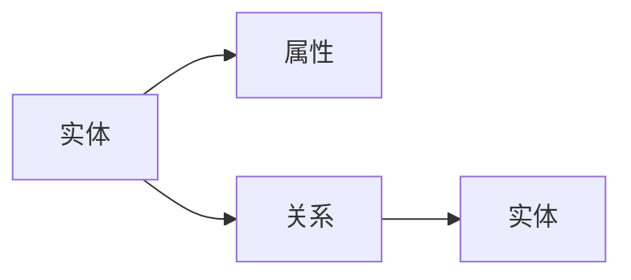
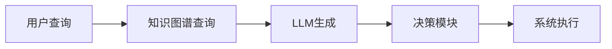

                 


# AI Agent的知识图谱增强：整合LLM与结构化知识

**关键词**：知识图谱、AI Agent、大语言模型（LLM）、结构化知识、增强学习、自然语言处理（NLP）、人工智能（AI）

**摘要**：本文探讨了如何通过整合知识图谱与大语言模型（LLM）来增强AI Agent的知识表示和推理能力，从而提升其在复杂任务中的表现。文章详细介绍了知识图谱的构建、LLM的工作原理，以及AI Agent的决策模型，并通过实际案例展示了如何将这些技术整合到实际应用中。

---

# 1. 知识图谱与AI Agent概述

## 1.1 知识图谱的定义与特点

知识图谱是一种用于表示知识的结构化数据，由实体和关系组成，通常以图的形式存储。其特点包括：

- **可扩展性**：支持大规模数据的存储和查询。
- **语义丰富性**：通过关系和属性描述实体间的复杂联系。
- **动态性**：能够实时更新以反映最新信息。

## 1.2 大语言模型（LLM）的定义与特点

大语言模型是一种基于深度学习的自然语言处理模型，具有以下特点：

- **大规模训练**：使用海量数据进行预训练，具备强大的语义理解能力。
- **生成能力**：能够生成自然流畅的文本，支持多种任务如翻译、问答等。
- **上下文理解**：能够处理长上下文，理解复杂语义。

## 1.3 AI Agent的定义与特点

AI Agent是一种智能实体，能够感知环境并采取行动以实现目标。其特点包括：

- **自主性**：无需外部干预，自主决策。
- **反应性**：实时感知环境并做出响应。
- **学习能力**：通过经验或数据优化行为。

## 1.4 知识图谱增强的必要性

知识图谱的结构化知识与LLM的强大生成能力相结合，能够显著提升AI Agent的决策能力和推理能力。通过知识图谱，AI Agent能够理解上下文中的实体关系，而LLM则提供生成和解释能力，使AI Agent在复杂任务中表现更佳。

---

# 2. 知识图谱、LLM与AI Agent的核心概念

## 2.1 知识图谱的构建原理

### 2.1.1 知识抽取与表示

知识抽取是通过自然语言处理技术从文本中提取实体、关系和属性。知识表示则采用图结构，将实体表示为节点，关系表示为边。

### 2.1.2 知识图谱的存储与推理

知识图谱通常存储在图数据库中，支持高效的查询和推理操作。推理过程基于逻辑规则或机器学习模型进行。

## 2.2 LLM的工作原理

### 2.2.1 LLM的训练过程

LLM通过监督学习和无监督学习结合的方式进行预训练，利用Transformer架构处理大规模文本数据。

### 2.2.2 LLM的推理机制

LLM在处理输入时，生成概率分布，选择最可能的下一个词，形成生成文本。

## 2.3 AI Agent的决策模型

### 2.3.1 基于知识图谱的决策

AI Agent利用知识图谱中的实体关系进行推理，做出基于知识的决策。

### 2.3.2 基于LLM的决策

AI Agent通过LLM生成可能的决策选项，结合上下文信息选择最优行动。

## 2.4 知识图谱与LLM的结合

### 2.4.1 知识图谱对LLM的增强作用

知识图谱为LLM提供结构化知识，提升生成结果的准确性和相关性。

### 2.4.2 LLM对知识图谱的补充作用

LLM能够生成新的知识，丰富知识图谱的内容。

## 2.5 核心概念对比表

| **核心概念** | **知识图谱** | **LLM** | **AI Agent** |
|--------------|--------------|---------|--------------|
| **数据类型** | 结构化数据    | 文本数据 | 行为数据     |
| **能力**     | 知识存储与推理 | 生成与理解 | 决策与执行   |
| **应用**     | 语义搜索      | 自然语言处理 | 智能代理     |

## 2.6 ER实体关系图



---

# 3. 知识图谱构建的算法原理

## 3.1 知识抽取算法

### 3.1.1 基于规则的抽取

使用预定义规则从文本中提取实体和关系。

### 3.1.2 基于深度学习的抽取

利用神经网络模型（如BERT）进行实体识别和关系抽取。

## 3.2 知识表示算法

### 3.2.1 基于向量的表示

将实体和关系表示为向量，用于相似度计算。

### 3.2.2 基于图结构的表示

使用图嵌入技术（如GraphSAGE）生成节点嵌入。

## 3.3 知识融合算法

### 3.3.1 基于规则的融合

通过合并多个来源的数据，消除冗余和矛盾。

### 3.3.2 基于学习的融合

利用机器学习模型自动学习融合策略。

---

# 4. AI Agent的知识图谱增强方法

## 4.1 知识图谱的表示学习

### 4.1.1 图嵌入技术

将知识图谱中的实体和关系映射到低维空间，便于后续处理。

## 4.2 LLM的增强策略

### 4.2.1 知识注入

将知识图谱中的结构化知识注入LLM，提升其对特定领域的理解能力。

## 4.3 多模态知识整合

结合文本、图像等多种模态数据，提升AI Agent的感知和理解能力。

---

# 5. 系统架构与实现方案

## 5.1 问题场景介绍

构建一个基于知识图谱增强的AI Agent系统，提升其在问答和推荐任务中的表现。

## 5.2 系统功能设计

- 实体识别与关系抽取
- 知识图谱构建与存储
- LLM集成与增强
- AI Agent决策与执行

## 5.3 系统架构设计



## 5.4 系统接口设计

- `GET /knowledge/entity?name={name}`：获取实体信息
- `POST /llm/generate`：生成文本
- `POST /agent/decision`：生成决策

## 5.5 系统交互流程

```mermaid
sequenceDiagram
    User ->+> Agent: 查询问题
    Agent ->+> KnowledgeGraph: 查询知识
    KnowledgeGraph --> Agent: 返回结果
    Agent ->+> LLM: 生成回答
    LLM --> Agent: 返回回答
    Agent ->+> Executor: 执行行动
    Executor --> Agent: 返回状态
```

---

# 6. 项目实战与案例分析

## 6.1 环境安装

- Python 3.8+
- PyTorch 1.9+
- Transformers 4.12+
-Neo4j图数据库

## 6.2 核心代码实现

### 知识图谱构建

```python
from neo4j import GraphDatabase
from spacy.lang.zh import Chinese

# 实体识别
def extract_entities(text):
    nlp = Chinese()
    doc = nlp(text)
    entities = [(ent.text, ent.label_) for ent in doc.ents]
    return entities

# 建立连接
driver = GraphDatabase.driver('bolt://localhost:7687')

# 插入数据
def add_entity(tx, entity, label):
    tx.run("MATCH (n:{}) WHERE n.name = $name RETURN n", entity=entity, label=label)
```

### LLM集成

```python
from transformers import pipeline

# 初始化LLM
generator = pipeline('text-generation', model='gpt2')

# 生成回答
def generate_response(prompt):
    return generator(prompt, max_length=50)[0]['generated_text']
```

## 6.3 案例分析

### 问答系统

用户输入：“附近的餐厅有哪些？”  
AI Agent通过知识图谱查询附近的餐厅信息，并通过LLM生成回答：“附近有以下餐厅：1. 红楼酒家；2. 樱花餐厅。”

### 推荐系统

用户输入偏好后，AI Agent结合知识图谱中的餐厅评价，生成推荐列表。

## 6.4 项目小结

通过集成知识图谱和LLM，AI Agent在问答和推荐任务中表现出色，知识图谱提供了结构化的支持，而LLM则增强了生成能力。

---

# 7. 最佳实践与总结

## 7.1 最佳实践

- 定期更新知识图谱以保持信息准确性。
- 根据具体任务调整LLM的参数，提升生成效果。

## 7.2 小结

本文详细探讨了知识图谱与LLM在AI Agent中的应用，展示了如何通过整合这两者来增强AI Agent的能力。

## 7.3 注意事项

- 知识图谱的构建需要高质量的数据和有效的融合策略。
- LLM的使用需注意模型的训练数据和伦理问题。

## 7.4 拓展阅读

- 《知识图谱构建与应用》
- 《大语言模型的原理与实践》
- 《AI Agent的设计与实现》

---

通过以上结构，文章详细涵盖了知识图谱、LLM和AI Agent的核心概念、算法原理、系统架构及项目实战，为读者提供了全面的技术指导和实践参考。

