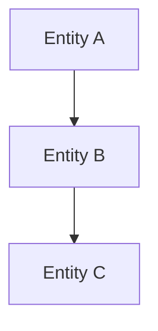
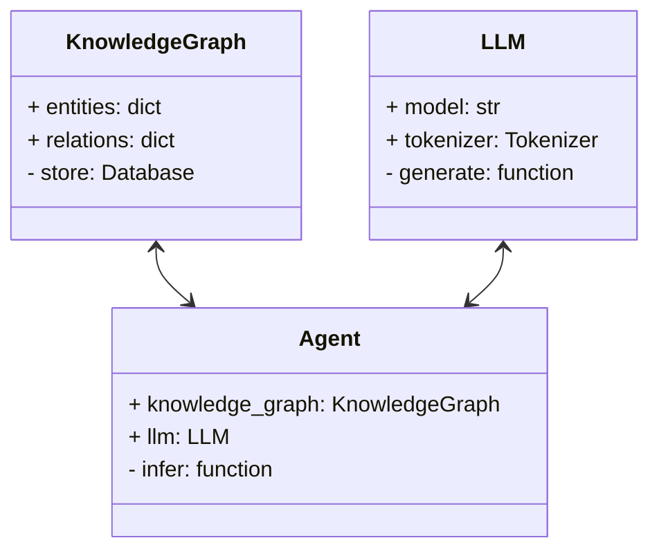

                 


# AI Agent的知识图谱推理：增强LLM的关系理解

## 关键词：AI Agent, 知识图谱, 大语言模型, 知识图谱推理, LLM关系理解

## 摘要：本文深入探讨了AI Agent结合知识图谱和大语言模型（LLM）的关系理解能力。通过分析知识图谱推理的算法原理、系统架构设计和实际项目案例，展示了如何增强LLM的关系理解能力。文章内容涵盖知识图谱与大语言模型的背景、核心概念与联系、算法原理、系统架构设计、项目实战以及最佳实践与总结。

---

# 第1章: 知识图谱与大语言模型的背景

## 1.1 知识图谱的定义与特点

### 1.1.1 知识图谱的定义
知识图谱是一种用于表示知识的图结构，由实体（节点）和关系（边）组成，能够表示复杂的语义信息。

### 1.1.2 知识图谱的核心特点
- **结构化**：实体和关系明确，便于计算机处理。
- **语义丰富**：通过关系和属性描述，提供上下文信息。
- **可扩展性**：支持大规模数据的构建和扩展。

### 1.1.3 知识图谱的构建与应用
- **构建方法**：基于规则或数据挖掘。
- **应用场景**：问答系统、推荐系统、语义搜索。

## 1.2 大语言模型的定义与特点

### 1.2.1 大语言模型的定义
大语言模型（LLM）是基于深度学习的自然语言处理模型，具有强大的文本生成和理解能力。

### 1.2.2 大语言模型的核心特点
- **大规模训练**：使用海量数据进行预训练。
- **上下文理解**：能够理解上下文关系，生成连贯文本。
- **多任务能力**：适用于多种自然语言处理任务。

### 1.2.3 大语言模型的应用场景
- **文本生成**：新闻、文章生成。
- **对话系统**：智能客服、聊天机器人。
- **文本理解**：信息提取、情感分析。

## 1.3 AI Agent的概念与应用

### 1.3.1 AI Agent的定义
AI Agent是一种智能体，能够感知环境、自主决策并执行任务。

### 1.3.2 AI Agent的核心功能
- **感知**：通过传感器或数据源获取信息。
- **推理**：基于知识和规则进行推理。
- **决策**：根据推理结果做出决策。
- **执行**：执行任务并反馈结果。

### 1.3.3 AI Agent在不同领域的应用案例
- **智能家居**：控制家电。
- **金融领域**：自动化交易、风险管理。
- **医疗领域**：辅助诊断、健康监测。

## 1.4 知识图谱推理与大语言模型的关系

### 1.4.1 知识图谱推理的定义
知识图谱推理是通过知识图谱中的实体和关系进行推导，得到新的知识或结论。

### 1.4.2 大语言模型在知识图谱推理中的作用
- **上下文理解**：帮助模型理解复杂的关系和语义。
- **动态推理**：处理实时更新的知识图谱。
- **结合规则**：将规则推理与统计推理相结合。

### 1.4.3 知识图谱推理与大语言模型结合的意义
- **提升准确性**：利用知识图谱的结构化信息提高推理的准确性。
- **增强泛化能力**：通过大语言模型的上下文理解增强推理的泛化能力。
- **扩展应用场景**：结合AI Agent，应用于更多复杂场景。

## 1.5 本章小结
本章介绍了知识图谱和大语言模型的基本概念、特点及应用场景，重点阐述了AI Agent的概念及其在知识图谱推理中的作用，为后续内容奠定了基础。

---

# 第2章: 知识图谱推理的核心概念与联系

## 2.1 知识图谱推理的原理

### 2.1.1 符号逻辑推理
符号逻辑推理是基于逻辑规则的推理方法，例如命题逻辑和谓词逻辑。

#### 2.1.1.1 命题逻辑
- 基于命题的真假值进行推理。
- 例如：如果A，则B；A为真，则B为真。

#### 2.1.1.2 谓词逻辑
- 基于谓词和个体的推理。
- 例如：所有人类都是 mortal，Socrates 是人类，因此 Socrates 是 mortal。

### 2.1.2 概率推理
概率推理基于概率论进行推理，考虑事件发生的可能性。

#### 2.1.2.1 贝叶斯定理
- 贝叶斯定理用于计算条件概率。
- 公式：$$P(A|B) = \frac{P(B|A)P(A)}{P(B)}$$

### 2.1.3 类比推理
类比推理通过比较不同事物的相似性进行推理。

- 例如：鸟会飞，蝙蝠会飞，因此蝙蝠可能属于鸟类。

## 2.2 知识图谱推理与大语言模型的关系

### 2.2.1 知识图谱推理在大语言模型中的应用
- **实体识别**：识别文本中的实体。
- **关系抽取**：提取实体之间的关系。
- **属性补全**：根据已知属性推断未知属性。

### 2.2.2 大语言模型对知识图谱推理的增强作用
- **上下文理解**：帮助处理复杂语义。
- **动态推理**：实时更新和推理。
- **结合规则**：将规则推理与统计推理相结合。

## 2.3 实体关系图的构建

### 2.3.1 实体关系图的定义
实体关系图（ER图）用于描述实体之间的关系。

### 2.3.2 实体关系图的构建方法
- **实体识别**：识别文本中的实体。
- **关系抽取**：提取实体之间的关系。
- **属性补全**：根据已知属性推断未知属性。

### 2.3.3 实体关系图的可视化
使用Mermaid图展示实体关系：



## 2.4 知识图谱推理的数学模型

### 2.4.1 符号逻辑推理的数学表达
- 命题逻辑：$$A \rightarrow B$$
- 谓词逻辑：$$\forall x (Human(x) \rightarrow Mortal(x))$$

### 2.4.2 概率推理的数学表达
- 贝叶斯定理：$$P(A|B) = \frac{P(B|A)P(A)}{P(B)}$$

### 2.4.3 类比推理的数学表达
- 类比推理：$$Similarity(A, B) = \frac{Similarity(A, C) \cdot Similarity(B, C)}{Similarity(A, A) \cdot Similarity(B, B)}$$

## 2.5 本章小结
本章详细阐述了知识图谱推理的核心概念和原理，并探讨了其与大语言模型的关系，为后续算法实现奠定了基础。

---

# 第3章: 知识图谱推理的算法原理

## 3.1 符号逻辑推理算法

### 3.1.1 算法原理
符号逻辑推理算法基于逻辑规则进行推理，例如命题逻辑和谓词逻辑。

#### 3.1.1.1 命题逻辑推理
- 基于命题的真假值进行推理。
- 例如：如果A，则B；A为真，则B为真。

#### 3.1.1.2 谓词逻辑推理
- 基于谓词和个体的推理。
- 例如：所有人类都是 mortal，Socrates 是人类，因此 Socrates 是 mortal。

### 3.1.2 算法实现
使用Python实现简单的符号逻辑推理：

```python
def propositional_inference(knowledge, query):
    # 简单的命题逻辑推理实现
    # 知识和查询均为字符串列表
    # 返回True或False
    pass
```

## 3.2 概率推理算法

### 3.2.1 算法原理
概率推理基于概率论进行推理，例如贝叶斯定理。

#### 3.2.1.1 贝叶斯推理
- 使用贝叶斯定理计算条件概率。
- 例如：计算某病人的患病概率。

### 3.2.2 算法实现
使用Python实现贝叶斯推理：

```python
def bayesian_inference(priors, likelihoods, evidence):
    # 简单的贝叶斯推理实现
    # priors: 各假设的先验概率
    # likelihoods: 各假设在证据下的似然概率
    # evidence: 观察到的证据
    # 返回后验概率
    pass
```

## 3.3 类比推理算法

### 3.3.1 算法原理
类比推理通过比较不同事物的相似性进行推理。

#### 3.3.1.1 相似度计算
- 使用余弦相似度或欧氏距离计算相似度。

### 3.3.2 算法实现
使用Python实现简单的类比推理：

```python
def analogy_inference(embeddings):
    # 基于嵌入向量的类比推理实现
    # 返回推断出的新向量
    pass
```

## 3.4 本章小结
本章详细讲解了知识图谱推理的几种主要算法，包括符号逻辑推理、概率推理和类比推理，并探讨了它们在大语言模型中的应用。

---

# 第4章: 系统分析与架构设计

## 4.1 问题场景介绍

### 4.1.1 问题背景
AI Agent需要通过知识图谱推理理解复杂的关系，提升任务执行的准确性。

### 4.1.2 问题描述
在实际应用中，如何将知识图谱推理与大语言模型结合，增强关系理解能力？

## 4.2 项目介绍

### 4.2.1 项目目标
- 实现知识图谱推理与大语言模型的结合。
- 提升AI Agent的关系理解能力。

### 4.2.2 项目范围
- 知识图谱构建与管理。
- 大语言模型的集成与优化。
- AI Agent的设计与实现。

## 4.3 系统功能设计

### 4.3.1 领域模型
- 实体管理：存储和管理实体信息。
- 关系管理：存储和管理实体关系。
- 推理引擎：基于知识图谱进行推理。

### 4.3.2 系统架构图
使用Mermaid图展示系统架构：



## 4.4 系统架构设计

### 4.4.1 分层架构
- 数据层：存储知识图谱数据。
- 逻辑层：处理推理逻辑。
- 表示层：展示推理结果。

### 4.4.2 接口设计
- API接口：供外部调用。
- 数据接口：与知识图谱存储交互。

## 4.5 本章小结
本章分析了AI Agent的知识图谱推理系统的应用场景，并设计了系统的功能模块和架构，为后续实现提供了指导。

---

# 第5章: 项目实战

## 5.1 环境安装

### 5.1.1 安装Python
- 安装Python 3.x。
- 安装必要的库：numpy、pandas、networkx。

### 5.1.2 安装大语言模型
- 使用开源模型：如GPT-3、BERT。
- 安装对应的库：如transformers。

## 5.2 系统核心实现

### 5.2.1 知识图谱构建
使用Python实现知识图谱的构建：

```python
from networkx import DiGraph

def build_knowledge_graph(entities, relations):
    graph = DiGraph()
    for relation in relations:
        graph.add_edge(relation[0], relation[1], label=relation[2])
    return graph
```

### 5.2.2 推理引擎实现
实现符号逻辑推理算法：

```python
def infer(knowledge_graph, query):
    # 简单的符号逻辑推理实现
    pass
```

## 5.3 实际案例分析

### 5.3.1 案例背景
假设知识图谱包含“人”、“城市”、“国籍”等实体和关系。

### 5.3.2 案例分析
- 输入：Alice 是美国人。
- 推理：Alice 的国籍是美国。

## 5.4 本章小结
本章通过实际项目展示了知识图谱推理的实现过程，包括环境搭建、系统实现和案例分析。

---

# 第6章: 最佳实践与总结

## 6.1 总结
本文详细探讨了AI Agent结合知识图谱和大语言模型的关系理解能力，分析了知识图谱推理的算法原理和系统架构设计，并通过实际案例展示了项目的实现过程。

## 6.2 最佳实践

### 6.2.1 知识图谱构建
- 确保数据的准确性和完整性。
- 使用适当的技术和工具。

### 6.2.2 系统设计
- 模块化设计，便于维护和扩展。
- 选择合适的算法和模型。

## 6.3 注意事项

### 6.3.1 数据隐私
- 注意数据隐私和安全问题。
- 遵守相关法律法规。

### 6.3.2 系统性能
- 优化算法和数据结构，提升推理效率。
- 使用分布式计算处理大规模数据。

## 6.4 拓展阅读

### 6.4.1 知识图谱相关书籍
- 《知识图谱：概念、方法与应用》
- 《大规模知识图谱构建与应用》

### 6.4.2 大语言模型相关书籍
- 《深度学习自然语言处理》
- 《大语言模型的原理与应用》

## 6.5 本章小结
本章总结了全文的主要内容，并提出了最佳实践和未来的研究方向，帮助读者更好地理解和应用知识图谱推理技术。

---

# 附录

## 附录A: 术语表
- **知识图谱**：由实体和关系组成的图结构。
- **大语言模型**：基于深度学习的自然语言处理模型。
- **AI Agent**：能够感知环境、自主决策并执行任务的智能体。

## 附录B: 参考文献
- [1] 知识图谱相关论文。
- [2] 大语言模型相关论文。
- [3] AI Agent相关论文。

---

# 结束语

本文通过详细分析AI Agent的知识图谱推理技术，展示了如何增强大语言模型的关系理解能力。希望本文能为相关领域的研究和实践提供有价值的参考。

