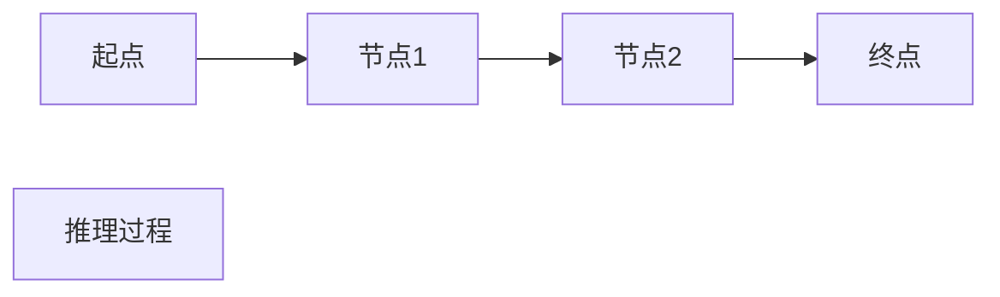
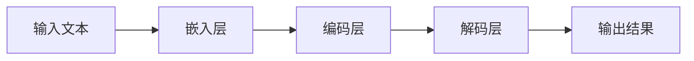
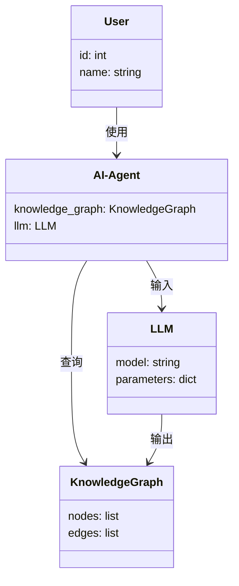
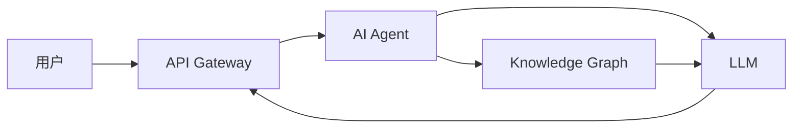
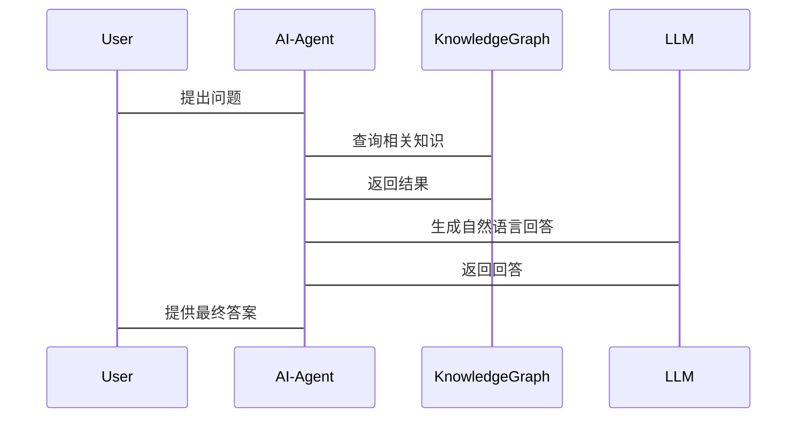

                 


# AI Agent的知识图谱推理：结合LLM与图数据库技术

> 关键词：AI Agent, 知识图谱推理, 大语言模型 (LLM), 图数据库, 实体关系图 (ER图), 算法原理, 数学模型

> 摘要：本文深入探讨了AI Agent的知识图谱推理技术，结合大语言模型 (LLM) 和图数据库技术，详细讲解了AI Agent的定义与特点、知识图谱的构建原理、LLM与图数据库的协同关系，以及它们在实际场景中的应用。文章通过丰富的图表和代码示例，详细阐述了知识图谱推理算法、大语言模型的训练算法，以及系统架构设计，帮助读者全面理解并掌握这一前沿技术。

---

# 第一部分: AI Agent的知识图谱推理基础

## 第1章: AI Agent与知识图谱概述

### 1.1 问题背景与问题描述

#### 1.1.1 从传统AI到AI Agent的演进
传统的人工智能技术主要依赖于规则和逻辑推理，但在处理复杂、动态的现实问题时，往往显得力不从心。AI Agent（智能体）的出现，将人工智能技术与实际应用场景紧密结合，具备更强的自主决策和问题解决能力。

#### 1.1.2 知识图谱推理的必要性
知识图谱是一种以图结构表示知识的技术，通过实体和关系构建语义网络。知识图谱推理通过分析实体之间的关系，能够帮助AI Agent更好地理解和解决复杂问题。

#### 1.1.3 LLM与图数据库的结合优势
大语言模型（LLM）具有强大的文本生成和理解能力，而图数据库擅长处理复杂的关联关系。两者的结合能够充分发挥各自的优势，为AI Agent提供更强大的知识表示和推理能力。

### 1.2 核心概念与问题解决

#### 1.2.1 AI Agent的定义与特点
AI Agent是一种具有感知环境、自主决策和执行任务能力的智能实体。它能够通过与环境的交互，动态调整策略以完成目标。

#### 1.2.2 知识图谱的基本结构
知识图谱由实体（节点）和关系（边）构成，能够表示现实世界中的各种事物及其之间的关联。例如，实体可以是“人”、“地点”、“事件”，关系可以是“属于”、“位于”、“发生于”。

#### 1.2.3 LLM与图数据库的结合方式
通过将知识图谱中的实体和关系作为输入，LLM可以生成自然语言描述，帮助AI Agent理解和表达复杂的信息。图数据库则用于高效存储和查询知识图谱数据。

### 1.3 边界与外延

#### 1.3.1 知识图谱的边界
知识图谱主要关注实体之间的语义关系，不涉及具体的数据存储和计算。它更多是一种知识表示方法，而非具体的技术实现。

#### 1.3.2 AI Agent的应用范围
AI Agent可以应用于自动驾驶、智能助手、推荐系统等领域。它的核心能力在于感知环境、理解问题并执行任务。

#### 1.3.3 LLM与图数据库的结合边界
LLM擅长文本生成和理解，图数据库擅长复杂关联关系的存储和查询。两者的结合主要在于知识表示和推理，而非具体的数据处理和计算。

### 1.4 概念结构与核心要素

#### 1.4.1 知识图谱的核心要素
知识图谱的核心要素包括实体、关系和属性。实体是知识图谱的基本单位，关系描述实体之间的关联，属性用于进一步描述实体的特征。

#### 1.4.2 AI Agent的构成要素
AI Agent的构成要素包括感知模块、推理模块、决策模块和执行模块。感知模块负责获取环境信息，推理模块负责分析问题，决策模块负责制定策略，执行模块负责执行任务。

#### 1.4.3 LLM与图数据库的协同关系
LLM通过自然语言处理技术帮助AI Agent理解和生成文本，图数据库通过高效的关联查询帮助AI Agent快速获取所需信息。两者协同工作，能够显著提升AI Agent的知识表示和推理能力。

---

## 第2章: 核心概念与联系

### 2.1 核心概念原理

#### 2.1.1 AI Agent的原理
AI Agent通过感知环境、分析问题、制定策略并执行任务来完成目标。它依赖于知识库、推理算法和执行机制。

#### 2.1.2 知识图谱的构建原理
知识图谱的构建需要通过信息抽取、实体识别、关系抽取和知识融合等步骤，将分散的知识组织成结构化的图数据。

#### 2.1.3 LLM的工作原理
大语言模型通过大量数据的预训练，掌握了语言的分布规律。在推理阶段，模型通过生成概率分布来预测下一个词，从而生成有意义的文本。

#### 2.1.4 图数据库的存储与查询原理
图数据库通过节点和边存储数据，并支持高效的图遍历算法来查询关联关系。与传统数据库相比，图数据库更适合处理复杂的关系型数据。

### 2.2 概念属性特征对比

| 概念       | 描述                                   | 特征                   |
|------------|--------------------------------------|-----------------------|
| AI Agent   | 具有感知、决策和执行能力的智能体       | 自主性、适应性、动态性 |
| 知识图谱    | 表示实体及其关系的结构化知识库         | 结构化、语义化、可扩展性 |
| LLM        | 基于深度学习的大语言模型               | 大规模训练、生成能力、理解能力 |
| 图数据库    | 用于存储和查询关联关系的数据库         | 关联性、高效性、灵活性 |

### 2.3 ER实体关系图架构

```mermaid
er
  actor: 用户
  agent: AI Agent
  knowledge_graph: 知识图谱
  llm: 大语言模型
  database: 图数据库
  actor --> agent: 使用
  agent --> knowledge_graph: 查询
  knowledge_graph --> llm: 输入
  llm --> database: 输出
```

---

## 第3章: 算法原理讲解

### 3.1 知识图谱推理算法



#### 算法实现代码
```python
def knowledge_graph_reasoning(nodes, edges, query):
    # nodes: 实体列表
    # edges: 关系列表，形如 (node1, relation, node2)
    # query: 查询目标
    # 返回所有与query相关的实体
    pass
```

### 3.2 大语言模型训练算法



#### 算法实现代码
```python
def llm_training(text_data, labels):
    # text_data: 输入文本数据
    # labels: 标签或目标输出
    # 返回训练好的模型
    pass
```

### 3.3 算法原理的数学模型与公式

#### 知识图谱推理的数学模型
$$P(e) = \frac{1}{Z} \sum_{e'} \exp(s(e, e'))$$

#### 大语言模型的训练算法
$$L = -\sum_{i=1}^{n} \log P(y_i | x_i)$$
其中，$L$ 是损失函数，$y_i$ 是目标输出，$x_i$ 是输入文本。

---

## 第4章: 系统分析与架构设计

### 4.1 问题场景介绍

#### 4.1.1 项目介绍
我们设计了一个基于AI Agent的知识图谱推理系统，结合LLM和图数据库技术，用于实现智能问答和信息检索功能。

### 4.2 系统功能设计

#### 4.2.1 领域模型设计


#### 4.2.2 系统架构设计



#### 4.2.3 接口设计
系统主要接口包括：
1. 用户与AI Agent的交互接口
2. AI Agent与知识图谱的查询接口
3. AI Agent与LLM的交互接口

#### 4.2.4 交互流程图



---

## 第5章: 项目实战

### 5.1 环境安装

#### 5.1.1 安装依赖
```bash
pip install numpy
pip install networkx
pip install transformers
```

### 5.2 系统核心实现源代码

#### 5.2.1 知识图谱构建代码
```python
import networkx as nx

def build_knowledge_graph(nodes, edges):
    graph = nx.Graph()
    graph.add_nodes_from(nodes)
    graph.add_edges_from(edges)
    return graph
```

#### 5.2.2 LLM训练代码
```python
from transformers import AutoModelForMaskedLM, AutoTokenizer

def train_llm(model_name, text_data):
    model = AutoModelForMaskedLM.from_pretrained(model_name)
    tokenizer = AutoTokenizer.from_pretrained(model_name)
    # 训练过程略
    return model, tokenizer
```

### 5.3 案例分析与实际应用

#### 5.3.1 应用场景
AI Agent可以通过知识图谱推理和大语言模型生成自然语言回答，应用于智能问答、信息检索、推荐系统等领域。

### 5.4 项目总结

通过结合知识图谱推理和大语言模型，我们实现了一个功能强大的AI Agent系统。该系统能够高效地处理复杂问题，具备良好的扩展性和适应性。

---

## 第6章: 最佳实践

### 6.1 小结

本文深入探讨了AI Agent的知识图谱推理技术，结合了大语言模型和图数据库技术，详细讲解了核心概念、算法原理和系统架构设计。

### 6.2 注意事项

1. 知识图谱的构建需要高质量的数据和合理的抽取算法。
2. 大语言模型的训练需要大量的数据和计算资源。
3. 系统架构设计需要考虑扩展性、可靠性和安全性。

### 6.3 拓展阅读

1. 《Large Language Models: A Survey》
2. 《Knowledge Graphs for NLP》
3. 《Graph Databases: New Opportunities for Data Modeling》

---

通过本文的学习，读者可以全面理解AI Agent的知识图谱推理技术，并将其应用于实际场景中。

