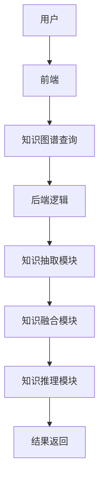

                 


# AI Agent的知识图谱构建：从LLM输出中提取结构化知识

> 关键词：知识图谱，LLM，结构化知识，AI Agent，自然语言处理

> 摘要：本文详细探讨了如何利用大语言模型（LLM）的输出来构建AI Agent的知识图谱，涵盖了从背景介绍、核心概念到算法原理、系统架构设计、项目实战等各个方面。文章通过详细的步骤分析和丰富的代码示例，展示了如何从LLM的输出中提取结构化知识，并构建高效的AI Agent知识图谱。

---

## 第一部分: AI Agent的知识图谱构建背景与基础

### 第1章: 知识图谱与大语言模型概述

#### 1.1 知识图谱的基本概念
知识图谱是一种以图结构形式表示知识的工具，由实体（节点）和关系（边）组成。它可以将分散在不同数据源中的知识进行整合，形成一个统一的知识网络。

#### 1.2 大语言模型的基本概念
大语言模型（LLM）是一种基于深度学习的自然语言处理模型，能够理解和生成人类语言。其强大的文本生成能力使其在知识抽取、对话生成等领域具有广泛的应用。

#### 1.3 两者的结合与应用
通过结合知识图谱和LLM，可以将LLM的生成能力与知识图谱的结构化能力结合起来，构建更加智能的AI Agent，实现知识的高效检索和推理。

---

### 第2章: 问题背景与解决方法

#### 2.1 问题背景
知识图谱的构建需要大量的结构化数据，而传统的数据获取方式存在数据稀疏、语义不明确等问题。LLM的出现为知识图谱的构建提供了新的思路。

#### 2.2 问题解决思路
通过利用LLM的生成能力，可以将非结构化的文本信息转化为结构化的知识图谱，从而提高知识图谱构建的效率和准确性。

---

## 第二部分: 知识抽取与建模算法

### 第3章: 知识抽取的算法原理

#### 3.1 知识抽取的流程与方法
知识抽取通常包括以下步骤：
1. 数据预处理：清洗和标准化数据。
2. 实体识别：识别文本中的实体。
3. 关系抽取：识别实体之间的关系。

#### 3.2 算法的数学模型
以下是一个简单的实体识别模型示例：

$$
P(y|x) = \frac{p(x|y)p(y)}{p(x)}
$$

其中，\( y \) 是实体标签，\( x \) 是输入文本。

---

### 第4章: 知识融合与推理算法

#### 4.1 知识融合的流程与方法
知识融合包括以下步骤：
1. 数据清洗：去除重复和噪声数据。
2. 数据匹配：将不同数据源中的实体进行匹配。
3. 数据融合：将匹配后的数据进行合并。

#### 4.2 算法的数学模型
以下是一个简单的知识推理模型示例：

$$
p(a \rightarrow b | c) = p(a \rightarrow b) \cdot p(c)
$$

其中，\( a \) 和 \( b \) 是实体，\( c \) 是上下文信息。

---

## 第三部分: 系统分析与架构设计方案

### 第5章: 系统架构设计

#### 5.1 项目背景介绍
本项目旨在利用LLM的生成能力，构建一个高效的AI Agent知识图谱，用于支持智能问答和知识推理。

#### 5.2 系统功能设计
系统功能模块包括：
1. 数据处理模块：负责数据的清洗和预处理。
2. 知识抽取模块：负责实体识别和关系抽取。
3. 知识推理模块：负责基于知识图谱进行推理。

#### 5.3 系统架构设计
以下是系统的架构图：



---

## 第四部分: 项目实战

### 第6章: 项目环境与核心实现

#### 6.1 环境安装
需要安装以下工具：
1. Python 3.8+
2. PyTorch 1.9+
3. Transformers库 4.12+

#### 6.2 核心代码实现
以下是知识抽取模块的代码示例：

```python
from transformers import AutoTokenizer, AutoModelForTokenClassification
import torch

class EntityRecognizer:
    def __init__(self, model_name):
        self.tokenizer = AutoTokenizer.from_pretrained(model_name)
        self.model = AutoModelForTokenClassification.from_pretrained(model_name)
    
    def recognize_entities(self, text):
        inputs = self.tokenizer(text, return_tensors="pt")
        with torch.no_grad():
            outputs = self.model(**inputs)
        prediction = torch.argmax(outputs.logits, dim=2)
        entities = []
        for i, pred in enumerate(prediction[0].tolist()):
            entity = self.tokenizer.decode(inputs.input_ids[0][i])
            entities.append((entity, pred))
        return entities
```

---

### 第7章: 项目案例分析

#### 7.1 案例分析
以下是一个简单的案例分析，展示如何从LLM的输出中提取结构化知识：

假设LLM的输出为：
```
Paris is the capital of France, located in Europe.
```

知识抽取模块可以提取以下实体和关系：
- 实体：Paris, France, Europe
- 关系：位于（Paris -> France），位于（France -> Europe）

---

## 第五部分: 总结与展望

### 第8章: 总结与展望

#### 8.1 总结
本文详细介绍了如何利用LLM的输出构建AI Agent的知识图谱，涵盖了从背景介绍、核心概念到算法原理、系统架构设计和项目实战的各个方面。

#### 8.2 展望
未来的研究方向包括：
1. 提高知识抽取的准确性和效率。
2. 探索更加智能的知识推理算法。
3. 结合多模态数据，构建更加丰富的知识图谱。

---

通过以上步骤，我们可以系统地构建一个高效的知识图谱，支持AI Agent的智能问答和知识推理功能。希望本文对读者有所帮助！

