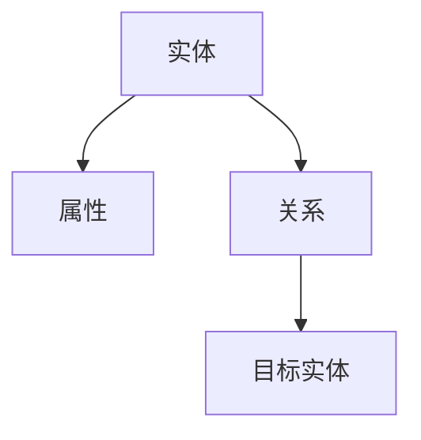
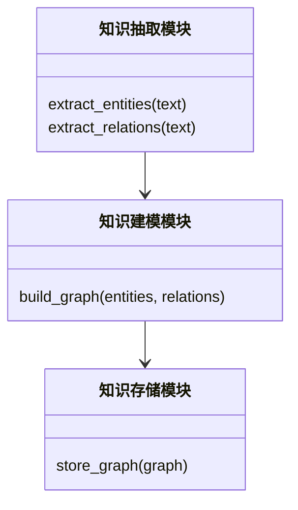
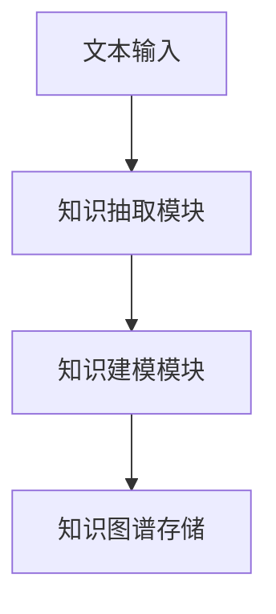

                 


# AI Agent的知识图谱构建：从LLM输出提取结构化信息

> 关键词：知识图谱，AI Agent，LLM，结构化信息提取，信息抽取，自然语言处理

> 摘要：本文深入探讨了AI Agent的知识图谱构建方法，重点分析了从大语言模型（LLM）输出中提取结构化信息的关键技术。通过详细阐述信息抽取算法、知识建模方法以及系统架构设计，本文为读者提供了一套完整的知识图谱构建解决方案。从理论到实践，本文旨在帮助读者理解并掌握如何利用LLM构建高效的知识图谱。

---

# 第一部分: AI Agent的知识图谱构建背景与概念

## 第1章: 知识图谱与AI Agent概述

### 1.1 知识图谱的基本概念

#### 1.1.1 知识图谱的定义与特点

知识图谱是一种以图结构形式表示知识的语义网络，节点表示实体或概念，边表示实体之间的关系。知识图谱的特点包括：

1. **结构化**：通过节点和边的组合，形成层次化的结构。
2. **语义丰富**：能够表示实体之间的复杂关系。
3. **可扩展性**：支持动态扩展和更新。

#### 1.1.2 AI Agent的概念与作用

AI Agent是一种智能体，能够在环境中感知、推理、规划并执行任务。AI Agent的知识图谱是其进行智能决策的核心基础设施。

#### 1.1.3 知识图谱在AI Agent中的重要性

知识图谱为AI Agent提供了语义理解能力，使其能够进行推理、问答和决策。

---

### 1.2 问题背景与目标

#### 1.2.1 从LLM输出提取结构化信息的必要性

大语言模型（LLM）输出通常是自然语言文本，而AI Agent需要结构化的知识图谱来支持智能任务。提取结构化信息是构建知识图谱的关键步骤。

#### 1.2.2 当前存在的主要问题与挑战

1. **信息抽取的准确性**：如何从LLM输出中准确提取实体和关系。
2. **知识建模的复杂性**：如何设计合理的知识图谱结构。
3. **数据质量**：LLM输出可能存在噪声，影响知识图谱的准确性。

#### 1.2.3 本书的目标与范围界定

本书旨在提供一套从LLM输出提取结构化信息的方法论，涵盖算法原理、系统架构和项目实战。

---

## 第2章: 知识图谱构建的核心概念与联系

### 2.1 知识图谱构建的关键环节

#### 2.1.1 文本到结构化数据的转换过程

1. **信息抽取**：从文本中提取实体、关系和属性。
2. **知识建模**：将抽取的信息转化为结构化的知识图谱。

#### 2.1.2 信息抽取与知识建模的关系

信息抽取是知识建模的基础，知识建模是信息抽取的结果。

#### 2.1.3 实体识别与关系抽取的对比分析

| 对比维度 | 实体识别 | 关系抽取 |
|----------|----------|----------|
| 目标     | 提取实体   | 提取实体间的关系 |
| 方法     | 基于模式匹配或统计模型 | 基于句法分析或语义理解 |

### 2.2 核心概念的ER实体关系图



---

## 第3章: 知识图谱构建的算法原理

### 3.1 信息抽取算法

#### 3.1.1 基于规则的抽取算法

```python
def extract_entities(text):
    entities = []
    # 基于规则的抽取逻辑
    return entities
```

#### 3.1.2 基于统计的抽取算法

```python
def extract_entities(text):
    entities = []
    # 基于统计模型的抽取逻辑
    return entities
```

#### 3.1.3 算法对比与选择

| 算法类型 | 优点 | 缺点 |
|----------|------|------|
| 基于规则 | 精度高 | 需要人工设计规则 |
| 基于统计 | 适应性强 | 精度可能较低 |

### 3.2 知识建模的数学模型

#### 3.2.1 实体表示的向量空间模型

$$ \text{实体向量} = \sum_{i=1}^{n} \alpha_i \cdot \text{词向量}_i $$

---

## 第4章: 系统分析与架构设计方案

### 4.1 项目介绍

#### 4.1.1 项目背景

构建一个基于LLM的知识图谱，支持AI Agent的智能任务。

#### 4.1.2 系统功能设计



#### 4.1.3 系统架构设计



---

## 第5章: 项目实战

### 5.1 环境安装与配置

```bash
pip install spacy
python -m spacy download en_core_web_sm
```

### 5.2 系统核心实现源代码

```python
import spacy

nlp = spacy.load("en_core_web_sm")

def extract_entities(text):
    doc = nlp(text)
    entities = []
    for ent in doc.ents:
        entities.append((ent.text, ent.label_))
    return entities

def extract_relations(text):
    doc = nlp(text)
    relations = []
    for i, token in enumerate(doc):
        if token.dep_ == "ROOT":
            # 简单的关系抽取逻辑
            relations.append((token.text, i))
    return relations
```

### 5.3 实际案例分析与详细讲解

案例：从文本中提取公司信息。

---

## 第6章: 最佳实践与小结

### 6.1 小结

本文详细介绍了AI Agent的知识图谱构建方法，包括从LLM输出提取结构化信息的关键步骤。

### 6.2 注意事项

1. 数据质量对知识图谱的准确性至关重要。
2. 知识建模需要结合具体应用场景。

### 6.3 拓展阅读

推荐阅读知识图谱相关的书籍和论文，深入理解信息抽取和知识建模的技术细节。

---

通过以上步骤，我们可以从LLM输出中提取结构化信息，构建高效的AI Agent知识图谱。希望本文对读者有所帮助！

