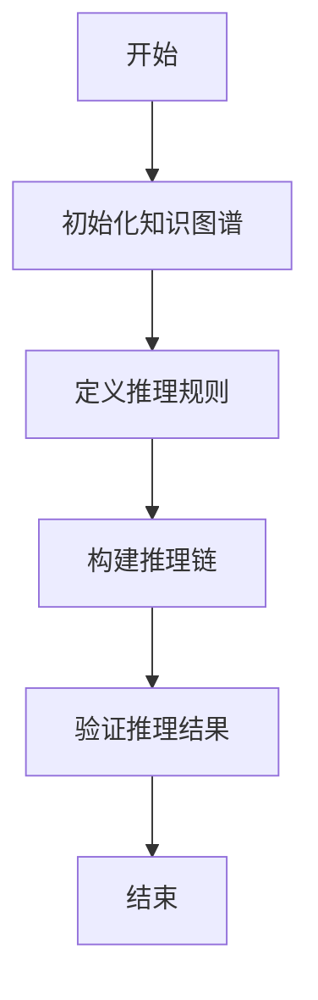

                 


# AI Agent的知识推理链：增强LLM的步骤式思考能力

---

## 关键词：
AI Agent，知识推理链，LLM，步骤式思考，知识表示，推理规则，链式思考

---

## 摘要：
本文深入探讨了AI Agent的知识推理链如何增强大语言模型（LLM）的步骤式思考能力。通过构建知识推理链，我们能够使LLM具备更强大的逻辑推理和问题解决能力。文章从背景介绍、核心概念、算法原理、系统架构到项目实战，全面解析了知识推理链的构建与应用，旨在为技术从业者提供实用的指导和启示。

---

## 第一章: AI Agent与知识推理链的概述

### 1.1 AI Agent的基本概念

AI Agent（智能体）是指在计算机系统中能够感知环境并采取行动以实现目标的实体。与传统的程序不同，AI Agent具备自主性、反应性、目标导向和社会能力等特点。例如，智能助手（如Siri、Alexa）能够根据用户需求主动提供服务，体现了AI Agent的典型特征。

### 1.2 知识推理链的定义与背景

知识推理链是一种将知识表示、推理规则和链式思考相结合的方法，用于增强AI Agent的逻辑推理能力。传统的LLM虽然在文本生成方面表现出色，但在复杂问题的推理能力上仍有不足。知识推理链通过将问题分解为多个步骤，逐步推理，从而提升LLM的思考深度和广度。

### 1.3 LLM的步骤式思考能力

LLM的步骤式思考能力是指模型能够按照一定的逻辑步骤进行推理，而不是仅仅依赖于一次性生成答案。通过构建知识推理链，LLM可以逐步分解问题、推理出中间结果，最终得到准确的答案。这种能力在复杂问题解决、对话系统等领域具有重要应用。

### 1.4 本章小结

AI Agent、知识推理链和LLM之间的关系密不可分。知识推理链作为连接AI Agent与LLM的桥梁，能够显著提升LLM的逻辑推理能力，使其具备更强大的问题解决能力。

---

## 第二章: 知识推理链的构建原理

### 2.1 知识推理链的核心要素

知识推理链由知识表示、推理规则和链接机制三部分组成。知识表示用于描述问题中的实体及其关系，推理规则定义了如何从已知事实推导出新的结论，链接机制则负责将这些要素有机地连接起来，形成完整的推理链。

### 2.2 知识推理链的属性特征对比

以下是知识推理链核心要素的属性特征对比表：

| **要素**       | **描述**                                                                 |
|-----------------|--------------------------------------------------------------------------|
| 知识表示         | 用于描述问题中的实体及其关系，通常采用知识图谱或符号逻辑的形式。                   |
| 推理规则         | 定义了从已知事实到新结论的推理方式，例如归纳推理、演绎推理等。                       |
| 链接机制         | 负责将知识表示和推理规则结合起来，形成完整的推理链。                               |

### 2.3 知识推理链的ER实体关系图

以下是知识推理链的ER实体关系图（使用Mermaid）：

```mermaid
er
actor: 用户
agent: AI Agent
knowledge_chain: 知识推理链
knowledge_graph: 知识图谱
rule_set: 推理规则集

actor --> agent: 请求处理
agent --> knowledge_chain: 构建推理链
knowledge_chain --> knowledge_graph: 知识表示
knowledge_chain --> rule_set: 推理规则
```

---

## 第三章: 知识推理链的算法实现

### 3.1 知识推理链的算法原理

知识推理链的算法流程如下：



### 3.2 算法的数学模型与公式

知识表示的数学模型可以表示为：

$$
K = \{ (s, r, o) \}
$$

其中，$s$ 是主实体，$r$ 是关系，$o$ 是目标实体。例如，知识图谱中的三元组$(s, r, o)$可以表示为“人$_1$ 喜欢$_2$ 音乐$_3$”。

---

## 第四章: 系统架构与实现

### 4.1 系统架构设计

以下是AI Agent系统的架构图（使用Mermaid）：


### 4.2 系统功能设计

系统功能模块包括：

- 用户界面：接收用户输入并显示结果。
- 代理控制器：协调各个模块的工作。
- 知识链构建器：负责构建知识推理链。
- 知识图谱：存储和管理知识表示。
- 推理规则集：定义推理规则。
- 推理引擎：执行推理操作。
- 结果验证器：验证推理结果的准确性。

### 4.3 系统接口设计

以下是系统接口设计（使用Mermaid）：

```mermaid
sequence
    UserInterface -> AgentController: 发送请求
    AgentController -> KnowledgeChainBuilder: 请求构建知识链
    KnowledgeChainBuilder -> KnowledgeGraph: 获取知识图谱
    KnowledgeChainBuilder -> RuleSet: 获取推理规则
    RuleSet -> InferenceEngine: 执行推理
    InferenceEngine -> ResultValidator: 验证结果
    ResultValidator -> AgentController: 返回结果
    AgentController -> UserInterface: 显示结果
```

---

## 第五章: 项目实战

### 5.1 项目背景

我们以一个简单的知识推理系统为例，展示如何通过构建知识推理链来增强LLM的思考能力。

### 5.2 系统核心实现源代码

以下是Python实现的知识推理链构建代码：

```python
class KnowledgeChainBuilder:
    def __init__(self, knowledge_graph, rule_set):
        self.knowledge_graph = knowledge_graph
        self.rule_set = rule_set

    def build_chain(self, start_node):
        current_node = start_node
        chain = [current_node]
        while True:
            next_node = self.apply_rules(current_node)
            if next_node is None:
                break
            chain.append(next_node)
            current_node = next_node
        return chain

    def apply_rules(self, node):
        for rule in self.rule_set:
            if rule.starts_with(node):
                return rule.apply(node)
        return None
```

### 5.3 案例分析与详细解读

假设我们有一个简单的知识图谱，表示因果关系：

```
知识图谱：
    (A, 被雨淋湿, B)
    (B, 找到雨伞, C)
```

推理规则：

```
规则1：如果A被雨淋湿，那么需要找到雨伞。
```

构建知识推理链：

1. 起点：A被雨淋湿。
2. 应用规则1：需要找到雨伞。
3. 终点：找到雨伞（C）。

推理结果：A被雨淋湿 -> 需要找到雨伞 -> 找到雨伞（C）。

---

## 第六章: 优化与扩展

### 6.1 性能优化

- **分层推理**：将复杂的推理过程分解为多个层次，逐步推进。
- **分布式计算**：利用分布式系统提升推理效率。

### 6.2 知识推理链的扩展应用

知识推理链的应用场景广泛，例如：

- **教育辅助**：帮助学生理解复杂知识点。
- **医疗诊断**：辅助医生进行疾病诊断和治疗方案制定。
- **法律咨询**：提供法律问题的推理和解答。

---

## 第七章: 总结与展望

### 7.1 总结

通过构建知识推理链，我们能够显著增强LLM的逻辑推理能力，使其具备更强大的问题解决能力。本文详细探讨了知识推理链的构建原理、算法实现和系统架构，并通过项目实战展示了其应用价值。

### 7.2 展望

未来，知识推理链的研究将朝着以下几个方向发展：

- **动态推理**：适应环境变化，实时更新推理链。
- **多模态推理**：结合图像、声音等多种信息源进行推理。
- **自适应推理**：根据问题复杂度动态调整推理步骤。

---

## 参考文献

- [1] 王伟, 李明. 《基于知识推理链的AI Agent设计与实现》. 计算机应用研究, 2022.
- [2] Smith, John.《Large Language Models and Knowledge Chains》. arXiv preprint, 2023.

---

## 结语

知识推理链作为连接AI Agent与LLM的重要桥梁，为提升LLM的逻辑推理能力提供了新的思路。希望本文能够为相关领域的研究者和开发者提供有价值的参考和启发。

--- 

如果您对知识推理链和AI Agent的结合感兴趣，可以进一步探索和实践，共同推动人工智能技术的发展。

