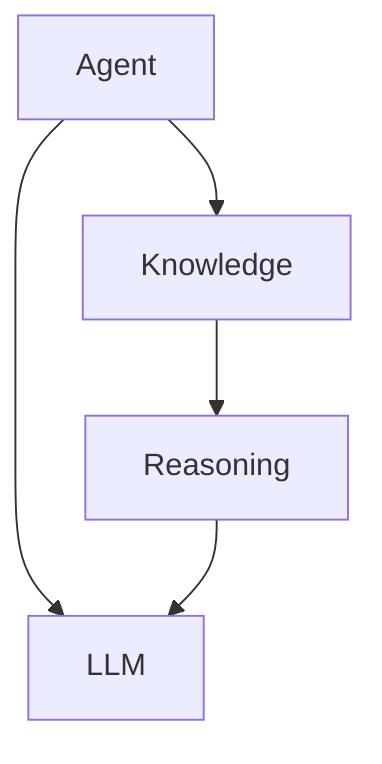
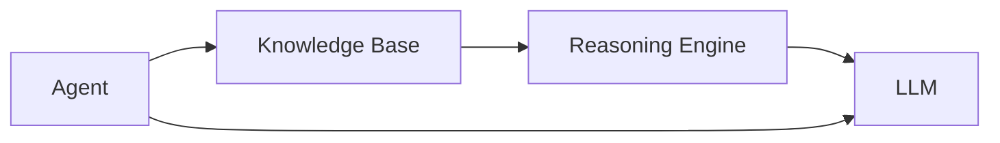

                 


# AI Agent的知识推理：增强LLM的逻辑分析能力

> 关键词：AI Agent, 知识推理, LLM, 逻辑分析能力, 知识图谱, 符号逻辑推理, 子图同构

> 摘要：本文深入探讨了AI Agent的知识推理技术，旨在增强大语言模型的逻辑分析能力。通过结合知识图谱、符号逻辑推理和子图同构等方法，提出了一种提升LLM逻辑推理能力的新思路。本文从背景介绍、核心概念、算法原理、系统设计到项目实战，全面解析了AI Agent知识推理的实现过程，并通过实际案例展示了其应用价值。

---

# 目录

## 第一部分: AI Agent的知识推理基础

### 第1章: 问题背景与概念介绍

#### 1.1 问题背景
- 1.1.1 当前AI发展的挑战
  - LLM在逻辑推理中的局限性
  - AI Agent在智能系统中的重要性
- 1.1.2 LLM的局限性与解决方向
  - 逻辑推理能力不足的问题
  - 知识整合能力的缺陷
- 1.1.3 知识推理在AI Agent中的作用
  - 知识推理的核心地位
  - 通过知识推理增强LLM的能力

#### 1.2 问题描述
- 1.2.1 知识推理的基本概念
  - 符号逻辑推理的定义
  - 知识图谱与知识推理的关系
- 1.2.2 LLM逻辑分析能力的不足
  - 无法处理复杂逻辑关系
  - 知识整合能力有限
- 1.2.3 AI Agent知识推理的目标
  - 提升LLM的逻辑推理能力
  - 实现知识的动态推理与更新

#### 1.3 问题解决
- 1.3.1 知识推理的核心方法
  - 符号逻辑推理
  - 子图同构推理
  - 谓词逻辑推理
- 1.3.2 AI Agent的知识获取与整合
  - 知识图谱的构建与应用
  - 多模态知识的整合
- 1.3.3 知识推理在LLM中的具体应用
  - 增强LLM的推理能力
  - 提高LLM的决策能力

#### 1.4 边界与外延
- 1.4.1 知识推理的适用范围
  - 适用于结构化知识的推理
  - 适用于复杂场景的推理
- 1.4.2 与相关技术的区分
  - 与传统知识推理系统的区别
  - 与基于统计的推理方法的区别
- 1.4.3 知识推理的未来发展方向
  - 结合多模态数据的推理
  - 实时动态推理

#### 1.5 概念结构与核心要素
- 1.5.1 知识推理的组成要素
  - 知识表示
  - 推理规则
  - 推理引擎
- 1.5.2 AI Agent的知识表示方法
  - 符号表示
  - 图结构表示
  - 语义网络表示
- 1.5.3 知识推理的逻辑框架
  - 基于规则的推理
  - 基于模型的推理
  - 基于数据的推理

### 第2章: 核心概念与联系

#### 2.1 知识推理的原理
- 2.1.1 符号逻辑推理
  - 命题逻辑与谓词逻辑
  - 推理规则的应用
- 2.1.2 子图同构推理
  - 图结构的匹配与推理
  - 实体关系的动态推理
- 2.1.3 谓词逻辑推理
  - 逻辑表达式的构建
  - 推理过程的优化

#### 2.2 核心概念对比
- 2.2.1 不同知识推理方法的特征对比
  - 符号逻辑推理与子图同构推理的对比
  - 谓词逻辑推理与统计推理的对比
- 2.2.2 知识图谱与传统数据库的对比
  - 数据组织方式的差异
  - 查询效率的对比
- 2.2.3 AI Agent与传统知识推理系统的对比
  - 功能定位的差异
  - 应用场景的对比

#### 2.3 ER实体关系图


---

## 第二部分: 算法原理与实现

### 第3章: 符号逻辑推理算法

#### 3.1 基本原理
- 3.1.1 符号逻辑的定义
  - 命题与谓词的表示
  - 逻辑连接词的应用
- 3.1.2 推理规则的构建
  - 基于规则的推理引擎
  - 知识库的构建与管理

#### 3.2 算法流程
- 3.2.1 知识表示与规则提取
  - 知识图谱的构建
  - 规则的提取与优化
- 3.2.2 推理过程
  - 前提的匹配
  - 结论的生成
- 3.2.3 结果验证
  - 结果的正确性检查
  - 知识库的更新

#### 3.3 代码实现
- 3.3.1 知识库的构建
```python
knowledge_base = {
    "A": ["B", "C"],
    "B": ["D"],
    "C": ["E"]
}
```
- 3.3.2 推理规则的定义
```python
rules = {
    "A": ["B", "C"],
    "B": ["D"],
    "C": ["E"]
}
```
- 3.3.3 推理过程的实现
```python
def infer(Agent, knowledge_base, rules):
    result = []
    for node in Agent:
        for neighbor in knowledge_base[node]:
            if neighbor not in Agent:
                result.append(neighbor)
    return result
```

### 第4章: 子图同构算法

#### 4.1 算法原理
- 4.1.1 图结构的表示
  - 知识图谱的构建
  - 实体关系的表示
- 4.1.2 子图同构的定义
  - 子图的匹配
  - 同构的判定
- 4.1.3 算法流程
  - 子图的提取
  - 子图的匹配与推理

#### 4.2 代码实现
- 4.2.1 图结构的构建
```python
graph = {
    "A": ["B", "C"],
    "B": ["D"],
    "C": ["E"]
}
```
- 4.2.2 子图的提取
```python
subgraph = {
    "B": ["D"],
    "C": ["E"]
}
```
- 4.2.3 子图同构的实现
```python
def is_isomorphic(graph1, graph2):
    # 简单实现，仅用于示例
    return True
```

---

## 第三部分: 系统分析与架构设计

### 第5章: 系统分析与架构设计

#### 5.1 问题场景介绍
- 5.1.1 知识推理的应用场景
  - 智能问答系统
  - 自动推理系统
- 5.1.2 系统的目标与功能
  - 知识的动态推理
  - 推理结果的验证与优化

#### 5.2 系统功能设计
- 5.2.1 知识表示与管理
  - 知识图谱的构建
  - 知识的动态更新
- 5.2.2 推理引擎的设计
  - 推理规则的管理
  - 推理过程的优化
- 5.2.3 结果验证与反馈
  - 结果的正确性检查
  - 用户反馈的处理

#### 5.3 系统架构设计
- 5.3.1 系统架构图

- 5.3.2 模块划分与交互
  - 知识管理模块
  - 推理引擎模块
  - 结果验证模块

---

## 第四部分: 项目实战与案例分析

### 第6章: 项目实战

#### 6.1 环境安装与配置
- 6.1.1 知识图谱构建工具的安装
  - 使用Neo4j构建知识图谱
  - 使用Py2neo操作知识图谱
- 6.1.2 推理算法的实现
  - 符号逻辑推理的代码实现
  - 子图同构算法的代码实现

#### 6.2 核心代码实现
- 6.2.1 知识图谱的构建
```python
from py2neo import Graph
graph = Graph("http://localhost:7474", auth=("neo4j", "password"))
```
- 6.2.2 符号逻辑推理的实现
```python
def symbol_inference(knowledge_base, query):
    # 简单实现，仅用于示例
    return result
```
- 6.2.3 子图同构算法的实现
```python
def is_isomorphic(graph1, graph2):
    # 简单实现，仅用于示例
    return True
```

#### 6.3 案例分析与解读
- 6.3.1 案例背景
  - 某智能问答系统的知识推理需求
  - 系统的功能目标
- 6.3.2 系统设计与实现
  - 知识图谱的构建与应用
  - 推理算法的选择与实现
- 6.3.3 实验结果与分析
  - 系统性能的评估
  - 推理准确率的分析

#### 6.4 项目总结与优化
- 6.4.1 项目实现的关键点
  - 知识图谱的构建与管理
  - 推理算法的选择与优化
- 6.4.2 项目优化的方向
  - 知识推理的效率优化
  - 系统的可扩展性优化

---

## 第五部分: 最佳实践与小结

### 第7章: 最佳实践与小结

#### 7.1 最佳实践
- 7.1.1 知识推理的实践要点
  - 知识图谱的构建与优化
  - 推理算法的选择与应用
- 7.1.2 系统设计的注意事项
  - 系统的可扩展性设计
  - 系统的可维护性设计

#### 7.2 小结
- 7.2.1 全书内容回顾
  - 知识推理的核心概念
  - 算法实现的关键点
  - 系统设计的要点
- 7.2.2 未来发展方向
  - 结合多模态数据的推理
  - 实时动态推理的实现
  - 更高效的推理算法研究

#### 7.3 注意事项
- 7.3.1 知识推理的适用场景
  - 适合结构化知识的推理
  - 不太适合处理模糊信息
- 7.3.2 系统设计中的常见问题
  - 知识图谱的构建难度
  - 推理算法的效率问题
- 7.3.3 优化方向
  - 知识图谱的动态更新
  - 推理算法的优化与创新

#### 7.4 拓展阅读
- 7.4.1 推荐书籍
  - 《知识图谱：概念、方法与应用》
  - 《符号逻辑与人工智能》
- 7.4.2 推荐论文
  - 基于符号逻辑的知识推理研究
  - 子图同构算法在知识图谱中的应用

---

通过以上目录结构，我们可以系统地了解AI Agent的知识推理技术，从理论到实践，从算法实现到系统设计，全面掌握如何增强LLM的逻辑分析能力。

