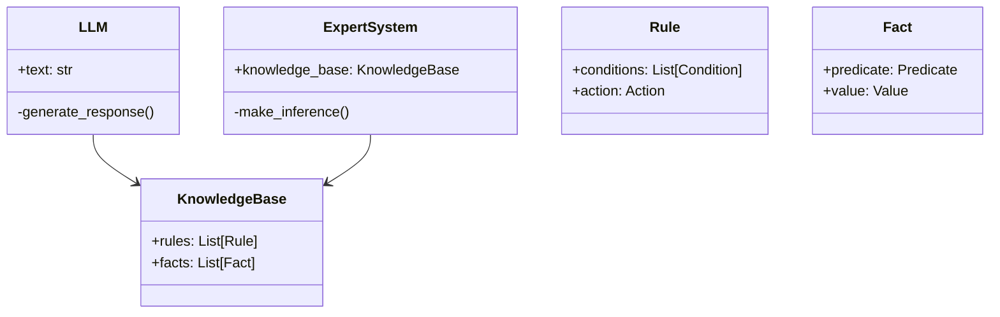
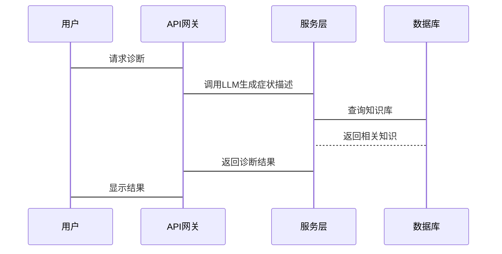

                 


# AI Agent的知识整合：融合LLM与专家系统

> 关键词：AI Agent, 大语言模型, 专家系统, 知识整合, 系统架构

> 摘要：本文探讨了AI Agent的知识整合，重点分析了如何将大语言模型（LLM）与专家系统相结合，以提升智能决策和自动化任务的能力。通过详细阐述背景、核心概念、算法原理、系统架构和项目实战，本文为读者提供了一个全面的技术视角，帮助理解这一前沿领域的整合方法。

---

# 第1章: AI Agent与知识整合的背景介绍

## 1.1 AI Agent的基本概念

### 1.1.1 AI Agent的定义
AI Agent（智能体）是能够感知环境、自主决策并执行任务的实体。它可以是一个软件程序或物理设备，通过传感器和执行器与环境交互。

### 1.1.2 AI Agent的核心特征
- **自主性**：无需外部干预，自主决策。
- **反应性**：实时感知环境并做出反应。
- **目标导向**：基于目标驱动行为。
- **社交能力**：与人类或其他智能体协作。

### 1.1.3 AI Agent的分类与应用场景
- **简单反射型**：基于规则的响应，如自动回复机器人。
- **基于模型型**：使用内部模型进行推理，如自动驾驶汽车。
- **目标驱动型**：为实现特定目标而行动，如智能推荐系统。

---

## 1.2 LLM与专家系统的背景

### 1.2.1 大语言模型（LLM）的崛起
LLM通过深度学习技术，从大量文本数据中学习语言模式，能够生成自然语言文本并进行对话。

### 1.2.2 专家系统的传统与演变
专家系统通过知识库和推理规则模拟专家决策过程，广泛应用于医疗诊断、金融分析等领域。

### 1.2.3 LLM与专家系统结合的必要性
- **知识的广度与深度**：LLM擅长处理广泛的知识，而专家系统擅长深度推理。
- **灵活性与准确性**：结合两者可提升系统的灵活性和准确性。

---

## 1.3 知识整合的背景与意义

### 1.3.1 知识整合的定义与目标
知识整合是将不同来源的知识融合到统一框架中，以提升系统的整体智能水平。

### 1.3.2 LLM与专家系统结合的优势
- **互补性**：LLM提供广泛的知识覆盖，专家系统提供深度推理。
- **协同性**：通过协同工作，提升决策的准确性和效率。

### 1.3.3 知识整合的实际应用价值
- **提升决策能力**：通过整合知识，AI Agent能够做出更准确的决策。
- **增强系统灵活性**：适应不同场景和任务需求。

---

# 第2章: 核心概念与联系

## 2.1 LLM与专家系统的原理对比

### 2.1.1 LLM的工作原理
- **输入**：文本输入。
- **处理**：通过Transformer模型生成输出。
- **输出**：生成的文本或摘要。

### 2.1.2 专家系统的工作原理
- **知识库**：存储领域知识。
- **推理引擎**：基于规则进行推理。
- **输出**：推理结果或建议。

### 2.1.3 两者在知识表示与推理上的差异

| 对比维度 | LLM | 专家系统 |
|----------|------|----------|
| 知识表示 | 概率分布 | 形式化规则 |
| 推理方式 | 基于概率 | 基于逻辑 |
| 适应性 | 强大 | 较弱 |

---

## 2.2 知识整合的系统架构

### 2.2.1 知识库的构建与管理
- **知识抽取**：从文本中提取实体、关系。
- **知识融合**：整合多源知识。
- **知识存储**：使用图数据库存储。

### 2.2.2 LLM与专家系统的协同机制
- **接口设计**：定义LLM与专家系统的交互接口。
- **数据流**：知识在两者间流动。
- **协同推理**：结合LLM的生成能力和专家系统的推理能力。

---

# 第3章: 算法原理与数学模型

## 3.1 LLM的数学模型

### 3.1.1 变压器模型的结构
- **编码器**：将输入序列编码为上下文表示。
- **解码器**：生成输出序列。

### 3.1.2 注意力机制的数学表达
$$\text{Attention}(Q, K, V) = \text{softmax}\left(\frac{QK^T}{\sqrt{d_k}}\right)V$$

### 3.1.3 梯度下降与优化算法
- **Adam优化器**：常用优化算法，结合动量和自适应学习率。

## 3.2 专家系统的推理模型

### 3.2.1 知识表示的逻辑形式
- **谓词逻辑**：如$ \text{is\_sick}(patient) $。

### 3.2.2 推理规则的表示方法
- **规则库**：如如果$ A \rightarrow B $，则$ B $成立。

### 3.2.3 逻辑推理的数学模型
$$ \text{结论} = \text{推理引擎}(\text{前提1}, \text{前提2}, \ldots) $$

## 3.3 知识整合的算法流程

### 3.3.1 知识抽取与预处理
- **分词**：将文本分割为词语。
- **实体识别**：识别文本中的实体。

### 3.3.2 知识融合与优化
- **冲突检测**：检测知识库中的矛盾。
- **合并规则**：优化知识表示。

### 3.3.3 结果验证与反馈
- **验证**：通过测试用例验证推理结果。
- **反馈**：根据反馈调整知识库。

---

# 第4章: 系统分析与架构设计

## 4.1 问题场景分析

### 4.1.1 问题背景
以医疗诊断系统为例，LLM提供广泛的医学知识，专家系统进行诊断推理。

### 4.1.2 系统目标
构建一个智能医疗诊断系统，结合LLM和专家系统。

## 4.2 系统功能设计

### 4.2.1 领域模型类图


### 4.2.2 系统架构设计


### 4.2.3 系统接口设计
- **LLM接口**：`generate(text: str) -> str`
- **专家系统接口**：`infer(knowledge: Knowledge) -> Result`

### 4.2.4 系统交互流程


---

# 第5章: 项目实战

## 5.1 环境安装

```bash
pip install transformers
pip install py知識庫
```

## 5.2 系统核心实现源代码

### 5.2.1 LLM实现
```python
from transformers import AutoModelForCausalLM, AutoTokenizer

class LLM:
    def __init__(self, model_name):
        self.tokenizer = AutoTokenizer.from_pretrained(model_name)
        self.model = AutoModelForCausalLM.from_pretrained(model_name)
    
    def generate(self, text):
        inputs = self.tokenizer(text, return_tensors="pt")
        outputs = self.model.generate(inputs.input_ids, max_length=100)
        return self.tokenizer.decode(outputs[0], skip_special_tokens=True)
```

### 5.2.2 专家系统实现
```python
class ExpertSystem:
    def __init__(self, knowledge_base):
        self.knowledge_base = knowledge_base
    
    def make_inference(self, input_data):
        # 假设knowledge_base包含规则和事实
        # 这里简化逻辑，直接返回推断结果
        return "推断结果"
```

## 5.3 案例分析与解读

### 5.3.1 案例分析
以医疗诊断为例，输入症状，系统结合LLM生成症状描述，并通过专家系统进行推理，输出诊断结果。

### 5.3.2 实际应用中的问题与解决
- **数据不足**：通过数据增强解决。
- **推理错误**：通过反馈机制优化知识库。

---

# 第6章: 最佳实践、小结与展望

## 6.1 最佳实践
- **数据质量管理**：确保知识库的准确性和完整性。
- **模型调优**：通过参数调整优化性能。
- **持续学习**：定期更新知识库和模型。

## 6.2 小结
本文详细探讨了AI Agent的知识整合，重点分析了LLM与专家系统的结合，通过理论分析和实际案例，展示了如何构建一个高效的智能系统。

## 6.3 注意事项
- **性能优化**：避免计算开销过大。
- **数据隐私**：确保数据安全和隐私保护。

## 6.4 拓展阅读
- 推荐阅读相关领域的最新论文和书籍，深入理解知识整合的技术细节。

---

通过以上内容，您可以系统地了解AI Agent的知识整合方法，以及如何在实际项目中应用这些技术。希望本文对您有所帮助！

