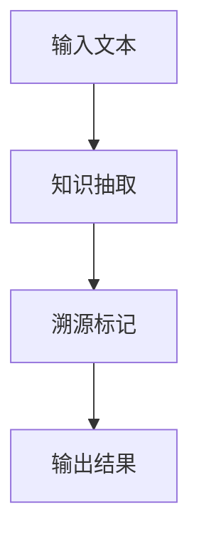
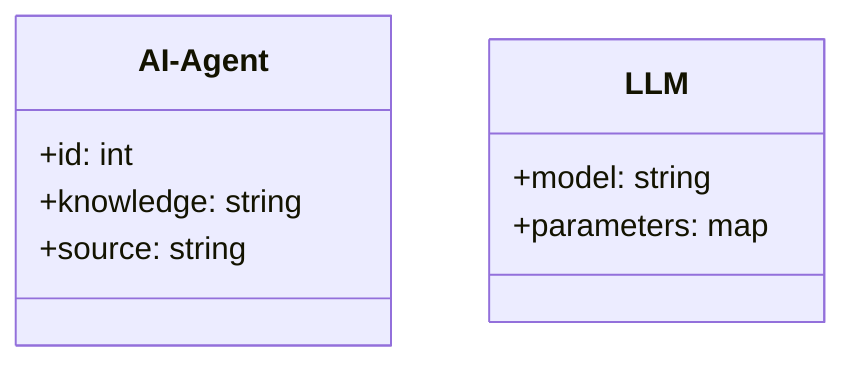
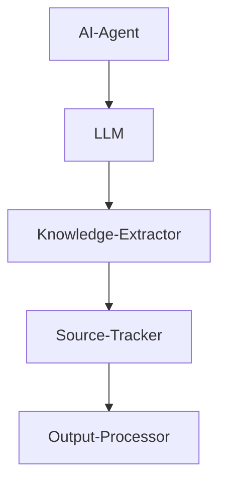
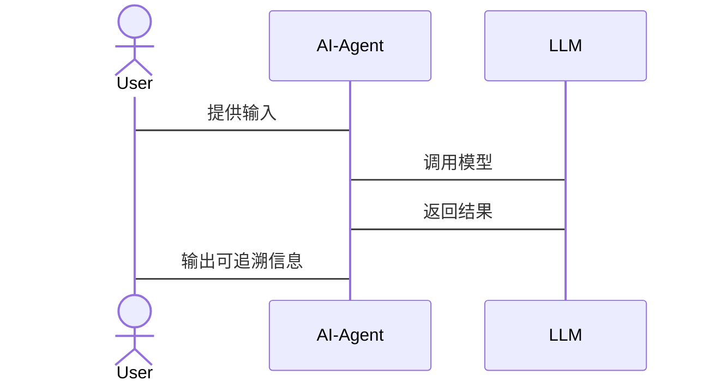

                 

# 目录大纲：AI Agent的知识溯源：提高LLM输出的可追溯性

## 第一部分：背景介绍

### 第1章：问题背景与描述

#### 1.1 问题背景
- 1.1.1 AI Agent的发展现状
- 1.1.2 LLM输出的挑战
- 1.1.3 知识溯源的重要性

#### 1.2 问题描述
- 1.2.1 LLM输出的不可追溯性
- 1.2.2 知识来源的模糊性
- 1.2.3 知识溯源的需求

#### 1.3 问题解决
- 1.3.1 知识溯源的目标
- 1.3.2 解决方案的可行性
- 1.3.3 边界与外延

#### 1.4 核心概念结构
- 1.4.1 知识溯源的定义
- 1.4.2 核心要素组成
- 1.4.3 概念结构图

## 第二部分：核心概念与原理

### 第2章：AI Agent与知识溯源

#### 2.1 核心概念原理
- 2.1.1 AI Agent的定义
- 2.1.2 知识溯源的机制

#### 2.2 概念属性对比表
- 2.2.1 AI Agent与传统程序的对比
- 2.2.2 知识溯源与数据溯源的区别

#### 2.3 ER实体关系图
- 2.3.1 实体关系展示
- 2.3.2 关系描述

## 第三部分：算法原理

### 第3章：LLM的知识溯源算法

#### 3.1 算法流程
- 3.1.1 输入处理
- 3.1.2 知识抽取
- 3.1.3 溯源标记

#### 3.2 算法原理图

#### 3.3 数学模型
- 3.3.1 概率计算公式：$$P(\text{知识正确}) = \frac{\text{正确次数}}{\text{总次数}}$$
- 3.3.2 损失函数：$$L = \sum (y_i - \hat{y_i})^2$$

## 第四部分：系统架构设计

### 第4章：系统分析与架构

#### 4.1 问题场景
- 4.1.1 系统需求
- 4.1.2 用户角色

#### 4.2 系统功能设计
- 4.2.1 领域模型图

#### 4.3 系统架构设计

#### 4.4 接口设计
- 4.4.1 API接口定义
- 4.4.2 接口调用流程

#### 4.5 交互流程

## 第五部分：项目实战

### 第5章：系统实现与案例分析

#### 5.1 环境安装
- 5.1.1 安装Python
- 5.1.2 安装依赖库

#### 5.2 核心代码实现
- 5.2.1 知识抽取模块
- 5.2.2 溯源标记模块

#### 5.3 实际案例分析
- 5.3.1 案例背景
- 5.3.2 数据准备
- 5.3.3 代码实现
- 5.3.4 结果分析

#### 5.4 项目小结
- 5.4.1 实现总结
- 5.4.2 经验教训

## 第六部分：最佳实践与小结

### 第6章：经验总结与注意事项

#### 6.1 最佳实践
- 6.1.1 代码规范
- 6.1.2 系统优化建议

#### 6.2 小结
- 6.2.1 核心观点回顾
- 6.2.2 未来展望

#### 6.3 注意事项
- 6.3.1 常见问题
- 6.3.2 解决方案

#### 6.4 拓展阅读
- 6.4.1 推荐书籍
- 6.4.2 相关论文

---

### 关键词：
- AI Agent
- 知识溯源
- LLM
- 可追溯性
- 系统架构
- 算法原理

### 摘要：
本文详细探讨了AI Agent的知识溯源技术，旨在提高大语言模型（LLM）输出的可追溯性。通过分析核心概念、算法原理和系统架构，结合实际案例，为实现高透明度和可验证性的AI系统提供理论支持和实践指导。

