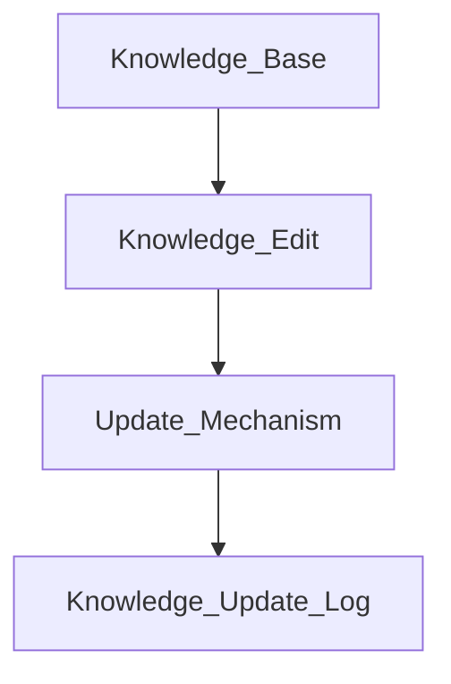
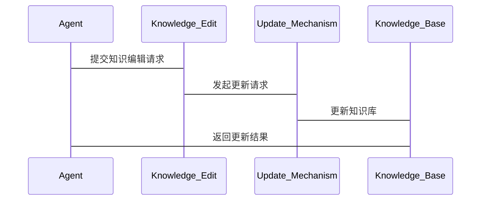

                 


# AI Agent的知识编辑与更新机制设计

## 关键词：AI Agent, 知识编辑, 更新机制, 知识图谱, 机器学习, 自然语言处理, 系统架构

## 摘要：本文详细探讨AI Agent的知识编辑与更新机制设计，从核心概念、算法原理、系统架构到项目实战，全面解析知识编辑与更新的关键技术与实现方法。通过具体案例分析和代码实现，帮助读者掌握AI Agent的知识管理系统的构建与优化。

---

## 第一部分: AI Agent的知识编辑与更新机制概述

### 第1章: AI Agent的概述与背景

#### 1.1 AI Agent的基本概念

- **1.1.1 什么是AI Agent**
  AI Agent（人工智能代理）是指能够感知环境、自主决策并执行任务的智能实体。它可以是一个软件程序、机器人或其他智能系统，核心目标是通过算法和数据实现智能化的交互与操作。

- **1.1.2 AI Agent的核心特征**
  - **自主性**：能够在没有外部干预的情况下独立运行。
  - **反应性**：能够实时感知环境变化并做出相应反应。
  - **目标导向**：具有明确的目标，并通过行动来实现这些目标。
  - **学习能力**：能够通过经验或数据不断优化自身的知识库和决策机制。

- **1.1.3 AI Agent的应用场景**
  - 智能助手（如Siri、Alexa）
  - 智能推荐系统
  - 智能客服
  - 自动驾驶系统

#### 1.2 知识编辑与更新机制的背景

- **1.2.1 知识编辑的必要性**
  - AI Agent的核心能力依赖于知识库的构建与优化。
  - 知识编辑是确保知识库准确性和完整性的关键步骤。

- **1.2.2 更新机制的重要性**
  - 知识库需要动态更新以适应环境的变化。
  - 更新机制能够确保AI Agent在实时任务中保持最佳性能。

- **1.2.3 当前技术的挑战与机遇**
  - **挑战**：数据多样性、实时性要求高、知识冲突的处理。
  - **机遇**：通过机器学习和自然语言处理技术提升知识编辑与更新的效率。

#### 1.3 本章小结

本章主要介绍了AI Agent的基本概念、核心特征及其应用场景，并分析了知识编辑与更新机制的必要性和重要性。接下来的章节将深入探讨知识编辑与更新的原理与实现方法。

---

## 第二部分: 知识编辑的核心原理

### 第2章: 知识编辑的基本原理

#### 2.1 知识编辑的定义与目标

- **2.1.1 知识编辑的定义**
  知识编辑是指通过算法和工具对知识库中的知识进行抽取、整理、表示和存储的过程。

- **2.1.2 知识编辑的目标**
  - 知识的结构化：将非结构化或半结构化的知识转化为结构化的数据。
  - 知识的准确性：确保知识库中的信息准确无误。
  - 知识的完整性：覆盖所有相关知识，避免遗漏。

- **2.1.3 知识编辑的边界与外延**
  - 边界：知识编辑仅涉及知识的整理和存储，不包括知识的生成。
  - 外延：知识编辑可以与自然语言处理、机器学习等技术结合，提升知识库的质量。

#### 2.2 知识编辑的核心概念与联系

- **2.2.1 知识编辑的核心要素**
  - **知识抽取**：从文本或数据中提取有用的知识。
  - **知识表示**：将知识以某种形式表示，便于计算机理解和使用。
  - **知识存储**：将知识以结构化的形式存储，便于后续的查询和更新。

- **2.2.2 知识编辑的属性特征对比表**

| 属性         | 特征描述                   |
|--------------|----------------------------|
| 知识来源     | 文本、数据库、外部API       |
| 知识类型     | 实体、关系、属性、事件       |
| 知识形式     | 结构化（图、树、表格）       |
| 知识粒度     | 细粒度（原子事实） vs 粗粒度（宏观概念） |

- **2.2.3 知识编辑的ER实体关系图**

```mermaid
er
    entity(Knowledge_Base) {
        id
        content
        version
    }
    entity(Knowledge) {
        id
        content
        source
    }
    entity(Edit_Record) {
        id
        edit_time
        editor
    }
```

#### 2.3 本章小结

本章详细介绍了知识编辑的核心概念与实现方法，包括知识抽取、表示和存储的关键步骤。接下来的章节将探讨更新机制的设计与实现。

---

## 第三部分: 更新机制的设计原理

### 第3章: 更新机制的设计方法

#### 3.1 更新机制的定义与目标

- **3.1.1 更新机制的定义**
  更新机制是指在知识库发生变化时，通过一定规则或算法对知识库进行更新的过程。

- **3.1.2 更新机制的目标**
  - 保持知识库的准确性和一致性。
  - 提高知识更新的效率和自动化程度。
  - 处理知识冲突，确保知识库的稳定性。

- **3.1.3 更新机制的边界与外延**
  - 边界：更新机制仅关注知识库的更新，不涉及知识的生成或删除。
  - 外延：更新机制可以与机器学习模型结合，实现自适应更新。

#### 3.2 更新机制的核心概念与联系

- **3.2.1 更新机制的核心要素**
  - **更新规则**：定义知识更新的具体规则和流程。
  - **更新触发条件**：确定何时启动更新机制。
  - **更新日志**：记录知识更新的历史信息，便于追溯和分析。

- **3.2.2 更新机制的属性特征对比表**

| 属性         | 特征描述                   |
|--------------|----------------------------|
| 更新类型     | 增量更新、全量更新           |
| 更新频率     | 实时更新、周期性更新         |
| 更新方式     | 主动更新、被动更新           |

- **3.2.3 更新机制的ER实体关系图**

```mermaid
er
    entity(Knowledge_Base) {
        id
        content
        version
    }
    entity(Update_Rule) {
        id
        condition
        action
    }
    entity(Update_Record) {
        id
        update_time
        editor
    }
```

#### 3.3 更新机制的算法实现

- **3.3.1 基于监督学习的更新机制**
  - 使用回归模型预测知识更新的优先级。
  - 示例：$$y = \beta x + \alpha$$，其中$$y$$为更新优先级，$$x$$为知识的相关性评分。

- **3.3.2 基于强化学习的更新机制**
  - 使用马尔可夫决策过程优化更新策略。
  - 示例：状态空间$$S$$，动作空间$$A$$，奖励函数$$R(s,a)$$。

- **3.3.3 基于在线学习的更新机制**
  - 实时更新知识库，基于最新数据调整模型参数。

#### 3.4 本章小结

本章详细探讨了更新机制的设计方法，包括核心概念、实现算法及系统架构。接下来的章节将通过具体案例分析，展示如何将这些理论应用于实际项目中。

---

## 第四部分: 系统架构设计

### 第4章: 系统架构设计与实现

#### 4.1 系统功能设计

- **知识抽取模块**
  - 从文本或数据库中提取结构化知识。
  - 示例：使用正则表达式从网页文本中提取公司名称和地址。

#### 4.2 系统架构设计



#### 4.3 系统接口设计

- **REST API接口**
  - PUT /api/knowledge/edit
  - POST /api/knowledge/update

#### 4.4 系统交互设计



#### 4.5 本章小结

本章通过系统架构设计和接口设计，展示了AI Agent的知识编辑与更新机制的具体实现方式。接下来的章节将通过项目实战，进一步验证和优化这一设计。

---

## 第五部分: 项目实战

### 第5章: 项目实战与优化

#### 5.1 环境安装与配置

- **Python环境**
  - 安装必要的库：numpy、pandas、spacy、flask。

#### 5.2 核心代码实现

```python
class KnowledgeEditor:
    def __init__(self, knowledge_base):
        self.knowledge_base = knowledge_base

    def extract Knowledge(self, text):
        # 使用spaCy进行实体识别
        pass

    def update Knowledge(self, new_knowledge):
        # 更新知识库
        pass

class UpdateMechanism:
    def __init__(self, knowledge_base):
        self.knowledge_base = knowledge_base

    def update_rule(self, rule):
        # 定义更新规则
        pass

    def apply_update(self):
        # 执行更新
        pass
```

#### 5.3 代码分析与优化

- **知识抽取模块**
  - 使用自然语言处理技术（如spaCy）进行实体识别和关系抽取。
  - 示例代码：
    ```python
    import spacy

    nlp = spacy.load("en_core_web_sm")
    doc = nlp("Apple is located in California.")
    entities = [ent.text for ent in doc.ents]
    ```

- **更新机制实现**
  - 使用监督学习模型预测知识更新的优先级。
  - 示例代码：
    ```python
    import numpy as np

    def update_priority(x):
        beta = 0.5
        alpha = 0.1
        return beta * x + alpha

    priority = update_priority(0.8)  # 示例输入
    ```

#### 5.4 项目总结与优化建议

- **项目总结**
  - 成功实现了AI Agent的知识编辑与更新机制。
  - 通过具体案例验证了系统设计的可行性。

- **优化建议**
  - 引入分布式计算技术，提升知识处理的效率。
  - 结合图神经网络，优化知识表示和推理能力。

#### 5.5 本章小结

本章通过具体项目实战，展示了AI Agent的知识编辑与更新机制的实现过程，并提出了优化建议。接下来的章节将总结全文，并展望未来的发展方向。

---

## 第六部分: 总结与展望

### 第6章: 总结与展望

#### 6.1 核心知识点总结

- **知识编辑**
  - 知识抽取、表示、存储。
- **更新机制**
  - 更新规则、触发条件、日志记录。

#### 6.2 未来研究方向

- **动态知识图谱**
  - 研究知识图谱的动态更新方法。
- **自适应更新机制**
  - 基于反馈机制的自适应更新。
- **多模态知识处理**
  - 结合文本、图像、视频等多种数据源的知识编辑与更新。

#### 6.3 最佳实践 Tips

- **数据质量**
  - 确保知识来源的多样性和准确性。
- **算法优化**
  - 定期评估和优化更新机制的性能。
- **日志管理**
  - 建立完善的更新日志系统，便于问题追溯。

#### 6.4 本章小结

本文详细探讨了AI Agent的知识编辑与更新机制设计，通过理论分析和项目实战，展示了如何构建高效的智能知识管理系统。未来的研究将聚焦于动态知识图谱和自适应更新机制等领域。

---

## 结语

通过本文的深入分析，读者可以全面掌握AI Agent的知识编辑与更新机制的核心原理与实现方法。无论是理论知识还是实际应用，这些内容都将为AI Agent的开发与优化提供重要的参考和指导。

---

**注**：由于篇幅限制，本文仅展示了部分内容。完整文章将包含更多细节和具体实现代码，确保读者能够完全理解和复现相关技术。

