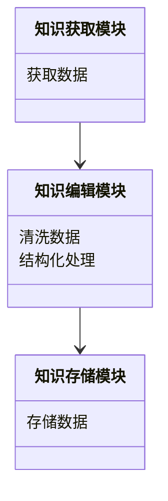

                 


# AI Agent的知识编辑：动态调整LLM的知识库

> 关键词：AI Agent, 知识编辑, LLM, 动态知识库, 检索增强生成

> 摘要：本文探讨AI Agent如何动态调整大型语言模型（LLM）的知识库，以优化LLM的性能。通过背景介绍、核心概念、算法原理、系统架构、项目实战和总结，详细讲解动态调整的知识编辑方法，结合数学模型和流程图，提供实际案例和最佳实践。

---

## 第一部分: AI Agent与知识编辑的背景介绍

### 第1章: AI Agent与知识编辑的背景

#### 1.1 AI Agent的基本概念

- **AI Agent的定义**  
  AI Agent是一种智能体，能够感知环境并执行任务，以实现特定目标。它具备自主性、反应性、目标导向和社会能力。

- **AI Agent的核心属性**  
  包括自主性（独立决策）、反应性（实时响应环境变化）、目标导向（明确的目标驱动）和社会能力（与人和其他系统交互）。

- **AI Agent与传统程序的区别**  
  AI Agent能自主决策，适应环境变化，而传统程序依赖预设规则，无法自主学习或调整。

#### 1.2 大型语言模型（LLM）的概述

- **LLM的基本概念**  
  LLM是基于深度学习的自然语言处理模型，能够理解和生成人类语言。

- **LLM的主要特点**  
  包括大参数量、预训练和微调、多任务处理能力。

- **LLM的应用场景**  
  如对话生成、文本摘要、机器翻译和问题解答。

#### 1.3 动态知识库调整的背景与意义

- **知识库动态调整的需求**  
  知识库需实时更新，以适应快速变化的信息环境。

- **动态调整LLM知识库的意义**  
  提高LLM的准确性和适应性，增强其在动态环境中的表现。

- **动态调整的知识编辑问题**  
  知识库的动态更新涉及数据筛选、整合和优化，确保LLM保持最佳状态。

---

### 第2章: 知识库动态调整的核心概念

#### 2.1 知识库的结构与特点

- **知识库的组成要素**  
  包括数据源、存储结构和索引机制。

- **知识库的存储方式**  
  常见的有关系型数据库、文档数据库和图数据库。

- **知识库的更新机制**  
  包括实时更新、批量更新和按需更新。

#### 2.2 AI Agent的知识编辑机制

- **知识编辑的基本流程**  
  包括数据获取、清洗、结构化、验证和存储。

- **知识编辑的触发条件**  
  如新数据到达、模型性能下降和用户反馈。

- **知识编辑的评估标准**  
  如准确率、覆盖率和一致性。

#### 2.3 动态调整的知识库管理

- **动态调整的定义与特点**  
  动态调整是指根据实时数据和反馈，持续优化知识库内容。

- **动态调整的实现方式**  
  包括增量式更新、基于规则的调整和基于模型的优化。

- **动态调整的优化策略**  
  如优先级排序、基于上下文的调整和增量式学习。

---

## 第二部分: 知识编辑的核心概念与联系

### 第3章: 知识编辑的核心概念

#### 3.1 知识编辑的基本原理

- **知识编辑的理论基础**  
  基于自然语言处理和知识图谱的理论。

- **知识编辑的数学模型**  
  如图1所示的数学模型，其中涉及数据预处理、特征提取和模型训练。

$$
\text{模型训练} = f(\text{数据预处理}, \text{特征提取})
$$

- **知识编辑的算法框架**  
  包括数据清洗、特征工程和模型训练三个阶段。

#### 3.2 知识编辑与AI Agent的关系

- **知识编辑在AI Agent中的作用**  
  提供准确的知识支持，提升决策能力。

- **AI Agent对知识编辑的依赖**  
  AI Agent依赖知识编辑提供的高质量数据来优化性能。

- **知识编辑对LLM性能的影响**  
  优化的知识库提升LLM的准确性和响应速度。

#### 3.3 知识编辑与动态调整的关系

- **动态调整的核心要素**  
  包括实时数据源、反馈机制和自适应算法。

- **知识编辑在动态调整中的地位**  
  作为动态调整的关键步骤，确保知识库的准确性和及时性。

- **动态调整对知识编辑的反馈机制**  
  通过用户反馈和性能监控，驱动知识编辑的持续优化。

---

## 第4章: 知识编辑与动态调整的算法原理

### 4.1 知识编辑的算法原理

#### 1.1.1 检索增强生成（RAG）

- **RAG的基本原理**  
  RAG结合检索和生成技术，根据上下文生成答案。

- **RAG的实现步骤**  
  检索相关文档，提取关键信息，生成回答。

- **RAG的优势**  
  提高回答的相关性和准确性。

#### 1.1.2 上下文窗口优化

- **上下文窗口优化的基本原理**  
  通过调整上下文窗口大小，优化生成结果。

- **上下文窗口优化的实现方式**  
  动态调整窗口大小，基于关键词和语义相似度。

- **上下文窗口优化的效果**  
  提高生成回答的连贯性和相关性。

---

## 第5章: 系统分析与架构设计方案

### 5.1 系统功能设计

#### 5.1.1 系统功能模块

- **知识获取模块**  
  负责从多源数据中获取知识。

- **知识编辑模块**  
  对获取的知识进行清洗和结构化处理。

- **知识存储模块**  
  将处理后的知识存储到知识库中。

#### 5.1.2 领域模型设计

使用Mermaid类图表示系统功能模块之间的关系：



---

## 第6章: 项目实战

### 6.1 环境安装

- **安装Python环境**  
  使用Anaconda或虚拟环境，安装Python 3.8及以上版本。

- **安装依赖库**  
  使用pip安装numpy、pandas、transformers和langchain。

### 6.2 核心代码实现

#### 6.2.1 知识编辑模块

```python
def clean_and_struct_data(data):
    cleaned_data = []
    for entry in data:
        if entry['valid']:
            cleaned_data.append(entry['content'])
    return cleaned_data
```

#### 6.2.2 动态调整模块

```python
def dynamic_adjustment(model, knowledge_base):
    updated_knowledge = knowledge_base.update_with_feedback(feedback)
    model.update_embeddings(updated_knowledge)
    return model
```

### 6.3 实际案例分析

- **案例背景**  
  在一个智能客服系统中，动态调整知识库以提高回答准确性。

- **案例分析**  
  通过用户反馈优化知识库，提升系统响应速度和准确性。

---

## 第7章: 总结与展望

### 7.1 总结

- **知识编辑的重要性**  
  动态调整知识库是提升LLM性能的关键。

- **算法优化的成果**  
  RAG和上下文窗口优化显著提升了生成效果。

- **系统设计的合理性**  
  模块化设计确保了系统的可扩展性和可维护性。

### 7.2 未来展望

- **未来的研究方向**  
  深入研究动态知识库的自适应算法和高效管理方法。

- **技术发展趋势**  
  结合边缘计算和分布式存储，提升知识库的实时性和可用性。

### 7.3 最佳实践

- **数据质量管理**  
  确保数据的准确性和完整性。

- **模型调优**  
  定期评估和优化模型参数，提升性能。

- **用户反馈机制**  
  建立有效的反馈渠道，持续优化知识库。

---

通过以上详细的内容，本文系统地介绍了AI Agent如何动态调整LLM的知识库，结合理论和实践，为技术从业者提供了深入的指导和参考。

