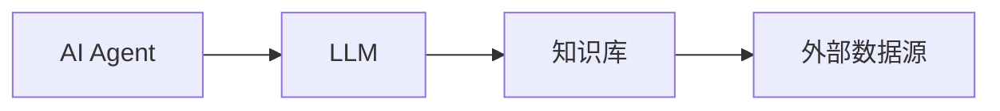

                 

# AI Agent的知识获取：利用LLM进行持续学习

> 关键词：AI Agent、知识获取、LLM、持续学习、大语言模型、知识表示、知识更新  
> 摘要：本文探讨了AI Agent的知识获取方法，重点介绍如何利用大语言模型（LLM）进行持续学习。通过分析LLM的工作原理，结合AI Agent的知识表示与更新机制，提出了一种基于LLM的知识获取框架，并通过实际案例展示了其应用。

---

## 第一部分：AI Agent与知识获取概述

### 第1章：AI Agent与知识获取概述

#### 1.1 问题背景与描述

##### 1.1.1 AI Agent的基本概念
AI Agent（智能体）是指能够感知环境、自主决策并执行任务的智能系统。AI Agent需要通过知识来理解和处理环境中的信息，从而做出合理的决策和行动。

##### 1.1.2 知识获取的核心问题
知识获取是AI Agent的核心能力之一。AI Agent需要从多种来源（如文本、数据库、网络等）中获取知识，并将其表示为可处理的形式。传统的知识获取方法依赖于人工标注或规则引擎，存在效率低、适应性差的问题。

##### 1.1.3 LLM在知识获取中的作用
大语言模型（LLM）通过其强大的语言理解和生成能力，能够从大量文本数据中提取和生成知识，为AI Agent的知识获取提供了新的可能性。LLM可以理解上下文、回答问题、生成文本，并通过持续学习不断更新知识库。

#### 1.2 问题解决与边界

##### 1.2.1 知识获取的实现方法
知识获取的实现方法包括知识抽取、知识表示和知识推理。知识抽取是从数据中提取结构化信息，知识表示将信息组织为可理解的形式，知识推理则是基于已有知识进行推断。

##### 1.2.2 LLM在知识获取中的边界
尽管LLM在知识获取中表现出色，但其能力也存在边界。例如，LLM无法处理实时动态数据，也无法直接与物理世界交互。此外，LLM的回答可能存在偏见或错误，需要结合验证机制来确保准确性。

##### 1.2.3 知识获取的外延与应用
知识获取的外延包括知识图谱构建、对话系统、智能问答等应用场景。通过知识获取，AI Agent可以实现更智能的交互和决策。

#### 1.3 核心要素与概念结构

##### 1.3.1 AI Agent的知识表示
知识表示是将知识以结构化形式存储的过程，常用的表示方法包括本体论（Ontology）和知识图谱。知识表示需要考虑实体、属性和关系。

##### 1.3.2 LLM与AI Agent的协作机制
LLM与AI Agent的协作机制包括知识检索、知识生成和知识验证。AI Agent通过向LLM提出问题，LLM生成回答，AI Agent再对回答进行验证和整合。

##### 1.3.3 知识更新的流程
知识更新是持续学习的重要部分，包括数据获取、知识抽取、知识融合和知识存储。通过持续更新，AI Agent能够适应变化的环境。

---

### 第2章：LLM与AI Agent的核心概念

#### 2.1 核心概念原理

##### 2.1.1 LLM的工作原理
LLM通过自注意力机制和解码器结构，能够理解上下文并生成连贯的文本。其核心在于通过大量数据训练出概率分布模型，从而能够预测下一个词。

##### 2.1.2 AI Agent的知识获取机制
AI Agent的知识获取机制包括需求分析、知识检索和知识整合。需求分析确定所需知识的类型和范围，知识检索通过LLM或其他数据源获取信息，知识整合将获取的知识与现有知识库融合。

##### 2.1.3 LLM与AI Agent的协同关系
LLM作为AI Agent的知识源，通过提供生成式回答支持AI Agent的任务执行。AI Agent则通过明确的需求引导LLM进行特定的知识生成。

#### 2.2 概念属性对比

##### 2.2.1 LLM与传统NLP模型的对比
| 特性             | LLM                 | 传统NLP模型       |
|------------------|--------------------|------------------|
| 处理能力         | 强大学习和生成能力   | 专注于特定任务     |
| 数据需求         | 需要大量数据         | 数据需求较低       |
| 应用场景         | 多领域通用           | 适用于特定任务     |

##### 2.2.2 AI Agent与传统知识库的对比
| 特性             | AI Agent           | 传统知识库       |
|------------------|--------------------|------------------|
| 自主性           | 高度自主           | 需要人工维护       |
| 适应性           | 能够动态更新知识     | 知识更新较慢       |
| 交互能力         | 支持自然语言交互     | 交互方式有限       |

##### 2.2.3 知识获取与知识推理的对比
| 特性             | 知识获取           | 知识推理         |
|------------------|--------------------|------------------|
| 目标             | 获取新知识         | 基于知识进行推断   |
| 方法             | 抽取、表示、整合     | 推理算法          |
| 应用场景         | 数据预处理阶段      | 问题求解阶段      |

#### 2.3 ER实体关系图

---

## 第三部分：总结与展望

### 3.1 总结

通过本文的探讨，我们了解了AI Agent的知识获取方法，特别是如何利用大语言模型（LLM）进行持续学习。LLM的强大能力为AI Agent的知识获取提供了新的可能性，但仍需解决实时数据处理、模型偏见等问题。

### 3.2 注意事项

- 数据质量：确保知识获取的数据来源可靠。
- 模型验证：对LLM的回答进行验证，避免错误信息。
- 隐私与伦理：关注数据隐私和模型的伦理问题。

### 3.3 拓展阅读

建议读者进一步阅读以下内容：
- 大语言模型的训练与优化
- 知识图谱的构建与应用
- AI Agent在不同领域的具体应用案例

---

通过本文的详细阐述，读者可以全面理解AI Agent的知识获取方法，并掌握如何利用LLM进行持续学习。希望本文能为相关领域的研究和实践提供有价值的参考。

