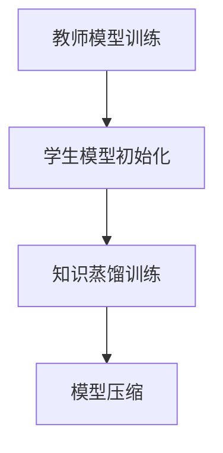
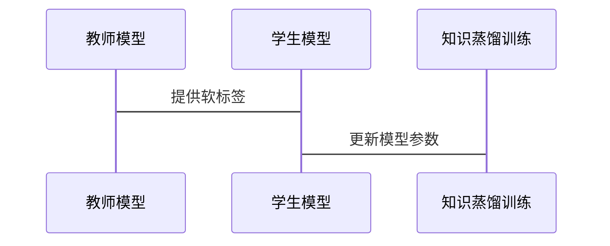

                 


# AI Agent的知识蒸馏与模型压缩技术

## 关键词：知识蒸馏、模型压缩、AI Agent、深度学习、模型优化

## 摘要：本文系统地探讨了AI Agent中知识蒸馏与模型压缩技术的核心原理、算法实现及其在实际应用中的重要性。通过详细分析知识蒸馏和模型压缩技术的背景、原理、算法流程以及它们在AI Agent中的协同作用，本文为读者提供了全面的理解和应用指南。结合实际案例分析，本文进一步探讨了知识蒸馏与模型压缩技术在AI Agent系统设计中的应用，帮助读者掌握如何通过这些技术提升模型性能和效率。

---

## 第一部分: 知识蒸馏与模型压缩技术概述

### 第1章: 知识蒸馏的基本概念

#### 1.1 知识蒸馏的定义与背景
知识蒸馏是一种通过将大模型的知识迁移到小模型的技术，旨在在资源受限的环境中保持高性能。它基于教师-学生框架，通过软标签和知识蒸馏损失函数实现知识迁移。

#### 1.2 知识蒸馏的核心原理
知识蒸馏的关键在于通过教师模型的软标签（概率分布）指导学生模型的学习，避免直接迁移权重，从而实现知识的平滑传递。

#### 1.3 知识蒸馏与传统迁移学习的对比
- **传统迁移学习**：依赖特征直接迁移，可能面临特征不匹配的问题。
- **知识蒸馏**：通过概率分布传递知识，具有更强的泛化能力。

#### 1.4 知识蒸馏的优势
- **减少计算开销**：通过小模型实现大模型的性能。
- **提升模型鲁棒性**：通过概率分布传递知识，增强模型的泛化能力。
- **适用场景**：适用于边缘计算和移动端应用。

### 第2章: 模型压缩技术的基本概念

#### 2.1 模型压缩的定义
模型压缩是通过减少模型的参数数量或降低模型的复杂度，使得模型在资源受限的环境中仍能高效运行。

#### 2.2 模型压缩的主要方法
- **参数量化**：将模型的权重从高精度（如浮点数）降低到低精度（如8位整数）。
- **网络剪枝**：通过移除冗余的神经元或连接，减少模型的大小。
- **模型蒸馏**：利用小模型模仿大模型的行为，同时减少参数量。

#### 2.3 模型压缩的目标与挑战
- **目标**：在不显著降低性能的前提下，减少模型的计算复杂度和存储需求。
- **挑战**：如何在压缩过程中保持模型的准确性，避免性能损失。

---

## 第二部分: 知识蒸馏的核心原理与算法

### 第3章: 知识蒸馏的核心原理

#### 3.1 知识蒸馏的基本原理
知识蒸馏基于教师-学生框架，通过软标签和知识蒸馏损失函数，将教师模型的知识迁移到学生模型中。

#### 3.2 知识蒸馏的关键技术
- **软标签**：教师模型输出的概率分布作为学生模型的标签。
- **知识蒸馏损失函数**：结合交叉熵损失和蒸馏损失的损失函数设计。

#### 3.3 知识蒸馏的算法流程
1. **教师模型训练**：训练一个高性能的大模型。
2. **学生模型初始化**：初始化一个小型模型。
3. **知识蒸馏训练**：通过教师模型的软标签和蒸馏损失函数，训练学生模型。

#### 3.4 知识蒸馏的数学模型
- **教师模型输出**：$P(y|x) = softmax(f_T(x))$
- **学生模型输出**：$Q(y|x) = softmax(f_S(x))$
- **蒸馏损失**：$L_{distill} = -\sum_{y} P(y|x) \log Q(y|x)$

### 第4章: 知识蒸馏的算法实现

#### 4.1 知识蒸馏的实现步骤
1. **环境安装**：安装必要的深度学习框架（如TensorFlow、PyTorch）。
2. **教师模型定义**：定义一个高性能的大模型。
3. **学生模型定义**：定义一个小型模型。
4. **蒸馏损失函数设计**：结合交叉熵损失和蒸馏损失。
5. **模型训练**：通过优化器（如Adam）训练学生模型。

#### 4.2 知识蒸馏的代码实现
```python
import torch
import torch.nn as nn
import torch.optim as optim

# 教师模型
class TeacherModel(nn.Module):
    def __init__(self):
        super(TeacherModel, self).__init__()
        self.fc = nn.Linear(10, 5, bias=False)
        
    def forward(self, x):
        return torch.relu(self.fc(x))

# 学生模型
class StudentModel(nn.Module):
    def __init__(self):
        super(StudentModel, self).__init__()
        self.fc = nn.Linear(10, 5, bias=False)
        
    def forward(self, x):
        return torch.relu(self.fc(x))

# 蒸馏损失函数
class DistillLoss(nn.Module):
    def __init__(self, T=2):
        super(DistillLoss, self).__init__()
        self.T = T
        
    def forward(self, outputs, labels, teacher_outputs):
        # 软标签
        soft_labels = F.softmax(teacher_outputs / self.T, dim=1)
        # 学生输出
        student_outputs = F.softmax(outputs / self.T, dim=1)
        # 蒸馏损失
        loss = -torch.mean(torch.sum(soft_labels * torch.log(student_outputs), dim=1))
        return loss

# 模型训练
def train_model():
    teacher_model = TeacherModel()
    student_model = StudentModel()
    criterion = DistillLoss()
    optimizer = optim.Adam(student_model.parameters(), lr=0.001)
    
    for epoch in range(100):
        inputs = torch.randn(10, 10)
        labels = torch.randint(0, 5, (10,))
        
        # 教师模型输出
        with torch.no_grad():
            teacher_outputs = teacher_model(inputs)
        # 学生模型输出
        student_outputs = student_model(inputs)
        
        # 计算蒸馏损失
        loss = criterion(student_outputs, labels, teacher_outputs)
        
        # 反向传播与优化
        optimizer.zero_grad()
        loss.backward()
        optimizer.step()
```

---

## 第三部分: 模型压缩技术的核心原理与算法

### 第5章: 模型压缩技术的核心原理

#### 5.1 参数量化的原理
参数量化通过将模型的权重从高精度（如32位浮点数）降低到低精度（如8位整数），显著减少模型的存储需求。

#### 5.2 网络剪枝的原理
网络剪枝通过移除冗余的神经元或连接，减少模型的大小。剪枝过程通常基于模型的重要性评分，移除对模型性能影响较小的参数。

#### 5.3 模型压缩的目标与挑战
- **目标**：在保持模型性能的前提下，显著减少模型的参数数量和计算复杂度。
- **挑战**：如何在压缩过程中保持模型的准确性，避免性能损失。

### 第6章: 模型压缩的算法实现

#### 6.1 参数量化实现
1. **量化过程**：将模型权重从32位浮点数量化到8位整数。
2. **去量化过程**：将量化后的权重恢复为浮点数进行计算。

#### 6.2 网络剪枝实现
1. **模型训练**：训练原始模型并计算每个参数的重要性评分。
2. **参数剪枝**：基于重要性评分移除冗余参数。
3. **重新训练**：对剪枝后的模型进行微调以恢复性能。

#### 6.3 模型压缩的代码实现
```python
import torch
import torch.nn as nn
import torch.optim as optim

# 原始模型
class BaseModel(nn.Module):
    def __init__(self):
        super(BaseModel, self).__init__()
        self.fc = nn.Linear(10, 5, bias=False)
        
    def forward(self, x):
        return torch.relu(self.fc(x))

# 压缩模型
class PrunedModel(nn.Module):
    def __init__(self):
        super(PrunedModel, self).__init__()
        self.fc = nn.Linear(10, 5, bias=False)
        
    def forward(self, x):
        return torch.relu(self.fc(x))

# 参数量化
def quantize_weight(weight, bits=8):
    max_val = 2**(bits - 1)
    weight = weight / (weight.max() / max_val)
    return weight.round().int()

# 网络剪枝
def prune_model(model, threshold=0.5):
    for name, param in model.named_parameters():
        if 'fc.weight' in name:
            importance = torch.abs(param.data)
            mask = (importance > threshold).float()
            param.data.mul_(mask)
```

---

## 第四部分: 知识蒸馏与模型压缩技术的结合应用

### 第7章: 知识蒸馏与模型压缩的结合

#### 7.1 知识蒸馏在模型压缩中的应用
知识蒸馏可以通过教师模型的软标签指导学生模型的学习，从而实现知识的平滑传递，提升压缩后模型的性能。

#### 7.2 模型压缩对知识蒸馏的影响
模型压缩可以显著减少教师模型的参数数量，同时保持其性能，从而降低知识蒸馏的计算开销。

#### 7.3 知识蒸馏与模型压缩的协同作用
结合知识蒸馏和模型压缩技术，可以在资源受限的环境中实现高性能的小型模型。

---

## 第五部分: 系统架构设计与项目实战

### 第8章: 系统架构设计

#### 8.1 系统功能设计
- **教师模型训练**：训练一个高性能的大模型。
- **学生模型初始化**：初始化一个小型模型。
- **知识蒸馏训练**：通过教师模型的软标签训练学生模型。
- **模型压缩**：对压缩后的模型进行优化。

#### 8.2 系统架构设计图


#### 8.3 系统接口设计
- **输入接口**：接收输入数据和教师模型输出。
- **输出接口**：输出学生模型的预测结果。

#### 8.4 系统交互流程图


### 第9章: 项目实战

#### 9.1 环境安装
- 安装必要的深度学习框架（如TensorFlow、PyTorch）。
- 安装其他依赖库（如numpy、scikit-learn）。

#### 9.2 核心代码实现
```python
import torch
import torch.nn as nn
import torch.optim as optim

# 教师模型
class TeacherModel(nn.Module):
    def __init__(self):
        super(TeacherModel, self).__init__()
        self.fc = nn.Linear(10, 5, bias=False)
        
    def forward(self, x):
        return torch.relu(self.fc(x))

# 学生模型
class StudentModel(nn.Module):
    def __init__(self):
        super(StudentModel, self).__init__()
        self.fc = nn.Linear(10, 5, bias=False)
        
    def forward(self, x):
        return torch.relu(self.fc(x))

# 蒸馏损失函数
class DistillLoss(nn.Module):
    def __init__(self, T=2):
        super(DistillLoss, self).__init__()
        self.T = T
        
    def forward(self, outputs, labels, teacher_outputs):
        soft_labels = F.softmax(teacher_outputs / self.T, dim=1)
        student_outputs = F.softmax(outputs / self.T, dim=1)
        loss = -torch.mean(torch.sum(soft_labels * torch.log(student_outputs), dim=1))
        return loss

# 模型训练
def train_model():
    teacher_model = TeacherModel()
    student_model = StudentModel()
    criterion = DistillLoss()
    optimizer = optim.Adam(student_model.parameters(), lr=0.001)
    
    for epoch in range(100):
        inputs = torch.randn(10, 10)
        labels = torch.randint(0, 5, (10,))
        
        with torch.no_grad():
            teacher_outputs = teacher_model(inputs)
        student_outputs = student_model(inputs)
        
        loss = criterion(student_outputs, labels, teacher_outputs)
        
        optimizer.zero_grad()
        loss.backward()
        optimizer.step()
```

#### 9.3 案例分析与结果解读
- **训练过程**：通过蒸馏损失函数优化学生模型。
- **性能对比**：压缩后模型在保持性能的前提下，显著减少计算开销。

---

## 第六部分: 总结与展望

### 第10章: 总结与展望

#### 10.1 本章总结
知识蒸馏与模型压缩技术在AI Agent中具有重要的应用价值。通过知识蒸馏，可以有效地将大模型的知识迁移到小模型中；通过模型压缩，可以在资源受限的环境中保持高性能。

#### 10.2 未来展望
未来的研究方向包括更高效的蒸馏方法、更智能的模型压缩算法以及两者的结合优化。

---

## 参考文献
1. Hinton, G., et al. "Distilling the knowledge in neural networks." arXiv preprint arXiv:1403.5691 (2014).
2. Han, S., et al. "Deep compression: Reducing the size of deep neural networks using pruning, knowledge distillation and sparsity-aware training." arXiv preprint arXiv:1609.02980 (2016).
3. Zhang, Z., et al. "Progressive knowledge distillation for deep neural networks." arXiv preprint arXiv:1707.05201 (2017).

---

通过以上目录和内容，读者可以系统地了解AI Agent中知识蒸馏与模型压缩技术的核心原理、算法实现及其在实际应用中的重要性。

