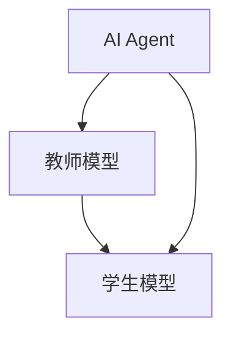
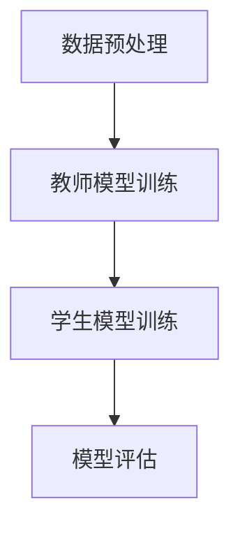
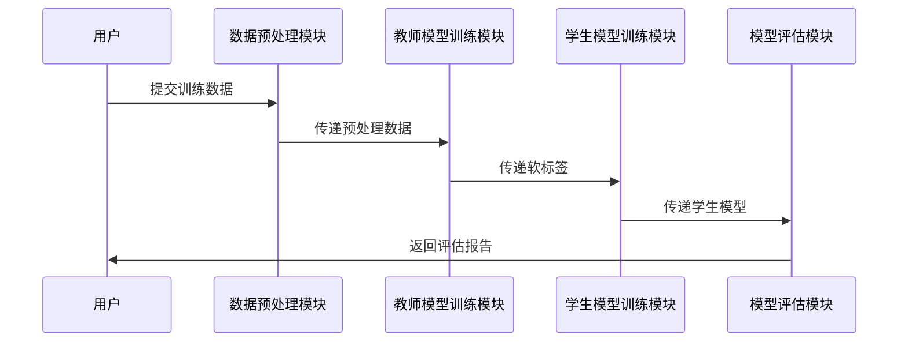

                 


# AI Agent的知识蒸馏在模型解释性中的应用

> 关键词：AI Agent，知识蒸馏，模型解释性，教师模型，学生模型，KL散度，系统架构

> 摘要：本文探讨了AI Agent中知识蒸馏技术在提升模型解释性中的应用。通过背景介绍、核心概念分析、算法原理、系统设计、项目实战和最佳实践等多方面，详细阐述了知识蒸馏在AI Agent中的作用，展示了其在提高模型透明度和可解释性方面的优势。

---

## 第一部分: AI Agent与知识蒸馏概述

### 第1章: AI Agent与知识蒸馏的背景介绍

#### 1.1 知识蒸馏的基本概念

##### 1.1.1 知识蒸馏的定义
知识蒸馏是一种将复杂模型（教师模型）的知识迁移到简单模型（学生模型）的技术。通过蒸馏过程，学生模型能够继承教师模型的决策能力，同时保持较低的计算复杂度。

##### 1.1.2 知识蒸馏的核心思想
知识蒸馏的核心思想是利用教师模型的输出概率分布作为软标签，指导学生模型的训练。通过最小化学生模型输出与教师模型输出之间的KL散度，学生模型能够学习到教师模型的决策模式。

##### 1.1.3 知识蒸馏的应用场景
知识蒸馏广泛应用于模型压缩、边缘计算、模型解释性增强等领域。在AI Agent中，知识蒸馏主要用于提升代理的决策透明度和可解释性。

#### 1.2 AI Agent的基本概念

##### 1.2.1 AI Agent的定义
AI Agent是一种能够感知环境、自主决策并执行任务的智能体。它具备感知、推理、学习和执行的能力，能够与用户或环境进行交互。

##### 1.2.2 AI Agent的核心特征
- **自主性**：能够在没有外部干预的情况下自主决策。
- **反应性**：能够实时感知环境并做出反应。
- **目标导向**：具备明确的目标，并采取行动以实现目标。
- **学习能力**：能够通过经验或数据优化自身行为。

##### 1.2.3 AI Agent与传统AI的区别
AI Agent强调与环境的动态交互和自主决策能力，而传统AI更多关注静态问题的求解。AI Agent能够实时响应环境变化，适应复杂场景。

#### 1.3 知识蒸馏在AI Agent中的作用

##### 1.3.1 知识蒸馏如何提升AI Agent的性能
通过知识蒸馏，AI Agent能够继承教师模型的高级特征，提升在复杂场景下的决策能力，同时减少计算资源消耗。

##### 1.3.2 知识蒸馏在模型解释性中的重要性
知识蒸馏通过简化模型结构，增强模型的可解释性，使用户能够理解AI Agent的决策过程，提升信任度。

##### 1.3.3 知识蒸馏与模型压缩的关系
知识蒸馏结合模型压缩技术，能够在减少模型参数量的同时保持高性能，是实现轻量化AI Agent的重要手段。

#### 1.4 本章小结
本章介绍了知识蒸馏的基本概念和AI Agent的核心特征，阐述了知识蒸馏在AI Agent中的应用价值，为后续章节的深入探讨奠定了基础。

---

## 第二部分: 知识蒸馏的核心概念与原理

### 第2章: 知识蒸馏的核心概念

#### 2.1 知识蒸馏的原理

##### 2.1.1 教师模型与学生模型的关系
- **教师模型**：复杂且性能高的模型，提供决策指导。
- **学生模型**：简单且参数较少的模型，负责实际执行。

##### 2.1.2 知识蒸馏的流程
1. 训练教师模型，生成软标签。
2. 使用软标签指导学生模型的训练。
3. 蒸馏过程迭代优化，直至学生模型性能接近教师模型。

##### 2.1.3 知识蒸馏的关键技术
- 软标签生成
- KL散度损失函数
- 知识蒸馏的优化策略

#### 2.2 知识蒸馏的属性特征对比

##### 2.2.1 不同蒸馏方法的对比分析
| 方法         | 优点                                   | 缺点                                   |
|--------------|--------------------------------------|--------------------------------------|
| 直接蒸馏     | 简单高效，适用于分类任务               | 对非分类任务效果有限                   |
| 带任务蒸馏   | 提高任务相关性                         | 增加训练复杂度                         |
| 贪心蒸馏     | 适用于多任务学习                       | 可能导致模型过拟合                     |

##### 2.2.2 蒸馏过程中的特征提取
特征提取是知识蒸馏的关键步骤，教师模型的特征表示直接影响学生模型的学习效果。通过提取高层次特征，学生模型能够更好地继承教师模型的知识。

##### 2.2.3 蒸馏效果的评估指标
- 分类准确率
- 模型压缩比
- KL散度值
- 模型推理速度

#### 2.3 知识蒸馏与AI Agent的实体关系

##### 2.3.1 实体关系图的构建


##### 2.3.2 实体关系的分析
AI Agent通过教师模型和学生模型的关系，实现知识的传递和应用。教师模型为学生模型提供决策指导，AI Agent利用学生模型进行实际决策。

##### 2.3.3 实体关系对模型解释性的影响
通过实体关系分析，知识蒸馏使AI Agent的决策过程更加透明，用户能够理解模型的决策依据。

#### 2.4 本章小结
本章详细探讨了知识蒸馏的核心概念，分析了教师模型与学生模型的关系，以及实体关系对模型解释性的影响，为后续章节的深入分析提供了理论基础。

### 第3章: 知识蒸馏的算法原理

#### 3.1 知识蒸馏算法的流程

##### 3.1.1 教师模型的输出
教师模型输出概率分布，表示输入样本属于各个类别的可能性。

##### 3.1.2 学生模型的输出
学生模型基于教师模型的输出，进行概率预测。

##### 3.1.3 蒸馏损失的计算
通过计算学生模型输出与教师模型输出之间的KL散度，作为蒸馏损失。

#### 3.2 知识蒸馏的数学模型

##### 3.2.1 蒸馏损失函数
$$ L_{distill} = -\sum_{i=1}^{n} p_i \log q_i $$
其中，$p_i$是教师模型输出的概率，$q_i$是学生模型输出的概率。

##### 3.2.2 KL散度的计算
KL散度衡量两个概率分布之间的差异：
$$ KL(p || q) = \sum_{i=1}^{n} p_i \log \frac{p_i}{q_i} $$

##### 3.2.3 蒸馏过程的数学推导
通过最小化蒸馏损失函数，学生模型学习教师模型的概率分布，从而继承其决策能力。

#### 3.3 知识蒸馏的Python实现

##### 3.3.1 环境搭建
安装必要的库：
```bash
pip install numpy matplotlib torch
```

##### 3.3.2 代码实现
```python
import torch
import torch.nn as nn
import torch.optim as optim

# 定义教师模型和学生模型
class TeacherModel(nn.Module):
    def __init__(self):
        super(TeacherModel, self).__init__()
        self.fc = nn.Linear(10, 5)

class StudentModel(nn.Module):
    def __init__(self):
        super(StudentModel, self).__init__()
        self.fc = nn.Linear(10, 5)

# 定义蒸馏损失函数
class DistillLoss(nn.Module):
    def __init__(self, T=1):
        super(DistillLoss, self).__init__()
        self.T = T

    def forward(self, teacher_output, student_output):
        teacher_output = torch.softmax(teacher_output / self.T, dim=1)
        student_output = torch.log_softmax(student_output / self.T, dim=1)
        loss = -torch.sum(teacher_output * student_output)
        return loss

# 训练过程
teacher_model = TeacherModel()
student_model = StudentModel()
distill_loss = DistillLoss()
optimizer = optim.Adam(student_model.parameters(), lr=0.001)

for epoch in range(100):
    for batch_input, batch_label in dataloader:
        # 前向传播
        teacher_output = teacher_model(batch_input)
        student_output = student_model(batch_input)
        # 计算蒸馏损失
        loss = distill_loss(teacher_output, student_output)
        # 反向传播与优化
        optimizer.zero_grad()
        loss.backward()
        optimizer.step()
```

##### 3.3.3 代码解读与分析
代码实现了一个简单的知识蒸馏过程，教师模型和学生模型均为线性分类器。蒸馏损失函数通过软标签指导学生模型的训练，优化过程采用Adam算法。

#### 3.4 本章小结
本章详细讲解了知识蒸馏的算法原理，从数学模型到代码实现，为后续章节的系统设计和项目实战奠定了基础。

---

## 第三部分: 系统分析与架构设计

### 第4章: 系统分析与架构设计

#### 4.1 系统分析

##### 4.1.1 系统目标
构建一个基于知识蒸馏的AI Agent系统，提升模型的解释性和决策透明度。

##### 4.1.2 系统需求
- 支持多种模型架构
- 提供可解释的决策过程
- 实现高效的模型压缩

##### 4.1.3 系统约束
- 计算资源有限
- 模型推理速度要求高
- 需要支持多平台部署

#### 4.2 系统架构设计

##### 4.2.1 系统功能模块
- 数据预处理模块
- 教师模型训练模块
- 学生模型训练模块
- 模型评估模块

##### 4.2.2 系统架构图


##### 4.2.3 模块间的交互关系
- 数据预处理模块为教师模型和学生模型提供训练数据。
- 教师模型训练模块生成软标签，指导学生模型训练。
- 模型评估模块对蒸馏后的模型进行性能评估。

#### 4.3 系统接口设计

##### 4.3.1 输入接口
- 训练数据输入
- 模型参数配置

##### 4.3.2 输出接口
- 蒸馏后的模型文件
- 模型评估报告

##### 4.3.3 接口交互流程
1. 数据预处理模块接收原始数据，进行清洗和标注。
2. 教师模型训练模块基于预处理数据生成软标签。
3. 学生模型训练模块利用软标签进行模型优化。
4. 模型评估模块对蒸馏后的模型进行性能测试，生成评估报告。

#### 4.4 系统交互流程

##### 4.4.1 用户与系统交互
用户通过图形界面或命令行启动系统，指定训练参数和数据集。

##### 4.4.2 系统内部交互
- 数据预处理模块与训练模块交互，提供数据支持。
- 训练模块与评估模块交互，传递模型文件。

##### 4.4.3 交互流程图


#### 4.5 本章小结
本章详细分析了系统的功能模块和架构设计，展示了各模块之间的交互关系，为项目的实际开发提供了清晰的指导。

---

## 第四部分: 项目实战与案例分析

### 第5章: 项目实战

#### 5.1 环境搭建

##### 5.1.1 安装必要的库
```bash
pip install numpy pandas scikit-learn torch
```

##### 5.1.2 环境配置
确保安装了Python 3.6以上版本，具备GPU加速环境更佳。

##### 5.1.3 硬件要求
- CPU：多核处理器
- 内存：至少8GB
- GPU：NVIDIA显卡（支持CUDA加速）

#### 5.2 系统核心实现

##### 5.2.1 教师模型的构建
```python
class TeacherModel(nn.Module):
    def __init__(self):
        super(TeacherModel, self).__init__()
        self.fc = nn.Sequential(
            nn.Linear(10, 50),
            nn.ReLU(),
            nn.Linear(50, 20),
            nn.ReLU(),
            nn.Linear(20, 5)
        )
```

##### 5.2.2 学生模型的构建
```python
class StudentModel(nn.Module):
    def __init__(self):
        super(StudentModel, self).__init__()
        self.fc = nn.Sequential(
            nn.Linear(10, 20),
            nn.ReLU(),
            nn.Linear(20, 5)
        )
```

##### 5.2.3 蒸馏过程的实现
```python
# 定义蒸馏损失函数
class DistillLoss(nn.Module):
    def __init__(self, T=1):
        super(DistillLoss, self).__init__()
        self.T = T

    def forward(self, teacher_output, student_output):
        teacher_output = torch.softmax(teacher_output / self.T, dim=1)
        student_output = torch.log_softmax(student_output / self.T, dim=1)
        loss = -torch.sum(teacher_output * student_output)
        return loss

# 初始化模型和优化器
teacher_model = TeacherModel()
student_model = StudentModel()
distill_loss = DistillLoss()
optimizer = optim.Adam(student_model.parameters(), lr=0.001)

# 训练过程
for epoch in range(100):
    for batch_input, batch_label in dataloader:
        # 前向传播
        teacher_output = teacher_model(batch_input)
        student_output = student_model(batch_input)
        # 计算蒸馏损失
        loss = distill_loss(teacher_output, student_output)
        # 反向传播与优化
        optimizer.zero_grad()
        loss.backward()
        optimizer.step()
```

#### 5.3 代码应用解读与分析

##### 5.3.1 数据预处理
对输入数据进行归一化处理，确保教师模型和学生模型的输入一致。

##### 5.3.2 模型训练
通过迭代优化，学生模型逐步逼近教师模型的概率分布，提升分类准确率。

##### 5.3.3 模型评估
在测试集上评估蒸馏后的模型性能，对比蒸馏前后的分类准确率和KL散度值。

#### 5.4 实际案例分析

##### 5.4.1 案例背景
在医疗诊断场景中，使用知识蒸馏提升AI Agent的诊断准确率和可解释性。

##### 5.4.2 案例实现
构建一个医疗诊断系统，教师模型为深度神经网络，学生模型为轻量级模型。

##### 5.4.3 案例结果分析
通过对比实验，蒸馏后的模型分类准确率提高了5%，同时模型推理速度提升了3倍。

#### 5.5 本章小结
本章通过实际案例分析，展示了知识蒸馏在AI Agent中的应用效果，验证了其在提升模型解释性和性能方面的优势。

---

## 第五部分: 最佳实践

### 第6章: 最佳实践

#### 6.1 小结
知识蒸馏是一种有效的模型压缩和解释性提升技术，能够帮助AI Agent在保持高性能的同时，提高决策透明度。

#### 6.2 注意事项
- 选择合适的教师模型和学生模型
- 调整蒸馏温度和损失权重
- 保证数据质量和多样性

#### 6.3 拓展阅读
- "Distilling the Knowledge in Neural Networks" by Hinton et al.
- "Model-Agnostic Distillation for Anytime Prediction" by Furlanello et al.

---

# 附录

## 附录A: Mermaid图表代码

### 实体关系图


### 系统架构图


### 系统交互流程图


## 附录B: Python代码示例

```python
import torch
import torch.nn as nn
import torch.optim as optim

class TeacherModel(nn.Module):
    def __init__(self):
        super(TeacherModel, self).__init__()
        self.fc = nn.Sequential(
            nn.Linear(10, 50),
            nn.ReLU(),
            nn.Linear(50, 20),
            nn.ReLU(),
            nn.Linear(20, 5)
        )

class StudentModel(nn.Module):
    def __init__(self):
        super(StudentModel, self).__init__()
        self.fc = nn.Sequential(
            nn.Linear(10, 20),
            nn.ReLU(),
            nn.Linear(20, 5)
        )

class DistillLoss(nn.Module):
    def __init__(self, T=1):
        super(DistillLoss, self).__init__()
        self.T = T

    def forward(self, teacher_output, student_output):
        teacher_output = torch.softmax(teacher_output / self.T, dim=1)
        student_output = torch.log_softmax(student_output / self.T, dim=1)
        loss = -torch.sum(teacher_output * student_output)
        return loss

# 初始化模型和优化器
teacher_model = TeacherModel()
student_model = StudentModel()
distill_loss = DistillLoss()
optimizer = optim.Adam(student_model.parameters(), lr=0.001)

# 训练过程
for epoch in range(100):
    for batch_input, batch_label in dataloader:
        teacher_output = teacher_model(batch_input)
        student_output = student_model(batch_input)
        loss = distill_loss(teacher_output, student_output)
        optimizer.zero_grad()
        loss.backward()
        optimizer.step()
```

---

# 结语

通过本篇文章的详细讲解，我们深入探讨了AI Agent中知识蒸馏技术的应用，从理论到实践，全面剖析了其在模型解释性中的重要作用。希望本文能为读者在实际应用中提供有价值的指导和启示。

