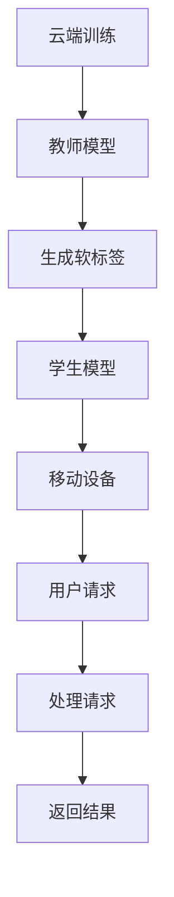

                 


# AI Agent的知识蒸馏在移动设备上的应用

> 关键词：AI Agent，知识蒸馏，移动设备，模型压缩，边缘计算，数学公式，算法实现

> 摘要：本文探讨了AI Agent的知识蒸馏技术在移动设备上的应用，详细介绍了知识蒸馏的基本原理、算法实现、系统架构设计以及实际案例分析。通过数学公式和代码示例，深入剖析了知识蒸馏在移动设备上的优化策略，并展望了未来的研究方向。

---

## 目录大纲

1. **引言**
   - 1.1 AI Agent的定义与特点
   - 1.2 知识蒸馏的基本概念
   - 1.3 移动设备上的AI Agent应用背景

2. **知识蒸馏的原理与算法**
   - 2.1 知识蒸馏的核心原理
   - 2.2 知识蒸馏的关键技术
   - 2.3 知识蒸馏的优化策略

3. **AI Agent在移动设备上的优化技术**
   - 3.1 模型压缩技术
   - 3.2 模型轻量化设计
   - 3.3 移动设备上的计算优化

4. **知识蒸馏的算法实现与案例分析**
   - 4.1 知识蒸馏的数学模型与算法流程
   - 4.2 算法实现的代码示例
   - 4.3 实际案例分析

5. **系统架构设计**
   - 5.1 问题场景介绍
   - 5.2 系统功能设计
   - 5.3 系统架构设计
   - 5.4 系统接口与交互设计

6. **项目实战：AI Agent的实现与优化**
   - 6.1 环境安装与配置
   - 6.2 核心代码实现
   - 6.3 测试与优化

7. **优化策略与未来展望**
   - 7.1 知识蒸馏的优化方向
   - 7.2 未来的研究方向
   - 7.3 结论

---

## 第一部分：引言

### 1.1 AI Agent的定义与特点

AI Agent（人工智能代理）是指能够感知环境并采取行动以实现目标的智能实体。AI Agent的特点包括自主性、反应性、目标导向性和社会性。在移动设备上，AI Agent通常用于实现本地化的智能服务，如语音助手、推荐系统等。

### 1.2 知识蒸馏的基本概念

知识蒸馏是一种将大型模型的知识迁移到小型模型的技术。通过教师模型（大模型）指导学生模型（小模型）学习，使小模型能够捕捉到教师模型的决策边界和特征。知识蒸馏的核心在于通过损失函数设计，将教师模型的知识转移到学生模型中。

### 1.3 移动设备上的AI Agent应用背景

移动设备受限于计算能力和资源，直接运行大型模型往往不可行。知识蒸馏技术为移动设备上的AI Agent提供了优化方案，通过模型压缩和轻量化设计，使AI Agent能够在资源受限的环境中高效运行。

---

## 第二部分：知识蒸馏的原理与算法

### 2.1 知识蒸馏的核心原理

知识蒸馏通过教师模型生成软标签，指导学生模型学习。软标签是对类别概率的平滑分布，通过温度缩放技术，学生模型能够更好地逼近教师模型的决策边界。知识蒸馏的损失函数通常包括软标签损失和交叉熵损失。

### 2.2 知识蒸馏的关键技术

知识蒸馏的关键技术包括：
1. **温度缩放**：通过调整温度参数，改变软标签的分布，使学生模型更容易捕捉教师模型的决策边界。
2. **损失函数设计**：结合软标签损失和硬标签损失，平衡学生模型的泛化能力。
3. **知识蒸馏的正则化技术**：通过引入正则化项，防止学生模型过拟合教师模型。

### 2.3 知识蒸馏的优化策略

1. **动态温度调整**：根据训练过程中的损失变化，动态调整温度参数，优化蒸馏效果。
2. **分阶段蒸馏**：在训练的不同阶段，逐步降低教师模型的温度，使学生模型逐步掌握更复杂的知识。
3. **数据增强结合蒸馏**：通过数据增强技术，增强学生模型对不同数据分布的适应能力。

---

## 第三部分：AI Agent在移动设备上的优化技术

### 3.1 模型压缩技术

模型压缩技术包括参数剪枝和模型量化。剪枝通过去除冗余参数，减少模型大小；量化通过降低参数的位宽，进一步减少模型体积。

### 3.2 模型轻量化设计

轻量化设计包括网络结构优化和剪枝技术。通过设计高效的网络结构，如MobileNet，减少计算量。同时，通过剪枝技术去除冗余的神经元和连接，进一步优化模型。

### 3.3 移动设备上的计算优化

通过硬件加速和软件优化，提升模型在移动设备上的运行效率。硬件加速利用GPU或TPU提升计算速度，软件优化包括使用高效的算法库和优化代码结构。

---

## 第四部分：知识蒸馏的算法实现与案例分析

### 4.1 知识蒸馏的数学模型与算法流程

知识蒸馏的数学模型包括教师模型和学生模型的损失函数。教师模型生成软标签，学生模型通过优化损失函数学习。

### 4.2 算法实现的代码示例

以下是知识蒸馏算法的Python代码示例：

```python
import torch
import torch.nn as nn
import torch.optim as optim

class TeacherModel(nn.Module):
    def __init__(self, ...):
        super(TeacherModel, self).__init__()
        # 定义教师模型的网络结构

    def forward(self, x):
        # 前向传播
        return x

class StudentModel(nn.Module):
    def __init__(self, ...):
        super(StudentModel, self).__init__()
        # 定义学生模型的网络结构

    def forward(self, x):
        # 前向传播
        return x

def distillation_loss(y_teacher, y_student, temperature):
    # 软标签损失
    y_teacher = y_teacher / temperature
    y_student = y_student / temperature
    loss = nn.KLDivLoss(reduction='batchmean')(y_student.log_softmax(), y_teacher.log_softmax()) * (temperature ** 2)
    # 硬标签损失
    loss += nn.CrossEntropyLoss()(y_student, labels)
    return loss

def train_model():
    teacher = TeacherModel()
    student = StudentModel()
    optimizer = optim.Adam(student.parameters(), lr=...)
    temperature = 3.0

    for epoch in range(num_epochs):
        for batch in dataloader:
            inputs, labels = batch
            teacher_outputs = teacher(inputs)
            student_outputs = student(inputs)
            loss = distillation_loss(teacher_outputs, student_outputs, temperature)
            optimizer.zero_grad()
            loss.backward()
            optimizer.step()
    return student

# 示例调用
trained_student = train_model()
```

### 4.3 实际案例分析

以图像分类任务为例，教师模型为ResNet，学生模型为MobileNet。通过知识蒸馏，使MobileNet在保持较高准确率的同时，显著减少计算量和模型大小，适合移动设备部署。

---

## 第五部分：系统架构设计

### 5.1 问题场景介绍

在移动设备上部署AI Agent，需要考虑计算资源有限、数据隐私保护等问题。知识蒸馏技术可以帮助在资源受限的设备上实现高效的AI服务。

### 5.2 系统功能设计

系统功能包括：
1. **模型训练**：教师模型在云端训练，生成软标签。
2. **模型蒸馏**：将教师模型的知识迁移到学生模型。
3. **模型部署**：在移动设备上部署轻量级的学生模型。

### 5.3 系统架构设计

使用mermaid绘制系统架构图：



---

## 第六部分：项目实战：AI Agent的实现与优化

### 6.1 环境安装与配置

安装必要的库，如TensorFlow、Keras、PyTorch等。配置开发环境，包括GPU支持。

### 6.2 核心代码实现

实现AI Agent的核心功能，包括知识蒸馏算法的代码实现和模型优化。

### 6.3 测试与优化

通过测试用例验证模型性能，进行优化调整，提升运行效率。

---

## 第七部分：优化策略与未来展望

### 7.1 知识蒸馏的优化方向

1. **动态蒸馏**：根据设备资源情况动态调整蒸馏参数。
2. **多目标蒸馏**：结合多种任务进行知识蒸馏。
3. **模型蒸馏的自动化**：通过自动化工具实现模型蒸馏的流程优化。

### 7.2 未来的研究方向

1. **结合边缘计算**：在边缘设备上实现更高效的AI服务。
2. **5G技术结合**：利用5G的高速传输，实现更高效的模型更新和数据同步。
3. **多模态蒸馏**：将多种模态的信息进行融合，提升模型的表达能力。

### 7.3 结论

知识蒸馏技术在移动设备上的应用为AI Agent的部署提供了新的可能性。通过不断优化算法和系统架构设计，未来可以在资源受限的设备上实现更高效的AI服务。

---

## 附录

- 附录A：相关术语解释
- 附录B：常用工具与库
- 附录C：参考文献

---

通过以上大纲，文章将系统地介绍AI Agent的知识蒸馏在移动设备上的应用，从原理到实践，帮助读者全面理解并掌握相关技术。

