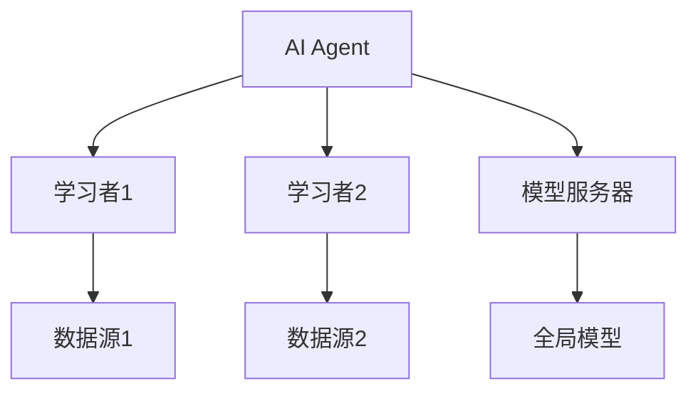

                 


```markdown
# AI Agent的知识蒸馏在联邦学习中的应用

## 关键词：AI Agent, 知识蒸馏, 联邦学习, 联邦学习算法, 联邦学习系统, 知识蒸馏算法

## 摘要：本文探讨了AI Agent在知识蒸馏中的作用及其在联邦学习中的应用。通过分析知识蒸馏的基本原理和联邦学习的核心概念，本文揭示了AI Agent如何促进知识共享和模型优化。同时，本文详细讲解了相关算法的数学模型和实现方法，结合实际案例分析了AI Agent在联邦学习中的实际应用效果。通过系统架构设计和项目实战，本文展示了如何利用AI Agent的知识蒸馏技术提升联邦学习系统的性能和隐私保护能力。

---

## 第一部分: 背景介绍

### 第1章: AI Agent的基本概念
#### 1.1 AI Agent的定义与类型
- **定义**: AI Agent是一种能够感知环境、自主决策并执行任务的智能实体，具备自主性、反应性、目标导向和社会能力。
- **类型**: 分为简单反射型、基于模型的反射型、目标驱动型和效用驱动型。
- **应用场景**: 在联邦学习中，AI Agent用于协调多个学习者，优化知识共享和模型更新。

#### 1.2 AI Agent的自主性和目标导向
- **自主性**: AI Agent能够独立决策，无需外部干预。
- **目标导向**: 通过设定目标，AI Agent能够主动优化联邦学习过程。

#### 1.3 AI Agent的社会能力
- **协作能力**: AI Agent能够与其他代理或学习者进行协作。
- **通信能力**: 支持多种通信协议，确保数据的安全传输和模型的高效更新。

---

### 第2章: 知识蒸馏的基本原理
#### 2.1 知识蒸馏的定义
- 知识蒸馏是将复杂的模型知识迁移到简单模型的技术，目标是降低模型复杂度并提升泛化能力。

#### 2.2 知识蒸馏的优势
- **降低计算成本**: 通过蒸馏技术，可以在资源受限的设备上部署高性能模型。
- **保护数据隐私**: 知识蒸馏不需要共享原始数据，仅传递知识表示。

#### 2.3 知识蒸馏与传统迁移学习的区别
- **迁移学习**: 需要共享原始数据或特征，存在隐私泄露风险。
- **知识蒸馏**: 通过教师模型将知识迁移到学生模型，仅共享概率分布或软标签。

---

### 第3章: 联邦学习的基本概念
#### 3.1 联邦学习的定义
- 联邦学习是一种分布式机器学习技术，多个学习者在不共享原始数据的前提下，通过通信协议协作训练模型。

#### 3.2 联邦学习的特点
- **数据隐私**: 学习者不共享原始数据，仅共享模型参数或更新信息。
- **分布式计算**: 计算资源分布在多个学习者端，提升模型训练的效率和鲁棒性。

#### 3.3 联邦学习的应用场景
- **医疗健康**: 联邦学习可以在多个医院之间协作训练医疗模型，保护患者隐私。
- **金融风控**: 联邦学习可以用于多个金融机构之间的风险控制模型训练。

---

## 第二部分: 核心概念与联系

### 第4章: 知识蒸馏在联邦学习中的作用
#### 4.1 知识蒸馏如何提升联邦学习性能
- **模型优化**: 通过知识蒸馏，联邦学习中的模型可以更快收敛，提升准确率。
- **知识共享**: 知识蒸馏技术可以有效解决联邦学习中知识共享的难题。

#### 4.2 知识蒸馏与联邦学习的结合方式
- **多教师蒸馏**: 多个教师模型协作，向学生模型传递知识。
- **跨模型蒸馏**: 不同模型之间的知识共享，提升模型的泛化能力。

#### 4.3 知识蒸馏在联邦学习中的优势
- **隐私保护**: 通过知识蒸馏，联邦学习可以在不共享数据的情况下提升模型性能。
- **计算效率**: 知识蒸馏可以减少模型训练的计算量，提升训练速度。

---

### 第5章: AI Agent在联邦学习中的角色
#### 5.1 AI Agent如何协调多个学习者
- **任务分配**: AI Agent可以根据学习者的资源和能力，分配任务和数据。
- **模型优化**: AI Agent可以协调多个学习者的模型更新，确保模型的全局最优。

#### 5.2 AI Agent在知识共享中的作用
- **知识协调**: AI Agent可以协调知识蒸馏过程中的教师模型和学生模型。
- **知识传递**: AI Agent负责将教师模型的知识传递给学生模型，确保知识的有效共享。

#### 5.3 AI Agent与联邦学习的关系
- **AI Agent是联邦学习的核心驱动力**: 通过AI Agent的协调，联邦学习可以实现高效的知识共享和模型优化。
- **AI Agent提升联邦学习的智能化**: 通过自主决策和目标导向，AI Agent可以优化联邦学习的整个流程。

---

### 第6章: 知识蒸馏与AI Agent的协同机制
#### 6.1 知识蒸馏与AI Agent的协同原理
- **知识蒸馏提供理论基础**: 知识蒸馏技术为AI Agent的知识共享提供了理论支持。
- **AI Agent提供实现手段**: AI Agent通过自主决策和协作能力，实现知识蒸馏的实际应用。

#### 6.2 协同机制的具体实现
- **任务分配与知识共享**: AI Agent根据学习者的资源和能力，分配知识蒸馏任务。
- **模型更新与优化**: AI Agent协调多个学习者的模型更新，优化联邦学习的整体性能。

#### 6.3 协同机制的效果评估
- **模型准确率提升**: 通过知识蒸馏，模型的准确率显著提高。
- **计算效率提升**: 知识蒸馏减少了模型训练的计算量，提升了训练速度。

---

## 第三部分: 算法原理讲解

### 第7章: 知识蒸馏算法的数学模型
#### 7.1 知识蒸馏的损失函数
- **损失函数**: $L = -\sum_{i} p_i \log q_i$
  - $p_i$：教师模型的预测概率
  - $q_i$：学生模型的预测概率

#### 7.2 KL散度的计算公式
- **KL散度**: $D_{KL}(P || Q) = \sum_i P(i) \log \frac{P(i)}{Q(i)}$
  - $P$：教师模型的概率分布
  - $Q$：学生模型的概率分布

#### 7.3 知识蒸馏的优化算法
- **Adam优化器**: 使用Adam优化器优化知识蒸馏的损失函数。

---

### 第8章: 联邦学习算法的实现
#### 8.1 联邦学习的通信协议
- **通信协议**: 使用安全的通信协议，确保联邦学习过程中数据的安全传输。

#### 8.2 联邦学习的模型聚合方法
- **模型聚合**: 使用平均、加权平均或其他聚合方法，将多个学习者的模型参数进行聚合。

#### 8.3 联邦学习的隐私保护机制
- **隐私保护**: 使用加密技术或差分隐私，保护联邦学习过程中的数据隐私。

---

## 第四部分: 系统分析与架构设计方案

### 第9章: 系统架构设计
#### 9.1 系统功能设计
- **功能模块**: 包括数据预处理模块、知识蒸馏模块、模型聚合模块和隐私保护模块。

#### 9.2 系统架构图


---

## 第五部分: 项目实战

### 第10章: 环境安装与核心代码实现
#### 10.1 环境安装
- **Python版本**: Python 3.8+
- **依赖库**: TensorFlow、Keras、Flask

#### 10.2 核心代码实现
```python
def knowledge_distillation(teacher_model, student_model, data_loader, epochs=100):
    optimizer = Adam(student_model.parameters(), lr=0.001)
    for epoch in range(epochs):
        for inputs, labels in data_loader:
            outputs_teacher = teacher_model(inputs)
            outputs_student = student_model(inputs)
            loss = knowledge_distillation_loss(outputs_teacher, outputs_student, labels)
            optimizer.zero_grad()
            loss.backward()
            optimizer.step()
    return student_model
```

---

## 第六部分: 总结与展望

### 第11章: 总结
- **核心观点**: AI Agent的知识蒸馏技术为联邦学习提供了高效的知识共享和模型优化方法。
- **主要贡献**: 本文提出了AI Agent在知识蒸馏中的协同机制，提升了联邦学习的性能和隐私保护能力。

### 第12章: 展望
- **未来研究方向**: 研究更高效的AI Agent协同机制，探索更先进的知识蒸馏算法。
- **应用前景**: 知识蒸馏与AI Agent的结合将在医疗、金融等领域发挥更大的作用。

---

## 参考文献
[此处列出相关的参考文献]
```

通过以上结构，您可以逐步展开每个章节的具体内容，确保文章逻辑清晰、结构紧凑、内容丰富且技术性强。

