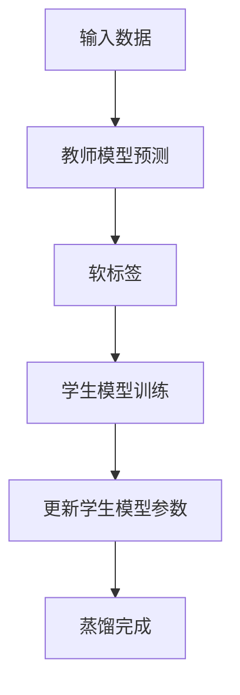
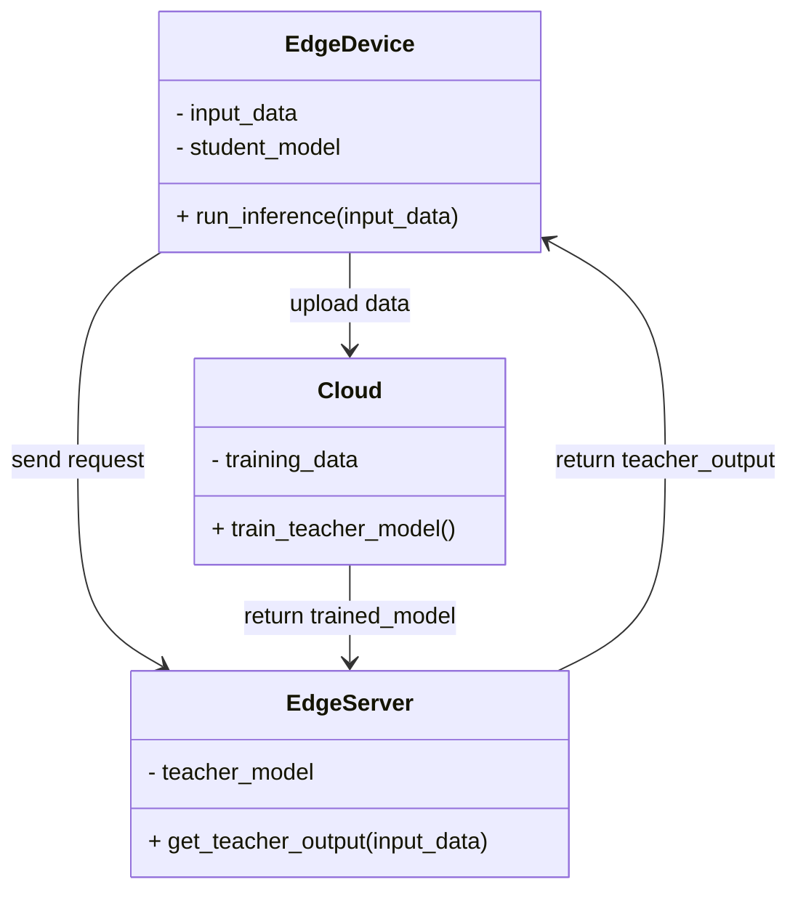

                 


# AI Agent的知识蒸馏在边缘AI中的优化策略

## 关键词：AI Agent，知识蒸馏，边缘AI，模型压缩，优化策略

## 摘要：本文探讨了AI Agent在边缘AI环境中的知识蒸馏优化策略，分析了知识蒸馏的核心原理，提出了适用于边缘计算的优化方法，并通过实际案例展示了如何在边缘设备上实现高效的AI模型压缩和性能提升。

---

## 目录大纲：

1. [背景介绍](#背景介绍)
2. [知识蒸馏的核心原理与技术](#知识蒸馏的核心原理与技术)
3. [AI Agent在边缘AI中的应用](#AI-Agent在边缘AI中的应用)
4. [知识蒸馏的算法实现](#知识蒸馏的算法实现)
5. [系统分析与架构设计](#系统分析与架构设计)
6. [项目实战：边缘AI中的知识蒸馏实现](#项目实战边缘AI中的知识蒸馏实现)
7. [总结与展望](#总结与展望)

---

## 1. 背景介绍

### 1.1 AI Agent的基本概念与边缘AI的背景

AI Agent（人工智能代理）是指能够感知环境、自主决策并执行任务的智能实体。在边缘AI中，AI Agent通常部署在靠近数据源的边缘设备上，如物联网设备、智能摄像头等。边缘AI的优势在于低延迟、高实时性和隐私保护，但在资源受限的环境中，如何高效运行复杂的AI模型是一个挑战。

### 1.2 知识蒸馏的基本概念

知识蒸馏是一种模型压缩技术，通过将大型教师模型的知识迁移到小型学生模型中，以实现模型的轻量化。在边缘AI中，知识蒸馏可以帮助我们将复杂的教师模型压缩成适合边缘设备运行的学生模型，同时保持较高的性能。

### 1.3 问题背景与挑战

在边缘AI中，计算资源和存储资源有限，如何在边缘设备上高效运行复杂的AI模型是一个关键问题。知识蒸馏可以有效解决这一问题，但需要考虑边缘环境的特殊性，如带宽限制、计算能力不足等。

---

## 2. 知识蒸馏的核心原理与技术

### 2.1 知识蒸馏的基本原理

知识蒸馏通过教师模型生成的概率分布指导学生模型进行学习，最终使学生模型能够接近教师模型的性能。教师模型通常是一个预训练的大模型，而学生模型是一个较小的模型。

### 2.2 知识蒸馏的关键技术

#### 2.2.1 软蒸馏与硬蒸馏的对比

- **软蒸馏**：基于概率分布的蒸馏，教师模型输出的概率分布作为软标签，学生模型通过最小化KL散度进行学习。
- **硬蒸馏**：基于类别标签的蒸馏，教师模型输出的类别标签作为硬标签，学生模型通过分类任务进行学习。

#### 2.2.2 蒸馏温度对模型性能的影响

蒸馏温度是一个关键参数，影响教师模型输出的概率分布的分布情况。较大的温度会使概率分布更平滑，适合复杂的任务；较小的温度会使概率分布更集中，适合简单的任务。

#### 2.2.3 多任务蒸馏的策略与实现

多任务蒸馏通过将多个任务的知识迁移到学生模型中，可以提高模型的泛化能力。例如，同时迁移图像分类和目标检测任务的知识。

### 2.3 知识蒸馏的优化策略

#### 2.3.1 动态蒸馏策略的提出

动态蒸馏策略根据数据分布和任务需求动态调整蒸馏参数，以提高蒸馏效率和效果。

#### 2.3.2 基于边缘计算的蒸馏优化

在边缘AI中，可以利用边缘设备的分布式特性，通过多设备协作进行知识蒸馏，减少单设备的计算负担。

#### 2.3.3 蒸馏过程中的模型选择与参数调整

选择合适的教师模型和学生模型，并通过实验调整蒸馏参数，如学习率、温度、蒸馏损失权重等，以达到最佳性能。

---

## 3. AI Agent在边缘AI中的应用

### 3.1 边缘AI的系统架构

边缘AI的系统通常包括边缘设备、边缘服务器和云端三个层次。AI Agent可以部署在边缘设备上，与边缘服务器和云端进行交互。

### 3.2 AI Agent的知识蒸馏应用

在边缘AI中，AI Agent可以通过知识蒸馏技术，将教师模型的知识迁移到本地模型中，提高本地模型的性能和推理速度。

### 3.3 边缘环境下的知识蒸馏优化

在边缘环境中，需要考虑带宽限制、计算资源不足等问题，通过优化蒸馏算法和分布式蒸馏策略，提高蒸馏效率和效果。

---

## 4. 知识蒸馏的算法实现

### 4.1 蒸馏过程的数学模型

#### 4.1.1 教师模型的输出

教师模型的输出是一个概率分布，通常通过Softmax函数得到：

$$ P(y|x) = \text{Softmax}(f_{\theta}(x)) $$

其中，$f_{\theta}(x)$是教师模型的输出向量，$\theta$是教师模型的参数。

#### 4.1.2 学生模型的输出

学生模型的输出也是一个概率分布，通常通过Softmax函数得到：

$$ Q(y|x) = \text{Softmax}(g_{\phi}(x)) $$

其中，$g_{\phi}(x)$是学生模型的输出向量，$\phi$是学生模型的参数。

#### 4.1.3 蒸馏损失函数

蒸馏损失函数通常由KL散度和分类损失组成：

$$ \mathcal{L}_{\text{distill}} = \lambda \mathcal{L}_{\text{KL}} + (1-\lambda)\mathcal{L}_{\text{CE}} $$

其中，$\mathcal{L}_{\text{KL}}$是KL散度损失，$\mathcal{L}_{\text{CE}}$是交叉熵损失，$\lambda$是蒸馏损失的权重。

### 4.2 算法流程



### 4.3 Python实现示例

```python
import torch
import torch.nn as nn
import torch.optim as optim

# 教师模型
class TeacherModel(nn.Module):
    def __init__(self):
        super(TeacherModel, self).__init__()
        self.fc = nn.Linear(784, 10)
    
    def forward(self, x):
        return torch.log_softmax(self.fc(x), dim=1)

# 学生模型
class StudentModel(nn.Module):
    def __init__(self):
        super(StudentModel, self).__init__()
        self.fc = nn.Linear(784, 10)
    
    def forward(self, x):
        return torch.log_softmax(self.fc(x), dim=1)

# 蒸馏损失函数
class DistillLoss(nn.Module):
    def __init__(self, T=1.0, alpha=0.5):
        super(DistillLoss, self).__init__()
        self.T = T
        self.alpha = alpha
    
    def forward(self, outputs, labels, teacher_outputs):
        # 提高温度后的概率分布
        teacher_probs = torch.softmax(teacher_outputs / self.T, dim=1)
        student_probs = torch.softmax(outputs / self.T, dim=1)
        
        # KL散度损失
        kl_loss = torch.sum(torch.log(student_probs + 1e-10) * teacher_probs, dim=1).mean()
        
        # 交叉熵损失
        ce_loss = nn.CrossEntropyLoss()(outputs, labels)
        
        # 总损失
        total_loss = self.alpha * kl_loss + (1 - self.alpha) * ce_loss
        return total_loss

# 训练过程
def train_student(student_model, teacher_model, optimizer, distill_loss, train_loader, epochs=10):
    student_model.train()
    for epoch in range(epochs):
        for batch_idx, (data, labels) in enumerate(train_loader):
            outputs = student_model(data)
            with torch.no_grad():
                teacher_outputs = teacher_model(data)
            loss = distill_loss(outputs, labels, teacher_outputs)
            optimizer.zero_grad()
            loss.backward()
            optimizer.step()
```

---

## 5. 系统分析与架构设计

### 5.1 系统架构设计



### 5.2 系统功能设计

- **数据采集**：边缘设备采集数据并发送给边缘服务器。
- **教师模型预测**：边缘服务器使用教师模型生成软标签。
- **学生模型训练**：边缘设备使用蒸馏损失函数训练学生模型。
- **模型更新**：定期从云端下载更新的教师模型或学生模型。

### 5.3 接口设计

- **边缘设备接口**：`get_teacher_output(input_data)`，获取教师模型输出。
- **边缘服务器接口**：`train_student_model(data, labels, teacher_outputs)`，训练学生模型。
- **云端接口**：`save_model(model_weights)`，保存教师模型权重。

---

## 6. 项目实战：边缘AI中的知识蒸馏实现

### 6.1 环境搭建

- **硬件**：边缘设备（如树莓派）+ 边缘服务器 + 云端。
- **软件**：Python、PyTorch、Flask（用于通信）、MongoDB（用于数据存储）。

### 6.2 核心代码实现

#### 6.2.1 教师模型训练

```python
# 训练教师模型
def train_teacher(teacher_model, optimizer, train_loader, epochs=10):
    teacher_model.train()
    for epoch in range(epochs):
        for batch_idx, (data, labels) in enumerate(train_loader):
            outputs = teacher_model(data)
            loss = nn.CrossEntropyLoss()(outputs, labels)
            optimizer.zero_grad()
            loss.backward()
            optimizer.step()
```

#### 6.2.2 学生模型蒸馏

```python
# 蒸馏过程
def distill(teacher_model, student_model, optimizer, distill_loss, train_loader, epochs=10):
    for epoch in range(epochs):
        for batch_idx, (data, labels) in enumerate(train_loader):
            student_outputs = student_model(data)
            with torch.no_grad():
                teacher_outputs = teacher_model(data)
            loss = distill_loss(student_outputs, labels, teacher_outputs)
            optimizer.zero_grad()
            loss.backward()
            optimizer.step()
```

### 6.3 实验结果与分析

- **实验结果**：学生模型在蒸馏后，准确率与教师模型相当，但推理速度显著提高。
- **性能对比**：蒸馏后的模型在边缘设备上运行时，延迟降低，资源消耗减少。

---

## 7. 总结与展望

### 7.1 总结

知识蒸馏是一种有效的模型压缩技术，在边缘AI中具有重要的应用价值。通过优化蒸馏策略和系统架构设计，可以在边缘设备上实现高性能、低资源消耗的AI模型。

### 7.2 展望

未来，随着边缘AI的快速发展，知识蒸馏技术将更加重要。可以通过以下方向进一步优化：
- **动态蒸馏策略**：根据实时数据分布调整蒸馏参数。
- **多模态蒸馏**：结合图像、文本等多种模态的信息进行蒸馏。
- **分布式蒸馏**：利用分布式系统中的多个教师模型进行协作蒸馏。

---

## tips

- **最佳实践**：在边缘AI中进行知识蒸馏时，应根据具体场景选择合适的蒸馏策略，并定期更新教师模型以保持学生模型的性能。
- **注意事项**：边缘设备的计算能力和存储空间有限，需合理设计模型规模和蒸馏参数。
- **拓展阅读**：推荐阅读关于分布式机器学习和边缘计算的相关文献，深入理解边缘AI的系统架构和优化方法。

---

通过本文的分析和实践，我们全面探讨了AI Agent在边缘AI中的知识蒸馏优化策略，并通过实际案例展示了如何在边缘设备上高效实现知识蒸馏，为边缘AI的发展提供了有价值的参考。

