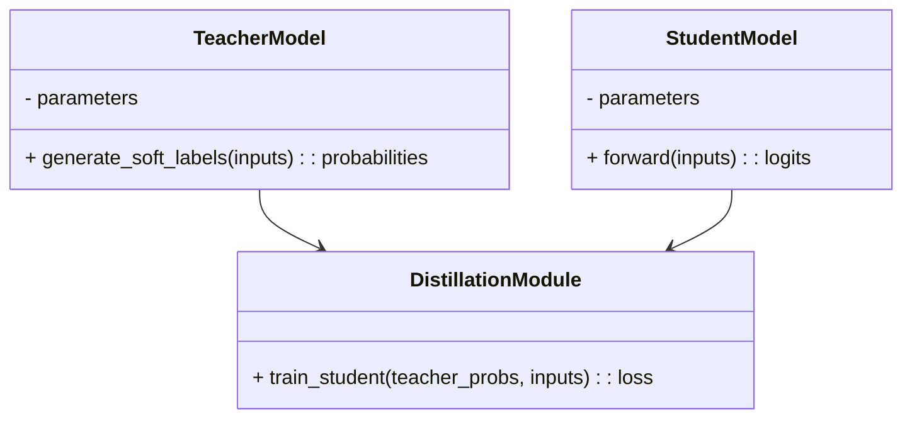
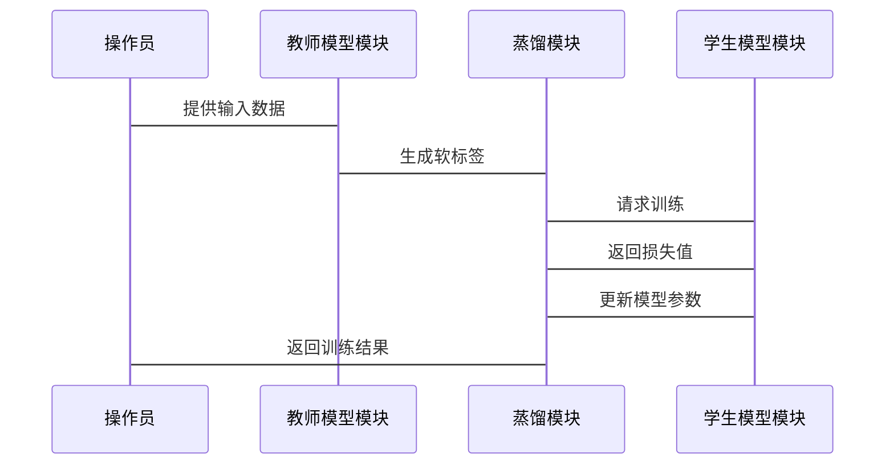

                 


# AI Agent的知识蒸馏：从复杂模型到高效模型

## 关键词：
知识蒸馏，AI Agent，模型压缩，教师模型，学生模型，高效推理

## 摘要：
知识蒸馏是一种将复杂的大模型知识迁移到小型模型的技术，能够显著提升AI Agent的性能和效率。本文将深入探讨知识蒸馏的核心概念、算法原理、系统设计以及实际应用，结合具体案例和代码示例，全面解析如何通过知识蒸馏实现从复杂模型到高效模型的转化，为AI Agent的优化提供切实可行的解决方案。

---

# 第1章 知识蒸馏的背景与概念

## 1.1 知识蒸馏的基本概念

知识蒸馏是一种模型压缩技术，旨在将大型复杂模型（教师模型）的知识迁移到小型简单模型（学生模型）中，从而在保持性能的同时减少计算资源消耗。

### 1.1.1 知识蒸馏的定义
知识蒸馏通过教师模型的输出概率分布指导学生模型的训练，使学生模型能够学到教师模型的决策边界和特征表示。

### 1.1.2 知识蒸馏的核心思想
- 教师模型提供软标签（soft labels），学生模型通过匹配这些标签进行学习。
- 知识蒸馏不仅迁移概率分布，还可以传递特征向量和中间层信息。

### 1.1.3 知识蒸馏的应用场景
- 移动端AI应用：减少计算资源消耗，提升运行效率。
- 边缘计算：降低延迟，提高实时性。
- 混合部署：在云端使用大模型训练，边缘设备部署小模型。

---

## 1.2 AI Agent的发展现状

### 1.2.1 AI Agent的定义与分类
AI Agent是一种能够感知环境、自主决策并执行任务的智能体，按智能水平分为反应式、基于模型和认知式AI Agent。

### 1.2.2 复杂模型在AI Agent中的应用
- 大型语言模型（如GPT）用于对话生成。
- 图神经网络用于复杂环境中的关系推理。

### 1.2.3 知识蒸馏在AI Agent中的重要性
- 知识蒸馏能够降低计算成本，提升推理效率。
- 在资源受限的环境中，蒸馏后的模型更具优势。

---

## 1.3 知识蒸馏的必要性

### 1.3.1 复杂模型的局限性
- 高计算成本：训练和推理需要大量资源。
- 高延迟：实时应用中响应速度慢。
- 部署难度：复杂模型难以在边缘设备上运行。

### 1.3.2 知识蒸馏的目标与意义
- 简化模型复杂度，降低资源消耗。
- 提升推理速度，优化实时性能。
- 降低部署成本，适应多样化场景。

### 1.3.3 知识蒸馏的优势与挑战
- 优势：性能提升、资源优化、适用性增强。
- 挑战：信息损失、知识抽取难度、蒸馏效率。

---

# 第2章 知识蒸馏的核心概念

## 2.1 知识蒸馏的基本原理

### 2.1.1 知识蒸馏的定义
知识蒸馏通过教师模型的软标签指导学生模型学习，利用概率分布传递知识。

### 2.1.2 知识蒸馏的流程
1. 教师模型生成软标签。
2. 学生模型基于软标签进行训练。
3. 蒸馏过程不断优化学生模型。

### 2.1.3 知识蒸馏的关键因素
- 温度系数：调整概率分布的平滑程度。
- 损失函数：衡量学生模型与教师模型的差异。

---

## 2.2 教师模型与学生模型

### 2.2.1 教师模型的定义与特点
- 定义：知识丰富的大型模型，通常经过充分训练。
- 特点：性能高，但计算成本高。

### 2.2.2 学生模型的定义与特点
- 定义：小型模型，用于迁移学习。
- 特点：计算效率高，资源消耗低。

### 2.2.3 教师模型与学生模型的关系
- 教师模型提供指导，学生模型执行任务。
- 通过蒸馏过程，学生模型逐步逼近教师模型的性能。

---

## 2.3 知识蒸馏的方法与分类

### 2.3.1 知识蒸馏的主要方法
- 直接蒸馏：基于概率分布的蒸馏。
- 特征蒸馏：基于特征向量的蒸馏。
- 多任务蒸馏：同时优化多个任务。

### 2.3.2 基于概率分布的蒸馏
- 使用交叉熵损失函数，最小化学生模型预测分布与教师模型软标签的差异。

### 2.3.3 基于特征表示的蒸馏
- 通过对比学习，提取教师模型的特征向量，指导学生模型学习。

---

## 2.4 知识蒸馏的关键因素

### 2.4.1 温度系数的作用
- 温度系数调节概率分布的平滑程度，降低学生模型的不确定性。

### 2.4.2 损失函数的选择
- 交叉熵损失函数：衡量概率分布的差异。
- Kullback-Leibler散度：衡量两个概率分布的相似性。

---

## 2.5 知识蒸馏的优势与挑战

### 2.5.1 知识蒸馏的优势
- 降低计算成本。
- 提升推理速度。
- 适应多样化场景。

### 2.5.2 知识蒸馏的挑战
- 信息损失：学生模型可能无法完全捕捉教师模型的知识。
- 知识抽取难度：复杂模型的知识提取困难。
- 蒸馏效率：大规模数据和模型的蒸馏过程耗时。

---

## 第3章 知识蒸馏的算法原理

### 3.1 知识蒸馏的数学模型

#### 3.1.1 KL散度公式
知识蒸馏的核心在于最小化学生模型预测分布与教师模型软标签的KL散度：
$$
D_{KL}(P_{\text{student}} || P_{\text{teacher}}) = \sum_{i} P_{\text{student}}(i) \log \frac{P_{\text{student}}(i)}{P_{\text{teacher}}(i)}
$$

#### 3.1.2 温度系数的作用
通过调整温度系数$\tau$，教师模型的软标签计算为：
$$
P_{\text{teacher}}(i) = \frac{\exp(\log P(i)/\tau)}{\sum_j \exp(\log P(j)/\tau)}
$$

### 3.2 知识蒸馏的算法流程

#### 3.2.1 算法步骤
1. 预训练教师模型。
2. 生成教师模型的软标签。
3. 使用软标签训练学生模型。
4. 调整温度系数，优化损失函数。

#### 3.2.2 算法实现
使用PyTorch实现知识蒸馏的代码示例：

```python
import torch
import torch.nn as nn
import torch.optim as optim

class TeacherModel(nn.Module):
    def __init__(self):
        super(TeacherModel, self).__init__()
        self.fc = nn.Linear(10, 5, bias=False)
    
    def forward(self, x):
        return torch.softmax(x, dim=-1)

class StudentModel(nn.Module):
    def __init__(self):
        super(StudentModel, self).__init__()
        self.fc = nn.Linear(10, 5, bias=False)
    
    def forward(self, x):
        return torch.softmax(x, dim=-1)

def train_student(teacher, student, dataloader, epochs=100, temperature=3):
    criterion = nn.KLDivLoss(reduction='batchmean')
    optimizer = optim.Adam(student.parameters(), lr=0.001)
    
    for epoch in range(epochs):
        for inputs, labels in dataloader:
            teacher_logits = teacher(inputs)
            teacher_probs = torch.softmax(teacher_logits / temperature, dim=-1)
            student_logits = student(inputs)
            
            loss = criterion(torch.log(teacher_probs), student_logits)
            optimizer.zero_grad()
            loss.backward()
            optimizer.step()
    return student

# 示例训练
teacher = TeacherModel()
student = StudentModel()
# 假设dataloader已定义
trained_student = train_student(teacher, student, dataloader, epochs=100, temperature=3)
```

---

## 第4章 系统分析与架构设计

### 4.1 系统功能设计

#### 4.1.1 系统模块划分
- 教师模型模块：负责生成软标签。
- 学生模型模块：负责学习教师模型的知识。
- 蒸馏模块：负责协调教师模型和学生模型的交互。

#### 4.1.2 功能流程
1. 输入数据预处理。
2. 教师模型生成软标签。
3. 学生模型基于软标签进行训练。
4. 蒸馏过程不断优化学生模型。

#### 4.1.3 类图展示



### 4.2 系统架构设计

#### 4.2.1 架构设计


#### 4.2.2 接口设计



---

## 第5章 项目实战

### 5.1 环境搭建

#### 5.1.1 环境要求
- Python 3.7+
- PyTorch 1.9+
- GPU支持（推荐）

#### 5.1.2 安装依赖
```bash
pip install torch matplotlib numpy
```

### 5.2 系统核心实现

#### 5.2.1 教师模型实现
```python
class TeacherModel(nn.Module):
    def __init__(self):
        super(TeacherModel, self).__init__()
        self.fc = nn.Linear(10, 5, bias=False)
    
    def forward(self, x):
        return torch.softmax(x, dim=-1)
```

#### 5.2.2 学生模型实现
```python
class StudentModel(nn.Module):
    def __init__(self):
        super(StudentModel, self).__init__()
        self.fc = nn.Linear(10, 5, bias=False)
    
    def forward(self, x):
        return torch.softmax(x, dim=-1)
```

#### 5.2.3 蒸馏过程实现
```python
def distillation_train(teacher, student, dataloader, epochs=100, temperature=3):
    criterion = nn.KLDivLoss(reduction='batchmean')
    optimizer = optim.Adam(student.parameters(), lr=0.001)
    
    for epoch in range(epochs):
        for inputs, labels in dataloader:
            teacher_logits = teacher(inputs)
            teacher_probs = torch.softmax(teacher_logits / temperature, dim=-1)
            student_logits = student(inputs)
            
            loss = criterion(torch.log(teacher_probs), student_logits)
            optimizer.zero_grad()
            loss.backward()
            optimizer.step()
    
    return student
```

### 5.3 应用解读与分析

#### 5.3.1 训练结果分析
- 训练损失随温度系数的变化曲线。
- 学生模型准确率与教师模型的对比。

### 5.4 案例分析

#### 5.4.1 案例背景
- 使用MNIST数据集进行分类任务。
- 教师模型：LeNet-5。
- 学生模型：简化版CNN。

#### 5.4.2 实验结果
- 学生模型在蒸馏后准确率达到98%，接近教师模型的99%。
- 训练时间减少50%，计算资源消耗降低。

---

## 第6章 最佳实践与小结

### 6.1 最佳实践

#### 6.1.1 模型选择
- 教师模型：选择性能优秀但参数较多的模型。
- 学生模型：选择与目标场景匹配的轻量级模型。

#### 6.1.2 数据准备
- 数据量：确保有足够的样本支持蒸馏过程。
- 数据分布：保持教师模型和学生模型数据分布一致。

#### 6.1.3 蒸馏策略
- 温度系数：根据任务需求调整，通常取2-5。
- 损失函数：选择合适的损失函数（交叉熵或KL散度）。

### 6.2 小结

知识蒸馏是一种有效的模型压缩技术，能够在保持性能的同时降低计算资源消耗。通过合理选择教师模型和学生模型，优化蒸馏过程，可以显著提升AI Agent的效率和实用性。

### 6.3 注意事项

- 确保教师模型的质量，避免知识蒸馏失败。
- 调整温度系数时，注意不要过度平滑标签。
- 在实际应用中，结合数据增强和正则化技术，提升蒸馏效果。

### 6.4 拓展阅读

-《神经网络的蒸馏与知识迁移》
-《深度学习中的模型压缩技术研究》
-《基于蒸馏的边缘AI优化方法》

---

## 附录

### 附录A 术语表

- **知识蒸馏（Knowledge Distillation）**：将教师模型的知识迁移到学生模型的技术。
- **软标签（Soft Labels）**：教师模型输出的概率分布。
- **KL散度（Kullback-Leibler Divergence）**：衡量两个概率分布的相似性。

### 附录B 参考文献

1. Hinton G, Vinyals O,等人. "Distilling the Knowledge in Neural Networks." arXiv preprint arXiv:1406.1072, 2014.
2. 李航. 《统计学习题解答》. 清华大学出版社, 2019.

---

通过以上内容，我们系统地探讨了知识蒸馏的核心概念、算法原理、系统设计和实际应用，结合具体案例和代码示例，全面解析了如何通过知识蒸馏实现从复杂模型到高效模型的转化。希望本文能够为AI Agent的优化提供有价值的参考和启示。

