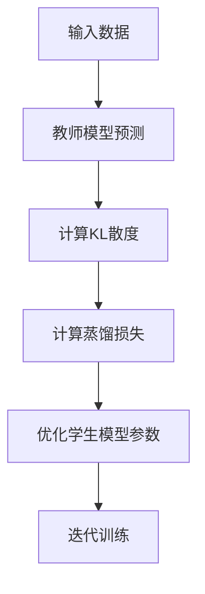

                 


# AI Agent的知识蒸馏：从大型LLM到轻量级模型

> **关键词**：知识蒸馏，AI Agent，大型语言模型，轻量级模型，模型压缩，迁移学习

> **摘要**：  
  随着人工智能技术的快速发展，大型语言模型（LLM）在各个领域的应用越来越广泛。然而，这些模型通常计算资源消耗大、部署复杂，难以在资源受限的场景中高效应用。为了解决这一问题，知识蒸馏技术应运而生，它能够将大型模型的知识迁移到轻量级模型中，从而实现模型的轻量化部署。本文将详细探讨知识蒸馏的原理、算法实现、系统设计以及在AI Agent中的应用，帮助读者全面理解并掌握这一技术的核心要点。

---

# 第1章 AI Agent的知识蒸馏概述

## 1.1 知识蒸馏的背景与意义

### 1.1.1 大型语言模型的局限性  
大型语言模型（LLM）如GPT-3、GPT-4等，凭借其强大的计算能力和丰富的知识库，在自然语言处理任务中表现出色。然而，这些模型通常需要大量的计算资源和存储空间，难以在边缘设备、移动应用等资源受限的场景中部署。

### 1.1.2 轻量级模型的应用需求  
在实际应用中，许多场景需要快速响应和本地处理能力。例如，移动应用、物联网设备、实时聊天机器人等场景，对模型的计算效率和资源占用提出了更高要求。此时，轻量级模型因其低资源消耗、高响应速度的特点，成为理想的选择。

### 1.1.3 知识蒸馏的核心作用  
知识蒸馏是一种将大型模型的知识迁移到轻量级模型的技术，其核心思想是通过教师模型（Teacher）和学生模型（Student）的协作，将教师模型的深层知识逐步传递给学生模型。这种技术能够显著降低模型的复杂度，同时保持较高的性能。

## 1.2 AI Agent的基本概念

### 1.2.1 AI Agent的定义与特点  
AI Agent（智能体）是指在特定环境中能够感知环境、自主决策并执行任务的智能实体。AI Agent可以是软件程序、机器人或其他智能系统，其核心能力包括感知、推理、规划和执行。

### 1.2.2 AI Agent的应用场景  
AI Agent广泛应用于多个领域，如智能助手、推荐系统、自动驾驶、智能客服等。在这些场景中，AI Agent需要快速响应用户需求，处理复杂任务，并与环境进行高效交互。

### 1.2.3 知识蒸馏在AI Agent中的作用  
在AI Agent中，知识蒸馏技术可以用于将大型语言模型的知识迁移到轻量级模型中，从而在资源受限的环境中实现高效的自然语言处理能力。这种技术不仅降低了计算成本，还提高了系统的实时性和响应速度。

---

# 第2章 知识蒸馏的核心概念与原理

## 2.1 知识蒸馏的定义与核心要素

### 2.1.1 知识蒸馏的定义  
知识蒸馏是一种通过教师模型和学生模型之间的知识迁移，将教师模型的复杂知识逐步传递给学生模型的技术。其核心目标是通过蒸馏过程，使学生模型在性能上接近甚至超越教师模型，同时降低模型的复杂度。

### 2.1.2 教师模型与学生模型  
- **教师模型**：通常是一个复杂的大型模型，具有丰富的知识和强大的表现能力。
- **学生模型**：是一个轻量级模型，通过蒸馏过程从教师模型中学习知识。

### 2.1.3 蒸馏过程的核心要素  
- **教师输出**：教师模型在输入数据上的预测结果。
- **学生输出**：学生模型在输入数据上的预测结果。
- **蒸馏损失**：衡量学生模型预测结果与教师模型预测结果之间差距的损失函数。

## 2.2 知识蒸馏的主要方法

### 2.2.1 直接蒸馏法  
直接蒸馏法是将教师模型的输出概率直接作为软标签，通过最小化学生模型输出与教师模型输出之间的KL散度来实现知识迁移。

### 2.2.2 间接蒸馏法  
间接蒸馏法通过中间特征提取层的特征传递，将教师模型的中间表示迁移到学生模型中。这种方法通常用于深度神经网络的特征提取。

### 2.2.3 混合蒸馏法  
混合蒸馏法结合了直接蒸馏法和间接蒸馏法的优点，通过同时优化概率分布和中间特征，实现更全面的知识迁移。

## 2.3 知识蒸馏的优缺点分析

### 2.3.1 优点  
- 知识蒸馏能够显著降低模型的复杂度和计算成本。
- 蒸馏后的轻量级模型在资源受限的环境中表现更优。
- 通过蒸馏技术，可以将大型模型的知识迁移到边缘设备，实现本地化服务。

### 2.3.2 缺点  
- 蒸馏过程需要大量标注数据，计算成本较高。
- 蒸馏后的模型可能无法完全继承教师模型的所有能力，尤其是在复杂的任务中表现可能不如原模型。

### 2.3.3 适用场景  
知识蒸馏适用于需要快速响应和本地部署的场景，如移动应用、实时聊天机器人、边缘计算等。

---

# 第3章 知识蒸馏的数学模型与算法实现

## 3.1 知识蒸馏的核心公式

### 3.1.1 KL散度的定义与公式  
KL散度（Kullback-Leibler Divergence）是用来衡量两个概率分布之间差异的指标，公式如下：

$$ D_{KL}(P||Q) = \sum_{y} P(y) \log \frac{P(y)}{Q(y)} $$

其中，$P$和$Q$分别表示教师模型和学生模型的输出概率分布。

### 3.1.2 蒸馏损失的计算公式  
蒸馏损失通常由分类损失和KL散度损失两部分组成，公式如下：

$$ L_{\text{distill}} = \alpha L_{\text{cls}} + (1-\alpha) L_{\text{KL}} $$

其中，$\alpha$是平衡参数，$L_{\text{cls}}$是分类损失，$L_{\text{KL}}$是KL散度损失。

## 3.2 算法流程图



---

# 第4章 系统分析与架构设计

## 4.1 系统功能设计

### 4.1.1 系统模块划分  
- 数据输入模块：接收输入数据并进行预处理。
- 教师模型模块：负责生成教师模型的输出。
- 学生模型模块：负责生成学生模型的输出。
- 蒸馏训练模块：计算蒸馏损失并优化学生模型参数。

### 4.1.2 系统功能流程  
1. 输入数据经过预处理后，输入教师模型和学生模型。
2. 教师模型生成概率分布输出。
3. 学生模型生成概率分布输出。
4. 计算KL散度损失和分类损失，优化学生模型参数。
5. 迭代训练，直到满足停止条件。

## 4.2 系统架构设计


---

# 第5章 项目实战：AI Agent的轻量化部署

## 5.1 环境安装

### 5.1.1 安装Python和相关库  
```bash
pip install torch numpy matplotlib
```

### 5.1.2 安装框架和工具  
```bash
pip install transformers
```

## 5.2 系统核心实现源代码

### 5.2.1 教师模型实现
```python
import torch
import torch.nn as nn

class TeacherModel(nn.Module):
    def __init__(self):
        super(TeacherModel, self).__init__()
        self.fc = nn.Linear(100, 50)
        self.fc2 = nn.Linear(50, 10)
```

### 5.2.2 学生模型实现
```python
class StudentModel(nn.Module):
    def __init__(self):
        super(StudentModel, self).__init__()
        self.fc = nn.Linear(100, 50)
        self.fc2 = nn.Linear(50, 10)
```

### 5.2.3 蒸馏训练实现
```python
def distillation_loss(output_s, output_t, alpha=0.5):
    loss_cls = nn.CrossEntropyLoss()(output_s, labels)
    loss_distill = nn.KLDivLoss()(F.softmax(output_s, dim=1), F.softmax(output_t, dim=1))
    return alpha * loss_cls + (1 - alpha) * loss_distill
```

## 5.3 实际案例分析

### 5.3.1 案例背景  
假设我们有一个AI Agent，需要在移动设备上实现自然语言理解功能。由于移动设备的计算资源有限，我们需要将大型语言模型的知识迁移到轻量级模型中。

### 5.3.2 案例实现  
1. 加载教师模型和学生模型。
2. 训练数据准备。
3. 进行蒸馏训练，优化学生模型参数。
4. 验证学生模型在移动设备上的性能。

---

# 第6章 总结与展望

## 6.1 本章小结  
知识蒸馏是一种有效的模型轻量化技术，能够将大型语言模型的知识迁移到轻量级模型中，从而在资源受限的场景中实现高效的应用。

## 6.2 最佳实践 tips  
- 在实际应用中，建议根据具体任务需求选择合适的蒸馏方法。
- 蒸馏过程中，合理设置平衡参数$\alpha$，以平衡分类损失和KL散度损失。
- 优化蒸馏训练的超参数，如学习率、批量大小等，以提高训练效率。

## 6.3 注意事项  
- 蒸馏过程需要大量标注数据，计算成本较高，需合理规划资源。
- 蒸馏后的模型可能在某些复杂任务中表现不如原模型，需进行充分的验证和测试。

## 6.4 拓展阅读  
-《Knowledge Distillation: A Survey and New Insights》
-《Model Distillation for Deep Learning: Theory and Practice》

---

以上是《AI Agent的知识蒸馏：从大型LLM到轻量级模型》的技术博客文章大纲和部分正文内容。文章从知识蒸馏的背景、核心概念、算法原理、系统设计、项目实战到总结，层层递进，帮助读者全面理解并掌握这一技术的核心要点。

