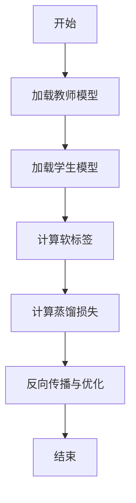
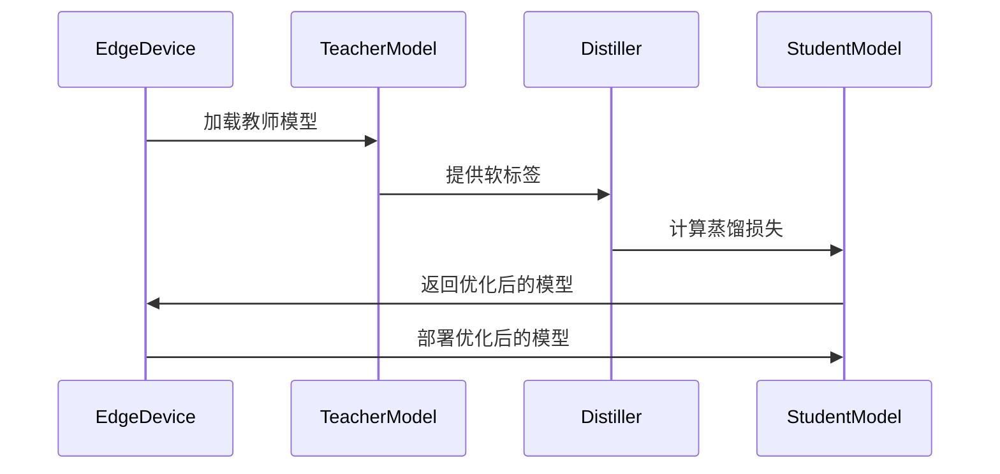

                 


# AI Agent的知识蒸馏：从大型LLM到边缘设备模型

> 关键词：知识蒸馏，AI Agent，大型语言模型，边缘设备模型，迁移学习，模型压缩

> 摘要：本文详细探讨了AI Agent的知识蒸馏技术，从大型语言模型（LLM）到边缘设备模型的构建过程。文章首先介绍了AI Agent和知识蒸馏的基本概念，然后深入分析了知识蒸馏的核心原理和算法，接着通过系统架构设计展示了如何将知识蒸馏应用于边缘设备模型的构建，最后通过实际项目案例验证了知识蒸馏的有效性和实用性。文章结构清晰，内容详实，为AI Agent在边缘设备中的应用提供了理论支持和实践指导。

---

## 第一部分: AI Agent的知识蒸馏概述

### 第1章: AI Agent与知识蒸馏概述

#### 1.1 AI Agent的基本概念
- 1.1.1 AI Agent的定义与特点
  - AI Agent的定义
  - AI Agent的核心特点（自主性、反应性、主动性、社会性）
  - AI Agent的应用场景（智能助手、推荐系统、自动驾驶等）

- 1.1.2 AI Agent的核心功能与应用场景
  - 信息处理与决策能力
  - 人机交互能力
  - 环境感知与适应能力
  - 典型应用场景分析（智能家居、医疗助手、金融服务等）

- 1.1.3 知识蒸馏的背景与重要性
  - 知识蒸馏技术的定义
  - 知识蒸馏技术的核心目标（知识转移与模型压缩）
  - 知识蒸馏在AI Agent中的作用

#### 1.2 大型语言模型（LLM）的背景与挑战
- 1.2.1 LLM的定义与技术特点
  - 大型语言模型的定义
  - LLM的主要技术特点（参数规模、训练数据、计算能力）
  - LLM的应用场景（自然语言处理、对话生成、文本摘要等）

- 1.2.2 LLM在实际应用中的局限性
  - 计算资源需求高
  - 部署成本高
  - 边缘设备上的应用受限
  - 模型更新与维护的挑战

- 1.2.3 知识蒸馏技术的提出背景
  - 为了解决LLM在边缘设备上的应用问题
  - 知识蒸馏技术的优势（减少计算开销、降低存储需求等）

#### 1.3 边缘设备模型的构建需求
- 1.3.1 边缘设备的特点与应用场景
  - 边缘设备的定义与特点（低功耗、轻量化、实时性等）
  - 边缘设备的主要应用场景（物联网、智能家居、工业自动化等）

- 1.3.2 边缘设备模型构建的挑战
  - 计算资源有限
  - 网络延迟问题
  - 模型更新的实时性要求
  - 数据隐私与安全问题

- 1.3.3 知识蒸馏在边缘设备中的作用
  - 通过知识蒸馏技术将大型模型的知识迁移到轻量级模型
  - 提高边缘设备的运行效率
  - 降低边缘设备的计算负担

#### 1.4 本章小结
- 本章总结了AI Agent和知识蒸馏的基本概念
- 分析了大型语言模型（LLM）的背景及其在边缘设备上的应用挑战
- 强调了知识蒸馏技术在解决边缘设备模型构建问题中的重要性

---

## 第二部分: 知识蒸馏的核心概念与原理

### 第2章: 知识蒸馏的核心概念

#### 2.1 知识蒸馏的基本原理
- 2.1.1 知识蒸馏的定义
  - 知识蒸馏的定义
  - 知识蒸馏的目标（将复杂模型的知识迁移到简单模型）

- 2.1.2 知识蒸馏的核心要素
  - 教师模型（Teacher Model）
  - 学生模型（Student Model）
  - 蒸馏损失（Distillation Loss）

- 2.1.3 知识蒸馏与传统迁移学习的区别
  - 迁移学习的基本概念
  - 知识蒸馏的独特之处（通过软标签进行知识转移）

#### 2.2 知识蒸馏的主要方法
- 2.2.1 直接蒸馏法
  - 直接蒸馏法的定义
  - 直接蒸馏法的核心步骤
  - 直接蒸馏法的优缺点

- 2.2.2 软标签蒸馏法
  - 软标签的概念
  - 软标签蒸馏法的实现过程
  - 温度系数在软标签中的作用

- 2.2.3 知识蒸馏的其他变体
  - 知识蒸馏的其他方法（硬标签蒸馏、混合蒸馏等）
  - 各种方法的适用场景

#### 2.3 知识蒸馏的优缺点分析
- 2.3.1 知识蒸馏的优点
  - 降低计算开销
  - 提高模型的泛化能力
  - 适用于边缘设备的轻量化需求

- 2.3.2 知识蒸馏的缺点
  - 对教师模型的依赖性强
  - 蒸馏过程中的计算成本
  - 软标签的准确性问题

- 2.3.3 知识蒸馏的适用场景
  - 适用于边缘设备模型的构建
  - 适用于需要快速部署的应用场景
  - 适用于需要模型压缩的场景

#### 2.4 本章小结
- 本章详细讲解了知识蒸馏的核心概念
- 分析了知识蒸馏的主要方法及其优缺点
- 强调了知识蒸馏在边缘设备模型构建中的适用性

---

## 第三部分: 知识蒸馏的算法原理与数学模型

### 第3章: 知识蒸馏的算法原理

#### 3.1 知识蒸馏的基本流程
- 3.1.1 教师模型的输出
  - 教师模型的定义与作用
  - 教师模型的输出形式（概率分布、软标签等）

- 3.1.2 学生模型的输出
  - 学生模型的定义与作用
  - 学生模型的输出形式（概率分布、分类结果等）

- 3.1.3 蒸馏损失的计算
  - 蒸馏损失的定义
  - 蒸馏损失的计算公式

#### 3.2 知识蒸馏的数学模型
- 3.2.1 蒸馏损失函数
  - 蒸馏损失函数的定义
  - 蒸馏损失函数的数学表达式
  - 示例：交叉熵损失函数与蒸馏损失函数的结合

- 3.2.2 软标签的计算公式
  - 软标签的定义
  - 软标签的计算公式
  - 温度系数对软标签的影响

- 3.2.3 温度系数的作用
  - 温度系数的定义
  - 温度系数对软标签的影响
  - 温度系数的调整策略

#### 3.3 算法流程图
- 3.3.1 算法流程图的 mermaid 代码


#### 3.4 本章小结
- 本章详细讲解了知识蒸馏的算法原理
- 推导了知识蒸馏的数学模型
- 通过流程图展示了知识蒸馏的基本流程

---

## 第四部分: 系统分析与架构设计

### 第4章: 系统分析与架构设计

#### 4.1 系统分析
- 4.1.1 问题场景介绍
  - 边缘设备上的AI Agent构建需求
  - 边缘设备的计算资源限制
  - 边缘设备的实时性要求

- 4.1.2 项目介绍
  - 项目目标
  - 项目范围
  - 项目关键成功因素

#### 4.2 系统功能设计
- 4.2.1 领域模型
  - 领域模型的定义
  - 领域模型的mermaid类图
  ```mermaid
  classDiagram
      class TeacherModel {
          forward(x)
          get_soft_labels(x)
      }
      class StudentModel {
          forward(x)
          backward(loss)
      }
      class Distiller {
          compute_loss(teacher_output, student_output)
          optimize()
      }
      TeacherModel <|-- Teacher
      StudentModel <|-- Student
      Distiller <|-- Distiller
  ```

- 4.2.2 系统架构设计
  - 系统架构的定义
  - 系统架构的mermaid架构图
  ```mermaid
  graph LR
      EdgeDevice[边缘设备] --> TeacherModel[教师模型]
      TeacherModel --> Distiller[蒸馏器]
      Distiller --> StudentModel[学生模型]
      StudentModel --> EdgeDevice[边缘设备]
  ```

- 4.2.3 系统接口设计
  - 系统接口的定义
  - 系统接口的交互流程
  ```mermaid
  sequenceDiagram
      EdgeDevice ->> TeacherModel: 请求知识蒸馏
      TeacherModel ->> Distiller: 提供软标签
      Distiller ->> StudentModel: 计算蒸馏损失
      StudentModel ->> EdgeDevice: 返回更新后的模型
  ```

#### 4.3 系统交互流程
- 4.3.1 系统交互流程的mermaid序列图


#### 4.4 本章小结
- 本章分析了系统的功能需求
- 设计了系统的架构和接口
- 通过mermaid图展示了系统的交互流程

---

## 第五部分: 项目实战

### 第5章: 项目实战

#### 5.1 环境安装
- 5.1.1 环境配置
  - 安装Python
  - 安装深度学习框架（如TensorFlow、PyTorch）
  - 安装其他依赖库

- 5.1.2 硬件配置
  - CPU/GPU的配置要求
  - 内存和存储空间的建议

#### 5.2 系统核心实现源代码
- 5.2.1 教师模型的实现
  - 教师模型的定义
  - 教师模型的训练代码
  ```python
  class TeacherModel(nn.Module):
      def __init__(self):
          super(TeacherModel, self).__init__()
          self.fc = nn.Linear(input_dim, output_dim)
  
      def forward(self, x):
          return self.fc(x)
  ```

- 5.2.2 学生模型的实现
  - 学生模型的定义
  - 学生模型的训练代码
  ```python
  class StudentModel(nn.Module):
      def __init__(self):
          super(StudentModel, self).__init__()
          self.fc = nn.Linear(input_dim, output_dim)
  
      def forward(self, x):
          return self.fc(x)
  ```

- 5.2.3 蒸馏器的实现
  - 蒸馏器的定义
  - 蒸馏器的训练代码
  ```python
  class Distiller:
      def __init__(self, teacher, student):
          self.teacher = teacher
          self.student = student
          self.criterion = nn.KLDivLoss()
  
      def compute_loss(self, teacher_output, student_output):
          loss = self.criterion(torch.log(F.softmax(student_output, dim=1)), F.softmax(teacher_output, dim=1))
          return loss
  ```

#### 5.3 代码应用解读与分析
- 5.3.1 代码的运行流程
  - 教师模型的加载与训练
  - 学生模型的加载与训练
  - 蒸馏器的调用与优化

- 5.3.2 代码的优化建议
  - 参数调整（学习率、温度系数等）
  - 模型结构的优化
  - 训练策略的改进

#### 5.4 实际案例分析
- 5.4.1 案例背景
  - 案例目标
  - 案例数据集
  - 案例需求

- 5.4.2 案例实现
  - 数据预处理
  - 模型训练
  - 模型评估

- 5.4.3 案例分析
  - 模型性能对比（教师模型与学生模型）
  - 蒸馏效果的评估指标（准确率、计算时间等）
  - 案例总结与经验分享

#### 5.5 项目总结
- 5.5.1 项目成果
  - 成功将知识蒸馏技术应用于边缘设备模型的构建
  - 达到了预期的性能目标
  - 解决了边缘设备上的计算资源限制问题

- 5.5.2 项目经验
  - 代码实现中的关键点
  - 项目中的难点与解决方案
  - 项目中的教训与改进方向

---

## 第六部分: 最佳实践与小结

### 第6章: 最佳实践与小结

#### 6.1 最佳实践
- 6.1.1 知识蒸馏技术的优化建议
  - 参数选择（温度系数、学习率等）
  - 模型选择（教师模型与学生模型的匹配）
  - 数据预处理与增强

- 6.1.2 系统架构的优化建议
  - 网络架构的优化
  - 系统接口的优化
  - 系统交互流程的优化

#### 6.2 小结
- 本章总结了项目的最佳实践
- 分析了项目中的关键点与难点
- 总结了项目的成果与经验

#### 6.3 注意事项
- 6.3.1 项目实施中的注意事项
  - 数据隐私与安全问题
  - 模型的泛化能力
  - 系统的实时性要求

- 6.3.2 未来的研究方向
  - 更高效的蒸馏算法研究
  - 更轻量级的学生模型设计
  - 多模态知识蒸馏技术的研究

#### 6.4 拓展阅读
- 6.4.1 相关论文推荐
  - 推荐几篇关于知识蒸馏的经典论文
  - 推荐几篇关于边缘设备模型构建的论文

- 6.4.2 技术博客与资源
  - 推荐相关技术博客
  - 推荐相关技术资源（如书籍、在线课程等）

---

## 第七部分: 参考文献与致谢

### 第7章: 参考文献与致谢

- 7.1 参考文献
  - 列出本文中引用的主要文献
  - 包括书籍、期刊论文、技术报告等

- 7.2 致谢
  - 感谢在项目中提供帮助的人
  - 感谢在写作过程中给予指导的人

---

## 附录: 代码与数据集

### 附录A: 完整代码实现

- 提供完整的代码实现
- 包括教师模型、学生模型、蒸馏器的实现
- 包括数据预处理、模型训练、模型评估的代码

### 附录B: 数据集描述

- 描述所使用的数据集
- 提供数据集的下载链接
- 提供数据集的使用说明

---

## 附录C: 进一步阅读与学习资源

- 推荐进一步学习的知识点
- 推荐相关书籍、论文、技术博客
- 提供在线课程和视频资源链接

---

以上是《AI Agent的知识蒸馏：从大型LLM到边缘设备模型》的技术博客文章的完整目录大纲。每一部分都详细展开了核心内容，确保逻辑清晰、结构紧凑、内容丰富。读者可以通过阅读本文，系统地了解AI Agent的知识蒸馏技术，并掌握从大型LLM到边缘设备模型的实际应用方法。

