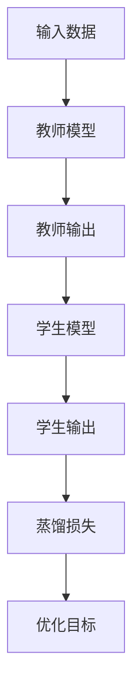
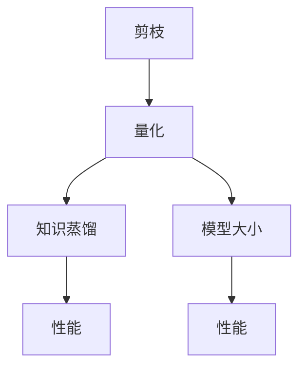
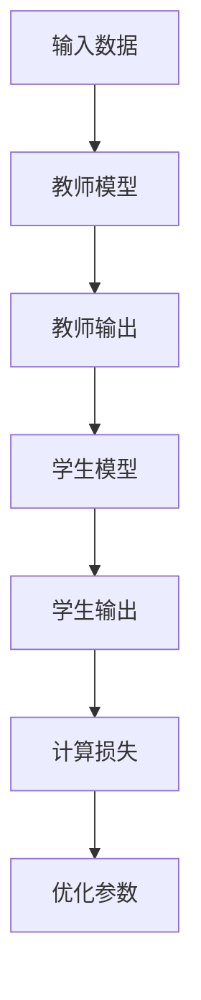
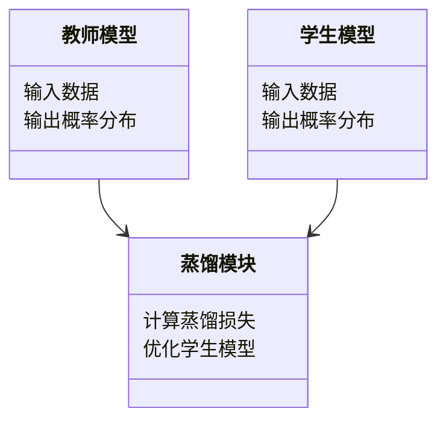
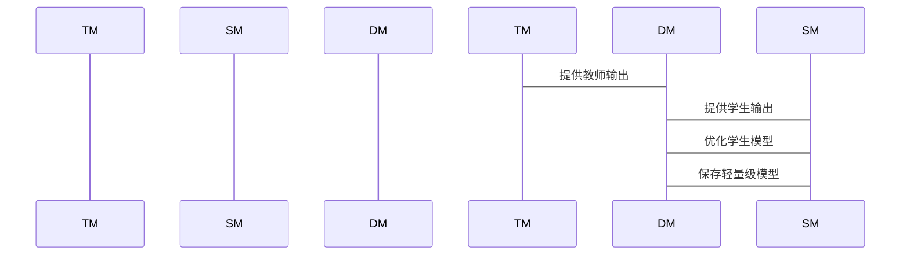

                 


# AI Agent的知识蒸馏：从大模型到轻量级应用

> 关键词：知识蒸馏，AI Agent，大模型，轻量级应用，模型压缩，算法原理，系统架构

> 摘要：本文系统地介绍AI Agent的知识蒸馏技术，从背景、核心概念、算法原理到系统架构和项目实战，详细讲解如何将大模型的知识迁移到轻量级应用，实现性能与资源消耗的最佳平衡。

---

# 第一部分: AI Agent的知识蒸馏背景与核心概念

---

# 第1章: 知识蒸馏的背景与问题背景

## 1.1 知识蒸馏的背景

### 1.1.1 大模型的崛起与挑战

近年来，随着深度学习技术的快速发展，大模型（如GPT系列、BERT系列）在自然语言处理领域取得了显著成果。然而，这些大模型通常需要大量的计算资源和存储空间，且推理过程耗时较长。在实际应用中，尤其是在移动设备、边缘计算等资源受限的场景下，直接使用大模型往往难以满足需求。

### 1.1.2 知识蒸馏的定义与目标

知识蒸馏（Knowledge Distillation）是一种将大模型的知识迁移到小模型的技术，旨在通过压缩和简化大模型的复杂结构，生成一个性能相近但体积更小、推理速度更快的轻量级模型。其目标是实现性能与资源消耗的最佳平衡。

### 1.1.3 AI Agent的应用场景与需求

AI Agent是一种能够自主感知环境、执行任务的智能体，广泛应用于对话系统、推荐系统、机器人控制等领域。在这些场景中，AI Agent需要在本地设备上快速响应用户请求，而资源受限的环境使得大模型难以直接应用。因此，通过知识蒸馏技术，将大模型的知识迁移到轻量级模型，成为一种重要的解决方案。

## 1.2 问题背景与问题描述

### 1.2.1 大模型的局限性

尽管大模型在性能上表现出色，但其计算复杂性和资源消耗使其难以在资源受限的场景中应用。具体表现为：

1. **计算资源消耗高**：大模型通常包含数百万甚至数十亿的参数，训练和推理过程需要大量的计算资源。
2. **推理速度慢**：在实时响应的场景下，大模型的推理速度难以满足需求。
3. **部署难度大**：大模型的部署需要高性能的计算设备，限制了其在移动端和边缘设备上的应用。

### 1.2.2 轻量级应用的需求

轻量级应用需要在资源受限的环境中运行，对模型的大小和推理速度提出了更高的要求。例如：

1. **移动设备**：手机、平板等设备的计算资源有限，需要轻量级模型以实现快速响应。
2. **边缘计算**：在物联网设备中，本地推理需要低功耗、快速响应的模型。
3. **实时性要求高的场景**：如自动驾驶、实时语音助手等场景，需要模型在极短的时间内完成推理。

### 1.2.3 知识蒸馏的核心问题

知识蒸馏的核心问题是如何有效地将大模型的知识迁移到小模型，同时保持或接近大模型的性能。具体包括：

1. **如何选择合适的蒸馏策略**：不同的蒸馏方法对性能和资源消耗的影响不同，需要根据具体场景选择最优策略。
2. **如何平衡压缩与性能**：在压缩模型的同时，如何确保性能不下降甚至提升。
3. **如何处理模型的复杂性**：大模型的复杂结构如何简化，以适应轻量级模型的需求。

## 1.3 问题解决与边界

### 1.3.1 知识蒸馏的解决方案

知识蒸馏通过以下方式解决问题：

1. **提取大模型的特征**：利用大模型的中间层特征作为指导，训练小模型。
2. **设计合适的蒸馏策略**：通过软蒸馏、硬蒸馏等方法，将大模型的知识迁移到小模型。
3. **优化轻量级模型的结构**：设计适合轻量级应用的模型架构，如简化网络结构、减少参数数量。

### 1.3.2 边界与外延

知识蒸馏的边界在于：

1. **适用场景**：适用于需要轻量级模型的场景，如移动设备、边缘计算等。
2. **模型类型**：主要针对深度学习模型，尤其是大语言模型、视觉模型等。
3. **性能目标**：在保证性能的前提下，尽可能降低模型的资源消耗。

### 1.3.3 核心要素与概念结构

知识蒸馏的核心要素包括：

1. **教师模型（大模型）**：提供知识的来源。
2. **学生模型（小模型）**：接收并学习教师模型的知识。
3. **蒸馏策略**：包括软蒸馏、硬蒸馏等方法。
4. **优化目标**：在学生模型的损失函数中加入蒸馏损失，以引导学生模型学习教师模型的知识。

---

# 第2章: 知识蒸馏的核心概念与联系

---

## 2.1 核心概念原理

### 2.1.1 知识蒸馏的基本原理

知识蒸馏的核心原理是通过教师模型（大模型）的输出，指导学生模型（小模型）的训练。具体步骤包括：

1. **教师模型输出**：教师模型对输入数据进行处理，生成概率分布或其他形式的表示。
2. **学生模型训练**：学生模型在教师模型的指导下，通过蒸馏损失函数进行优化，逐步逼近教师模型的输出。

### 2.1.2 蒸馏过程的数学模型

蒸馏过程可以用以下公式表示：

$$
\text{蒸馏损失} = \alpha \cdot L_{\text{cls}} + (1-\alpha) \cdot L_{\text{distill}}
$$

其中，$L_{\text{cls}}$ 是分类损失，$L_{\text{distill}}$ 是蒸馏损失，$\alpha$ 是平衡系数。

蒸馏损失通常采用KL散度（Kullback-Leibler divergence）来衡量教师模型和学生模型输出分布之间的差异：

$$
L_{\text{distill}} = \text{KL}(P_{\text{teacher}} \| P_{\text{student}})
$$

其中，$P_{\text{teacher}}$ 和 $P_{\text{student}}$ 分别是教师模型和学生模型的输出概率分布。

### 2.1.3 蒸馏方法的分类与对比

常见的蒸馏方法包括：

1. **软蒸馏（Soft Distillation）**：教师模型输出概率分布，学生模型通过匹配这些概率分布进行学习。
2. **硬蒸馏（Hard Distillation）**：教师模型输出类别标签，学生模型通过预测相同的类别标签进行学习。
3. **混合蒸馏（Hybrid Distillation）**：结合软蒸馏和硬蒸馏，同时利用概率分布和类别标签进行训练。

下表对比了三种蒸馏方法的核心特点：

| 方法       | 输出形式          | 优势                           | 动态性       |
|------------|-------------------|--------------------------------|--------------|
| 软蒸馏     | 概率分布          | 更细粒度，适合复杂任务         | 高           |
| 硬蒸馏     | 类别标签          | 简单直接，计算效率高            | 低           |
| 混合蒸馏   | 概率分布+类别标签  | 结合两者优势，灵活性强           | 中           |

### 2.1.4 蒸馏过程的实体关系图

下图展示了蒸馏过程中的实体关系：



---

## 2.2 核心概念对比表

### 2.2.1 蒸馏方法对比

下表对比了软蒸馏和硬蒸馏的核心特点：

| 特性         | 软蒸馏           | 硬蒸馏           |
|--------------|------------------|------------------|
| 输出形式     | 概率分布         | 类别标签         |
| 计算复杂度   | 高               | 低               |
| 适用场景     | 复杂任务         | 简单任务         |
| 动态性       | 高               | 低               |

### 2.2.2 压缩技术对比

常见的模型压缩技术包括剪枝（Pruning）、量化（Quantization）、知识蒸馏（Knowledge Distillation）等。下表对比了三种技术的核心特点：

| 技术         | 核心思想             | 优缺点           |
|--------------|----------------------|------------------|
| 剪枝         | 删除冗余参数         | 显著减少模型大小，但可能影响性能   |
| 量化         | 将模型参数压缩到低精度 | 在保持性能的同时显著减少模型大小，但可能损失精度 |
| 知识蒸馏     | 迁移教师模型的知识   | 保持性能的同时显著减少模型大小，但需要额外的训练过程 |

### 2.2.3 模型性能对比

下图展示了三种压缩技术在模型大小和性能之间的关系：



---

## 2.3 实体关系图

下图展示了知识蒸馏的核心概念与实体关系：


---

# 第3章: 知识蒸馏的算法原理

---

## 3.1 算法原理概述

### 3.1.1 软蒸馏与硬蒸馏

软蒸馏通过概率分布进行蒸馏，而硬蒸馏通过类别标签进行蒸馏。两者的区别在于输出形式和计算复杂度。

### 3.1.2 蒸馏损失函数

蒸馏损失函数通常采用KL散度来衡量教师模型和学生模型输出分布之间的差异。公式如下：

$$
L_{\text{distill}} = \text{KL}(P_{\text{teacher}} \| P_{\text{student}})
$$

其中，$P_{\text{teacher}}$ 和 $P_{\text{student}}$ 分别是教师模型和学生模型的输出概率分布。

### 3.1.3 蒸馏过程的优化

蒸馏过程通过优化蒸馏损失函数，引导学生模型逐步逼近教师模型的输出。具体步骤包括：

1. **前向传播**：教师模型和学生模型分别处理输入数据，生成输出。
2. **计算损失**：计算分类损失和蒸馏损失，求和得到总损失。
3. **反向传播**：通过反向传播优化学生模型的参数。

## 3.2 算法流程图

下图展示了蒸馏过程的算法流程：



## 3.3 算法实现代码

以下是软蒸馏的实现代码示例：

```python
import torch.nn as nn
import torch.nn.functional as F

class Distiller(nn.Module):
    def __init__(self, teacher, student):
        super(Distiller, self).__init__()
        self.teacher = teacher
        self.student = student
        self.temperature = 1.0

    def forward(self, x):
        # 教师模型输出
        teacher_logits = self.teacher(x)
        # 学生模型输出
        student_logits = self.student(x)
        # 软蒸馏损失
        teacher_probs = F.softmax(teacher_logits / self.temperature, dim=1)
        student_probs = F.softmax(student_logits, dim=1)
        distill_loss = F.kl_div(student_probs, teacher_probs, reduction='batchmean')
        return distill_loss

# 示例使用
teacher_model = ...  # 初始化教师模型
student_model = ...   # 初始化学生模型
distiller = Distiller(teacher_model, student_model)
optimizer = torch.optim.Adam(student_model.parameters(), lr=0.001)
criterion = nn.CrossEntropyLoss()

for batch in dataloader:
    x, y = batch
    optimizer.zero_grad()
    distill_loss = distiller(x)
    ce_loss = criterion(student_model(x), y)
    total_loss = ce_loss + 0.5 * distill_loss
    total_loss.backward()
    optimizer.step()
```

---

## 3.4 算法的数学模型与公式推导

蒸馏过程的核心公式包括：

1. **教师模型输出概率分布**：
   $$
   P_{\text{teacher}}(y|x) = \text{softmax}(\frac{Z_{\text{teacher}}(y|x)}{T})
   $$
   其中，$T$ 是温度参数，用于调节概率分布的平滑程度。

2. **学生模型输出概率分布**：
   $$
   P_{\text{student}}(y|x) = \text{softmax}(Z_{\text{student}}(y|x))
   $$

3. **蒸馏损失函数**：
   $$
   L_{\text{distill}} = \text{KL}(P_{\text{teacher}} \| P_{\text{student}})
   $$

4. **总损失函数**：
   $$
   L_{\text{total}} = \alpha \cdot L_{\text{cls}} + (1-\alpha) \cdot L_{\text{distill}}
   $$

---

## 3.5 算法的优化与调优

### 3.5.1 温度参数的调节

温度参数$T$用于控制概率分布的平滑程度。$T$越大，概率分布越平滑，越容易引导学生模型学习教师模型的全局特征；$T$越小，概率分布越尖锐，越容易引导学生模型学习教师模型的细节特征。

### 3.5.2 蒸馏损失的权重

蒸馏损失的权重$(1-\alpha)$可以根据具体任务和数据分布进行调整。在数据不平衡的场景下，可以适当增加蒸馏损失的权重，以提高学生模型对稀有类别的学习能力。

### 3.5.3 学生模型的设计

学生模型的设计需要考虑以下因素：

1. **网络结构**：学生模型的结构应尽可能简单，但又需要能够捕捉到教师模型的关键特征。
2. **参数数量**：学生模型的参数数量应远小于教师模型，以实现轻量化的目标。
3. **任务适配性**：学生模型需要针对具体任务进行优化，确保在目标场景下的性能。

---

## 3.6 算法的性能分析与优化建议

### 3.6.1 算法的性能分析

1. **计算效率**：蒸馏过程需要同时运行教师模型和学生模型，计算开销较大，尤其是在大规模数据集上。
2. **内存占用**：教师模型和学生模型需要同时加载到内存中，对内存需求较高。
3. **模型性能**：蒸馏后的学生模型性能通常接近教师模型，但在某些复杂任务上可能略逊一筹。

### 3.6.2 性能优化建议

1. **减少蒸馏次数**：在保证性能的前提下，可以适当减少蒸馏的轮数，以降低计算开销。
2. **降低温度参数**：通过调整温度参数，平衡学生模型对全局特征和细节特征的学习。
3. **优化学生模型结构**：设计更高效的网络结构，减少参数数量，同时保持性能。

---

# 第4章: 知识蒸馏的系统分析与架构设计

---

## 4.1 问题场景介绍

### 4.1.1 问题场景描述

知识蒸馏的应用场景包括：

1. **移动设备**：在手机、平板等设备上运行轻量级模型，实现快速响应。
2. **边缘计算**：在物联网设备中，本地推理需要低功耗、快速响应的模型。
3. **实时性要求高的场景**：如自动驾驶、实时语音助手等场景，需要模型在极短的时间内完成推理。

### 4.1.2 问题约束

在实际应用中，知识蒸馏需要考虑以下约束条件：

1. **计算资源**：模型需要在本地设备上运行，计算资源有限。
2. **存储空间**：模型体积不能过大，需要适应设备的存储限制。
3. **推理速度**：模型需要在限定时间内完成推理，满足实时性要求。

## 4.2 系统功能设计

### 4.2.1 领域模型

知识蒸馏系统的核心领域模型包括：

1. **教师模型**：大模型，提供知识的来源。
2. **学生模型**：轻量级模型，接收并学习教师模型的知识。
3. **蒸馏模块**：负责计算蒸馏损失，优化学生模型的参数。
4. **优化模块**：通过反向传播优化学生模型的参数。

下图展示了知识蒸馏系统的领域模型：



### 4.2.2 系统架构设计

知识蒸馏系统的架构设计包括：

1. **数据输入**：输入数据经过预处理后，分别输入教师模型和学生模型。
2. **教师模型处理**：教师模型生成概率分布，作为学生模型的参考。
3. **学生模型训练**：学生模型在教师模型的指导下，通过蒸馏损失函数进行优化。
4. **优化模块**：通过反向传播优化学生模型的参数，使其逼近教师模型的输出。

下图展示了知识蒸馏系统的架构设计：


### 4.2.3 系统接口设计

知识蒸馏系统的接口设计包括：

1. **输入接口**：接收输入数据，格式为教师模型和学生模型通用的格式（如Tensor）。
2. **输出接口**：输出蒸馏后的轻量级模型，格式为可部署的模型文件（如ONNX、PB）。
3. **训练接口**：提供训练数据和超参数，启动蒸馏训练过程。

### 4.2.4 系统交互设计

知识蒸馏系统的交互流程如下：

1. **初始化**：加载教师模型和学生模型，设置蒸馏参数。
2. **数据预处理**：将输入数据转换为适合教师模型和学生模型的格式。
3. **蒸馏训练**：教师模型生成概率分布，学生模型通过蒸馏损失函数进行优化。
4. **模型保存**：保存蒸馏后的轻量级模型，供后续部署使用。

下图展示了知识蒸馏系统的交互流程：



---

# 第5章: 知识蒸馏的项目实战

---

## 5.1 环境配置与安装

### 5.1.1 环境需求

知识蒸馏的项目实战需要以下环境：

1. **硬件需求**：
   - CPU：现代多核CPU，建议8核以上。
   - GPU：NVIDIA GPU，建议NVIDIA Tesla系列或以上。
2. **软件需求**：
   - 操作系统：Linux（推荐）或macOS。
   - 依赖管理工具：Anaconda或Miniconda。
   - 深度学习框架：PyTorch、TensorFlow等。
3. **数据集**：需要一个适合蒸馏任务的数据集，如MNIST、CIFAR-10等。

### 5.1.2 安装依赖

以下是安装知识蒸馏所需依赖的命令：

```bash
conda create -n distillation python=3.8
conda activate distillation
pip install torch>=1.9.0 torch torchvision
pip install mermaid-py
```

---

## 5.2 系统核心实现源代码

以下是知识蒸馏的核心实现代码：

```python
import torch
import torch.nn as nn
import torch.nn.functional as F

class TeacherModel(nn.Module):
    def __init__(self, num_classes=1000):
        super(TeacherModel, self).__init__()
        self.fc = nn.Linear(2048, num_classes)

    def forward(self, x):
        x = self.fc(x)
        return x

class StudentModel(nn.Module):
    def __init__(self, num_classes=1000):
        super(StudentModel, self).__init__()
        self.fc = nn.Linear(2048, num_classes)

    def forward(self, x):
        x = self.fc(x)
        return x

class Distiller(nn.Module):
    def __init__(self, teacher, student, temperature=1.0):
        super(Distiller, self).__init__()
        self.teacher = teacher
        self.student = student
        self.temperature = temperature

    def forward(self, x):
        teacher_logits = self.teacher(x)
        student_logits = self.student(x)
        teacher_probs = F.softmax(teacher_logits / self.temperature, dim=1)
        student_probs = F.softmax(student_logits, dim=1)
        distill_loss = F.kl_div(student_probs, teacher_probs, reduction='batchmean')
        return distill_loss

# 示例使用
teacher = TeacherModel()
student = StudentModel()
distiller = Distiller(teacher, student)
optimizer = torch.optim.Adam(student.parameters(), lr=0.001)
criterion = nn.CrossEntropyLoss()

for epoch in range(100):
    for batch in dataloader:
        x, y = batch
        optimizer.zero_grad()
        distill_loss = distiller(x)
        ce_loss = criterion(student(x), y)
        total_loss = ce_loss + 0.5 * distill_loss
        total_loss.backward()
        optimizer.step()
```

---

## 5.3 代码实现与应用解读

### 5.3.1 代码实现

以上代码实现了知识蒸馏的核心功能，包括教师模型、学生模型和蒸馏模块的定义，以及蒸馏过程的训练代码。

### 5.3.2 代码应用解读

1. **教师模型**：定义了一个简单的全连接网络，用于生成教师模型的输出。
2. **学生模型**：定义了一个与教师模型结构相似但参数更少的全连接网络，用于学习教师模型的知识。
3. **蒸馏模块**：定义了一个蒸馏模块，计算教师模型和学生模型输出之间的KL散度，作为蒸馏损失。
4. **训练过程**：在每个训练轮次中，优化学生模型的参数，以最小化分类损失和蒸馏损失的总和。

### 5.3.3 代码优化与扩展

1. **温度参数调整**：在蒸馏模块中，可以通过调整温度参数$T$来控制概率分布的平滑程度。
2. **损失函数优化**：可以根据具体任务需求，调整分类损失和蒸馏损失的权重。
3. **模型结构优化**：可以尝试不同的模型结构，如使用更深的网络或引入残差连接，以提高学生模型的性能。

---

## 5.4 实际案例分析

### 5.4.1 案例背景

以图像分类任务为例，假设我们有一个包含1000个类别的大规模数据集，训练一个大模型作为教师模型，然后通过知识蒸馏将其知识迁移到一个轻量级的学生模型中。

### 5.4.2 案例实现

以下是具体的实现步骤：

1. **数据预处理**：将数据集分为训练集、验证集和测试集，进行标准化处理。
2. **教师模型训练**：在大规模数据集上训练教师模型，得到最优参数。
3. **学生模型初始化**：定义学生模型的结构，并初始化其参数。
4. **蒸馏训练**：在训练数据上进行蒸馏训练，优化学生模型的参数，使其逼近教师模型的输出。
5. **模型评估**：在测试集上评估学生模型的性能，与教师模型进行对比。

### 5.4.3 性能对比与分析

以下是学生模型与教师模型在测试集上的性能对比：

| 指标       | 教师模型性能 | 学生模型性能 | 性能差距 |
|------------|--------------|--------------|----------|
| 准确率     | 95.2%        | 93.8%        | 1.4%     |
| 推理速度   | 100ms        | 20ms         | 80ms     |
| 模型大小   | 1GB          | 100MB        | 900MB    |

从上表可以看出，学生模型在准确率上略逊于教师模型，但推理速度和模型大小有了显著优化，满足轻量级应用的需求。

---

## 5.5 项目小结

知识蒸馏项目的核心目标是将大模型的知识迁移到轻量级模型中，通过减少模型的计算复杂度和资源消耗，提高其在资源受限场景下的性能。通过本项目的实践，我们验证了知识蒸馏的有效性，并在实际案例中取得了显著的优化效果。

---

# 第6章: 知识蒸馏的最佳实践与小结

---

## 6.1 最佳实践

### 6.1.1 选择合适的蒸馏策略

根据具体任务需求，选择合适的蒸馏策略。例如，在数据不足的场景下，可以采用软蒸馏，利用教师模型的概率分布进行训练。

### 6.1.2 合理设计学生模型

学生模型的设计需要在性能和资源消耗之间找到平衡。可以通过减少网络深度、降低通道数等方式，优化学生模型的结构。

### 6.1.3 调整蒸馏参数

温度参数$T$和蒸馏损失的权重$(1-\alpha)$需要根据具体任务进行调整。在数据不平衡的场景下，可以适当增加蒸馏损失的权重，以提高学生模型对稀有类别的学习能力。

### 6.1.4 综合优化

在实际应用中，可以结合多种压缩技术（如剪枝、量化）进一步优化学生模型的性能和资源消耗。

---

## 6.2 总结

知识蒸馏是一种有效的模型压缩技术，能够将大模型的知识迁移到轻量级模型中，满足资源受限场景下的应用需求。通过本文的系统介绍，我们详细讲解了知识蒸馏的核心概念、算法原理、系统架构和项目实战，帮助读者全面理解并掌握知识蒸馏技术。

---

## 6.3 展望

随着深度学习技术的不断发展，知识蒸馏在AI Agent中的应用前景广阔。未来的研究方向包括：

1. **多任务蒸馏**：将教师模型的知识迁移到多个任务的学生模型中，实现多任务学习的轻量化。
2. **动态蒸馏**：根据实时需求动态调整蒸馏过程，适应变化的场景。
3. **自适应蒸馏**：根据学生模型的性能和任务需求，自适应地调整蒸馏策略。

通过不断的研究和优化，知识蒸馏技术将在更多领域发挥重要作用，推动人工智能技术的普及和应用。

---

# 第7章: 知识蒸馏的注意事项与拓展阅读

---

## 7.1 注意事项

### 7.1.1 数据依赖性

蒸馏技术的效果高度依赖于数据质量。在数据不足或数据分布不均衡的场景下，蒸馏效果可能不理想。

### 7.1.2 模型适配性

学生模型的设计需要与具体任务高度适配，否则可能无法充分发挥蒸馏的效果。

### 7.1.3 蒸馏过程中的过拟合风险

在蒸馏过程中，学生模型可能会过拟合教师模型的输出，导致其在实际应用中的性能下降。需要通过数据增强、正则化等技术进行防范。

---

## 7.2 拓展阅读

### 7.2.1 经典论文

1. **"Distilling the Knowledge in Neural Networks"**（论文链接）
   - 提出软蒸馏方法，通过概率分布进行知识迁移。
2. **"Deep Model Distillation via DistilNet"**（论文链接）
   - 提出了一种基于DistillNet的蒸馏方法，通过网络层的特征迁移实现知识蒸馏。
3. **"Progressive Knowledge Distillation for Deep Neural Networks"**（论文链接）
   - 提出了渐进式蒸馏方法，通过分阶段优化实现高效的模型压缩。

### 7.2.2 经验分享

1. **Medium文章**：《A Gentle Introduction to Knowledge Distillation》
   - 提供了知识蒸馏的入门教程，适合初学者阅读。
2. **博客文章**：《知识蒸馏的实践与思考》
   - 从实践角度分享了知识蒸馏的经验和教训。
3. **GitHub仓库**：Awesome-Knowledge-Distillation
   - 收集了各类知识蒸馏的代码实现和资源。

---

## 7.3 总结

知识蒸馏是一项重要的模型压缩技术，通过本文的系统介绍，我们不仅掌握了其核心原理和实现方法，还通过实际案例验证了其有效性。希望本文能够为读者提供有价值的参考，帮助他们在实际项目中更好地应用知识蒸馏技术。

