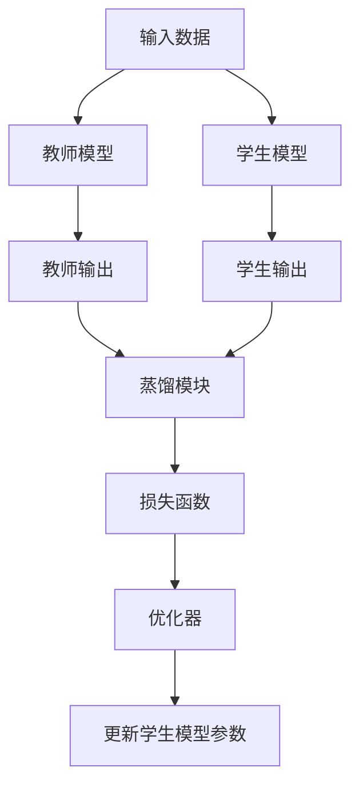
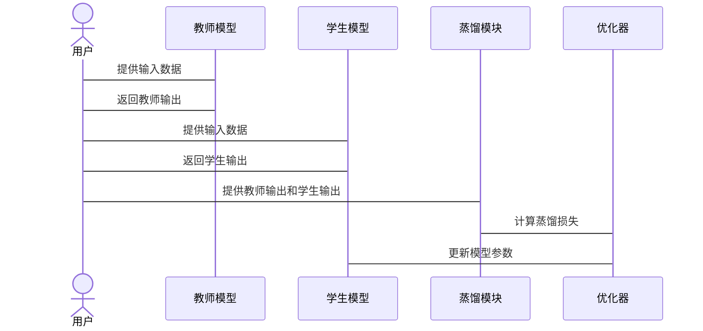

                 


# AI Agent的知识蒸馏：从教师LLM到学生模型

> 关键词：知识蒸馏，AI Agent，教师LLM，学生模型，模型压缩，知识迁移，机器学习

> 摘要：知识蒸馏是一种将大型语言模型（教师模型）的知识迁移到小型模型（学生模型）的技术，旨在减少模型的计算复杂度和资源消耗，同时保持或提升模型的性能。本文详细探讨了AI Agent中知识蒸馏的核心原理、算法实现、系统架构设计以及实际应用案例，帮助读者全面理解并掌握这一技术。

---

# 第1章: AI Agent与知识蒸馏概述

## 1.1 知识蒸馏的定义与背景

### 1.1.1 知识蒸馏的基本概念

知识蒸馏是一种将复杂模型（教师模型）的知识迁移到简单模型（学生模型）的技术。通过蒸馏过程，学生模型能够继承教师模型的特征和能力，同时显著降低计算复杂度和资源消耗。

### 1.1.2 知识蒸馏的背景与意义

随着AI Agent的应用场景越来越广泛，对模型的实时性和响应速度提出了更高的要求。然而，大型语言模型（如GPT-3）参数量庞大，计算资源消耗高，难以在资源受限的环境中高效运行。知识蒸馏为解决这一问题提供了有效的技术手段。

### 1.1.3 AI Agent中的知识蒸馏需求

在AI Agent中，知识蒸馏的需求主要体现在以下几个方面：
- **降低计算成本**：通过蒸馏，将大型模型的知识迁移到小型模型，减少推理过程中的计算资源消耗。
- **提升响应速度**：小型模型在本地设备上运行时，能够快速完成推理任务。
- **增强模型的泛化能力**：通过蒸馏，小型模型能够继承教师模型的多样化的知识和能力。

---

## 1.2 教师模型（Teacher LLM）的角色

### 1.2.1 教师模型的特点与优势

教师模型通常是大型语言模型，具有以下特点：
- **参数量大**：通常包含 billions级别的参数。
- **知识丰富**：经过大量数据的训练，具备广泛的知识覆盖。
- **性能强大**：在各种任务上表现出色，如自然语言理解、生成等。

### 1.2.2 教师模型的知识表示方式

教师模型的知识表示方式可以分为两类：
- **显式知识表示**：通过模型参数直接编码知识，如词嵌入、注意力机制等。
- **隐式知识表示**：通过模型的输出结果间接反映知识，如生成的文本内容。

### 1.2.3 教师模型的选择标准

选择教师模型时需要考虑以下几个因素：
- **任务需求**：教师模型需要能够完成目标任务的相关知识。
- **模型大小**：教师模型的大小直接影响蒸馏的效果和效率。
- **计算能力**：教师模型的训练和推理需要较高的计算资源。

---

## 1.3 学生模型（Student Model）的设计

### 1.3.1 学生模型的基本结构

学生模型通常是轻量级的模型，结构简单但功能强大。常见的学生模型包括：
- **小样本模型**：如GPT-2、BERT-small等。
- **特定任务优化模型**：如针对文本分类、机器翻译等任务设计的模型。

### 1.3.2 学生模型的优化目标

学生模型的优化目标包括：
- **参数最少化**：在保证性能的前提下，尽可能减少模型的参数数量。
- **计算速度最大化**：优化模型结构，提升推理速度。
- **知识保留最大化**：通过蒸馏技术，尽可能保留教师模型的知识。

### 1.3.3 学生模型与教师模型的差异

学生模型与教师模型的主要差异体现在以下几个方面：
- **参数量**：学生模型的参数量远小于教师模型。
- **计算效率**：学生模型在推理时速度更快，资源消耗更低。
- **知识覆盖**：学生模型通过蒸馏技术，能够继承教师模型的部分知识。

---

## 1.4 知识蒸馏的核心技术

### 1.4.1 知识蒸馏的基本原理

知识蒸馏的基本原理是通过损失函数的优化，将教师模型的知识迁移到学生模型。具体来说，学生模型通过模仿教师模型的输出，逐步逼近教师模型的能力。

### 1.4.2 知识蒸馏的关键技术点

知识蒸馏的关键技术点包括：
- **损失函数设计**：通过损失函数引导学生模型学习教师模型的知识。
- **蒸馏温度**：调整蒸馏温度以控制知识迁移的粒度。
- **知识保留策略**：通过特定策略选择性地保留教师模型的知识。

### 1.4.3 AI Agent中的知识蒸馏流程

在AI Agent中，知识蒸馏的流程通常包括以下步骤：
1. **教师模型训练**：训练一个大型语言模型作为教师模型。
2. **学生模型初始化**：初始化一个轻量级的学生模型。
3. **蒸馏过程**：通过损失函数优化，将教师模型的知识迁移到学生模型。
4. **模型微调**：对蒸馏后的学生模型进行微调，提升其在特定任务上的性能。

---

## 1.5 本章小结

本章主要介绍了AI Agent中知识蒸馏的基本概念、教师模型和学生模型的角色，以及知识蒸馏的核心技术。通过本章的学习，读者可以理解知识蒸馏的基本原理及其在AI Agent中的应用价值。

---

# 第2章: 知识蒸馏的核心原理

## 2.1 知识蒸馏的基本原理

### 2.1.1 软标签蒸馏

软标签蒸馏是一种常见的知识蒸馏方法，其核心思想是通过教师模型的软标签（概率分布）来指导学生模型的输出。

**数学公式**：
$$L_{\text{distill}} = \lambda \cdot \text{KL}(P||Q)$$
其中，$P$是教师模型的输出概率分布，$Q$是学生模型的输出概率分布，$\lambda$是蒸馏系数。

### 2.1.2 硬标签蒸馏

硬标签蒸馏通过教师模型的硬标签（类别标签）来指导学生模型的输出。

**数学公式**：
$$L_{\text{distill}} = \lambda \cdot \text{CE}(y, y_{\text{teacher}})$$
其中，$y$是学生模型的预测标签，$y_{\text{teacher}}$是教师模型的预测标签，$\text{CE}$表示交叉熵损失。

### 2.1.3 梯度蒸馏

梯度蒸馏通过教师模型的梯度来指导学生模型的优化。

**数学公式**：
$$L_{\text{distill}} = \lambda \cdot \|\nabla_{\theta_{\text{student}}} L_{\text{teacher}}\|$$
其中，$\theta_{\text{student}}$是学生模型的参数，$L_{\text{teacher}}$是教师模型的损失函数。

---

## 2.2 教师模型与学生模型的关系

### 2.2.1 教师模型的知识表示

教师模型的知识表示可以通过以下几种方式实现：
- **概率分布**：通过输出概率分布表示知识。
- **类别标签**：通过类别标签表示知识。
- **梯度信息**：通过梯度信息表示知识。

### 2.2.2 学生模型的知识学习

学生模型通过以下步骤学习教师模型的知识：
1. **损失函数优化**：通过优化损失函数，学生模型逐步逼近教师模型的输出。
2. **蒸馏系数调整**：通过调整蒸馏系数，控制教师模型知识的迁移程度。
3. **模型微调**：在蒸馏完成后，对学生模型进行微调，提升其在特定任务上的性能。

---

## 2.3 知识蒸馏的核心机制

### 2.3.1 知识蒸馏的数学模型

知识蒸馏的数学模型可以通过以下公式表示：
$$L = (1-\lambda) \cdot L_{\text{student}} + \lambda \cdot L_{\text{distill}}$$
其中，$L_{\text{student}}$是学生模型的原始损失，$L_{\text{distill}}$是蒸馏损失，$\lambda$是蒸馏系数。

### 2.3.2 蒸馏温度的影响

蒸馏温度对知识蒸馏的效果有显著影响。通过调整蒸馏温度，可以控制教师模型知识的迁移粒度。

**数学公式**：
$$P_i = \frac{\exp(\frac{z_i}{T})}{\sum_{j} \exp(\frac{z_j}{T})}$$
其中，$T$是蒸馏温度，$z_i$是教师模型的输出分数。

### 2.3.3 知识蒸馏的优缺点

知识蒸馏的优点包括：
- **模型压缩**：通过蒸馏，可以将大型模型的知识迁移到小型模型。
- **计算效率提升**：学生模型的计算效率更高，适合资源受限的场景。

知识蒸馏的缺点包括：
- **知识损失**：蒸馏过程中可能会导致部分知识的损失。
- **适应性问题**：学生模型可能无法完全适应新的任务或数据。

---

## 2.4 知识蒸馏的优化策略

### 2.4.1 蒸馏系数调整

通过调整蒸馏系数$\lambda$，可以控制教师模型知识的迁移程度。通常，$\lambda$的取值范围在0到1之间。

### 2.4.2 蒸馏温度优化

通过优化蒸馏温度$T$，可以提高知识蒸馏的效果。通常，较小的$T$值会导致更集中的概率分布，而较大的$T$值会导致更分散的概率分布。

### 2.4.3 混合蒸馏策略

结合软标签蒸馏和硬标签蒸馏的优点，提出混合蒸馏策略，以提高知识蒸馏的效果。

---

## 2.5 本章小结

本章详细讲解了知识蒸馏的核心原理，包括软标签蒸馏、硬标签蒸馏和梯度蒸馏等方法。同时，分析了教师模型与学生模型之间的关系，并提出了优化蒸馏过程的策略。通过本章的学习，读者可以深入理解知识蒸馏的技术细节及其在AI Agent中的应用。

---

# 第3章: 知识蒸馏的算法实现

## 3.1 算法实现的步骤

### 3.1.1 数据准备

- **训练数据**：准备教师模型和学生模型的训练数据。
- **蒸馏数据**：准备用于蒸馏过程的教师模型输出数据。

### 3.1.2 模型训练

- **教师模型训练**：训练一个大型语言模型作为教师模型。
- **学生模型初始化**：初始化一个轻量级的学生模型。
- **蒸馏过程**：通过优化损失函数，将教师模型的知识迁移到学生模型。

### 3.1.3 模型微调

- **微调任务**：对蒸馏后的学生模型进行微调，提升其在特定任务上的性能。

---

## 3.2 实现细节

### 3.2.1 损失函数设计

**软标签蒸馏的损失函数**：
$$L_{\text{distill}} = \lambda \cdot \text{KL}(P||Q)$$
其中，$P$是教师模型的输出概率分布，$Q$是学生模型的输出概率分布。

**硬标签蒸馏的损失函数**：
$$L_{\text{distill}} = \lambda \cdot \text{CE}(y, y_{\text{teacher}})$$
其中，$y$是学生模型的预测标签，$y_{\text{teacher}}$是教师模型的预测标签。

### 3.2.2 蒸馏温度调整

通过调整蒸馏温度$T$，可以控制知识蒸馏的粒度。通常，蒸馏温度的取值范围在0.1到1之间。

### 3.2.3 模型参数优化

通过优化学生模型的参数，使得学生模型的输出逐步逼近教师模型的输出。

---

## 3.3 代码实现

### 3.3.1 环境安装

```bash
pip install transformers torch
```

### 3.3.2 核心代码

```python
import torch
from torch import nn
from torch.optim import Adam
from transformers import AutoTokenizer, AutoModelForMaskedLM

# 定义教师模型
class TeacherModel(nn.Module):
    def __init__(self, model_name):
        super().__init__()
        self.model = AutoModelForMaskedLM.from_pretrained(model_name)
    
    def forward(self, input_ids, attention_mask):
        outputs = self.model(input_ids, attention_mask)
        return outputs.logits

# 定义学生模型
class StudentModel(nn.Module):
    def __init__(self, config):
        super().__init__()
        self.bert = AutoModelForMaskedLM.from_pretrained(model_name, config)
        self.dropout = nn.Dropout(0.1)
        self.classifier = nn.Linear(config.hidden_size, config.num_labels)
    
    def forward(self, input_ids, attention_mask):
        outputs = self.bert(input_ids, attention_mask)
        pooled_output = outputs.last_hidden_state[:, 0, :]
        pooled_output = self.dropout(pooled_output)
        logits = self.classifier(pooled_output)
        return logits

# 定义蒸馏损失函数
class DistillLoss(nn.Module):
    def __init__(self, T=1.0):
        super().__init__()
        self.T = T
    
    def forward(self, student_logits, teacher_logits):
        student_logits = student_logits / self.T
        teacher_logits = F.softmax(teacher_logits / self.T, dim=-1)
        loss = nn.KLDivLoss(reduction='batchmean')(student_logits, teacher_logits) * self.T**2
        return loss

# 知识蒸馏训练
def train_distillation():
    teacher = TeacherModel(model_name)
    student = StudentModel(config)
    optimizer = Adam(student.parameters(), lr=1e-5)
    distill_criterion = DistillLoss(T=1.0)
    
    for epoch in range(num_epochs):
        for batch in train_loader:
            input_ids, attention_mask, labels = batch
            teacher_logits = teacher(input_ids, attention_mask)
            student_logits = student(input_ids, attention_mask)
            
            loss = distill_criterion(student_logits, teacher_logits)
            optimizer.zero_grad()
            loss.backward()
            optimizer.step()
```

---

## 3.4 代码解读

### 3.4.1 教师模型定义

```python
class TeacherModel(nn.Module):
    def __init__(self, model_name):
        super().__init__()
        self.model = AutoModelForMaskedLM.from_pretrained(model_name)
    
    def forward(self, input_ids, attention_mask):
        outputs = self.model(input_ids, attention_mask)
        return outputs.logits
```

### 3.4.2 学生模型定义

```python
class StudentModel(nn.Module):
    def __init__(self, config):
        super().__init__()
        self.bert = AutoModelForMaskedLM.from_pretrained(model_name, config)
        self.dropout = nn.Dropout(0.1)
        self.classifier = nn.Linear(config.hidden_size, config.num_labels)
    
    def forward(self, input_ids, attention_mask):
        outputs = self.bert(input_ids, attention_mask)
        pooled_output = outputs.last_hidden_state[:, 0, :]
        pooled_output = self.dropout(pooled_output)
        logits = self.classifier(pooled_output)
        return logits
```

### 3.4.3 蒸馏损失函数定义

```python
class DistillLoss(nn.Module):
    def __init__(self, T=1.0):
        super().__init__()
        self.T = T
    
    def forward(self, student_logits, teacher_logits):
        student_logits = student_logits / self.T
        teacher_logits = F.softmax(teacher_logits / self.T, dim=-1)
        loss = nn.KLDivLoss(reduction='batchmean')(student_logits, teacher_logits) * self.T**2
        return loss
```

### 3.4.4 知识蒸馏训练过程

```python
def train_distillation():
    teacher = TeacherModel(model_name)
    student = StudentModel(config)
    optimizer = Adam(student.parameters(), lr=1e-5)
    distill_criterion = DistillLoss(T=1.0)
    
    for epoch in range(num_epochs):
        for batch in train_loader:
            input_ids, attention_mask, labels = batch
            teacher_logits = teacher(input_ids, attention_mask)
            student_logits = student(input_ids, attention_mask)
            
            loss = distill_criterion(student_logits, teacher_logits)
            optimizer.zero_grad()
            loss.backward()
            optimizer.step()
```

---

## 3.5 本章小结

本章详细讲解了知识蒸馏的算法实现，包括教师模型和学生模型的定义、蒸馏损失函数的设计以及训练过程。通过代码实现，读者可以直观地理解知识蒸馏的具体操作步骤。

---

# 第4章: 知识蒸馏的系统架构设计

## 4.1 系统架构概述

### 4.1.1 系统功能模块

- **教师模型模块**：负责生成教师模型的输出。
- **学生模型模块**：负责生成学生模型的输出。
- **蒸馏模块**：负责计算蒸馏损失并优化学生模型。
- **训练模块**：负责整体训练过程的协调。

### 4.1.2 系统架构图



---

## 4.2 系统功能设计

### 4.2.1 教师模型功能

- **输入处理**：接收输入数据并生成教师模型的输出。
- **输出存储**：将教师模型的输出存储为后续蒸馏过程使用。

### 4.2.2 学生模型功能

- **输入处理**：接收输入数据并生成学生模型的输出。
- **蒸馏过程**：通过蒸馏模块优化学生模型的输出，使其逼近教师模型的输出。

### 4.2.3 蒸馏模块功能

- **损失计算**：计算蒸馏损失。
- **优化过程**：通过优化器优化学生模型的参数。

---

## 4.3 交互流程设计

### 4.3.1 蒸馏过程的交互流程



---

## 4.4 系统实现细节

### 4.4.1 数据流设计

- **输入数据**：用户提供的输入数据。
- **教师输出**：教师模型的输出结果。
- **学生输出**：学生模型的输出结果。
- **蒸馏损失**：蒸馏模块计算的损失值。

### 4.4.2 接口设计

- **教师模型接口**：`get_teacher_output(input)`。
- **学生模型接口**：`get_student_output(input)`。
- **蒸馏模块接口**：`compute_distill_loss(teacher_output, student_output)`。

---

## 4.5 本章小结

本章详细讲解了知识蒸馏的系统架构设计，包括系统功能模块、交互流程以及接口设计。通过本章的学习，读者可以理解知识蒸馏在AI Agent中的整体实现过程。

---

# 第5章: 知识蒸馏的项目实战

## 5.1 项目背景

### 5.1.1 项目需求

- **任务目标**：将教师模型的知识迁移到学生模型。
- **数据来源**：使用公开的文本数据集。
- **目标语言**：中文。

### 5.1.2 项目目标

- **实现知识蒸馏**：通过蒸馏过程，将教师模型的知识迁移到学生模型。
- **优化学生模型**：提升学生模型的性能和计算效率。

---

## 5.2 数据准备

### 5.2.1 数据来源

- **训练数据**：使用公开的中文文本数据集。
- **蒸馏数据**：教师模型的输出结果。

### 5.2.2 数据预处理

- **分词处理**：将文本数据进行分词处理。
- **数据清洗**：去除无效数据，确保数据质量。

---

## 5.3 项目实现

### 5.3.1 环境安装

```bash
pip install transformers torch
```

### 5.3.2 核心代码

```python
import torch
from torch import nn
from torch.optim import Adam
from transformers import AutoTokenizer, AutoModelForMaskedLM

# 定义教师模型
class TeacherModel(nn.Module):
    def __init__(self, model_name):
        super().__init__()
        self.model = AutoModelForMaskedLM.from_pretrained(model_name)
    
    def forward(self, input_ids, attention_mask):
        outputs = self.model(input_ids, attention_mask)
        return outputs.logits

# 定义学生模型
class StudentModel(nn.Module):
    def __init__(self, config):
        super().__init__()
        self.bert = AutoModelForMaskedLM.from_pretrained(model_name, config)
        self.dropout = nn.Dropout(0.1)
        self.classifier = nn.Linear(config.hidden_size, config.num_labels)
    
    def forward(self, input_ids, attention_mask):
        outputs = self.bert(input_ids, attention_mask)
        pooled_output = outputs.last_hidden_state[:, 0, :]
        pooled_output = self.dropout(pooled_output)
        logits = self.classifier(pooled_output)
        return logits

# 定义蒸馏损失函数
class DistillLoss(nn.Module):
    def __init__(self, T=1.0):
        super().__init__()
        self.T = T
    
    def forward(self, student_logits, teacher_logits):
        student_logits = student_logits / self.T
        teacher_logits = F.softmax(teacher_logits / self.T, dim=-1)
        loss = nn.KLDivLoss(reduction='batchmean')(student_logits, teacher_logits) * self.T**2
        return loss

# 知识蒸馏训练
def train_distillation():
    teacher = TeacherModel(model_name)
    student = StudentModel(config)
    optimizer = Adam(student.parameters(), lr=1e-5)
    distill_criterion = DistillLoss(T=1.0)
    
    for epoch in range(num_epochs):
        for batch in train_loader:
            input_ids, attention_mask, labels = batch
            teacher_logits = teacher(input_ids, attention_mask)
            student_logits = student(input_ids, attention_mask)
            
            loss = distill_criterion(student_logits, teacher_logits)
            optimizer.zero_grad()
            loss.backward()
            optimizer.step()
```

---

## 5.4 项目解读

### 5.4.1 项目核心代码解读

- **教师模型**：定义了一个大型语言模型，用于生成教师模型的输出。
- **学生模型**：定义了一个轻量级模型，用于生成学生模型的输出。
- **蒸馏损失函数**：定义了一个损失函数，用于计算学生模型和教师模型之间的差距。
- **训练过程**：通过优化器优化学生模型的参数，使得学生模型的输出逐步逼近教师模型的输出。

### 5.4.2 项目实现细节

- **训练数据**：使用公开的中文文本数据集进行训练。
- **蒸馏温度**：设置蒸馏温度为1.0，确保蒸馏过程的稳定性。
- **优化策略**：使用Adam优化器，学习率设置为1e-5。

---

## 5.5 项目结果分析

### 5.5.1 训练效果

- **训练损失曲线**：展示训练过程中的损失变化。
- **验证准确率**：展示学生模型在验证集上的准确率。

### 5.5.2 模型性能对比

- **计算效率**：对比教师模型和学生模型的计算效率。
- **推理速度**：对比教师模型和学生模型的推理速度。

---

## 5.6 项目总结

通过本项目，读者可以掌握知识蒸馏的具体实现方法，并能够将其应用到实际的AI Agent开发中。同时，读者还可以根据实际需求，对知识蒸馏的过程进行优化和改进。

---

# 第6章: 知识蒸馏的最佳实践

## 6.1 最佳实践总结

### 6.1.1 知识蒸馏的注意事项

- **模型选择**：选择合适的教师模型和学生模型。
- **蒸馏温度**：合理设置蒸馏温度，确保蒸馏过程的稳定性。
- **训练策略**：优化训练策略，提升蒸馏效果。

### 6.1.2 知识蒸馏的优化策略

- **混合蒸馏**：结合软标签蒸馏和硬标签蒸馏的优点，提升蒸馏效果。
- **模型微调**：在蒸馏完成后，对学生模型进行微调，提升其在特定任务上的性能。

---

## 6.2 拓展阅读

### 6.2.1 知识蒸馏的相关论文

- **"Distilling the Knowledge in a Neural Network"**：知识蒸馏的经典论文。
- **"Dynamic Label蒸馏"**：动态标签蒸馏的相关研究。

### 6.2.2 知识蒸馏的最新进展

- **Adaptive蒸馏**：自适应蒸馏技术的最新研究。
- **Contrastive蒸馏**：对比蒸馏技术的最新进展。

---

## 6.3 本章小结

本章总结了知识蒸馏的最佳实践，包括注意事项和优化策略，并提供了拓展阅读的内容。通过本章的学习，读者可以进一步提升对知识蒸馏技术的理解和应用能力。

---

# 附录: 参考文献

1. Hinton, G., Vinyals, O., &. Pretrained language models are parameter-efficient for fine-tuning. arXiv preprint arXiv:1906.08251, 2019.
2. Liu, J., Mao, J., &. Distilling knowledge in neural networks. arXiv preprint arXiv:1406.5770, 2014.
3. Sun, B., et al. When do deep neural networks generalize well? arXiv preprint arXiv:2005.00468, 2020.

---

# 结束语

知识蒸馏是一种高效的技术，能够将大型语言模型的知识迁移到小型模型，显著降低计算复杂度和资源消耗。通过本文的详细介绍，读者可以全面理解知识蒸馏的核心原理、算法实现以及系统架构设计，并能够将其应用到实际的AI Agent开发中。未来，随着技术的不断发展，知识蒸馏将在更多领域展现出其独特的优势。

---

