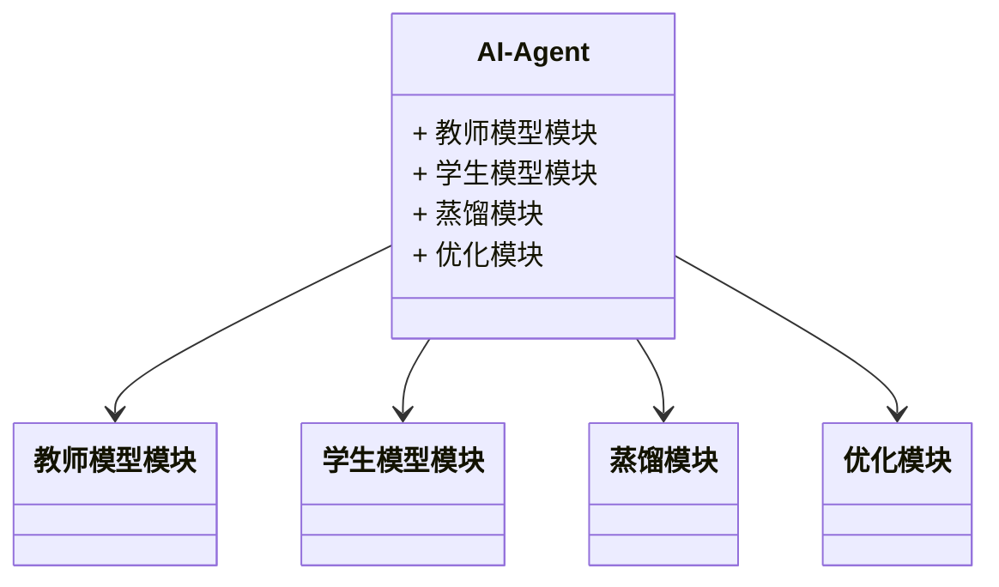
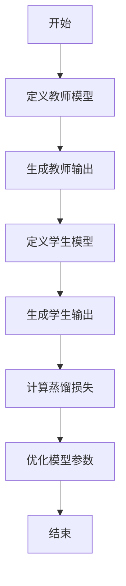

                 


# AI Agent的知识蒸馏：从集成LLM到轻量级模型

> 关键词：AI Agent，知识蒸馏，大型语言模型（LLM），轻量级模型，模型压缩

> 摘要：随着人工智能技术的快速发展，AI Agent在各个领域的应用越来越广泛。然而，大型语言模型（LLM）的计算成本和资源需求限制了其在实际应用中的推广。知识蒸馏作为一种有效的模型压缩技术，能够将大模型的知识迁移到小模型中，从而在保证性能的同时降低计算成本。本文将详细探讨AI Agent的知识蒸馏技术，从集成LLM到轻量级模型的实现过程，分析其核心原理、系统架构设计、算法实现、项目实战以及优化策略。

---

# 第1章: AI Agent与知识蒸馏概述

## 1.1 AI Agent的基本概念

### 1.1.1 AI Agent的定义与特点
AI Agent是一种智能体，能够感知环境、自主决策并执行任务。其特点包括自主性、反应性、目标导向和社会能力。

### 1.1.2 AI Agent的应用场景
AI Agent广泛应用于自然语言处理、推荐系统、自动驾驶、机器人控制等领域。

### 1.1.3 知识蒸馏的定义与背景
知识蒸馏是一种将知识从复杂的大模型迁移到简单的小模型的技术，旨在降低模型的计算成本和资源需求。

---

## 1.2 知识蒸馏的核心原理

### 1.2.1 知识蒸馏的基本原理
知识蒸馏通过教师模型（大模型）和学生模型（小模型）之间的互动，将教师的知识迁移到学生模型中。

### 1.2.2 知识蒸馏的关键技术
包括教师模型的选择、蒸馏策略的设计以及损失函数的优化。

### 1.2.3 知识蒸馏的目标与意义
目标是实现模型的轻量化，同时保持或提升模型性能；意义在于降低计算成本，提高模型的部署效率。

---

## 1.3 LLM与轻量级模型的对比分析

### 1.3.1 LLM的优势与局限性
优势：强大的上下文理解和生成能力；局限性：计算成本高、资源需求大。

### 1.3.2 轻量级模型的特点与应用场景
特点：计算效率高、资源消耗低；应用场景：移动设备、边缘计算、实时响应等。

### 1.3.3 知识蒸馏在LLM与轻量级模型之间的桥梁作用
通过知识蒸馏，可以在保持模型性能的同时，将LLM的知识迁移到轻量级模型中。

---

## 1.4 本章小结
本章介绍了AI Agent和知识蒸馏的基本概念，分析了LLM与轻量级模型的特点及其在知识蒸馏中的应用。

---

# 第2章: 知识蒸馏的理论基础

## 2.1 知识蒸馏的核心概念

### 2.1.1 知识蒸馏的定义
知识蒸馏是一种通过教师模型和学生模型的交互，将知识从复杂模型迁移到简单模型的技术。

### 2.1.2 知识蒸馏的关键要素
包括教师模型、学生模型、蒸馏策略和损失函数。

### 2.1.3 知识蒸馏的数学模型
知识蒸馏的损失函数通常包括分类损失和蒸馏损失，公式如下：

$$ L = \lambda_1 L_{\text{cls}} + \lambda_2 L_{\text{distill}} $$

其中，$L_{\text{cls}}$是分类损失，$L_{\text{distill}}$是蒸馏损失，$\lambda_1$和$\lambda_2$是平衡系数。

---

## 2.2 知识蒸馏的实现原理

### 2.2.1 知识蒸馏的步骤与流程
1. 训练教师模型。
2. 使用教师模型的输出作为学生模型的标签。
3. 优化学生模型以最小化蒸馏损失。

### 2.2.2 知识蒸馏的算法框架
常用的蒸馏算法包括软目标蒸馏、硬目标蒸馏和概率蒸馏。

### 2.2.3 知识蒸馏的优化方法
包括调整蒸馏温度、优化损失函数和引入正则化项。

---

## 2.3 知识蒸馏的数学模型与公式

### 2.3.1 知识蒸馏的损失函数
$$ L_{\text{distill}} = -\sum_{i=1}^n T_i \log S_i $$
其中，$T_i$是教师模型的输出概率，$S_i$是学生模型的输出概率。

### 2.3.2 知识蒸馏的KL散度公式
$$ \text{KL}(T||S) = \sum_{i=1}^n T_i \log \frac{T_i}{S_i} $$

### 2.3.3 知识蒸馏的优化算法
常用的优化算法包括随机梯度下降（SGD）和Adam优化器。

---

## 2.4 本章小结
本章详细介绍了知识蒸馏的理论基础，包括其核心概念、实现原理和数学模型。

---

# 第3章: AI Agent的知识蒸馏系统架构设计

## 3.1 系统架构概述

### 3.1.1 系统的整体架构
系统包括教师模型、学生模型、蒸馏模块和优化模块。

### 3.1.2 系统的功能模块划分
- 教师模型模块：负责生成知识蒸馏的参考输出。
- 学生模型模块：负责学习教师模型的知识。
- 蒸馏模块：负责计算蒸馏损失并优化学生模型。
- 优化模块：负责调整模型参数以最小化损失函数。

### 3.1.3 系统的交互流程
教师模型生成输出，学生模型通过蒸馏模块学习教师模型的知识，优化模块调整模型参数。

---

## 3.2 系统功能设计

### 3.2.1 知识蒸馏模块的设计
包括蒸馏策略的选择和损失函数的设计。

### 3.2.2 AI Agent的集成设计
将知识蒸馏模块集成到AI Agent中，使其能够利用轻量级模型进行推理。

### 3.2.3 轻量级模型的构建设计
设计轻量级模型的架构，确保其在资源受限的环境中能够高效运行。

---

## 3.3 系统架构的实现

### 3.3.1 系统架构的Mermaid类图


### 3.3.2 系统架构的实现步骤
1. 定义教师模型和学生模型。
2. 实现蒸馏模块，计算蒸馏损失。
3. 优化模块调整模型参数。
4. 集成到AI Agent中，进行知识蒸馏。

---

## 3.4 本章小结
本章设计了AI Agent的知识蒸馏系统架构，详细介绍了各功能模块的设计和实现步骤。

---

# 第4章: 知识蒸馏的算法实现

## 4.1 知识蒸馏算法的原理

### 4.1.1 知识蒸馏的基本算法
包括软目标蒸馏、硬目标蒸馏和概率蒸馏。

### 4.1.2 知识蒸馏的改进算法
针对不同场景的改进算法，如任务适应蒸馏和自适应蒸馏。

### 4.1.3 知识蒸馏的对比分析
比较不同蒸馏算法的优缺点，分析其适用场景。

---

## 4.2 知识蒸馏的Mermaid流程图



---

## 4.3 知识蒸馏的Python实现

### 4.3.1 环境配置与安装
安装必要的库，如TensorFlow或PyTorch。

### 4.3.2 知识蒸馏算法的代码实现
```python
import tensorflow as tf
from tensorflow.keras import layers

# 定义教师模型
teacher_model = tf.keras.Sequential([
    layers.Dense(128, activation='relu'),
    layers.Dense(10, activation='softmax')
])

# 定义学生模型
student_model = tf.keras.Sequential([
    layers.Dense(64, activation='relu'),
    layers.Dense(10, activation='softmax')
])

# 定义蒸馏损失函数
def distillation_loss(y_true, y_pred, alpha=0.1, temperature=3.0):
    teacher_pred = teacher_model.predict(y_true)
    student_pred = y_pred
    # 蒸馏损失
    distill_loss = tf.keras.losses.KLDivergence()(teacher_pred, student_pred)
    distill_loss = distill_loss * alpha
    # 分类损失
    class_loss = tf.keras.losses.sparse_categorical_crossentropy(y_true, student_pred)
    total_loss = class_loss + distill_loss
    return total_loss

# 编译学生模型
student_model.compile(optimizer='adam', loss=distillation_loss)

# 训练学生模型
student_model.fit(x_train, y_train, epochs=10, batch_size=32)
```

---

## 4.4 本章小结
本章详细介绍了知识蒸馏算法的实现过程，包括算法原理、流程图设计和Python代码实现。

---

# 第5章: 知识蒸馏的项目实战

## 5.1 项目背景与目标

### 5.1.1 项目背景介绍
在资源受限的场景中，需要将大型语言模型的知识迁移到轻量级模型中。

### 5.1.2 项目目标设定
实现知识蒸馏技术，将LLM的知识迁移到轻量级模型中，提升模型的计算效率。

### 5.1.3 项目范围界定
项目范围包括模型训练、蒸馏过程和性能评估。

---

## 5.2 项目系统设计

### 5.2.1 系统功能设计
包括教师模型训练、学生模型训练和蒸馏过程的实现。

### 5.2.2 系统接口设计
定义教师模型和学生模型的接口，确保模块之间的通信。

### 5.2.3 系统交互设计
设计系统交互流程，确保各模块协同工作。

---

## 5.3 项目实现与代码解读

### 5.3.1 项目核心代码实现
```python
# 训练教师模型
teacher_model.fit(x_train, y_train, epochs=10, batch_size=32)

# 定义蒸馏损失函数
def distillation_loss(y_true, y_pred):
    teacher_pred = teacher_model.predict(y_true)
    student_pred = y_pred
    distill_loss = tf.keras.losses.KLDivergence()(teacher_pred, student_pred)
    class_loss = tf.keras.losses.sparse_categorical_crossentropy(y_true, student_pred)
    total_loss = class_loss + distill_loss
    return total_loss

# 编译并训练学生模型
student_model.compile(optimizer='adam', loss=distillation_loss)
student_model.fit(x_train, y_train, epochs=10, batch_size=32)
```

### 5.3.2 代码的功能解读
代码实现教师模型和学生模型的训练，并定义蒸馏损失函数，最终训练学生模型以实现知识蒸馏。

---

## 5.4 项目案例分析与总结

### 5.4.1 项目案例分析
通过具体案例分析知识蒸馏在实际项目中的应用效果。

### 5.4.2 项目实施的经验总结
总结项目实施中的经验和教训，提出改进建议。

### 5.4.3 项目实施的注意事项
包括模型选择、参数调整和性能评估等方面。

---

## 5.5 本章小结
本章通过具体案例展示了知识蒸馏技术的项目实施过程，总结了实施经验和注意事项。

---

# 第6章: 知识蒸馏的系统优化与性能分析

## 6.1 系统优化策略

### 6.1.1 知识蒸馏的模型压缩技术
包括剪枝、量化和知识蒸馏本身。

### 6.1.2 知识蒸馏的性能优化方法
通过调整蒸馏温度、优化损失函数和引入正则化项来提升性能。

### 6.1.3 知识蒸馏的资源优化策略
包括减少模型参数数量和降低计算复杂度。

---

## 6.2 系统性能分析

### 6.2.1 知识蒸馏的效果评估
通过准确率、计算速度和资源消耗等指标评估蒸馏效果。

### 6.2.2 知识蒸馏的对比分析
对比蒸馏前后的模型性能，分析其优劣。

### 6.2.3 知识蒸馏的适用场景
总结知识蒸馏在不同场景下的适用性和效果。

---

## 6.3 本章小结
本章分析了知识蒸馏的系统优化策略及其性能表现，总结了其在实际应用中的优势和局限性。

---

# 第7章: 总结与展望

## 7.1 知识蒸馏技术的总结
总结知识蒸馏技术的核心思想、实现方法和应用场景。

## 7.2 知识蒸馏技术的未来展望
展望知识蒸馏技术的发展方向，包括更高效的蒸馏算法、多任务蒸馏和自适应蒸馏等。

## 7.3 最佳实践 tips
给出知识蒸馏技术在实际应用中的最佳实践建议，包括模型选择、参数调整和性能优化等方面。

---

## 7.4 本章小结
本章总结了知识蒸馏技术的现状和未来发展方向，提出了实际应用中的注意事项和建议。

---

# 结束语

通过本文的详细讲解，读者可以全面了解AI Agent的知识蒸馏技术，从理论到实践，从算法到优化，掌握其核心思想和实现方法。未来，随着技术的不断发展，知识蒸馏将在更多领域发挥重要作用，为AI Agent的应用提供更多可能性。

---

# 参考文献

（此处列出相关文献和资源，如学术论文、技术文档等。）

