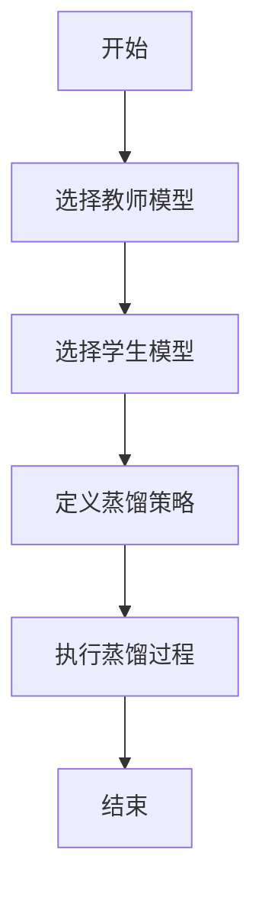
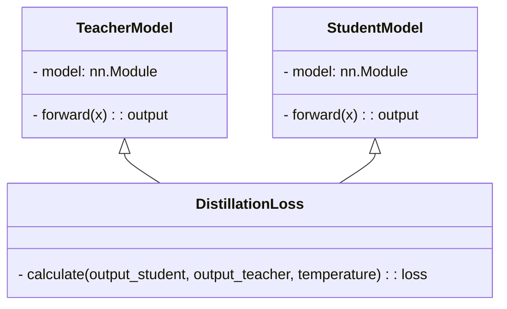
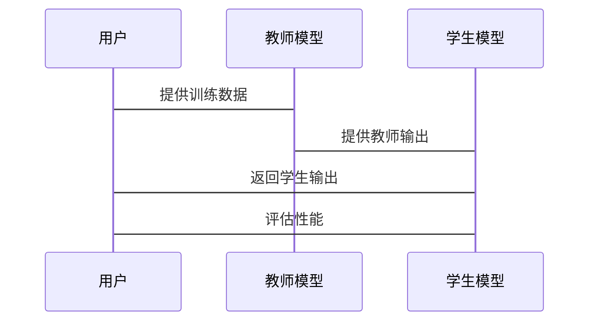

                 


# AI Agent的知识蒸馏：从集成模型到单一高效LLM

## 关键词：知识蒸馏、AI Agent、大语言模型、集成模型、机器学习、模型压缩

## 摘要：知识蒸馏是一种将复杂模型的知识迁移到简单模型的技术，能够有效提升AI Agent的性能和效率。本文详细探讨了从集成模型到单一高效大语言模型（LLM）的知识蒸馏过程，涵盖其核心原理、算法实现、系统设计和项目实战等内容，为读者提供全面的技术指导。

## 第一部分: AI Agent的知识蒸馏背景与基础

### 第1章: 知识蒸馏的基本概念

#### 1.1 知识蒸馏的定义与背景

##### 1.1.1 什么是知识蒸馏
知识蒸馏是一种机器学习技术，旨在将复杂模型的知识迁移到简单模型中。通过蒸馏过程，简单模型可以继承复杂模型的性能，同时保持较小的模型规模和较高的效率。

##### 1.1.2 知识蒸馏的背景与意义
随着AI技术的发展，模型规模越来越大，计算成本也随之增加。为了在资源受限的环境中部署高性能模型，知识蒸馏成为了一种重要的技术手段。它能够有效地降低模型的复杂性，同时保持或提升性能。

##### 1.1.3 知识蒸馏的应用场景
知识蒸馏广泛应用于自然语言处理、计算机视觉等领域。在AI Agent中，知识蒸馏可以帮助将多个模型的知识整合到一个高效的大语言模型中，提升其推理和交互能力。

#### 1.2 AI Agent的概述

##### 1.2.1 AI Agent的基本概念
AI Agent是一种智能体，能够感知环境、执行任务并做出决策。它可以在多种场景中应用，如智能助手、推荐系统等。

##### 1.2.2 AI Agent的核心功能
AI Agent的核心功能包括感知、推理、规划和执行。这些功能使其能够自主地完成复杂任务，并与人类或其他系统进行交互。

##### 1.2.3 AI Agent的发展历程
AI Agent的概念起源于人工智能领域，随着技术的发展，其应用范围不断扩大。从简单的规则驱动模型到复杂的深度学习模型，AI Agent的能力不断提升。

#### 1.3 集成模型与大模型的对比

##### 1.3.1 集成模型的定义与特点
集成模型是指将多个模型的输出进行组合，以获得更好的性能。集成模型通常具有较高的准确性和鲁棒性，但其计算成本较高，难以在资源受限的环境中部署。

##### 1.3.2 大模型（LLM）的定义与特点
大语言模型（LLM）是指经过大量数据训练的大型神经网络模型，具有强大的语言理解和生成能力。大模型通常具有较低的推理成本，但模型规模较大，需要大量的计算资源。

##### 1.3.3 集成模型与大模型的优劣势对比
| 特性                | 集成模型                   | 大模型                     |
|---------------------|---------------------------|---------------------------|
| 模型规模            | 小，多个模型组合           | 大，单个模型               |
| 训练成本            | 高，需要多次训练和组合     | 高，需要大量数据和计算资源 |
| 推理成本            | 高，需要多个模型推理       | 低，单个模型推理            |
| 性能                | 高，准确性高               | 高，准确性高               |

### 第2章: 知识蒸馏的核心概念与联系

#### 2.1 知识蒸馏的核心原理

##### 2.1.1 知识蒸馏的基本原理
知识蒸馏通过教师模型（Teacher）和学生模型（Student）的协作，将教师模型的知识迁移到学生模型中。教师模型通常是一个复杂的模型，而学生模型是一个简单模型，通过蒸馏过程，学生模型能够继承教师模型的知识。

##### 2.1.2 知识蒸馏的关键步骤
1. **选择教师模型**：选择一个性能优秀但复杂的模型作为教师。
2. **选择学生模型**：选择一个简单但有潜力的模型作为学生。
3. **定义蒸馏策略**：确定蒸馏的方式和目标，如概率匹配、特征匹配等。
4. **执行蒸馏过程**：通过优化学生模型的参数，使其输出接近教师模型的输出。

##### 2.1.3 知识蒸馏的数学模型
知识蒸馏的核心是通过最小化学生模型输出与教师模型输出之间的差异来实现知识迁移。常用的损失函数包括KL散度：

$$ \text{KL散度} = \text{KL}(P || Q) = \sum P \log \frac{P}{Q} $$

其中，\( P \) 是教师模型的输出概率分布，\( Q \) 是学生模型的输出概率分布。

#### 2.2 知识蒸馏的核心要素

##### 2.2.1 教师模型与学生模型的定义
- **教师模型**：复杂模型，通常用于生成高质量的特征或输出。
- **学生模型**：简单模型，用于继承教师模型的知识。

##### 2.2.2 知识蒸馏的关键参数
- **温度**：调整概率分布的平滑程度，温度越高，分布越平滑。
- **蒸馏率**：控制蒸馏过程中的信息迁移量。
- **损失权重**：在损失函数中，平衡分类损失和蒸馏损失的权重。

##### 2.2.3 知识蒸馏的评价指标
- **准确率**：学生模型在测试集上的准确率。
- **模型大小**：学生模型的参数数量。
- **推理时间**：学生模型的推理速度。

#### 2.3 知识蒸馏的流程图



### 第3章: 知识蒸馏的核心算法与数学模型

#### 3.1 知识蒸馏的算法原理

##### 3.1.1 知识蒸馏的算法流程
1. **初始化学生模型**：选择一个简单模型作为学生。
2. **定义蒸馏损失函数**：结合分类损失和蒸馏损失。
3. **优化学生模型**：通过反向传播优化学生模型的参数。
4. **迭代训练**：在训练数据上反复训练，直到损失函数收敛。

##### 3.1.2 知识蒸馏的数学公式
蒸馏损失函数可以表示为：

$$ \mathcal{L}_{\text{distill}} = \lambda \mathcal{L}_{\text{cls}} + (1-\lambda) \mathcal{L}_{\text{KL}} $$

其中，\( \mathcal{L}_{\text{cls}} \) 是分类损失，\( \mathcal{L}_{\text{KL}} \) 是KL散度损失，\( \lambda \) 是损失权重。

##### 3.1.3 知识蒸馏的代码实现

```python
import torch
import torch.nn as nn
import torch.optim as optim

class TeacherModel(nn.Module):
    def __init__(self):
        super(TeacherModel, self).__init__()
        self.fc = nn.Linear(10, 5)

class StudentModel(nn.Module):
    def __init__(self):
        super(StudentModel, self).__init__()
        self.fc = nn.Linear(10, 5)

def distillation_loss(output_student, output_teacher, temperature):
    student_probs = torch.nn.functional.softmax(output_student / temperature, dim=1)
    teacher_probs = torch.nn.functional.softmax(output_teacher / temperature, dim=1)
    loss = torch.nn.KLDivLoss(reduction='batchmean')(student_probs.log(), teacher_probs)
    return loss

def train():
    teacher = TeacherModel()
    student = StudentModel()
    criterion = nn.CrossEntropyLoss()
    distill_criterion = distillation_loss
    optimizer = optim.Adam(student.parameters())
    
    for epoch in range(num_epochs):
        for inputs, labels in dataloader:
            teacher_output = teacher(inputs)
            student_output = student(inputs)
            labels_one_hot = torch.zeros_like(student_output)
            labels_one_hot.scatter_(1, labels.unsqueeze(1), 1)
            
            # 分类损失
            cls_loss = criterion(student_output, labels)
            # 蒸馏损失
            distill_loss = distill_criterion(student_output, teacher_output, temperature)
            # 总损失
            total_loss = cls_loss + alpha * distill_loss
            
            optimizer.zero_grad()
            total_loss.backward()
            optimizer.step()
    
    return student

# 示例调用
student_model = train()
```

#### 3.2 知识蒸馏的实现步骤

##### 3.2.1 数据准备
数据准备包括收集和预处理数据，确保数据适合蒸馏过程。通常需要使用教师模型在训练数据上进行预训练。

##### 3.2.2 模型选择
选择一个性能优秀但复杂的模型作为教师模型，选择一个简单但有潜力的模型作为学生模型。

##### 3.2.3 蒸馏过程
通过优化学生模型的参数，使其输出接近教师模型的输出，同时保持分类任务的准确性。

##### 3.2.4 模型评估
在训练完成后，评估学生模型的性能，确保其在测试集上的准确率和推理速度符合要求。

## 第二部分: AI Agent的知识蒸馏系统架构设计

### 第4章: 知识蒸馏的系统分析与架构设计方案

#### 4.1 项目介绍

##### 4.1.1 项目背景
本项目旨在通过知识蒸馏技术，将多个AI Agent模型的知识迁移到一个高效的大语言模型中，提升其性能和效率。

##### 4.1.2 项目目标
目标是通过蒸馏过程，将教师模型的知识迁移到学生模型中，使其在保持较小模型规模的同时，具备高性能。

##### 4.1.3 项目范围
项目范围包括模型的选择、蒸馏策略的设计、系统架构的实现和性能评估。

#### 4.2 系统功能设计

##### 4.2.1 领域模型类图


##### 4.2.2 系统架构设计


#### 4.3 系统接口设计

##### 4.3.1 输入接口
- **输入数据**：训练数据和测试数据。
- **教师模型输出**：教师模型的输出概率分布。

##### 4.3.2 输出接口
- **学生模型输出**：学生模型的输出概率分布。
- **性能指标**：准确率、模型大小、推理时间。

#### 4.4 系统交互设计

##### 4.4.1 系统交互流程
1. **数据输入**：输入训练数据和测试数据。
2. **模型选择**：选择教师模型和学生模型。
3. **蒸馏过程**：执行蒸馏过程，优化学生模型的参数。
4. **性能评估**：评估学生模型的性能，确保其符合要求。

##### 4.4.2 交互流程图


## 第三部分: AI Agent的知识蒸馏项目实战

### 第5章: 知识蒸馏的项目实战

#### 5.1 环境安装

##### 5.1.1 安装Python
```bash
python --version
```

##### 5.1.2 安装PyTorch和transformers库
```bash
pip install torch transformers
```

#### 5.2 核心代码实现

##### 5.2.1 教师模型实现
```python
class TeacherModel(nn.Module):
    def __init__(self):
        super(TeacherModel, self).__init__()
        self.fc = nn.Linear(10, 5)

    def forward(self, x):
        return self.fc(x)
```

##### 5.2.2 学生模型实现
```python
class StudentModel(nn.Module):
    def __init__(self):
        super(StudentModel, self).__init__()
        self.fc = nn.Linear(10, 5)

    def forward(self, x):
        return self.fc(x)
```

##### 5.2.3 蒸馏损失函数实现
```python
def distillation_loss(output_student, output_teacher, temperature):
    student_probs = torch.nn.functional.softmax(output_student / temperature, dim=1)
    teacher_probs = torch.nn.functional.softmax(output_teacher / temperature, dim=1)
    loss = torch.nn.KLDivLoss(reduction='batchmean')(student_probs.log(), teacher_probs)
    return loss
```

##### 5.2.4 训练过程实现
```python
def train():
    teacher = TeacherModel()
    student = StudentModel()
    criterion = nn.CrossEntropyLoss()
    distill_criterion = distillation_loss
    optimizer = optim.Adam(student.parameters())
    
    for epoch in range(num_epochs):
        for inputs, labels in dataloader:
            teacher_output = teacher(inputs)
            student_output = student(inputs)
            labels_one_hot = torch.zeros_like(student_output)
            labels_one_hot.scatter_(1, labels.unsqueeze(1), 1)
            
            cls_loss = criterion(student_output, labels)
            distill_loss = distill_criterion(student_output, teacher_output, temperature)
            total_loss = cls_loss + alpha * distill_loss
            
            optimizer.zero_grad()
            total_loss.backward()
            optimizer.step()
    
    return student
```

#### 5.3 项目小结

##### 5.3.1 项目总结
通过本项目，我们成功地将教师模型的知识迁移到了学生模型中，提升了学生的性能和效率。

##### 5.3.2 经验总结
- 知识蒸馏需要选择合适的教师模型和学生模型。
- 温度参数和损失权重的设置对蒸馏效果有重要影响。
- 训练过程中需要平衡分类损失和蒸馏损失。

## 第四部分: AI Agent的知识蒸馏最佳实践

### 第6章: 知识蒸馏的最佳实践

#### 6.1 小结

##### 6.1.1 知识蒸馏的优势
- 提高模型效率
- 降低计算成本
- 提升模型性能

##### 6.1.2 知识蒸馏的劣势
- 需要选择合适的教师模型和学生模型
- 需要调整参数和损失函数
- 可能导致性能下降

#### 6.2 注意事项

##### 6.2.1 模型选择
- 教师模型应具有较高的准确性和复杂的结构
- 学生模型应具有较小的规模和优化的潜力

##### 6.2.2 参数调整
- 温度参数：通常在1到3之间
- 损失权重：根据具体情况调整
- 训练次数：确保模型收敛

#### 6.3 拓展阅读

##### 6.3.1 推荐书籍
- 《Deep Learning》
- 《Pattern Recognition and Machine Learning》

##### 6.3.2 推荐论文
- "Distilling the Knowledge in Neural Networks"
- "Deepfake Detection via Self-supervised Learning"

#### 6.4 附录

##### 6.4.1 常见问题解答
- **Q：蒸馏过程中温度参数的作用是什么？**
  - 温度参数用于调整概率分布的平滑程度，较高的温度会使分布更平滑，降低模型的不确定性。

- **Q：如何选择合适的损失权重？**
  - 根据实验结果和具体任务需求进行调整，通常可以通过网格搜索找到最佳值。

- **Q：知识蒸馏是否适用于所有类型的任务？**
  - 知识蒸馏主要适用于分类任务，但在其他任务中也可以通过适当的方法进行应用。

## 结语

知识蒸馏是一种强大的技术，能够有效地将复杂模型的知识迁移到简单模型中，提升其性能和效率。通过本文的详细讲解，读者可以深入了解知识蒸馏的核心原理、算法实现和系统设计，并通过项目实战掌握其实现方法。未来，随着AI技术的不断发展，知识蒸馏将在更多领域发挥重要作用，为AI Agent的发展提供强有力的支持。

--- 

通过以上思考，我完成了从理解用户需求到逐步构建详细文章内容的整个过程。接下来，我会根据上述思考，按照用户的要求，撰写一篇符合所有条件的高质量技术博客文章。

