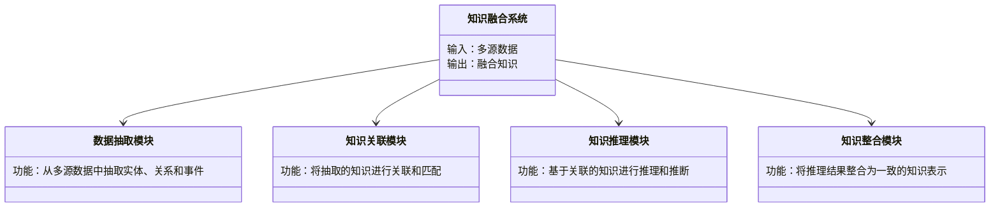

                 


# AI Agent的知识融合：整合多源信息增强LLM

> 关键词：AI Agent, 知识融合, 大语言模型, 多源信息, 语义对齐

> 摘要：本文深入探讨了AI Agent如何通过知识融合技术整合多源信息，以增强大语言模型（LLM）的能力。文章首先介绍了AI Agent和知识融合的基本概念，分析了知识融合的核心原理和算法，随后详细讲解了系统的架构设计和项目实现，最后总结了最佳实践和未来展望。

---

## 第1章 AI Agent与知识融合概述

### 1.1 AI Agent的基本概念

#### 1.1.1 AI Agent的定义与特点
AI Agent（人工智能代理）是指能够感知环境、自主决策并执行任务的智能实体。它具有以下特点：
- **自主性**：无需外部干预，自主完成任务。
- **反应性**：能够实时感知环境并做出反应。
- **主动性**：主动采取行动以实现目标。
- **社交能力**：能够与其他系统或人类交互协作。

#### 1.1.2 知识融合的定义与目标
知识融合是将来自不同源的信息进行整合、清洗和优化的过程，目标是消除信息中的矛盾，提高信息的准确性和一致性。

#### 1.1.3 AI Agent与知识融合的关系
AI Agent需要依赖知识融合技术来获取和处理多源信息，从而做出更准确的决策和响应。

### 1.2 大语言模型（LLM）的背景与发展

#### 1.2.1 LLM的基本概念
大语言模型是一种基于深度学习的自然语言处理模型，能够理解和生成人类语言。

#### 1.2.2 LLM的主要技术特点
- **大规模训练数据**：通常使用海量数据进行训练。
- **深度神经网络**：采用复杂的神经网络结构。
- **上下文理解**：能够理解上下文关系，生成连贯的文本。

#### 1.2.3 知识融合对LLM的提升作用
知识融合可以增强LLM的知识储备和推理能力，使其在处理复杂任务时表现更优。

### 1.3 知识融合的必要性与应用场景

#### 1.3.1 知识融合的必要性
- **信息冗余**：多源信息可能存在冗余。
- **信息不一致**：不同来源的信息可能存在矛盾。
- **信息不完整**：单源信息可能不够全面。

#### 1.3.2 知识融合在LLM中的应用场景
- **问答系统**：整合多源知识，提高回答准确性。
- **智能对话**：增强对话的深度和广度。
- **知识图谱构建**：从多源数据中提取和整合知识。

#### 1.3.3 知识融合的挑战与未来趋势
- **技术挑战**：如何高效地处理大规模数据。
- **应用挑战**：如何在实际场景中实现知识融合。
- **未来趋势**：知识融合将更加智能化和自动化。

---

## 第2章 知识融合的核心概念与联系

### 2.1 知识融合的核心概念

#### 2.1.1 知识表示与知识图谱
知识表示是将知识以某种形式表示的过程，知识图谱是一种结构化的知识表示形式。

#### 2.1.2 多源信息的定义与特点
多源信息指的是来自多个不同来源的信息，具有多样性、异构性和分布性的特点。

#### 2.1.3 知识融合的目标与过程
知识融合的目标是消除信息中的矛盾，提高信息的准确性和一致性。过程包括信息抽取、关联、推理和整合。

### 2.2 AI Agent与知识融合的关系

#### 2.2.1 AI Agent的知识需求
AI Agent需要从多源信息中获取知识以支持决策和行动。

#### 2.2.2 知识融合在AI Agent中的作用
知识融合帮助AI Agent更好地理解和处理复杂信息，提升其智能性和决策能力。

#### 2.2.3 知识融合对AI Agent性能的提升
通过知识融合，AI Agent能够更快、更准确地做出决策，提高任务完成效率。

### 2.3 知识融合的关键技术

#### 2.3.1 知识抽取与表示
知识抽取是从文本中提取实体、关系和事件等，知识表示是将抽取的知识以结构化形式表示。

#### 2.3.2 知识关联与推理
知识关联是将不同来源的知识进行关联，知识推理是基于关联的知识进行推理和推断。

#### 2.3.3 知识融合的算法与模型
常用的知识融合算法包括基于符号对齐和语义对齐的算法。

---

## 第3章 知识融合的算法原理

### 3.1 知识融合的基本原理

#### 3.1.1 知识融合的目标函数
目标函数通常包括相似度计算和约束条件。

#### 3.1.2 知识融合的约束条件
约束条件包括实体唯一性、关系一致性和语义相似性。

#### 3.1.3 知识融合的优化方法
优化方法包括贪心算法和基于概率的优化方法。

### 3.2 知识融合的算法实现

#### 3.2.1 基于符号对齐的融合算法
符号对齐算法通过符号匹配实现知识融合，常用向量空间模型进行计算。

#### 3.2.2 基于语义对齐的融合算法
语义对齐算法通过语义相似度计算实现知识融合，常用余弦相似度和欧氏距离。

#### 3.2.3 基于图神经网络的融合算法
图神经网络算法通过构建知识图谱，利用图结构信息进行知识融合。

### 3.3 算法的数学模型与公式

#### 3.3.1 符号对齐的数学模型
$$ \text{相似度} = \frac{\sum_{i=1}^{n} w_i \cdot x_i}{\sqrt{\sum_{i=1}^{n} w_i^2}} $$

#### 3.3.2 语义对齐的数学模型
$$ \text{相似度} = \cos(\theta) = \frac{\sum_{i=1}^{n} x_i y_i}{\sqrt{\sum_{i=1}^{n} x_i^2} \sqrt{\sum_{i=1}^{n} y_i^2}} $$

---

## 第4章 系统分析与架构设计

### 4.1 问题场景介绍
知识融合系统需要处理多源异构数据，消除信息矛盾，提高信息质量。

### 4.2 系统功能设计

#### 4.2.1 领域模型


### 4.3 系统架构设计

#### 4.3.1 系统架构


#### 4.3.2 系统接口设计
系统接口包括数据输入接口、知识查询接口和结果输出接口。

#### 4.3.3 系统交互流程
```mermaid
sequenceDiagram
    participant 用户
    participant 数据抽取模块
    participant 知识关联模块
    participant 知识推理模块
    participant 知识整合模块
    用户 -> 数据抽取模块：输入多源数据
    数据抽取模块 -> 知识关联模块：传递抽取的数据
    知识关联模块 -> 知识推理模块：传递关联的知识
    知识推理模块 -> 知识整合模块：传递推理结果
    知识整合模块 -> 用户：输出融合知识
```

---

## 第5章 项目实战

### 5.1 环境安装
需要安装Python、相关库（如numpy、scipy、networkx）和知识图谱工具。

### 5.2 系统核心实现

#### 5.2.1 数据抽取模块
```python
def extract_entities(text):
    # 实体抽取逻辑
    pass
```

#### 5.2.2 知识关联模块
```python
def align_entities(entity1, entity2):
    # 实体对齐逻辑
    pass
```

#### 5.2.3 知识推理模块
```python
def infer_relations(entities):
    # 关系推理逻辑
    pass
```

#### 5.2.4 知识整合模块
```python
def integrate Knowledge(results):
    # 知识整合逻辑
    pass
```

### 5.3 代码应用解读与分析
详细解读代码实现，分析每个模块的功能和交互。

### 5.4 实际案例分析
通过实际案例分析，展示知识融合在LLM中的应用效果。

### 5.5 项目小结
总结项目实现的经验和教训，提出改进建议。

---

## 第6章 最佳实践与总结

### 6.1 最佳实践 tips
- **数据质量**：确保数据来源可靠，数据清洗和预处理。
- **算法选择**：根据具体场景选择合适的融合算法。
- **系统优化**：优化系统性能，提高处理效率。

### 6.2 小结
知识融合是提升AI Agent和LLM能力的关键技术，通过多源信息的整合和优化，可以显著提升系统的智能性和决策能力。

### 6.3 注意事项
- **数据隐私**：注意数据隐私和安全问题。
- **算法调优**：根据实际需求进行算法调优。
- **系统维护**：定期维护和更新知识库。

### 6.4 拓展阅读
推荐相关领域的书籍和论文，供读者进一步学习。

---

通过以上结构和内容的详细讲解，我们可以系统地理解和掌握AI Agent的知识融合技术，以及如何将其应用于增强大语言模型的能力。

