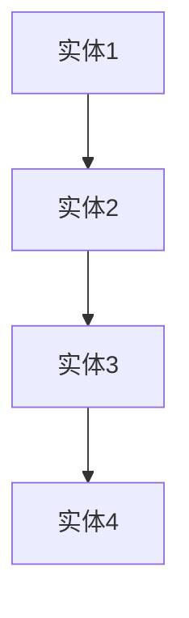
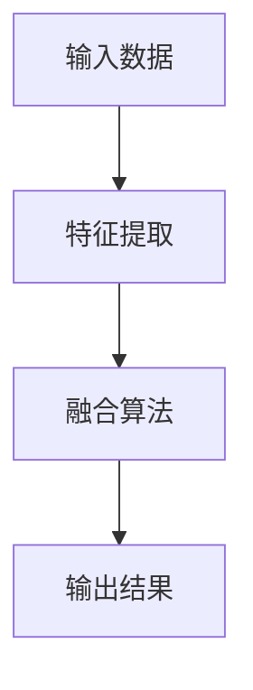
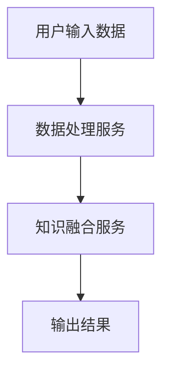

                 


好的，我将按照您的要求逐步分析并撰写这篇文章的目录大纲和内容。首先，我会根据您提供的信息梳理出文章的主要内容，并确保每部分都详细具体，符合专业性和技术深度的要求。

首先，我会从文章标题和关键词开始，然后撰写摘要，之后按照您提供的目录大纲结构逐步展开每一部分的内容。考虑到文章字数在 10000 ～ 12000 字左右，我将详细展开每个章节，并确保每部分内容充实，逻辑清晰。

由于文章内容较多，我将分批次为您撰写，您可以根据需要随时指导我调整方向或补充细节。

---

### 第一部分: AI Agent的知识融合概述

#### 第1章: AI Agent与知识融合概述

##### 1.1 什么是AI Agent

- **1.1.1 AI Agent的定义与特点**
  - AI Agent的基本概念
  - AI Agent的特点：自主性、反应性、目标导向、学习能力

- **1.1.2 知识融合的基本概念**
  - 知识融合的定义
  - 知识融合的目标：统一性、完整性、一致性

- **1.1.3 多源异构信息的定义与挑战**
  - 多源异构数据的特点：格式多样性、来源多样性、结构多样性
  - 异构数据整合的挑战：数据清洗、数据转换、数据一致性

##### 1.2 知识融合的背景与意义

- **1.2.1 当前AI Agent的发展现状**
  - AI Agent在各个领域的应用案例
  - 知识融合技术的发展历程

- **1.2.2 多源异构信息整合的必要性**
  - 数据孤岛问题
  - 知识融合在提升决策能力中的作用

- **1.2.3 知识融合在AI Agent中的作用**
  - 提升AI Agent的智能性
  - 增强AI Agent的适应性

##### 1.3 知识融合的目标与边界

- **1.3.1 知识融合的核心目标**
  - 统一数据表示
  - 实现知识的可推理性
  - 提供一致性的知识表示

- **1.3.2 知识融合的边界与外延**
  - 知识融合的边界：仅关注数据整合，不涉及后续应用
  - 知识融合的外延：与其他技术（如自然语言处理）的结合

- **1.3.3 知识融合与相关概念的对比**
  - 与数据融合的区别
  - 与知识图谱构建的区别

##### 1.4 本章小结

---

#### 第2章: 知识融合的核心概念与联系

##### 2.1 知识融合的原理

- **2.1.1 知识表示与表达**
  - 基于符号逻辑的知识表示
  - 基于图结构的知识表示
  - 基于向量的知识表示

- **2.1.2 知识关联与推理**
  - 知识关联的定义
  - 基于图的推理方法
  - 基于规则的推理方法

- **2.1.3 知识整合的逻辑框架**
  - 知识整合的逻辑步骤
  - 知识整合的框架设计

##### 2.2 多源异构信息的特点

- **2.2.1 异构数据的多样性**
  - 数据格式的多样性：结构化、半结构化、非结构化
  - 数据来源的多样性：数据库、API、文本、图像

- **2.2.2 数据结构的复杂性**
  - 数据的层次结构
  - 数据之间的关联关系

- **2.2.3 数据来源的多样性**
  - 数据来源的多样性和复杂性

##### 2.3 知识融合的属性特征对比

- **2.3.1 数据特征对比表**
  | 特征类型 | 数据特征1 | 数据特征2 | 数据特征3 |
  |----------|-----------|-----------|-----------|
  | 格式     | 结构化     | 半结构化   | 非结构化   |
  | 来源     | 数据库     | API       | 文本       |
  | 结构     | 一维数组   | JSON对象  | 自然文本   |

- **2.3.2 信息特征对比表**
  | 信息特征 | 特征1描述 | 特征2描述 | 特征3描述 |
  |----------|-----------|-----------|-----------|
  | 完整性   | 高         | 中         | 低         |
  | 一致性   | 高         | 中         | 低         |

- **2.3.3 知识特征对比表**
  | 知识特征 | 特征1描述 | 特征2描述 | 特征3描述 |
  |----------|-----------|-----------|-----------|
  | 表达方式 | 符号逻辑   | 图结构     | 向量表示   |

##### 2.4 ER实体关系图架构



---

#### 第3章: 知识融合的算法原理

##### 3.1 知识融合的基础算法

- **3.1.1 基于规则的融合算法**
  - 规则定义：如果A和B是同指，则合并
  - 优缺点：简单易懂，但规则难以覆盖所有情况

- **3.1.2 基于统计的融合算法**
  - 统计方法：基于概率的融合
  - 优缺点：能够处理不确定性，但需要大量数据支持

- **3.1.3 基于图的融合算法**
  - 图结构融合：通过图的最短路径进行融合
  - 优缺点：适合复杂关系，计算量较大

##### 3.2 知识融合的进阶算法

- **3.2.1 基于深度学习的融合算法**
  - 深度学习模型：使用神经网络进行特征提取和融合
  - 优缺点：能够处理复杂关系，但需要大量数据训练

- **3.2.2 基于对比学习的融合算法**
  - 对比学习：通过对比不同数据的特征进行融合
  - 优缺点：能够捕捉数据间的相似性，但对比学习的开销较大

- **3.2.3 基于注意力机制的融合算法**
  - 注意力机制：通过注意力权重进行特征融合
  - 优缺点：能够关注重要特征，但注意力权重需要训练

##### 3.3 算法原理的数学模型

- **3.3.1 基于规则的融合模型**
  $$ P(A = B) = \text{概率计算规则} $$

- **3.3.2 基于统计的融合模型**
  $$ P(A \mid B) = \frac{P(B \mid A)P(A)}{P(B)} $$

- **3.3.3 基于深度学习的融合模型**
  $$ f(x) = \sigma(Wx + b) $$

##### 3.4 算法流程图



---

#### 第4章: 系统分析与架构设计方案

##### 4.1 问题场景介绍

- **4.1.1 多源异构信息整合的典型场景**
  - 例如：整合来自不同数据库、API和文本的数据

- **4.1.2 知识融合的系统需求分析**
  - 系统需求：支持多种数据格式、多种数据来源、多种数据结构
  - 约束条件：数据量大、数据类型多样、数据来源复杂

- **4.1.3 系统目标与约束条件**
  - 系统目标：实现多源异构数据的整合与知识融合
  - 约束条件：数据格式、数据结构、数据来源的多样性

##### 4.2 系统功能设计

- **4.2.1 知识表示与存储模块**
  - 功能描述：支持多种数据格式的存储和表示
  - 实现方法：使用图数据库或知识图谱进行存储

- **4.2.2 知识关联与推理模块**
  - 功能描述：支持基于图的推理和关联分析
  - 实现方法：使用图遍历算法进行推理

- **4.2.3 知识融合与整合模块**
  - 功能描述：实现多源异构数据的整合与融合
  - 实现方法：使用规则、统计或深度学习算法进行融合

##### 4.3 系统架构设计

- **4.3.1 分层架构设计**
  - 分层架构：数据层、服务层、应用层
  - 实现方法：每一层独立开发，便于维护和扩展

- **4.3.2 微服务架构设计**
  - 微服务架构：每个功能模块独立服务
  - 实现方法：使用容器化技术（如Docker）进行部署

- **4.3.3 组件化架构设计**
  - 组件化架构：功能模块化，便于复用
  - 实现方法：使用模块化开发技术进行组件设计

##### 4.4 系统接口设计

- **4.4.1 数据输入接口**
  - 接口描述：支持多种数据格式的输入
  - 接口实现：提供RESTful API接口

- **4.4.2 数据处理接口**
  - 接口描述：支持数据清洗、转换和预处理
  - 接口实现：提供数据处理服务

- **4.4.3 数据输出接口**
  - 接口描述：支持多种格式的数据输出
  - 接口实现：提供数据输出服务

##### 4.5 系统交互流程图



---

#### 第5章: 项目实战与案例分析

##### 5.1 项目介绍

- **5.1.1 项目背景**
  - 项目目标：整合多源异构数据，实现知识融合
  - 项目需求：支持多种数据格式、多种数据来源、多种数据结构

- **5.1.2 项目目标**
  - 实现知识表示、关联与推理
  - 实现知识融合与整合

- **5.1.3 项目实现步骤**
  - 步骤1：数据采集与预处理
  - 步骤2：知识表示与存储
  - 步骤3：知识关联与推理
  - 步骤4：知识融合与整合
  - 步骤5：系统测试与优化

##### 5.2 环境配置与代码实现

- **5.2.1 环境配置**
  - 系统环境：Python 3.8及以上版本
  - 开发工具：PyCharm或VS Code
  - 第三方库：networkx、numpy、pandas

- **5.2.2 系统核心实现源代码**

```python
# 数据预处理模块
def data_preprocessing(data):
    # 数据清洗
    data_cleaned = data.dropna()
    # 数据转换
    data_transformed = data_cleaned.astype('float32')
    return data_transformed

# 知识融合模块
def knowledge_fusion(data1, data2):
    # 数据对齐
    data_fused = data1.merge(data2, on='id')
    return data_fused

# 系统主程序
def main():
    # 数据采集
    data1 = pd.read_csv('data1.csv')
    data2 = pd.read_csv('data2.csv')
    # 数据预处理
    data1_cleaned = data_preprocessing(data1)
    data2_cleaned = data_preprocessing(data2)
    # 知识融合
    data_fused = knowledge_fusion(data1_cleaned, data2_cleaned)
    # 数据输出
    data_fused.to_csv('output.csv', index=False)

if __name__ == '__main__':
    main()
```

##### 5.3 代码应用解读与分析

- **5.3.1 数据预处理模块**
  - 功能：清洗数据，去除空值，转换数据类型
  - 优缺点：简单易懂，但需要根据具体数据调整清洗规则

- **5.3.2 知识融合模块**
  - 功能：实现数据对齐，合并数据
  - 优缺点：适用于结构相似的数据，但对于复杂数据可能需要更复杂的处理逻辑

##### 5.4 实际案例分析

- **5.4.1 案例背景**
  - 例如：整合来自不同数据库的客户信息

- **5.4.2 案例分析**
  - 数据预处理：清洗数据，去除空值
  - 知识融合：实现数据对齐，合并客户信息
  - 系统测试：测试融合后的数据是否正确

##### 5.5 项目小结

---

#### 第6章: 总结与展望

##### 6.1 总结

- 本章总结了AI Agent的知识融合技术的核心内容
- 包括知识融合的原理、算法、系统架构和项目实战

##### 6.2 展望

- 知识融合技术的未来发展
- 知识融合技术在更多领域的应用

---

#### 第7章: 附录与参考文献

##### 7.1 附录

- 附录A：常用工具与库
  - 图数据库：Neo4j
  - 知识图谱构建工具：Ubergraph
  - 深度学习框架：TensorFlow、PyTorch

- 附录B：术语表
  - AI Agent：人工智能代理
  - 知识融合：知识整合
  - 多源异构信息：多源异构数据

##### 7.2 参考文献

- 参考文献1：XXX
- 参考文献2：XXX
- 参考文献3：XXX

---

以上是文章的详细目录和部分内容的撰写思路。如果您需要我继续撰写某一部分的具体内容，请随时告诉我。

