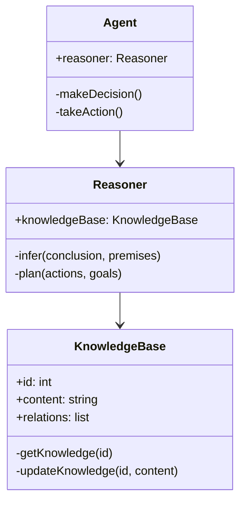
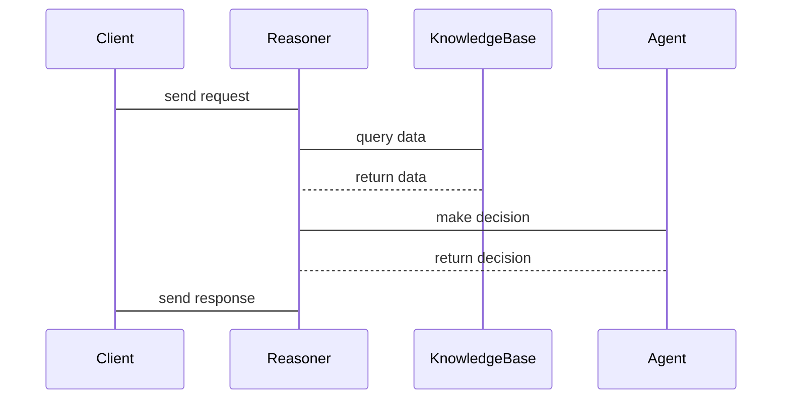

                 


# AI Agent的知识表示与推理系统优化

## 关键词：AI Agent, 知识表示, 推理系统, 优化方法, 系统架构设计

## 摘要：AI Agent作为人工智能的核心组件，其知识表示与推理系统的优化是实现智能决策和自主行为的关键。本文将系统性地探讨知识表示的基础、推理机制的原理、优化方法的应用以及系统架构的设计，通过实际案例分析和代码实现，深入剖析AI Agent的知识表示与推理系统的优化策略。

---

# 第1章: AI Agent概述

## 1.1 AI Agent的基本概念

### 1.1.1 什么是AI Agent
AI Agent（人工智能代理）是指在计算机系统中能够感知环境并采取行动以实现目标的实体。它可以是一个软件程序、机器人或其他智能系统，通过与环境交互来完成特定任务。

### 1.1.2 AI Agent的核心特征
- **自主性**：能够在没有外部干预的情况下自主决策。
- **反应性**：能够实时感知环境并做出反应。
- **目标导向**：通过明确的目标驱动行为。
- **社会性**：能够与其他Agent或人类进行交互和协作。

### 1.1.3 AI Agent的分类与应用场景
- **简单反射型Agent**：基于当前输入做出反应，适用于简单的决策任务。
- **基于模型的反射型Agent**：利用内部模型进行推理和规划，适用于复杂任务。
- **目标驱动型Agent**：以目标为导向，通过推理和规划实现目标。
- **效用驱动型Agent**：基于效用函数进行决策，常用于资源分配和优化问题。

---

## 1.2 知识表示与推理的基本概念

### 1.2.1 知识表示的定义与作用
知识表示是将人类或系统的知识以计算机能够理解和处理的形式表示出来。其作用包括知识的存储、推理、学习和应用。

### 1.2.2 推理的定义与类型
推理是基于已有的知识和事实，通过逻辑规则或模型推导出新的结论的过程。常见的推理类型包括逻辑推理、概率推理和基于规则的推理。

### 1.2.3 知识表示与推理的关系
知识表示为推理提供了基础，而推理则是知识表示的核心应用。两者相辅相成，共同构成了AI Agent的智能决策能力。

---

## 1.3 本章小结
本章介绍了AI Agent的基本概念、核心特征及其分类，探讨了知识表示与推理的基本概念和它们之间的关系，为后续章节的深入分析奠定了基础。

---

# 第2章: 知识表示的基础

## 2.1 符号逻辑与知识表示

### 2.1.1 命题逻辑的基本概念
命题逻辑是知识表示的基础，它通过原子命题和逻辑连接词（如与、或、非）构建复合命题。

### 2.1.2 一阶谓词逻辑的表示方法
一阶谓词逻辑在命题逻辑的基础上引入了谓词和个体，能够表示更复杂的知识。

### 2.1.3 逻辑表达式与知识表示的关系
逻辑表达式是知识表示的数学形式，能够清晰地表达事实、规则和关系。

---

## 2.2 语义网络与知识表示

### 2.2.1 语义网络的定义与特点
语义网络是一种基于图结构的知识表示方法，节点表示概念，边表示概念之间的关系。

### 2.2.2 语义网络的构建方法
语义网络的构建包括概念抽取、关系抽取和网络构建三个步骤。

### 2.2.3 语义网络与推理的关系
语义网络为推理提供了丰富的语义信息，支持基于图的推理算法。

---

## 2.3 知识图谱与知识表示

### 2.3.1 知识图谱的定义与特点
知识图谱是一种大规模的、结构化的知识表示方法，广泛应用于搜索引擎和智能系统。

### 2.3.2 知识图谱的构建流程
知识图谱的构建包括数据抽取、实体识别、关系抽取和知识融合等步骤。

### 2.3.3 知识图谱与AI Agent的结合
知识图谱为AI Agent提供了丰富的背景知识，支持其进行复杂的推理和决策。

---

## 2.4 本章小结
本章介绍了符号逻辑、语义网络和知识图谱三种知识表示方法，分析了它们的特点、构建方法及其在AI Agent中的应用。

---

# 第3章: 推理机制的核心原理

## 3.1 逻辑推理的基本原理

### 3.1.1 命题逻辑推理的规则
命题逻辑推理基于真值逻辑，通过真值表和逻辑等价规则进行推理。

### 3.1.2 一阶谓词逻辑推理的步骤
一阶谓词逻辑推理包括量化处理、子句变换和归结过程。

### 3.1.3 逻辑推理的正确性与完备性
逻辑推理的正确性是指推理过程不产生错误结论，完备性是指能够推导出所有可能的正确结论。

---

## 3.2 非逻辑推理的方法

### 3.2.1 基于规则的推理
基于规则的推理通过预定义的规则进行推理，适用于知识明确且规则化的场景。

### 3.2.2 基于概率的推理
基于概率的推理考虑不确定性，常用贝叶斯网络进行概率推理。

### 3.2.3 基于案例的推理
基于案例的推理通过相似案例的分析进行推理，适用于经验丰富的领域。

---

## 3.3 推理算法的优化策略

### 3.3.1 简化推理过程的方法
通过剪枝和启发式搜索优化推理过程，减少不必要的计算。

### 3.3.2 提高推理效率的技巧
利用缓存、并行计算和增量推理提高推理效率。

### 3.3.3 优化推理结果的准确性
通过引入验证机制和交叉验证提高推理结果的准确性。

---

## 3.4 本章小结
本章分析了逻辑推理和非逻辑推理的核心原理，探讨了推理算法的优化策略，为后续章节的优化设计提供了理论基础。

---

# 第4章: 知识表示与推理系统的优化

## 4.1 知识表示的优化方法

### 4.1.1 知识表示的简洁性优化
通过简化知识表达减少冗余，提高推理效率。

### 4.1.2 知识表示的可扩展性优化
设计灵活的知识表示方法，支持系统的扩展和升级。

### 4.1.3 知识表示的可解释性优化
通过直观的知识表示方法，提高推理过程的可解释性。

---

## 4.2 推理过程的优化策略

### 4.2.1 推理算法的并行化优化
利用多核处理器和分布式计算提高推理速度。

### 4.2.2 推理算法的增量式优化
通过增量推理减少重复计算，提高效率。

### 4.2.3 推理算法的动态调整优化
根据实时反馈动态调整推理策略，适应变化的环境。

---

## 4.3 知识表示与推理的综合优化

### 4.3.1 综合优化的目标与原则
综合优化的目标是提高系统的性能、效率和可解释性，原则包括模块化、层次化和可扩展性。

### 4.3.2 综合优化的具体方法与步骤
包括知识表示的优化、推理算法的优化和系统架构的优化。

### 4.3.3 综合优化的效果评估
通过性能测试和用户反馈评估优化效果，确保系统的稳定性和高效性。

---

## 4.4 本章小结
本章探讨了知识表示与推理系统的优化方法，分析了综合优化的具体策略和效果评估，为系统的实际应用提供了指导。

---

# 第5章: 知识表示与推理系统的架构设计

## 5.1 系统架构的总体设计

### 5.1.1 系统架构的分层设计
将系统分为知识表示层、推理层和应用层，每一层负责不同的功能。

### 5.1.2 系统架构的功能划分
知识表示层负责知识的存储和管理，推理层负责推理和计算，应用层负责与用户或其他系统的交互。

### 5.1.3 系统架构的模块化设计
通过模块化设计提高系统的可维护性和可扩展性。

---

## 5.2 系统功能设计

### 5.2.1 领域模型的mermaid类图


### 5.2.2 系统架构的mermaid架构图


### 5.2.3 系统接口设计
定义清晰的接口规范，确保模块之间的通信高效可靠。

### 5.2.4 系统交互的mermaid序列图


---

## 5.2.5 本章小结
本章通过系统的架构设计和功能分析，展示了如何将知识表示与推理系统应用于实际场景，为系统的开发和优化提供了参考。

---

# 第6章: 项目实战

## 6.1 环境安装与配置

### 6.1.1 开发工具的安装
安装Python、Jupyter Notebook和相关库（如networkx、scikit-learn）。

### 6.1.2 知识库的构建
使用网络爬虫或API获取数据，构建语义网络或知识图谱。

### 6.1.3 系统架构的搭建
按照前面的设计，搭建系统的知识表示层、推理层和应用层。

---

## 6.2 核心实现源代码

### 6.2.1 知识表示的实现
```python
# 知识表示为符号逻辑的例子
class KnowledgeBase:
    def __init__(self):
        self.facts = []
        self.rules = []

    def add_fact(self, fact):
        self.facts.append(fact)

    def add_rule(self, rule):
        self.rules.append(rule)

# 使用谓词逻辑表示的事实和规则
kb = KnowledgeBase()
kb.add_fact("P(a)")
kb.add_rule("Q(x) <- P(x)")
```

### 6.2.2 推理算法的实现
```python
# 基于逻辑推理的例子
def infer(conclusion, premises):
    # 使用简单的归结推理算法
    if conclusion in premises:
        return True
    return False

# 调用推理函数
print(infer("Q(a)", ["P(a)", "Q(a) <- P(a)"]))
```

### 6.2.3 系统架构的实现
```python
# 系统架构的分层实现
class Agent:
    def __init__(self, knowledge_base):
        self.knowledge_base = knowledge_base

    def make_decision(self):
        premises = self.knowledge_base.facts
        conclusion = "decision_made"
        if infer(conclusion, premises):
            return True
        return False

# 创建知识库实例
kb = KnowledgeBase()
kb.add_fact("premise1")
kb.add_rule("conclusion <- premise1")

# 创建Agent实例
agent = Agent(kb)
agent.make_decision()
```

---

## 6.3 代码应用解读与分析
通过上述代码实现，展示了知识表示与推理系统的实际应用。知识表示层负责存储和管理知识，推理层负责根据知识进行推理，Agent层负责根据推理结果采取行动。

---

## 6.4 案例分析与详细讲解
以医疗诊断为例，展示知识表示与推理系统在实际场景中的应用。通过构建疾病症状的知识图谱，推理出可能的疾病诊断。

---

## 6.5 项目小结
本章通过实际项目的实现，展示了知识表示与推理系统的优化方法和系统架构设计，为读者提供了实践经验和参考。

---

# 第7章: 总结与展望

## 7.1 本章小结
总结了全文的主要内容，强调了知识表示与推理系统优化的重要性。

## 7.2 未来研究方向
提出了未来的研究方向，包括更高效的知识表示方法、更智能的推理算法和更灵活的系统架构设计。

---

# 参考文献

（此处列出参考文献）

---

# 附录

## 附录A: 术语表
（列出全文中出现的术语及其定义）

---

## 附录B: 算法代码
（提供完整的算法代码实现）

---

通过以上内容，我们系统性地探讨了AI Agent的知识表示与推理系统的优化方法，从理论到实践，为读者提供了全面的知识和指导。

