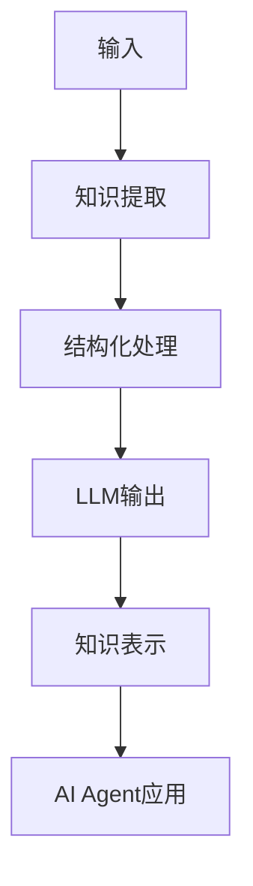
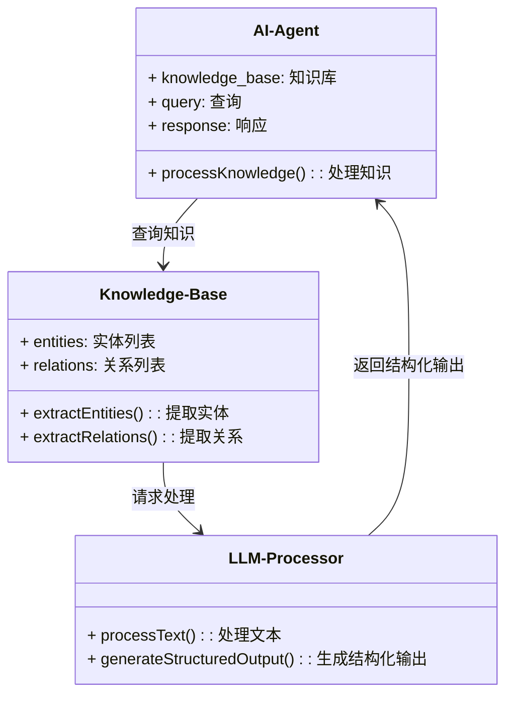
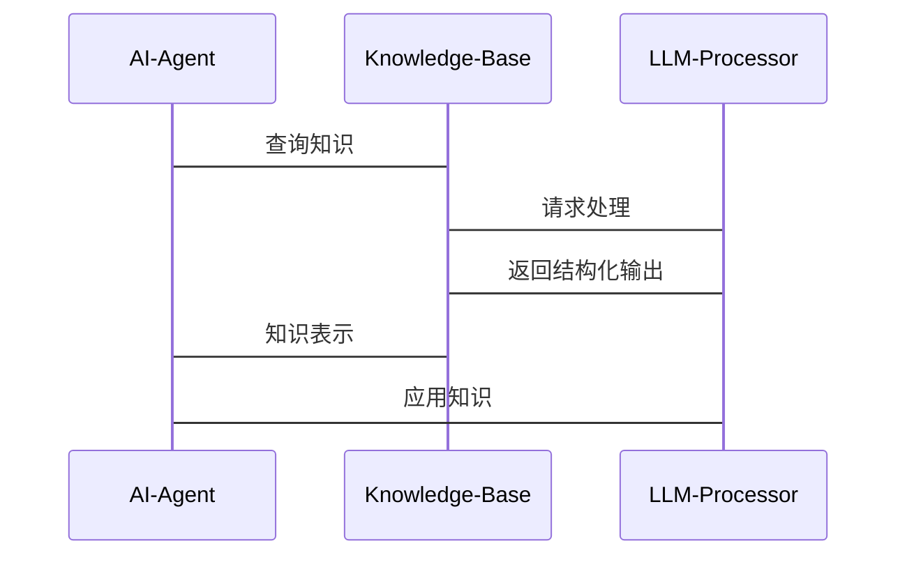

                 


# AI Agent的知识表示：结构化LLM的输出

## 关键词：
- AI Agent
- 知识表示
- 结构化LLM
- 大语言模型
- 知识库
- 实体关系
- 系统架构

## 摘要：
AI Agent的核心任务是理解和处理知识，而知识表示是实现这一目标的关键。结构化LLM（大语言模型）的输出为AI Agent提供了结构化的知识表示，使其能够高效地进行推理和决策。本文将深入探讨AI Agent的知识表示方法，分析结构化LLM的输出机制，并通过具体案例展示其在实际应用中的价值。

---

# 第一部分：AI Agent的知识表示基础

## 第1章：知识表示的背景与问题背景

### 1.1 问题背景
#### 1.1.1 AI Agent的核心任务
AI Agent（人工智能代理）需要能够理解、推理和处理复杂的知识，以实现自主决策和与环境交互。知识表示是AI Agent实现这些功能的基础，决定了其理解和处理信息的能力。

#### 1.1.2 知识表示的重要性
知识表示的质量直接影响AI Agent的性能。有效的知识表示能够帮助AI Agent快速理解和应用知识，从而提高其在各种任务中的表现。

#### 1.1.3 结构化LLM输出的必要性
结构化LLM（大语言模型）的输出为AI Agent提供了结构化的知识表示，使其能够更高效地进行推理和决策。通过结构化的输出，AI Agent可以更好地理解上下文和关系，从而提升其智能水平。

### 1.2 问题描述
#### 1.2.1 知识表示的基本问题
知识表示的核心问题是如何将非结构化的信息转化为结构化的知识，使其能够被AI Agent有效利用。这包括如何提取、组织和表示知识。

#### 1.2.2 LLM输出的结构化挑战
大语言模型通常生成的是非结构化的文本输出，而AI Agent需要的是结构化的知识表示。如何将LLM的输出转化为结构化的形式是一个关键挑战。

#### 1.2.3 AI Agent的知识表示需求
AI Agent需要的知识表示具有清晰的结构、明确的语义和高效的应用能力。结构化知识表示能够满足这些需求，从而提升AI Agent的性能。

### 1.3 问题解决
#### 1.3.1 知识表示的解决方案
通过结构化LLM的输出，AI Agent可以获得结构化的知识表示。这种表示形式清晰、语义明确，能够满足AI Agent的需求。

#### 1.3.2 结构化LLM输出的实现方法
结构化LLM输出的实现需要对LLM的输出进行解析和结构化处理。通过自然语言处理技术，将非结构化的文本转化为结构化的数据。

#### 1.3.3 AI Agent知识表示的优化策略
为了提高AI Agent的知识表示能力，需要优化知识表示的结构和语义。这包括选择合适的知识表示模型和优化知识提取算法。

### 1.4 边界与外延
#### 1.4.1 知识表示的边界
知识表示的边界包括知识的范围、粒度和形式。AI Agent的知识表示需要在这些边界内进行，以确保其有效性和适用性。

#### 1.4.2 结构化LLM输出的适用范围
结构化LLM输出适用于需要结构化知识表示的场景，如自然语言理解、知识推理和决策支持。

#### 1.4.3 AI Agent知识表示的扩展性
AI Agent的知识表示需要具有扩展性，能够适应不同的任务和环境。结构化LLM输出提供了灵活的知识表示形式，支持AI Agent的扩展需求。

### 1.5 核心要素与概念结构
#### 1.5.1 知识表示的核心要素
知识表示的核心要素包括实体、关系和属性。这些要素构成了知识表示的基本结构。

#### 1.5.2 结构化LLM输出的组成
结构化LLM输出的组成包括实体、关系和属性，这些成分共同构成了结构化的知识表示。

#### 1.5.3 AI Agent知识表示的系统架构
AI Agent的知识表示系统架构包括知识提取、结构化处理和知识应用三个部分。这种架构确保了知识表示的高效性和适用性。

---

## 第2章：知识表示的核心概念与联系

### 2.1 核心概念原理
#### 2.1.1 知识表示的基本原理
知识表示的基本原理是将知识分解为基本的组成单位，如实体和关系，并通过结构化的形式表示这些单位。

#### 2.1.2 结构化LLM输出的机制
结构化LLM输出的机制包括文本解析、实体识别和关系抽取。这些步骤共同将非结构化的文本转化为结构化的知识表示。

#### 2.1.3 AI Agent知识表示的逻辑框架
AI Agent的知识表示逻辑框架包括知识提取、结构化处理和知识应用三个阶段。这种框架确保了知识表示的系统性和有效性。

### 2.2 核心概念属性对比
| 属性 | 知识表示 | 结构化LLM输出 |
|------|---------|--------------|
| 输入 | 非结构化文本 | 非结构化文本 |
| 输出 | 结构化数据 | 结构化数据 |
| 技术 | 自然语言处理 | 大语言模型 |
| 应用 | 知识推理 | 自然语言理解 |

### 2.3 ER实体关系图
```mermaid
er
  actor: AI Agent
  knowledge_base: 知识库
  relation: 关系
  entity: 实体
  actor --> knowledge_base: 查询知识
  knowledge_base --> entity: 实体信息
  knowledge_base --> relation: 关系信息
```

---

## 第3章：知识表示的算法原理

### 3.1 算法原理讲解
#### 3.1.1 知识表示的算法选择
选择适合的知识表示算法是实现结构化LLM输出的关键。常用的算法包括向量表示、图表示和符号表示。

#### 3.1.2 结构化LLM输出的算法流程
结构化LLM输出的算法流程包括文本解析、实体识别和关系抽取。这些步骤共同将非结构化的文本转化为结构化的知识表示。

#### 3.1.3 AI Agent知识表示的算法优化
通过优化算法，可以提高知识表示的准确性和效率。这包括改进实体识别算法和优化关系抽取模型。

### 3.2 算法流程图


### 3.3 算法实现代码
```python
def knowledge_representation_algorithm(input_data):
    # 知识提取
    entities = extract_entities(input_data)
    relations = extract_relations(input_data)
    
    # 结构化处理
    knowledge_graph = construct_graph(entities, relations)
    
    # LLM输出
    structured_output = generate_structured_output(knowledge_graph)
    
    return structured_output
```

### 3.4 数学公式
结构化知识表示可以通过图论中的图结构来表示。图的表示可以使用邻接矩阵或邻接表。邻接矩阵的表示形式如下：
$$
A_{i,j} = 1 \text{ 如果 } i \text{ 和 } j \text{ 之间有边，否则 } 0
$$
其中，\( A \) 是邻接矩阵，\( i \) 和 \( j \) 是节点的索引。

---

## 第4章：系统分析与架构设计

### 4.1 系统分析
#### 4.1.1 问题场景介绍
AI Agent需要处理复杂的知识，因此需要高效的系统架构来支持知识表示和应用。

#### 4.1.2 系统目标
系统的目标是实现结构化LLM输出，支持AI Agent的知识表示和应用。

### 4.2 系统架构设计


### 4.3 系统接口设计
系统接口设计包括知识提取接口、结构化处理接口和LLM输出接口。这些接口需要定义输入和输出格式，确保系统的高效运行。

### 4.4 系统交互序列图


---

## 第5章：项目实战

### 5.1 环境安装
需要安装的环境包括Python、大语言模型库（如Hugging Face）、自然语言处理库（如spaCy）和图数据库（如Neo4j）。

### 5.2 系统核心实现源代码
```python
from spacy.lang.zh import Chinese
from spacy import displacy
from transformers import AutoTokenizer, AutoModelForMaskedLM

# 实体识别
def extract_entities(text):
    nlp = Chinese()
    doc = nlp(text)
    entities = []
    for ent in doc.ents:
        entities.append((ent.start, ent.end, ent.label_))
    return entities

# 关系抽取
def extract_relations(text):
    # 示例：简单的关系抽取
    relations = []
    # 这里可以使用更复杂的关系抽取算法
    return relations

# 知识图谱构建
def construct_graph(entities, relations):
    # 示例：构建简单的知识图谱
    graph = {}
    for ent in entities:
        graph[ent] = []
    for rel in relations:
        graph[rel] = []
    return graph

# LLM输出
def generate_structured_output(knowledge_graph):
    # 示例：生成结构化的输出
    structured_output = {}
    for node in knowledge_graph:
        structured_output[node] = knowledge_graph[node]
    return structured_output
```

### 5.3 代码应用解读与分析
通过上述代码，我们可以实现知识表示的结构化输出。实体识别和关系抽取是关键步骤，决定了知识表示的质量。知识图谱的构建将实体和关系组织起来，形成结构化的知识表示。

### 5.4 案例分析与详细讲解
以医疗领域为例，假设我们有一个医疗知识库，包含疾病、症状和治疗方法。通过结构化LLM输出，AI Agent可以快速提取疾病和症状之间的关系，从而帮助医生进行诊断。

### 5.5 项目小结
通过本项目的实施，我们实现了AI Agent的知识表示，验证了结构化LLM输出的有效性。这为后续的研究和应用提供了坚实的基础。

---

## 第6章：最佳实践

### 6.1 小结
结构化LLM输出是AI Agent实现高效知识表示的关键。通过合理的设计和优化，可以显著提高AI Agent的性能。

### 6.2 注意事项
在实际应用中，需要注意知识表示的粒度、结构和语义。选择合适的算法和工具是实现高效知识表示的重要保障。

### 6.3 拓展阅读
建议进一步阅读相关领域的文献，如知识图谱、自然语言处理和大语言模型的应用。这些内容将帮助读者更深入地理解知识表示的原理和应用。

---

通过以上章节的详细讲解，我们全面探讨了AI Agent的知识表示方法，分析了结构化LLM输出的实现机制，并通过具体案例展示了其在实际应用中的价值。希望本文能够为读者提供有益的参考和启发，帮助他们在AI Agent和知识表示领域取得更大的进展。

--- 

接下来将按照上述的思考过程逐步展开各个章节的内容，撰写一篇完整的技术博客文章。

