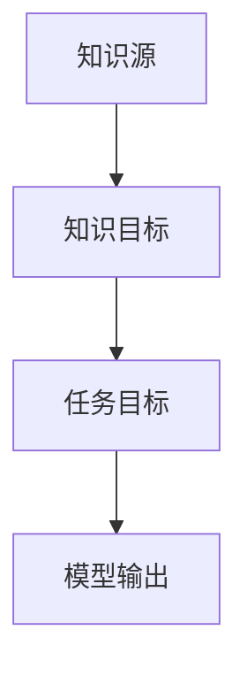
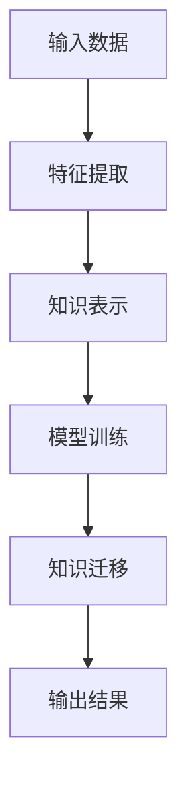
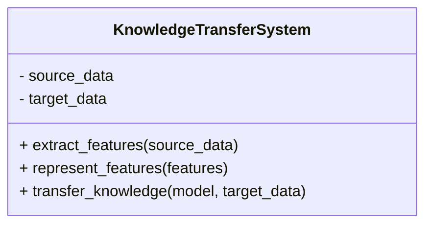
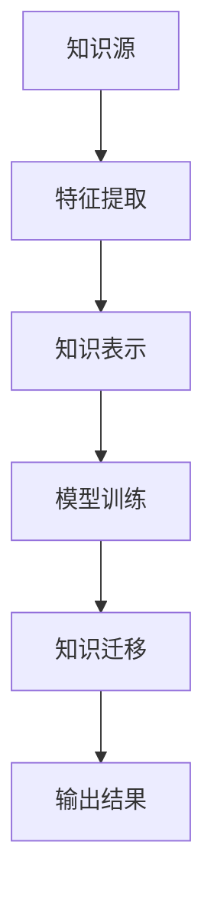
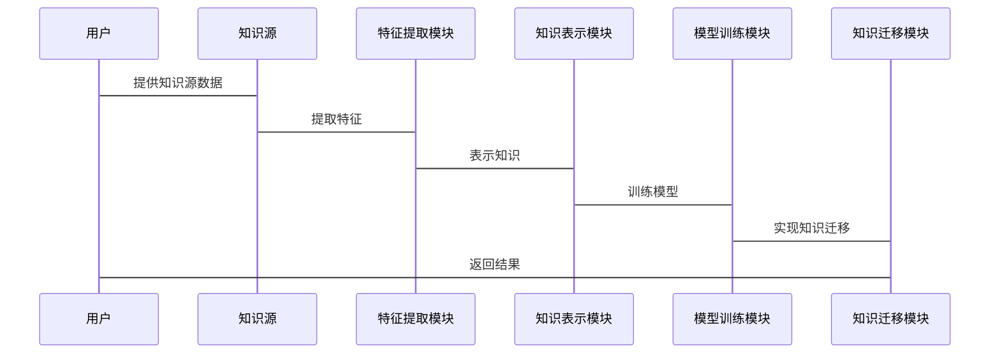

                 


# AI Agent的知识迁移：跨领域应用LLM的能力

> 关键词：AI Agent，知识迁移，大型语言模型，跨领域应用，LLM能力

> 摘要：本文深入探讨AI Agent在跨领域应用中的知识迁移能力，重点分析大型语言模型（LLM）如何在不同领域之间实现知识的高效迁移。通过系统化的分析和实践案例，揭示知识迁移的核心原理、算法实现、系统架构以及实际应用场景，为AI Agent的跨领域应用提供理论支持和实践指导。

---

## 第一部分: AI Agent与知识迁移的背景与基础

### 第1章: AI Agent与知识迁移概述

#### 1.1 AI Agent的基本概念

- **1.1.1 AI Agent的定义与特点**
  - AI Agent（人工智能代理）是指能够感知环境、采取行动以实现目标的智能实体。
  - 具有自主性、反应性、主动性、社会性和知识性的特点。
  - AI Agent可以是软件程序、机器人或其他智能系统。

- **1.1.2 知识迁移的核心概念**
  - 知识迁移是指将某个领域的知识或经验应用到另一个领域的过程。
  - 在AI Agent中，知识迁移的核心目标是让模型在不同领域之间共享和复用知识。

- **1.1.3 AI Agent在跨领域应用中的重要性**
  - 跨领域应用是AI Agent的核心应用场景之一。
  - 知识迁移能力是实现跨领域应用的关键技术。

#### 1.2 大型语言模型（LLM）的基本原理

- **1.2.1 LLM的定义与技术特点**
  - 大型语言模型是指基于深度学习训练的大型神经网络模型，能够处理自然语言文本。
  - 具有强大的语义理解、生成和推理能力。
  - 例如：GPT系列模型、BERT系列模型等。

- **1.2.2 LLM在知识迁移中的优势**
  - LLM通过预训练掌握了大量通用知识，能够快速适应新领域。
  - 知识迁移能力强，适合跨领域应用。

- **1.2.3 LLM与传统AI的区别**
  - 传统AI依赖于特定领域的规则和数据，知识迁移能力较弱。
  - LLM通过预训练和微调，能够实现跨领域知识迁移。

#### 1.3 知识迁移的背景与挑战

- **1.3.1 知识迁移的背景介绍**
  - 随着AI技术的发展，跨领域应用需求日益增长。
  - 知识迁移技术成为实现跨领域应用的核心技术。

- **1.3.2 知识迁移的核心问题**
  - 如何在不同领域之间共享和复用知识。
  - 如何克服领域差异带来的知识障碍。

- **1.3.3 知识迁移的边界与外延**
  - 知识迁移的边界在于不同领域的相似性和可迁移性。
  - 知识迁移的外延包括跨领域应用的多个方面。

#### 1.4 本章小结

- 本章介绍了AI Agent和知识迁移的基本概念，分析了大型语言模型在知识迁移中的优势，指出了知识迁移的核心问题和边界。

---

## 第二部分: 知识迁移的核心概念与联系

### 第2章: 知识迁移的核心原理

#### 2.1 知识迁移的原理与机制

- **2.1.1 知识迁移的基本原理**
  - 知识迁移是通过共享知识源和知识目标之间的共同特征，实现跨领域应用。
  - 通过特征提取和知识表示，建立领域之间的联系。

- **2.1.2 知识迁移的实现过程**
  - 从知识源中提取特征。
  - 将知识目标与知识源建立关联。
  - 通过模型训练实现知识迁移。

- **2.1.3 知识迁移的关键因素**
  - 领域相似性。
  - 数据特征的可迁移性。
  - 模型的迁移能力。

#### 2.2 知识迁移的核心要素

- **2.2.1 数据特征与任务差异**
  - 数据特征是知识迁移的基础。
  - 任务差异是知识迁移的核心挑战。

- **2.2.2 知识表示与编码方法**
  - 知识表示是知识迁移的关键。
  - 编码方法是实现知识迁移的核心技术。

- **2.2.3 知识迁移的评估指标**
  - 知识迁移的效果可以通过准确率、召回率等指标评估。
  - 领域适应性是评估知识迁移的重要指标。

#### 2.3 知识迁移的ER实体关系图



#### 2.4 本章小结

- 本章分析了知识迁移的核心原理和关键要素，通过ER实体关系图展示了知识迁移的基本结构。

---

## 第三部分: 知识迁移的算法原理与实现

### 第3章: 知识迁移的算法原理

#### 3.1 知识迁移的算法框架

- **3.1.1 迁移学习的基本框架**
  - 迁移学习是一种通过共享知识源和知识目标之间的共同特征，实现跨领域应用的技术。
  - 迁移学习的框架包括特征提取、知识表示和模型训练三个阶段。

- **3.1.2 知识迁移的算法流程**
  - 从知识源中提取特征。
  - 将知识目标与知识源建立关联。
  - 通过模型训练实现知识迁移。

- **3.1.3 算法的输入与输出**
  - 输入：知识源和知识目标的数据。
  - 输出：能够实现跨领域应用的AI Agent。

#### 3.2 知识迁移的核心算法

- **3.2.1 基于特征的迁移学习**
  - 通过提取特征实现知识迁移。
  - 特征提取是基于数据特征的提取方法。

- **3.2.2 基于模型的迁移学习**
  - 通过模型的迁移实现知识迁移。
  - 模型迁移是基于模型参数的迁移方法。

- **3.2.3 基于分布的迁移学习**
  - 通过分布的匹配实现知识迁移。
  - 分布匹配是基于数据分布的匹配方法。

#### 3.3 知识迁移的算法实现

- **3.3.1 算法流程图**



- **3.3.2 Python代码实现示例**

```python
def knowledge_transfer(source_data, target_data):
    # 特征提取
    features = extract_features(source_data)
    # 知识表示
    knowledge_representation = represent_features(features)
    # 模型训练
    model = train_model(knowledge_representation)
    # 知识迁移
    transferred_knowledge = transfer_knowledge(model, target_data)
    return transferred_knowledge
```

- **3.3.3 算法的数学模型与公式**

$$ \text{迁移学习的目标是通过特征提取和知识表示，实现跨领域应用} $$

$$ \text{特征提取的目标是提取数据的特征，表示为} x_i $$

$$ \text{知识表示的目标是将特征表示为} y_i $$

$$ \text{模型训练的目标是通过优化目标函数，实现知识迁移} $$

---

## 第四部分: 知识迁移的系统分析与架构设计

### 第4章: 知识迁移的系统分析与架构设计

#### 4.1 知识迁移的系统分析

- **4.1.1 问题场景介绍**
  - 知识迁移的应用场景包括跨领域应用、多任务学习等。
  - 知识迁移的核心问题是如何在不同领域之间共享知识。

- **4.1.2 系统功能设计**
  - 知识提取功能：提取数据的特征。
  - 知识表示功能：将特征表示为知识。
  - 知识迁移功能：实现跨领域应用。

- **4.1.3 系统功能设计的类图**



#### 4.2 知识迁移的系统架构设计

- **4.2.1 系统架构图**



- **4.2.2 系统接口设计**
  - 输入接口：知识源和知识目标的数据。
  - 输出接口：能够实现跨领域应用的AI Agent。

- **4.2.3 系统交互设计**



#### 4.3 本章小结

- 本章分析了知识迁移的系统架构设计，通过类图和序列图展示了系统的功能模块和交互流程。

---

## 第五部分: 知识迁移的项目实战

### 第5章: 知识迁移的项目实战

#### 5.1 项目环境与安装

- **5.1.1 环境要求**
  - Python 3.8+
  - 熟悉深度学习框架（如TensorFlow、PyTorch）

- **5.1.2 安装依赖**
  - 安装所需的深度学习库和自然语言处理库。

#### 5.2 系统核心实现

- **5.2.1 知识提取模块**

```python
def extract_features(data):
    # 实现特征提取的代码
    return features
```

- **5.2.2 知识表示模块**

```python
def represent_features(features):
    # 实现知识表示的代码
    return knowledge_representation
```

- **5.2.3 知识迁移模块**

```python
def transfer_knowledge(model, target_data):
    # 实现知识迁移的代码
    return transferred_knowledge
```

#### 5.3 项目小结

- 本章通过一个具体的项目实战，展示了知识迁移的实现过程，包括环境安装、代码实现和案例分析。

---

## 第六部分: 知识迁移的最佳实践与总结

### 第6章: 知识迁移的最佳实践

#### 6.1 最佳实践

- **6.1.1 知识迁移的关键点**
  - 领域相似性。
  - 数据特征的可迁移性。
  - 模型的迁移能力。

- **6.1.2 知识迁移的注意事项**
  - 避免领域差异过大。
  - 确保数据质量。
  - 选择合适的迁移学习方法。

#### 6.2 小结

- 本章总结了知识迁移的核心内容，提出了知识迁移的最佳实践。

#### 6.3 注意事项

- 知识迁移的实现需要结合具体应用场景。
- 领域差异是知识迁移的核心挑战。
- 数据质量和模型选择是知识迁移的关键因素。

#### 6.4 拓展阅读

- 推荐阅读相关领域的最新论文和书籍，深入理解知识迁移的核心原理和技术细节。

---

## 总结

本文系统地探讨了AI Agent在跨领域应用中的知识迁移能力，从基本概念、核心原理到算法实现、系统设计和项目实战，全面分析了知识迁移的核心内容。通过具体的案例分析和代码实现，展示了知识迁移的实际应用价值。希望本文能够为AI Agent的跨领域应用提供理论支持和实践指导。

