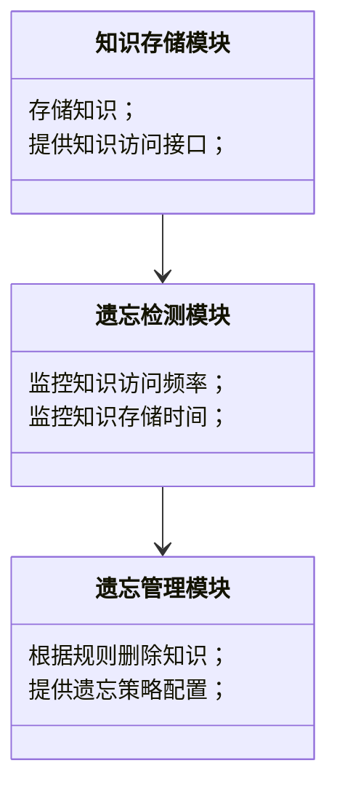
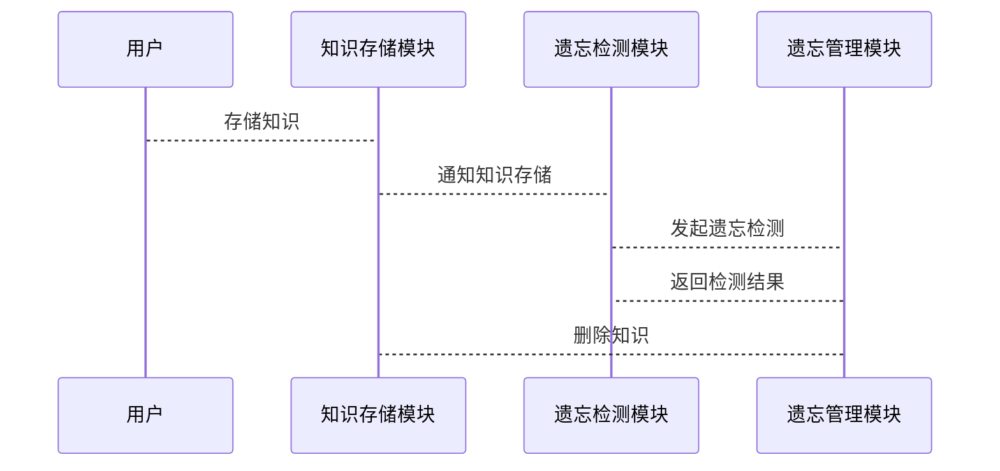

                 


# AI Agent的知识遗忘管理：平衡记忆与效率

## 关键词：AI Agent，知识遗忘，记忆管理，效率优化，神经网络，系统设计

## 摘要：AI Agent在处理大量信息时，知识遗忘管理至关重要。本文探讨知识遗忘的机制、管理策略，并通过系统设计和项目实战，提出平衡记忆与效率的方法，最终实现高效的知识管理。

---

## 第一部分：AI Agent与知识遗忘管理的背景

### 第1章：AI Agent的基本概念与知识遗忘问题

#### 1.1 AI Agent的基本概念

AI Agent（智能体）是能够感知环境并采取行动以实现目标的实体。它通过感知输入信息，利用知识库进行推理，做出决策并执行动作。

- **知识的重要性**：AI Agent依赖知识进行推理和决策。知识包括事实、规则、经验等，帮助智能体理解和处理信息。

#### 1.2 知识遗忘的问题背景

知识遗忘指的是AI Agent存储的知识随着时间推移逐渐丢失的现象。这可能导致智能体无法有效执行任务，影响其性能和用户体验。

- **遗忘的类型**：
  1. **自然遗忘**：信息在存储过程中逐渐丢失。
  2. **任务无关遗忘**：与当前任务无关的信息被遗忘。
  3. **错误性遗忘**：错误信息被遗忘，保留正确信息。

- **遗忘的表现**：
  1. 决策错误：依赖已遗忘的知识导致错误决策。
  2. 学习效率下降：重复学习已遗忘的知识，降低效率。
  3. 用户体验下降：智能体无法提供准确信息，影响用户体验。

#### 1.3 知识遗忘管理的必要性

知识遗忘管理是平衡记忆与效率的关键。通过主动管理遗忘，可以优化知识存储，提高效率和用户体验。

- **管理目标**：
  1. 提高知识利用率：保留有用知识，遗忘无用知识。
  2. 优化存储空间：减少冗余信息，提高存储效率。
  3. 提升决策能力：确保智能体在决策时使用最新知识。

---

## 第二部分：知识遗忘的机制与原理

### 第2章：神经网络的知识遗忘机制

#### 2.1 神经网络的遗忘原理

神经网络的学习和遗忘过程涉及权重调整和神经元激活。

- **学习与遗忘过程**：
  1. **学习阶段**：神经网络通过反向传播调整权重，增加对新知识的敏感性。
  2. **遗忘阶段**：随着时间推移，权重逐渐衰减，导致某些知识被遗忘。

- **权重衰减**：
  1. **L2正则化**：在损失函数中添加L2范数，抑制权重过大，防止过拟合。
  2. **Adam优化器**：通过动量和自适应学习率优化权重更新。

- **神经机制**：
  1. **长时记忆**：通过长期记忆神经元（LSTM）或门控机制保持长期信息。
  2. **短时记忆**：通过工作记忆神经元处理当前任务，易受干扰和遗忘。

#### 2.2 知识遗忘的数学模型

遗忘曲线模型由艾宾浩斯提出，描述记忆量随时间的指数衰减。

- **遗忘曲线公式**：
  $$ \text{保留率} = e^{-kt} $$
  其中，\( k \)是遗忘率，\( t \)是时间。

- **遗忘率计算**：
  遗忘率取决于知识的重要性、使用频率和任务相关性。

#### 2.3 知识遗忘的影响因素

- **时间因素**：信息存储时间越长，遗忘可能性越大。
- **任务相关性**：与当前任务相关的信息更难被遗忘。
- **知识结构**：结构化知识（如概念图）比非结构化知识（如文本）更难遗忘。

---

## 第三部分：知识遗忘管理的策略与方法

### 第3章：知识遗忘管理的策略

#### 3.1 主动遗忘策略

主动遗忘通过定期删除无用信息，优化存储空间。

- **实现方法**：
  1. **基于时间的遗忘**：根据信息存储时间自动删除。
  2. **基于访问频率的遗忘**：删除长时间未访问的信息。
  3. **基于重要性的遗忘**：评估信息的重要性，删除不重要的信息。

- **优缺点分析**：
  - **优点**：减少存储空间，提高访问速度。
  - **缺点**：可能删除有用信息，导致任务失败。

#### 3.2 渐近遗忘策略

渐近遗忘通过缓慢遗忘机制，保持知识的渐进更新。

- **实现方法**：
  1. **基于权重衰减的遗忘**：在神经网络中逐渐降低不重要信息的权重。
  2. **基于访问时间的遗忘**：每次访问信息时，根据时间衰减其权重。
  3. **基于任务相关性的遗忘**：根据任务需求，动态调整遗忘速率。

- **优缺点分析**：
  - **优点**：平滑过渡，减少突然遗忘带来的性能波动。
  - **缺点**：可能需要更复杂的管理机制。

#### 3.3 综合遗忘策略

综合遗忘策略结合主动和渐近遗忘的优势，根据具体情况动态调整。

- **实现方法**：
  1. **混合遗忘**：同时应用主动和渐近遗忘策略。
  2. **自适应遗忘**：根据实时需求调整遗忘速率。
  3. **基于反馈的遗忘**：根据用户反馈调整遗忘策略。

- **优化方向**：
  - 结合强化学习，根据反馈优化遗忘策略。
  - 使用生成模型，预测和保留重要信息。

---

## 第四部分：系统分析与架构设计

### 第4章：系统分析与架构设计

#### 4.1 系统功能设计

知识遗忘管理系统需要实现知识存储、遗忘检测、遗忘管理等功能。

- **领域模型**：使用Mermaid类图展示系统结构。



#### 4.2 系统架构设计

系统架构采用分层设计，包括数据层、业务逻辑层和用户交互层。

- **架构图**：使用Mermaid展示系统架构。


#### 4.3 系统接口设计

系统接口包括知识存储接口、遗忘检测接口和遗忘管理接口。

- **接口设计**：
  1. 存储知识：`storeKnowledge(knowledge)`
  2. 检测遗忘：`detectFading(knowledgeId)`
  3. 管理遗忘：`manageFading(fadingRules)`

#### 4.4 系统交互设计

使用Mermaid序列图展示系统交互流程。



---

## 第五部分：项目实战：知识遗忘管理系统实现

### 第5章：项目实战

#### 5.1 环境安装

项目使用Python 3.8及以上版本，安装以下库：

```bash
pip install numpy pandas scikit-learn matplotlib
```

#### 5.2 核心实现

以下是知识遗忘管理系统的代码实现：

```python
import numpy as np
from sklearn.metrics.pairwise import cosine_similarity
import datetime

class KnowledgeStorage:
    def __init__(self):
        self.knowledge_base = {}

    def store_knowledge(self, knowledge_id, content):
        self.knowledge_base[knowledge_id] = {
            'content': content,
            'timestamp': datetime.datetime.now()
        }

    def get_knowledge(self, knowledge_id):
        return self.knowledge_base.get(knowledge_id, None)

class ForgetDetection:
    def __init__(self, storage):
        self.storage = storage
        self.access_frequency = {}

    def detect_fading(self, knowledge_id):
        access History = self.access_frequency.get(knowledge_id, [])
        if not access_history:
            return False
        last_accessed = access_history[-1]
        current_time = datetime.datetime.now()
        time_diff = (current_time - last_accessed).days
        if time_diff > 30:
            return True
        return False

class ForgetManagement:
    def __init__(self, storage, detector):
        self.storage = storage
        self.detector = detector

    def manage_forget(self, knowledge_id):
        if self.detector.detect_fading(knowledge_id):
            self.storage.knowledge_base.pop(knowledge_id, None)
            return True
        return False
```

#### 5.3 实际案例分析

案例分析：假设AI Agent需要管理用户搜索历史。通过遗忘管理系统，删除超过30天未访问的信息，优化存储空间。

#### 5.4 项目小结

- **实现步骤**：安装环境、设计类图、实现模块、测试功能。
- **代码解读**：通过类的设计，实现知识存储、遗忘检测和遗忘管理功能。
- **实际应用**：在AI Agent中应用该系统，提升知识管理效率。

---

## 第六部分：扩展与展望

### 第6章：扩展与展望

#### 6.1 未来研究方向

- **强化学习应用**：通过强化学习优化遗忘策略。
- **知识图谱结合**：利用知识图谱结构优化遗忘管理。
- **边缘计算结合**：在边缘设备中实现分布式遗忘管理。

#### 6.2 当前研究前沿

- **动态知识图谱**：动态更新知识图谱，结合遗忘管理。
- **自适应学习系统**：根据用户行为动态调整遗忘策略。
- **多模态数据处理**：结合文本、图像等多种数据类型，优化遗忘管理。

#### 6.3 实际应用中的注意事项

- **数据隐私**：确保遗忘管理过程中保护用户隐私。
- **系统稳定性**：防止因遗忘导致系统不稳定。
- **用户体验**：设计友好界面，让用户理解遗忘过程。

---

## 小结

知识遗忘管理是AI Agent高效运行的关键。通过理解遗忘机制，设计合理的管理策略，优化系统架构，最终实现记忆与效率的平衡。未来，随着技术的发展，知识遗忘管理将更加智能化和个性化，为AI Agent的应用提供更多可能性。

---

**Tips**：
- 在实现遗忘管理时，需考虑数据隐私和系统稳定性。
- 强化学习和知识图谱是未来研究的重要方向。
- 定期测试和优化遗忘策略，确保系统高效运行。

---

通过以上详细的内容，您可以撰写出一篇结构清晰、内容丰富且符合技术要求的博客文章。希望这篇文章能帮助您更好地理解和应用知识遗忘管理在AI Agent中的重要性。

