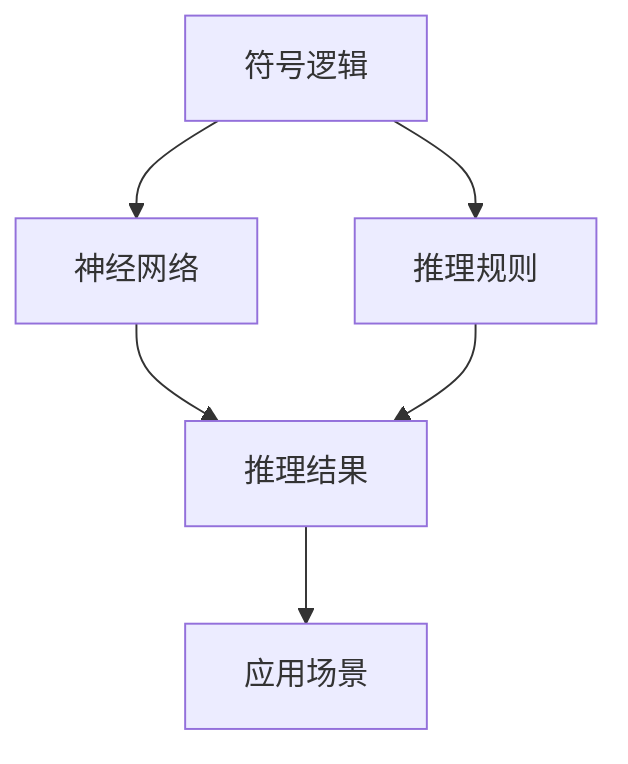
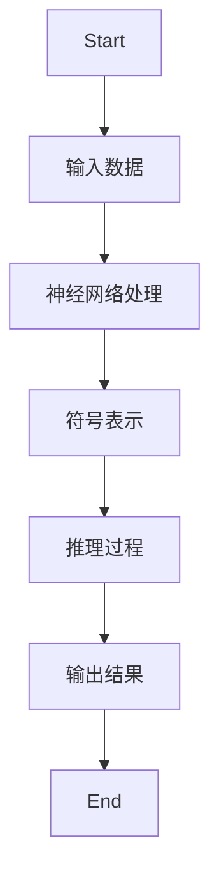
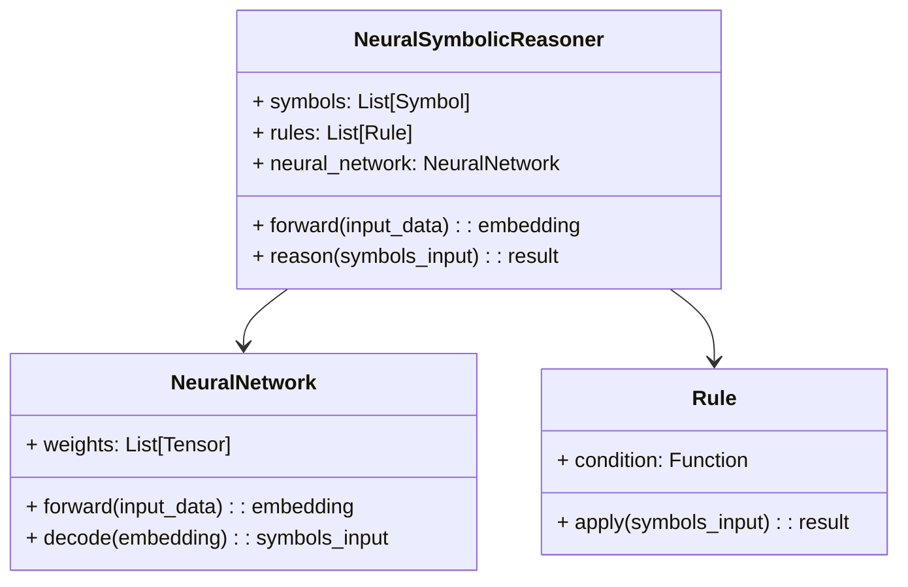

                 


# AI Agent的神经-符号混合推理系统

> 关键词：AI Agent，神经符号推理，混合推理系统，符号逻辑，神经网络

> 摘要：本文深入探讨了AI Agent的神经-符号混合推理系统，从概念、算法到系统设计与项目实战，全面解析了神经符号推理的核心原理及其在实际应用中的优势。文章结合理论与实践，详细介绍了神经符号推理的算法流程、系统架构设计以及项目实现的全过程，为读者提供了全面的指导。

---

## 第一部分: AI Agent的神经-符号混合推理系统概述

### 第1章: 背景介绍

#### 1.1 问题背景
神经符号推理（Neural-Symbolic Reasoning）是人工智能领域的重要研究方向，旨在结合神经网络的强大表征能力和符号推理的逻辑推理能力，解决复杂场景下的推理问题。传统的神经网络在处理图像识别、自然语言处理等任务中表现出色，但难以直接进行逻辑推理；而传统的符号推理系统虽然具备逻辑推理能力，却缺乏对复杂数据的感知和处理能力。神经符号推理的提出，正是为了弥补这一短板。

#### 1.2 问题描述
神经符号推理的核心问题在于如何将符号逻辑与神经网络有效结合，使其能够在复杂场景下进行推理和决策。具体来说，神经符号推理需要解决以下问题：
- 如何将符号逻辑嵌入到神经网络中，使其能够直接处理符号推理任务。
- 如何设计高效的推理算法，使得神经符号推理系统能够在实际应用中快速响应。
- 如何处理符号推理中的不确定性，提升系统的鲁棒性。

#### 1.3 神经符号推理的边界与外延
神经符号推理的边界主要集中在以下几个方面：
- 神经符号推理仅适用于需要结合感知和逻辑推理的任务。
- 神经符号推理的性能受限于神经网络的计算能力和符号推理的复杂性。
- 神经符号推理目前主要应用于特定领域，如医疗诊断、金融分析等。

---

### 第2章: 核心概念与联系

#### 2.1 神经符号推理的核心原理
神经符号推理通过将符号逻辑嵌入到神经网络中，实现了感知与推理能力的结合。其核心原理包括以下几个方面：
- **符号表示**：符号逻辑通过符号表示数据和关系，如逻辑命题、规则等。
- **神经网络表示**：神经网络通过深度学习提取数据的特征表示。
- **推理机制**：通过符号逻辑指导神经网络的推理过程，实现端到端的推理任务。

#### 2.2 神经符号推理的核心概念对比
以下是神经符号推理与传统符号推理、强化学习的关键对比：

| 对比维度       | 神经符号推理                | 传统符号推理          | 强化学习             |
|----------------|---------------------------|-----------------------|----------------------|
| 核心能力       | 结合感知与逻辑推理         | 逻辑推理              | 基于奖励的决策       |
| 数据输入       | 结构化或非结构化数据       | 结构化数据             | 环境交互             |
| 推理方式       | 神经网络驱动符号推理       | 符号规则驱动推理       | 基于经验的试错        |
| 优势           | 能够处理复杂数据           | 逻辑清晰，但难以处理复杂数据 | 能够处理动态环境，但推理能力有限 |

#### 2.3 实体关系图
以下是神经符号推理的实体关系图：



---

### 第3章: 算法原理讲解

#### 3.1 神经符号推理算法流程
神经符号推理的基本流程如下：



#### 3.2 算法实现
以下是神经符号推理算法的核心代码实现：

```python
import numpy as np

class NeuralSymbolicReasoner:
    def __init__(self, symbols, rules):
        self.symbols = symbols
        self.rules = rules
        self.neural_network = NeuralNetwork()

    def forward(self, input_data):
        # 神经网络处理输入数据
        embedding = self.neural_network.forward(input_data)
        # 符号推理过程
        symbols_input = self.neural_network.decode(embedding)
        result = self.reason(symbols_input)
        return result

    def reason(self, symbols_input):
        # 符号推理规则应用
        for rule in self.rules:
            if rule.condition(symbols_input):
                return rule.apply(symbols_input)
        return None

class NeuralNetwork:
    def __init__(self):
        # 初始化神经网络参数

    def forward(self, input_data):
        # 神经网络前向传播
        return embedding

    def decode(self, embedding):
        # 将嵌入解码为符号表示
        return symbols_input
```

#### 3.3 神经符号推理的数学模型
神经符号推理的数学模型如下：

$$
\text{推理结果} = \text{神经网络}(\text{输入数据}) \ast \text{符号规则}
$$

其中，$\text{神经网络}(\text{输入数据})$ 表示神经网络对输入数据的特征提取，$\text{符号规则}$ 表示符号推理的规则集合。

---

### 第4章: 系统分析与架构设计方案

#### 4.1 问题场景介绍
神经符号推理系统主要应用于需要结合感知和逻辑推理的场景，如医疗诊断、金融分析等。

#### 4.2 系统功能设计
以下是神经符号推理系统的功能模块：



#### 4.3 系统架构设计
以下是神经符号推理系统的架构图：

```mermaid
graph LR
    Client --> API Gateway
    API Gateway --> NeuralSymbolicReasoner
    NeuralSymbolicReasoner --> NeuralNetwork
    NeuralSymbolicReasoner --> RuleEngine
    RuleEngine --> Database
```

---

### 第5章: 项目实战

#### 5.1 环境安装与配置
神经符号推理系统的开发环境如下：
- Python 3.8+
- PyTorch 1.9+
- Transformers 4.12+

安装依赖：
```bash
pip install torch transformers
```

#### 5.2 核心代码实现
以下是神经符号推理系统的实现代码：

```python
import torch
from torch import nn

class NeuralNetwork(nn.Module):
    def __init__(self, input_dim, hidden_dim, output_dim):
        super(NeuralNetwork, self).__init__()
        self.fc1 = nn.Linear(input_dim, hidden_dim)
        self.fc2 = nn.Linear(hidden_dim, output_dim)
    
    def forward(self, x):
        x = torch.relu(self.fc1(x))
        x = torch.sigmoid(self.fc2(x))
        return x

class Rule:
    def __init__(self, condition, apply_func):
        self.condition = condition
        self.apply_func = apply_func

    def apply(self, input):
        if self.condition(input):
            return self.apply_func(input)
        else:
            return None

class NeuralSymbolicReasoner:
    def __init__(self, input_dim, hidden_dim, output_dim, rules):
        self.neural_net = NeuralNetwork(input_dim, hidden_dim, output_dim)
        self.rules = rules

    def forward(self, input_data):
        embedding = self.neural_net.forward(input_data)
        symbols_input = embedding.numpy().tolist()
        result = self.reason(symbols_input)
        return result

    def reason(self, symbols_input):
        for rule in self.rules:
            result = rule.apply(symbols_input)
            if result is not None:
                return result
        return None
```

#### 5.3 案例分析与详细讲解
以下是医疗诊断场景下的案例分析：

**输入数据**：患者症状：发热、咳嗽、乏力。
**神经符号推理过程**：
1. 神经网络提取症状特征。
2. 符号推理规则匹配可能的疾病。
3. 输出诊断结果：新冠疑似。

---

### 第6章: 小结与注意事项

#### 6.1 章节小结
本文详细介绍了AI Agent的神经-符号混合推理系统的背景、核心概念、算法原理、系统设计与项目实战。通过理论与实践的结合，为读者提供了全面的指导。

#### 6.2 注意事项
- 神经符号推理系统的性能依赖于神经网络和符号规则的设计。
- 在实际应用中，需要根据具体场景调整符号规则和神经网络的参数。
- 神经符号推理目前主要适用于特定领域，扩展性有限。

#### 6.3 拓展阅读
- 神经符号推理在自然语言处理中的应用。
- 神经符号推理在自动驾驶中的应用。

---

通过本文的学习，读者可以深入了解AI Agent的神经-符号混合推理系统的原理与实现，为实际应用提供有力的技术支持。

