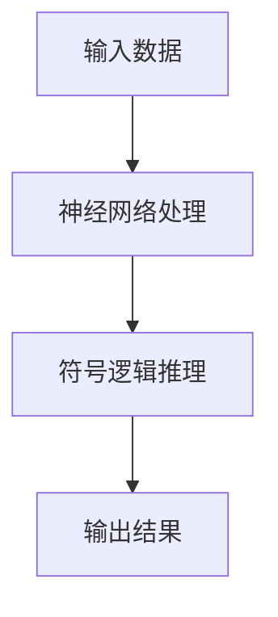
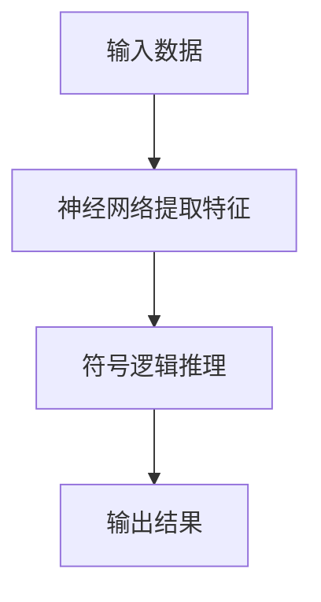
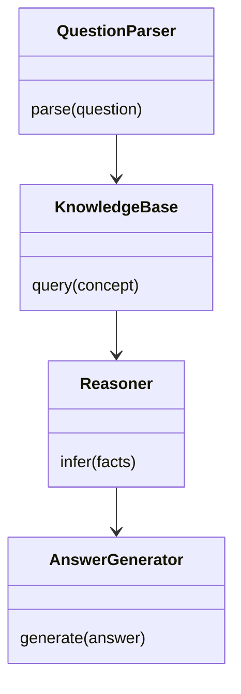

                 


# AI Agent的神经-符号混合架构实现

---

## 关键词：AI Agent, 神经-符号混合架构, 神经网络, 符号逻辑, 知识表示, 逻辑推理, 混合型AI

---

## 摘要：  
本文深入探讨了AI Agent的神经-符号混合架构的实现方法，从理论基础到实际应用，结合神经网络和符号逻辑的优势，提出了一种创新的混合架构设计。通过详细分析符号逻辑与知识表示、神经网络基础、神经-符号混合架构的核心原理，以及系统设计与项目实战，本文为读者提供了全面的指导和实践方案。最终，通过具体案例展示，证明了神经-符号混合架构在提升AI Agent智能性和可解释性方面的显著优势。

---

# 第1章: AI Agent与神经-符号混合架构概述

## 1.1 AI Agent的基本概念

### 1.1.1 AI Agent的定义与特点
AI Agent（智能体）是指在特定环境中能够感知并自主行动以实现目标的实体。其特点包括：
- **自主性**：无需外部干预，自主决策。
- **反应性**：能够实时感知环境并做出反应。
- **目标导向**：所有行为均以实现目标为导向。
- **社会性**：能够与其他Agent或人类进行交互协作。

### 1.1.2 神经-符号混合架构的背景与意义
传统AI技术主要依赖于符号逻辑或神经网络的单一方法，但各有局限：
- 符号逻辑方法在规则明确的领域表现优异，但在处理复杂、模糊问题时能力有限。
- 神经网络在处理非结构化数据和模式识别方面表现出色，但在逻辑推理和可解释性方面存在不足。

神经-符号混合架构通过结合两者的优点，能够同时处理感知和推理任务，提升AI Agent的智能性和可解释性。

### 1.1.3 本书的目标与结构
本书旨在通过理论与实践结合的方式，系统介绍神经-符号混合架构的设计与实现。主要内容包括：
- 神经网络与符号逻辑的基础理论。
- 神经-符号混合架构的核心原理与实现方法。
- 系统设计与项目实战。
- 实际案例分析与应用展望。

---

# 第2章: 神经-符号混合架构的核心概念与原理

## 2.1 符号逻辑与知识表示基础

### 2.1.1 符号逻辑的基本概念
符号逻辑是基于符号和规则的推理方法，主要包括命题逻辑和谓词逻辑。

#### 命题逻辑
- 命题逻辑将知识表示为原子命题的逻辑组合。
- 例如：$P \land Q$ 表示命题P和Q同时为真。

#### 谓词逻辑
- 谓词逻辑引入了谓词和个体的概念，能够表达更复杂的关系。
- 例如：$F(x, y)$ 表示“x具有性质F”且y满足该性质。

### 2.1.2 逻辑推理的基本规则
- **演绎推理**：从一般到具体的推理方式，例如从全称命题推导出特例。
- **归纳推理**：从具体到一般的推理方式，例如从多个特例推导出一般规则。

### 2.1.3 知识表示的符号化方法
- **规则引擎**：通过预定义的规则进行推理。
- **知识图谱**：通过图结构表示实体间的关系，例如使用RDF（资源描述框架）。

## 2.2 神经网络基础

### 2.2.1 神经网络的基本结构
- **输入层**：接收外部输入。
- **隐藏层**：通过非线性变换提取特征。
- **输出层**：生成最终的输出结果。

### 2.2.2 深度学习的基本原理
- **感知机**：单层神经网络，用于线性分类。
- **多层感知机（MLP）**：通过多层网络提升表达能力。
- **卷积神经网络（CNN）**：适用于图像处理。
- **循环神经网络（RNN）**：适用于序列数据处理。
- **Transformer架构**：基于注意力机制的网络结构。

### 2.2.3 注意力机制与图神经网络
- **注意力机制**：通过权重分配关注输入中的重要部分。
- **图神经网络（GNN）**：用于处理图结构数据，通过聚合邻居节点的信息进行推理。

## 2.3 神经-符号混合架构的核心要素

### 2.3.1 神经网络与符号逻辑的结合点
- **符号增强的神经网络**：通过符号规则约束神经网络的输出。
- **神经网络驱动的符号推理**：通过神经网络提取特征，再结合符号逻辑进行推理。

### 2.3.2 神经-符号混合架构的数学模型
神经-符号混合架构可以表示为：
$$
f(x) = g(h(x)) 
$$
其中，$h(x)$ 是神经网络提取的特征，$g$ 是符号逻辑的推理函数。

### 2.3.3 神经-符号混合架构的优缺点对比

| 项目         | 神经网络优势                          | 符号逻辑优势                          |
|--------------|---------------------------------------|----------------------------------------|
| 可解释性      | 较低                                  | 较高                                  |
| 处理复杂性    | 适合处理非结构化数据                 | 适合处理结构化数据                     |
| 灵活性        | 较高                                  | 较低                                  |

---

# 第3章: 神经-符号混合架构的实现方法

## 3.1 符号增强的神经网络

### 3.1.1 符号规则对神经网络的约束
- 通过符号规则对神经网络的输出进行约束，例如使用正则化项：
$$
L = L_{\text{neural}} + \lambda \cdot L_{\text{symbolic}}
$$

### 3.1.2 神经网络对符号逻辑的优化
- 通过神经网络优化符号逻辑的参数，例如通过反向传播调整逻辑规则的权重。

### 3.1.3 实现流程的mermaid图


## 3.2 神经网络驱动的符号推理

### 3.2.1 神经网络提取特征
- 使用CNN提取图像特征，使用RNN提取文本特征。

### 3.2.2 符号逻辑进行推理
- 通过谓词逻辑进行推理，例如：
$$
\forall x, P(x) \rightarrow Q(x)
$$

### 3.2.3 实现流程的mermaid图


---

# 第4章: 神经-符号混合架构的系统设计

## 4.1 问题场景介绍
以智能问答系统为例，描述如何通过神经-符号混合架构实现自然语言理解与推理。

## 4.2 系统功能设计

### 4.2.1 领域模型设计
使用Mermaid类图展示系统模块的交互。



## 4.3 系统架构设计
使用Mermaid架构图展示整体系统架构。


## 4.4 系统接口设计
- 输入接口：自然语言查询。
- 输出接口：结构化答案。

---

# 第5章: 神经-符号混合架构的项目实战

## 5.1 环境安装
- 安装Python、TensorFlow、Keras、NLTK等库。

## 5.2 系统核心实现源代码
```python
import tensorflow as tf
from tensorflow.keras import layers
from keras.models import Model
from keras.layers import Input, Dense, Dropout

# 定义神经网络部分
input_layer = Input(shape=(input_dim,))
dense1 = Dense(64, activation='relu')(input_layer)
dense2 = Dense(32, activation='relu')(dense1)
output_layer = Dense(1, activation='sigmoid')(dense2)

model = Model(inputs=input_layer, outputs=output_layer)
model.compile(optimizer='adam', loss='binary_crossentropy', metrics=['accuracy'])

# 定义符号逻辑部分
def symbolic_rule(features):
    return tf.where(features > 0.5, 1, 0)

# 组合神经网络与符号逻辑
symbolic_output = symbolic_rule(model.output)
final_model = Model(inputs=model.input, outputs=symbolic_output)
```

## 5.3 代码应用解读与分析
- 神经网络部分用于特征提取。
- 符号逻辑部分用于最终决策。

## 5.4 实际案例分析
通过具体案例展示神经-符号模型在智能问答系统中的应用效果。

---

# 总结与展望

## 总结
本文系统介绍了AI Agent的神经-符号混合架构的实现方法，从理论到实践，详细阐述了符号逻辑与神经网络的结合方式，以及系统的实现与优化。

## 展望
未来，神经-符号混合架构将在更多领域得到应用，例如自动驾驶、智能客服、医疗诊断等。同时，如何进一步提升模型的可解释性和泛化能力，是研究者们需要继续探索的方向。

---

# 最佳实践 Tips

- **数据质量**：确保训练数据的多样性和代表性。
- **模型可解释性**：通过符号逻辑增强模型的可解释性。
- **系统架构优化**：合理设计系统架构，提升系统的稳定性和性能。

---

# 附录

## 附录A: 神经-符号混合架构的数学公式汇总
- 神经网络损失函数：
$$
L = \frac{1}{n}\sum_{i=1}^{n}(y_i - \hat{y_i})^2
$$
- 符号逻辑推理规则：
$$
\forall x, P(x) \rightarrow Q(x)
$$

## 附录B: 系统架构设计图


---

通过以上目录和内容的详细设计，读者可以系统地理解AI Agent的神经-符号混合架构的实现方法，并能够在实际项目中进行应用和优化。

