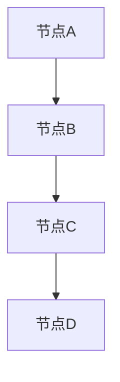
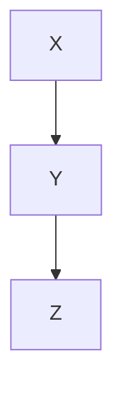
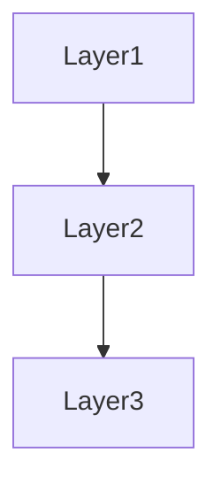
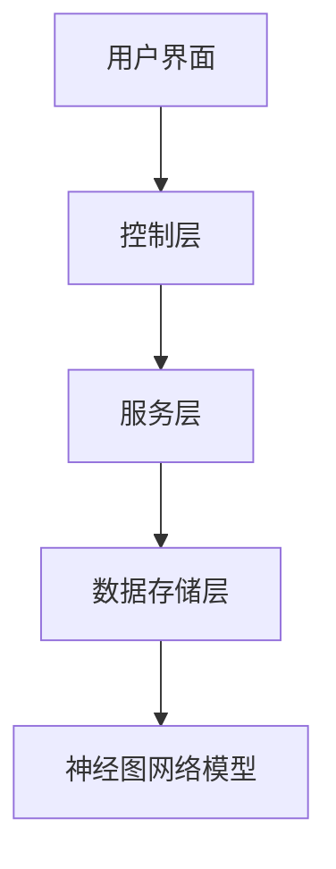
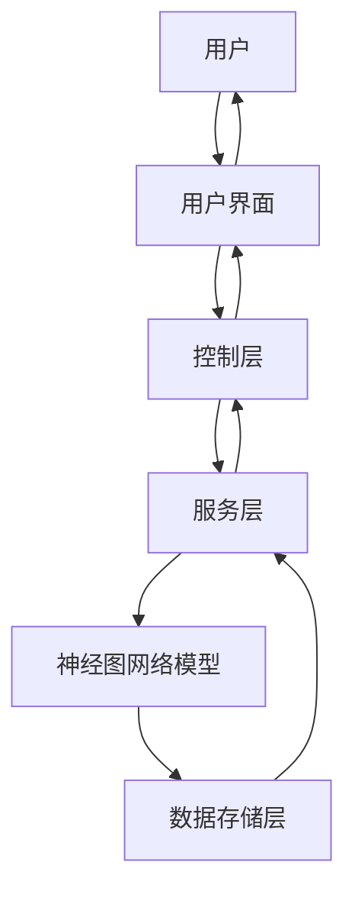

                 


---

# AI Agent的神经图网络推理能力实现

## 关键词：AI Agent，神经图网络，图神经网络，推理能力，深度学习

## 摘要

本文深入探讨了AI Agent在神经图网络中的推理能力实现。通过结合图神经网络（Graph Neural Networks, GNNs）的结构特点，分析了AI Agent如何在复杂图数据中进行高效推理。文章详细讲解了神经图网络的核心概念、算法原理、系统架构，并通过实际案例展示了如何实现基于神经图网络的推理能力。此外，本文还提供了最佳实践和项目实战经验，为读者提供了一套完整的解决方案。

---

## 第1章: AI Agent与神经图网络概述

### 1.1 AI Agent的基本概念

AI Agent（人工智能代理）是指能够感知环境、自主决策并执行任务的智能实体。AI Agent可以是软件程序、机器人或其他智能系统，其核心能力包括感知、推理、规划和执行。

#### 1.1.1 AI Agent的分类

AI Agent可以根据智能水平分为以下几类：

- **反应式AI Agent**：基于当前感知做出反应，不依赖历史记忆。
- **认知式AI Agent**：具备复杂推理和规划能力，能够理解上下文和长期目标。
- **学习型AI Agent**：能够通过数据和经验不断优化自身能力。

#### 1.1.2 神经图网络的基本原理

神经图网络是一种结合了图论和深度学习的新型神经网络，能够处理图结构数据（节点和边）。神经图网络通过聚合邻居节点的信息来更新节点表示，从而捕捉图中的结构特征和语义信息。

#### 1.1.3 AI Agent与神经图网络的关系

AI Agent可以通过神经图网络来增强其推理能力，特别是在处理复杂关系型数据时。神经图网络能够帮助AI Agent理解图中的实体关系和潜在模式，从而做出更准确的推理和决策。

### 1.2 神经图网络推理能力的核心要素

神经图网络的推理能力依赖于以下几个关键要素：

- **图结构数据的表示方法**：如何将现实世界中的实体及其关系表示为图结构。
- **神经图网络的推理机制**：如何通过神经网络模型进行信息聚合和推理。
- **推理能力的评估指标**：如何量化神经图网络的推理性能。

---

## 第2章: 神经图网络的核心概念与联系

### 2.1 神经图网络的结构与属性

神经图网络由节点（Nodes）、边（Edges）和权重（Weights）组成，每个节点代表一个实体，边表示实体之间的关系，权重表示关系的强度。

#### 2.1.1 图节点与边的定义

- **节点**：表示数据中的实体，例如“人”、“地点”、“事件”等。
- **边**：表示节点之间的关系，例如“人-地点”关系可以表示为“人住在地点”。

#### 2.1.2 神经图网络的特征表示

神经图网络通过节点嵌入（Node Embedding）将节点转换为低维向量表示，这些向量能够捕捉节点的语义信息和结构特征。

#### 2.1.3 神经图网络的权重矩阵

权重矩阵用于表示节点之间关系的强度和方向，权重越大，节点之间的关系越紧密。

### 2.2 神经图网络与传统神经网络的对比

神经图网络与传统神经网络在以下几个方面存在显著差异：

- **输入数据结构**：传统神经网络处理的是序列数据或图像数据，而神经图网络处理的是图结构数据。
- **信息聚合方式**：传统神经网络通过卷积或注意力机制处理局部信息，而神经图网络通过聚合邻居节点信息来更新节点表示。
- **应用场景**：传统神经网络适用于图像识别和自然语言处理，而神经图网络适用于社交网络分析、推荐系统和知识图谱构建。

### 2.3 神经图网络的ER实体关系图

以下是一个简单的ER实体关系图示例：



---

## 第3章: 神经图网络推理算法原理

### 3.1 图卷积网络（GCN）原理

图卷积网络是一种基于图结构数据的卷积神经网络，能够通过聚合邻居节点的信息来更新节点表示。

#### 3.1.1 GCN的数学模型

图卷积网络的数学模型如下：

$$Y = \theta X + b$$

其中，$X$ 是输入的邻接矩阵，$\theta$ 是权重矩阵，$b$ 是偏置项。

#### 3.1.2 GCN的传播规则

GCN的传播规则如下：



### 3.2 图注意力网络（GAT）原理

图注意力网络是一种基于注意力机制的图神经网络，能够通过自适应地关注重要邻居节点来更新节点表示。

#### 3.2.1 GAT的注意力机制

图注意力网络的注意力机制如下：

$$\alpha_{ij} = \frac{e^{score(i,j)}}{\sum_{k} e^{score(i,k)}}}$$

其中，$\alpha_{ij}$ 表示节点 $i$ 对节点 $j$ 的注意力权重，$score(i,j)$ 是节点 $i$ 和节点 $j$ 之间的相似度得分。

#### 3.2.2 GAT的多层传播过程

图注意力网络的多层传播过程如下：



### 3.3 神经图网络推理的数学模型

神经图网络推理的数学模型如下：

$$Y = \sum_{j} \alpha_{ij} X_j$$

其中，$Y$ 是节点 $i$ 的最终表示，$\alpha_{ij}$ 是节点 $i$ 对节点 $j$ 的注意力权重，$X_j$ 是节点 $j$ 的输入特征。

---

## 第4章: 系统分析与架构设计

### 4.1 系统功能设计

系统功能设计包括以下几个方面：

- **节点表示**：将实体表示为图节点，并赋予节点特征。
- **边表示**：将实体之间的关系表示为边，并赋予边权重。
- **神经图网络构建**：基于节点和边构建神经图网络模型。
- **推理过程**：通过神经图网络模型进行推理，输出结果。

### 4.2 系统架构设计

系统架构设计如下：



### 4.3 系统接口设计

系统接口设计包括以下几个方面：

- **输入接口**：接收用户输入的实体和关系。
- **输出接口**：输出推理结果。
- **数据接口**：与数据库或其他数据源交互。

### 4.4 系统交互流程图

系统交互流程图如下：



---

## 第5章: 项目实战

### 5.1 环境安装

项目实战需要以下环境：

- **Python**：3.6+
- **深度学习框架**：TensorFlow或PyTorch
- **图神经网络库**：如DGL或PyG
- **其他依赖**：根据具体项目需求安装。

### 5.2 核心代码实现

以下是基于PyTorch实现的图注意力网络代码示例：

```python
import torch
from torch.nn import Module, Linear, ReLU

class GATLayer(Module):
    def __init__(self, in_features, out_features):
        super(GATLayer, self).__init__()
        self.w = Linear(in_features, out_features)
        self.a = Linear(2*out_features, 1)
        self.relu = ReLU()

    def forward(self, x, adj):
        N = x.size(0)
        h = self.w(x)
        a_input = torch.cat([h.unsqueeze(1), h.unsqueeze(1)], dim=2)
        a = self.a(a_input.view(-1, 2*out_features))
        a = torch.sigmoid(a)
        output = h * a
        return output

# 示例用法
x = torch.randn(4, 8)  # 4个节点，8维特征
adj = torch.ones(4, 4)  # 4x4邻接矩阵
model = GATLayer(8, 4)
output = model(x, adj)
print(output)
```

### 5.3 实际案例分析

以下是一个实际案例分析：

假设我们有一个社交网络，节点表示用户，边表示用户之间的关系。我们可以通过神经图网络推理用户的兴趣爱好。

1. **数据准备**：收集用户数据和用户关系。
2. **模型训练**：训练图注意力网络模型。
3. **推理过程**：输入目标用户，推理其兴趣爱好。

---

## 第6章: 最佳实践与小结

### 6.1 最佳实践

- **数据预处理**：确保数据的完整性和准确性。
- **模型调优**：通过交叉验证和超参数调优优化模型性能。
- **模型解释性**：通过可视化工具分析模型的注意力权重，解释推理过程。

### 6.2 小结

本文详细讲解了AI Agent的神经图网络推理能力实现，从核心概念到算法原理，再到系统架构和项目实战，为读者提供了一套完整的解决方案。神经图网络作为一种新兴的技术，将在未来的AI Agent开发中发挥重要作用。

### 6.3 注意事项

- 神经图网络的计算复杂度较高，适用于大规模数据时需要优化计算资源。
- 模型的可解释性较差，需要通过可视化工具辅助分析。
- 在实际应用中，需要结合具体场景进行模型优化和调整。

### 6.4 拓展阅读

- [DGL官方文档](https://dgl.ai/)
- [PyTorch官方文档](https://pytorch.org/)
- [图神经网络综述论文](https://arxiv.org/abs/1812.34276)

---

通过本文的学习，读者可以深入了解AI Agent的神经图网络推理能力实现，并能够将其应用到实际项目中。

