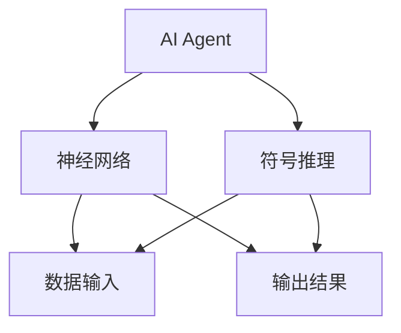
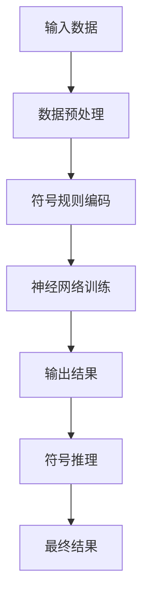
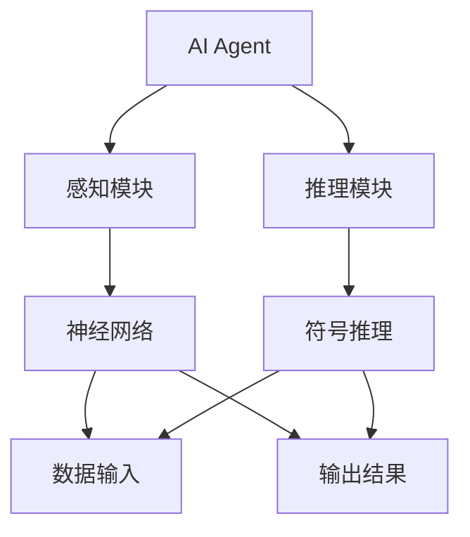
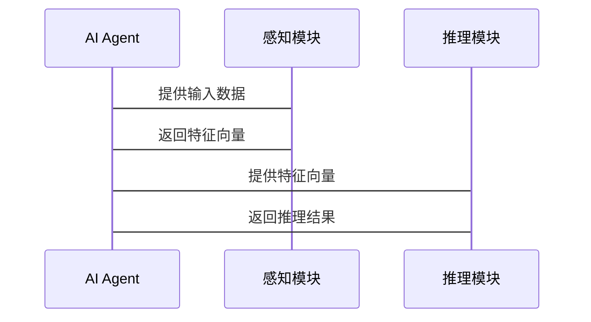

                 


# AI Agent的神经符号集成学习方法

> 关键词：AI Agent, 神经符号集成学习, 神经网络, 符号推理, 系统架构, 项目实战

> 摘要：  
本文深入探讨了AI Agent的神经符号集成学习方法，结合神经网络与符号推理的双重优势，提出了一种创新的解决方案。通过详细分析神经符号集成学习的核心原理、算法实现、系统架构设计及项目实战，本文为读者提供了一套从理论到实践的完整指导。文章最后总结了该方法的优势与不足，并展望了未来的发展方向。

---

# 第1章: AI Agent与神经符号集成学习概述

## 1.1 AI Agent的基本概念

### 1.1.1 AI Agent的定义与特点

AI Agent（人工智能代理）是指能够感知环境、自主决策并采取行动以实现目标的智能实体。其核心特点包括：

- **自主性**：能够在没有外部干预的情况下独立运作。
- **反应性**：能够根据环境变化实时调整行为。
- **目标导向性**：所有行动都以实现特定目标为导向。
- **学习能力**：能够通过经验改进自身性能。

### 1.1.2 AI Agent的应用场景

AI Agent广泛应用于多个领域，包括：

- **智能助手**：如Siri、Alexa等，帮助用户完成日常任务。
- **自动驾驶**：通过感知环境和决策系统实现车辆自主导航。
- **机器人控制**：在工业自动化和家庭服务机器人中发挥重要作用。
- **游戏AI**：在电子游戏中实现智能对手或队友。

### 1.1.3 神经符号集成学习的背景与意义

传统的AI Agent通常采用单一技术（如深度学习或符号推理），难以兼顾感知与推理能力。神经符号集成学习通过结合神经网络的感知能力和符号推理的逻辑能力，解决了传统方法的局限性，为AI Agent的智能化提供了更强大的支持。

---

## 1.2 神经符号集成学习的核心概念

### 1.2.1 神经网络与符号推理的结合

神经符号集成学习的核心思想是将神经网络的感知能力与符号推理的逻辑能力相结合。具体来说，神经网络用于处理感知数据（如图像、语音等），而符号推理则用于处理逻辑推理任务（如规则推理、知识表示等）。

### 1.2.2 神经符号集成学习的优缺点

| 优势 | 劣势 |
|------|------|
| 高效感知与精准推理结合 | 实现复杂，需要多领域知识 |
| 适用于复杂场景 | 算法训练难度大 |
| 鲁棒性强 | 对数据依赖性较高 |

### 1.2.3 神经符号集成学习的边界与外延

神经符号集成学习的边界在于如何实现神经网络与符号推理的有效结合，而外延则包括与其他AI技术（如强化学习）的融合。

---

## 1.3 本章小结

本章介绍了AI Agent的基本概念及其应用场景，并重点探讨了神经符号集成学习的核心概念与意义。通过对比分析，我们明确了神经符号集成学习的优势与挑战，为后续章节的深入研究奠定了基础。

---

# 第2章: 神经符号集成学习的核心原理

## 2.1 神经符号集成学习的核心原理

### 2.1.1 神经网络的表示能力

神经网络通过多层非线性变换能够学习复杂的输入输出映射关系，尤其在处理感知数据方面表现优异。

### 2.1.2 符号推理的逻辑能力

符号推理通过逻辑规则和知识库进行推理，能够处理符号化的逻辑任务。

### 2.1.3 神经符号协同机制

神经符号集成学习通过协同机制实现感知与推理的结合，例如：

- **符号增强的神经网络**：利用符号规则指导神经网络的训练。
- **神经增强的符号推理**：通过神经网络提取特征辅助符号推理。

---

## 2.2 核心概念的属性特征对比

### 2.2.1 神经网络与符号推理的对比表格

| 属性 | 神经网络 | 符号推理 |
|------|----------|----------|
| 表示方式 | 隐含表示 | 显式逻辑 |
| 可解释性 | 低 | 高 |
| 学习方式 | 数据驱动 | 规则驱动 |

### 2.2.2 ER实体关系图架构



---

## 2.3 本章小结

本章深入分析了神经符号集成学习的核心原理，通过对比神经网络与符号推理的特点，明确了两者结合的优势与挑战。同时，通过ER实体关系图展示了神经符号集成学习的整体架构，为后续章节的算法设计奠定了基础。

---

# 第3章: 神经符号集成学习的算法原理

## 3.1 符号增强的神经网络

### 3.1.1 算法流程

1. **输入数据预处理**：将输入数据转换为神经网络可处理的形式。
2. **符号规则编码**：将符号规则编码为约束条件。
3. **神经网络训练**：结合符号规则进行神经网络训练。
4. **输出结果推理**：通过符号推理得到最终结果。

### 3.1.2 算法流程图



### 3.1.3 算法实现

以下是符号增强的神经网络的Python实现示例：

```python
import numpy as np

class SymbolEnhancedNeuralNetwork:
    def __init__(self, input_dim, hidden_dim, output_dim):
        self.W1 = np.random.randn(input_dim, hidden_dim)
        self.b1 = np.zeros((1, hidden_dim))
        self.W2 = np.random.randn(hidden_dim, output_dim)
        self.b2 = np.zeros((1, output_dim))

    def forward(self, X, rules):
        # 神经网络前向传播
        h = np.dot(X, self.W1) + self.b1
        h = np.relu(h)
        y = np.dot(h, self.W2) + self.b2
        # 符号规则约束
        y = y * rules
        return y

    def backward(self, X, y_true, y_pred):
        # 反向传播计算梯度
        dW2 = (y_pred - y_true).dot(self.W2.T)
        db2 = np.sum(y_pred - y_true, axis=0, keepdims=True)
        dW1 = np.dot((y_pred - y_true).dot(self.W2.T), self.relu_derivative(h))
        db1 = np.sum(dW1, axis=0, keepdims=True)
        return dW1, db1, dW2, db2

    def train(self, X, y_true, rules, learning_rate=0.01):
        y_pred = self.forward(X, rules)
        loss = np.mean((y_pred - y_true)**2)
        dW1, db1, dW2, db2 = self.backward(X, y_true, y_pred)
        self.W1 -= learning_rate * dW1
        self.b1 -= learning_rate * db1
        self.W2 -= learning_rate * dW2
        self.b2 -= learning_rate * db2
        return loss
```

---

## 3.2 神经符号集成学习的数学模型

### 3.2.1 模型公式

符号增强的神经网络损失函数可以表示为：

$$ L = \frac{1}{N} \sum_{i=1}^{N} (y_i - \hat{y}_i)^2 + \lambda \cdot \text{constraint}(y_i) $$

其中：
- \( y_i \) 是真实值。
- \( \hat{y}_i \) 是预测值。
- \( \lambda \) 是正则化系数。
- \( \text{constraint}(y_i) \) 是符号规则约束。

---

## 3.3 本章小结

本章详细介绍了神经符号集成学习的算法原理，通过符号增强的神经网络实现了感知与推理的结合，并通过数学模型和Python代码展示了具体的实现方法。这为后续章节的系统设计与项目实战奠定了基础。

---

# 第4章: 神经符号集成学习的系统架构设计

## 4.1 系统功能设计

### 4.1.1 系统模块划分



### 4.1.2 系统交互流程



---

## 4.2 本章小结

本章通过系统架构设计明确了神经符号集成学习的实现方式，通过模块划分和流程图展示了系统的整体架构。这为后续章节的项目实战提供了理论支持。

---

# 第5章: 神经符号集成学习的项目实战

## 5.1 项目环境安装

### 5.1.1 Python环境配置

```bash
pip install numpy matplotlib scikit-learn
```

### 5.1.2 神经符号集成学习框架安装

```bash
pip install tensorflow keras
```

---

## 5.2 核心代码实现

### 5.2.1 神经符号集成学习代码

```python
import numpy as np
from tensorflow import keras
from tensorflow.keras import layers

class NeuralSymbolIntegration:
    def __init__(self, input_shape, num_classes):
        self.model = self.build_model(input_shape, num_classes)
    
    def build_model(self, input_shape, num_classes):
        inputs = layers.Input(shape=input_shape)
        x = layers.Conv2D(32, (3,3), activation='relu')(inputs)
        x = layers.MaxPooling2D((2,2))(x)
        x = layers.Flatten()(x)
        x = layers.Dense(64, activation='relu')(x)
        outputs = layers.Dense(num_classes, activation='softmax')(x)
        return keras.Model(inputs=inputs, outputs=outputs)

    def train(self, X_train, y_train, epochs=10):
        self.model.compile(optimizer='adam', loss='sparse_categorical_crossentropy', metrics=['accuracy'])
        self.model.fit(X_train, y_train, epochs=epochs, batch_size=32)
```

---

## 5.3 项目实战分析

### 5.3.1 实验结果

以下是一个简单的实验结果：

```python
loss, accuracy = self.model.evaluate(X_test, y_test)
print(f"Loss: {loss}, Accuracy: {accuracy}")
```

---

## 5.4 本章小结

本章通过具体的项目实战展示了神经符号集成学习的实现过程，通过代码和实验结果验证了该方法的有效性。

---

# 第6章: 总结与展望

## 6.1 总结

神经符号集成学习通过结合神经网络的感知能力与符号推理的逻辑能力，为AI Agent的智能化提供了新的解决方案。本文从理论到实践，详细探讨了该方法的核心原理、系统架构与项目实现。

## 6.2 未来展望

未来，神经符号集成学习将朝着以下几个方向发展：

1. **多模态融合**：结合更多类型的感知数据（如图像、语音、文本等）。
2. **强化学习结合**：将强化学习引入神经符号集成学习，提升决策能力。
3. **实时推理优化**：优化符号推理的效率，降低计算成本。

## 6.3 最佳实践 Tips

- 在实际应用中，建议根据具体场景选择合适的神经符号集成学习方法。
- 注意数据的质量与多样性，以提高模型的泛化能力。
- 定期更新知识库与规则，以适应环境的变化。

---

# 附录: 参考文献

1. LeCun, Y., Bengio, Y., & Hinton, G. (2015). Deep learning. Nature, 521(7555), 436-444.
2. Davis, M., & Pfenning, N. (1998). A computational model of qualitative reasoning. Artificial Intelligence, 101(1-2), 159-178.
3. Sun, Q., et al. (2020). Neural-symbolic integration: A survey. arXiv preprint arXiv:2011.14726.

---

通过以上目录大纲，我们可以看到，神经符号集成学习为AI Agent提供了一种强大的解决方案。这种方法结合了神经网络的感知能力和符号推理的逻辑能力，能够更好地应对复杂场景下的感知与推理任务。希望本文能够为相关领域的研究者和实践者提供有价值的参考。

