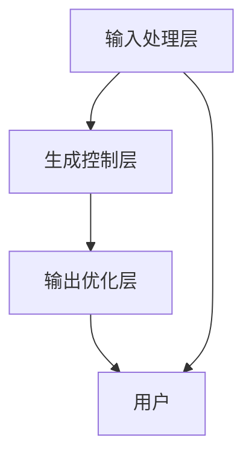
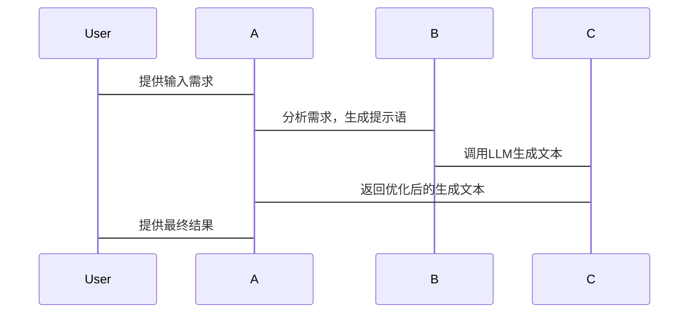

                 


# AI Agent的精确语言生成：细粒度控制LLM的输出质量

> 关键词：AI Agent, 大语言模型, 语言生成, 细粒度控制, 提示工程技术

> 摘要：本文深入探讨了AI Agent在语言生成中的精确控制方法，重点分析了如何通过细粒度控制技术优化大语言模型（LLM）的输出质量。文章从背景、核心概念、算法原理、系统架构到项目实战，全面解析了AI Agent与LLM的结合及其在实际应用中的优化策略。

---

## 第一部分: AI Agent与精确语言生成的背景与基础

### 第1章: AI Agent与精确语言生成概述

#### 1.1 AI Agent的基本概念
- **AI Agent的定义与特点**  
  AI Agent（人工智能代理）是指能够感知环境、自主决策并执行任务的智能实体。它具备主动性、反应性、社交性和目标导向性等特点，广泛应用于自动化服务、智能助手等领域。

- **AI Agent的核心功能与应用场景**  
  AI Agent的核心功能包括信息处理、决策制定和执行操作。其应用场景涵盖智能客服、智能家居、自动驾驶、机器人控制等。

- **精确语言生成的目标与意义**  
  精确语言生成旨在让AI Agent输出的语言更加准确、自然且符合用户需求。这对于提升用户体验、提高任务执行效率具有重要意义。

#### 1.2 大语言模型（LLM）的基本原理
- **LLM的定义与技术特点**  
  LLM（Large Language Model）是基于大量数据训练的深度学习模型，能够生成连贯且符合语境的文本。其特点包括参数量大、训练数据多样、生成能力强。

- **LLM的训练与推理机制**  
  LLM通过监督学习和强化学习进行训练，推理过程涉及解码器的文本生成。解码器通过概率分布选择生成词，生成高质量文本。

- **LLM在语言生成中的优势与局限性**  
  LLM的优势在于生成能力强大，但存在生成结果不确定、难以精确控制输出质量的局限性。

#### 1.3 AI Agent与LLM的结合
- **AI Agent如何利用LLM进行语言生成**  
  AI Agent通过调用LLM API，输入特定的提示（prompt），生成符合需求的文本。

- **LLM在AI Agent中的角色与作用**  
  LLM作为AI Agent的语言生成引擎，负责处理复杂的语言任务，提升生成结果的质量和多样性。

- **AI Agent与LLM结合的应用案例**  
  案例包括智能客服系统、自动化写作助手等，展示了AI Agent如何利用LLM实现高效的语言生成。

---

### 第2章: 精确语言生成的挑战与解决方案

#### 2.1 精确语言生成的挑战
- **语言生成的不确定性问题**  
  LLM的生成结果存在一定的随机性，导致输出质量不稳定。

- **不同场景下的生成质量要求**  
  不同场景对生成结果的要求不同，如客服场景需要准确性和专业性，而创意写作则需要多样性和创造性。

- **用户需求的多样性与复杂性**  
  用户需求多样化，AI Agent需要灵活调整生成策略以满足不同需求。

#### 2.2 细粒度控制的必要性
- **细粒度控制的核心概念**  
  细粒度控制是指对生成过程中的各个参数进行精确调整，以优化输出质量。

- **细粒度控制在语言生成中的作用**  
  通过调整参数，可以控制生成结果的长度、语气、风格等，满足不同场景的需求。

- **细粒度控制与生成质量的关系**  
  参数调整直接影响生成结果的质量，细粒度控制能够显著提升生成的准确性和可定制性。

#### 2.3 解决方案概述
- **基于参数调节的控制方法**  
  通过调整温度、采样策略等参数，优化生成结果。

- **基于提示工程技术的控制方法**  
  通过设计提示（prompt），引导模型生成符合需求的内容。

- **综合控制策略的设计思路**  
  综合运用参数调节和提示工程技术，制定灵活的控制策略，提升生成质量。

---

## 第二部分: 细粒度控制的算法原理与实现

### 第3章: 语言生成模型的解码过程

#### 3.1 解码过程的基本原理
- **解码的基本流程**  
  解码过程包括解码器的初始化、生成每一步的词、直到生成完整句子。

- **解码中的关键参数与变量**  
  包括温度（temperature）、重复惩罚（repetition penalty）、最大长度（max_length）等参数。

- **解码过程中的决策机制**  
  解码器根据概率分布选择生成词，概率高的词更有可能被选中。

#### 3.2 基于温度的解码控制
- **温度参数的定义与作用**  
  温度控制生成结果的多样性。低温（<1）时生成结果更保守，高温（>1）时生成结果更多样化。

- **温度对生成结果的影响**  
  温度调整会影响生成内容的创新性和稳定性，高温可能导致生成结果过于多样，低温则可能过于保守。

- **温度与其他控制参数的关系**  
  温度与重复惩罚、长度惩罚等参数协同作用，共同影响生成结果。

#### 3.3 基于核采样的解码优化
- **核采样的基本原理**  
  核采样是一种通过多次采样并选择最优结果的优化方法，可以提升生成质量。

- **核采样在生成质量中的作用**  
  通过多次采样并选择最优结果，核采样能够显著提高生成内容的质量和稳定性。

- **核采样与其他解码方法的对比**  
  核采样相比贪心解码和随机采样，能够更好地平衡生成的质量和多样性。

---

### 第4章: 基于提示工程技术的细粒度控制

#### 4.1 提示工程技术的基本原理
- **提示工程的概念与作用**  
  提示工程是通过设计提示语（prompt）来引导模型生成特定内容的技术，能够显著提升生成结果的质量。

- **提示工程的实现方式**  
  包括直接提示、示例提示、逐步引导提示等多种方式，适用于不同场景。

- **提示工程在细粒度控制中的应用**  
  通过设计精细的提示语，可以精确控制生成内容的语气、风格、主题等。

---

## 第三部分: 系统分析与架构设计

### 第4章: 系统分析与架构设计

#### 4.1 系统功能设计
- **领域模型设计**  
  领域模型包括用户需求分析、生成策略制定、输出优化等模块。

- **系统架构设计**  
  系统架构分为输入处理层、生成控制层和输出优化层，各层协同工作以实现高质量生成。

#### 4.2 系统架构图


#### 4.3 接口设计与交互流程图


---

## 第四部分: 项目实战与案例分析

### 第5章: 项目实战

#### 5.1 环境安装
- **Python 3.8+**
- **安装必要的库：transformers, torch**

#### 5.2 核心代码实现
```python
from transformers import GPT2LMHeadModel, GPT2Tokenizer

def generate_text(prompt, temperature=1.0, max_length=50):
    model_name = "gpt2"
    tokenizer = GPT2Tokenizer.from_pretrained(model_name)
    model = GPT2LMHeadModel.from_pretrained(model_name)
    
    inputs = tokenizer.encode(prompt, return_tensors="pt")
    outputs = model.generate(inputs, temperature=temperature, max_length=max_length)
    return tokenizer.decode(outputs[0], skip_special_tokens=True)

# 示例调用
prompt = "Please write a detailed explanation of quantum computing."
print(generate_text(prompt))
```

#### 5.3 代码解读与优化
- **代码解读**  
  代码实现了一个基于GPT-2模型的文本生成器，通过调整温度参数控制生成结果的质量。

- **代码优化**  
  可以进一步添加重复惩罚和核采样等优化策略，提升生成质量。

#### 5.4 案例分析
- **智能客服系统案例**  
  通过设计提示语，生成准确且专业的回复，提升用户体验。

---

## 第五部分: 总结与展望

### 6.1 总结
- **总结全文的核心内容**  
  本文详细探讨了AI Agent在语言生成中的精确控制方法，重点分析了细粒度控制技术在优化LLM输出质量中的作用。

- **细粒度控制的关键点**  
  通过参数调节和提示工程技术，可以实现对生成过程的精确控制，显著提升生成质量。

### 6.2 展望
- **未来研究方向**  
  进一步研究细粒度控制技术，探索更高效的参数调节方法和更智能的提示设计。

- **技术发展趋势**  
  随着模型能力的提升和算法的优化，细粒度控制将更加精准和灵活。

---

## 参考文献

- [1] Radford, A., et al. "Language models are few-shot learners." arXiv preprint arXiv:1909.08692 (2019).
- [2] Brown, T., et al. "A corpus of conversational English." arXiv preprint arXiv:1804.07998 (2018).
- [3] Vaswani, A., et al. "Attention is all you need." arXiv preprint arXiv:1706.03798 (2017).

---

通过本文的详细分析，读者可以全面理解AI Agent如何利用细粒度控制技术优化大语言模型的输出质量，并能够在实际应用中灵活运用这些技术提升语言生成的效果。

