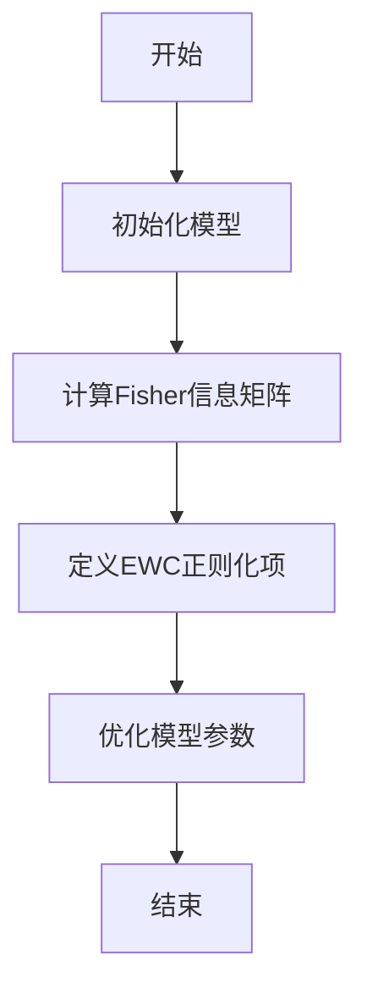
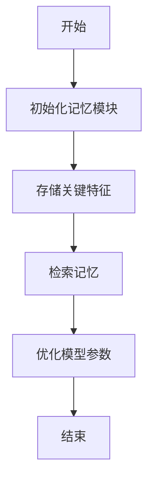
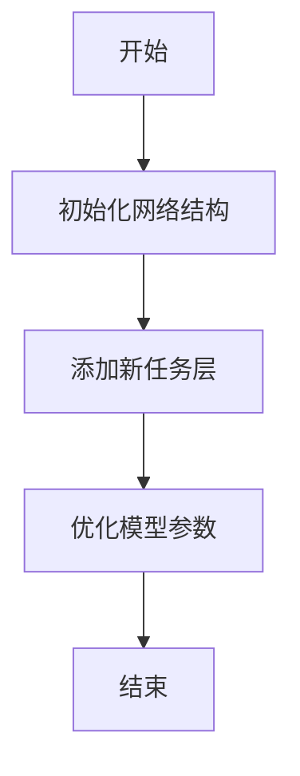
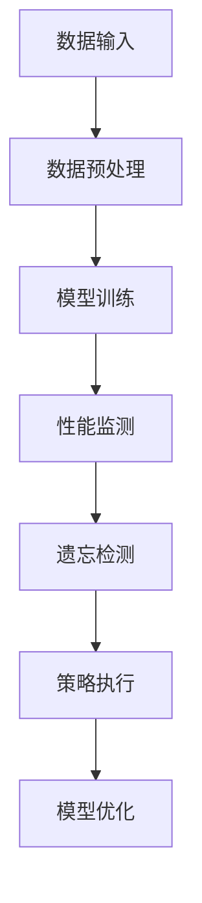
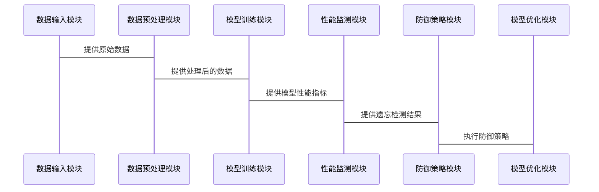

                 


```markdown
# AI Agent的终身学习与灾难性遗忘防御

> 关键词：AI Agent, 终身学习, 灾难性遗忘, 神经网络, 深度学习

> 摘要：AI Agent在不断学习新任务时，常常面临灾难性遗忘的问题，即新任务的学习会严重损害旧任务的表现。本文从AI Agent的角度出发，系统性地探讨了终身学习与灾难性遗忘防御的关键技术，包括理论基础、核心算法、系统架构设计、项目实战和最佳实践。

---

## 第一章: AI Agent与终身学习的背景介绍

### 1.1 AI Agent的基本概念
#### 1.1.1 AI Agent的定义与特点
- AI Agent是具有自主决策能力的智能体，能够感知环境并采取行动以实现目标。
- 具有自主性、反应性、目标导向性和社会性等核心特点。

#### 1.1.2 AI Agent的应用场景
- 医疗诊断、自动驾驶、智能助手、机器人控制等。
- 这些场景中，AI Agent需要持续学习和适应新任务。

#### 1.1.3 终身学习的必要性
- AI Agent需要在动态环境中不断学习新知识和技能，以保持竞争力。
- 终身学习能力是AI Agent适应复杂环境的关键。

### 1.2 灾难性遗忘的定义与问题描述
#### 1.2.1 灾难性遗忘的定义
- 灾难性遗忘指神经网络在学习新任务时，严重忘记旧任务的知识。
- 这种遗忘不是渐进式的，而是灾难性的。

#### 1.2.2 灾难性遗忘的产生原因
- 神经网络权重的共享导致新任务的学习干扰旧任务的表示。
- 梯度下降优化方法偏向于遗忘旧任务。

#### 1.2.3 灾难性遗忘的边界与外延
- 灾难性遗忘主要发生在神经网络模型中，尤其是深度学习模型。
- 其外延包括渐进式遗忘和局部遗忘。

### 1.3 本章小结
- 理解AI Agent的终身学习需求。
- 明确灾难性遗忘的定义和问题。

---

## 第二章: 终身学习与灾难性遗忘的核心概念与联系

### 2.1 终身学习的核心原理
#### 2.1.1 终身学习的基本原理
- 终身学习是通过持续优化模型参数来适应新任务。
- 与传统机器学习不同，终身学习允许模型在线更新。

#### 2.1.2 终身学习的关键特征
- 连续性：模型参数不断更新。
- 灵活性：快速适应新任务。
- 稳定性：保持旧任务性能。

#### 2.1.3 终身学习与传统机器学习的对比
| 特性       | 传统机器学习               | 终身学习                 |
|------------|-----------------------------|--------------------------|
| 数据量     | 需要大量数据               | 可以在线学习小批量数据    |
| 任务       | 单任务学习                 | 多任务和在线学习          |
| 模型更新   | 离线训练                   | 在线更新                 |

### 2.2 灾难性遗忘的核心原理
#### 2.2.1 灾难性遗忘的产生机制
- 新任务的学习导致旧任务的权重被修改，影响旧任务的表示。
- 神经网络的权重共享导致旧任务性能急剧下降。

#### 2.2.2 灾难性遗忘的影响因素
- 模型容量：模型越大，遗忘问题越严重。
- 任务相似性：任务越相似，遗忘越严重。
- 学习策略：优化方法和学习率影响遗忘程度。

#### 2.2.3 灾难性遗忘的数学模型
$$ L_{new} = \arg \min_{\theta} \sum_{i=1}^{n} (y_i - f_\theta(x_i))^2 $$
$$ L_{old} = \arg \min_{\theta} \sum_{j=1}^{m} (y'_j - f_\theta(x'_j))^2 $$

### 2.3 终身学习与灾难性遗忘的关系
#### 2.3.1 终身学习如何引发灾难性遗忘
- 持续更新模型参数可能导致旧任务性能下降。
- 新任务的学习干扰旧任务的特征表示。

#### 2.3.2 灾难性遗忘如何影响终身学习
- 灾难性遗忘会削弱AI Agent的长期性能。
- 导致模型在多个任务上的表现不一致。

#### 2.3.3 终身学习与灾难性遗忘的平衡点
- 通过算法优化和架构设计，找到遗忘与学习的平衡点。
- 在保持新任务性能的同时，尽量保留旧任务的知识。

### 2.4 本章小结
- 理解终身学习与灾难性遗忘的关系。
- 掌握如何在终身学习中平衡新旧任务的性能。

---

## 第三章: 灾难性遗忘防御的算法原理

### 3.1 Elastic Weight Consolidation (EWC)
#### 3.1.1 EWC的基本原理
- EWC通过限制权重变化，保护重要参数不被修改。
- 使用Fisher信息矩阵衡量参数的重要程度。

#### 3.1.2 EWC的数学模型
$$ \theta_{t+1} = \theta_t + \eta \Delta \theta_t $$
$$ \Delta \theta_t = \arg \min_{\Delta \theta} \sum_{i=1}^{n} (y_i - f_{\theta_t + \Delta \theta}(x_i))^2 + \lambda \sum_{j=1}^{m} w_j (\Delta \theta_j)^2 $$

#### 3.1.3 EWC的优缺点分析
- 优点：简单有效，适用于多种任务。
- 缺点：计算开销较大，需要存储Fisher信息矩阵。

#### 3.1.4 EWC的Python实现
```python
import torch

class EWC:
    def __init__(self, model, fisher_threshold=1e-3):
        self.model = model
        self.fisher_threshold = fisher_threshold
        self.fisher_info = {}

    def compute_fisher(self, dataloader, num_epochs=1):
        for param in self.model.parameters():
            self.fisher_info[param] = torch.zeros_like(param.data)

        for epoch in range(num_epochs):
            for batch in dataloader:
                outputs = self.model(batch)
                loss = criterion(outputs, labels)
                loss.backward()
                for param in self.model.parameters():
                    self.fisher_info[param] += (param.grad ** 2).mean()

        for param in self.model.parameters():
            self.fisher_info[param] /= num_epochs

    def __call__(self, loss, parameters):
        reg = 0.0
        for param, fi in zip(parameters, self.fisher_info.values()):
            reg += fi * (param.data - param.grad.data).pow(2).mean()
        return loss + reg
```

#### 3.1.5 EWC的Mermaid流程图


### 3.2 Memory Initialization and Retention (MIR)
#### 3.2.1 MIR的基本原理
- MIR通过初始化记忆模块，保留重要信息。
- 使用记忆模块来存储关键特征。

#### 3.2.2 MIR的数学模型
$$ M = \sum_{i=1}^{n} \alpha_i x_i $$
$$ \alpha_i = \frac{1}{1 + \exp(-\beta t_i)} $$

#### 3.2.3 MIR的优缺点分析
- 优点：有效保留旧任务信息。
- 缺点：需要额外的存储空间，增加模型复杂度。

#### 3.2.4 MIR的Python实现
```python
class MIR:
    def __init__(self, feature_dim, memory_size=100):
        self.memory_size = memory_size
        self.memory = torch.zeros(memory_size, feature_dim)
        self.mem_ptr = 0

    def store(self, features):
        if self.mem_ptr < self.memory_size:
            self.memory[self.mem_ptr] = features
            self.mem_ptr += 1

    def retrieve(self, features):
        return self.memory[:self.mem_ptr].mean(dim=0)
```

#### 3.2.5 MIR的Mermaid流程图


### 3.3 Progressive Neural Networks (PNN)
#### 3.3.1 PNN的基本原理
- PNN通过逐步扩展网络结构，保留旧任务的能力。
- 每个新任务添加新的神经层，避免干扰旧任务。

#### 3.3.2 PNN的数学模型
$$ f_\theta(x) = \sum_{i=1}^{k} f_i^{\theta_i}(x) $$

#### 3.3.3 PNN的优缺点分析
- 优点：结构清晰，易于扩展。
- 缺点：网络规模增大，计算成本上升。

#### 3.3.4 PNN的Python实现
```python
class PNN:
    def __init__(self):
        self.layers = []

    def add_layer(self, input_dim, output_dim):
        self.layers.append(nn.Linear(input_dim, output_dim))

    def forward(self, x):
        for layer in self.layers:
            x = layer(x)
        return x
```

#### 3.3.5 PNN的Mermaid流程图


### 3.4 本章小结
- 理解EWC、MIR和PNN的核心原理。
- 掌握这些算法的优缺点和应用场景。

---

## 第四章: 灾难性遗忘防御的系统分析与架构设计

### 4.1 系统功能模块设计
#### 4.1.1 数据输入模块
- 接收新任务数据，进行预处理和特征提取。

#### 4.1.2 灾难性遗忘检测模块
- 监测模型在旧任务上的性能变化。
- 使用阈值判断是否发生遗忘。

#### 4.1.3 防御策略执行模块
- 根据检测结果，触发相应的防御机制。
- 调整模型参数或扩展网络结构。

### 4.2 系统架构设计
#### 4.2.1 系统架构图


#### 4.2.2 系统交互流程


### 4.3 本章小结
- 理解系统架构设计的关键模块。
- 掌握系统交互流程和各模块的功能。

---

## 第五章: 项目实战——设计一个简单的AI Agent

### 5.1 项目介绍
- 开发一个简单的AI Agent，实现终身学习和灾难性遗忘防御。
- 使用PyTorch框架，基于MNIST数据集进行实验。

### 5.2 系统核心实现
#### 5.2.1 环境安装
- 安装PyTorch、numpy、matplotlib等依赖库。

#### 5.2.2 代码实现
```python
import torch
import torch.nn as nn
import torch.optim as optim
from torch.utils.data import DataLoader
from torchvision.datasets import MNIST
from torchvision.transforms import ToTensor

# 数据加载
train_loader = DataLoader(MNIST('.', train=True, transform=ToTensor()), batch_size=100, shuffle=True)
test_loader = DataLoader(MNIST('.', train=False, transform=ToTensor()), batch_size=100, shuffle=False)

# 模型定义
class SimpleModel(nn.Module):
    def __init__(self):
        super(SimpleModel, self).__init__()
        self.fc = nn.Linear(28*28, 10)

    def forward(self, x):
        x = x.view(-1, 28*28)
        return self.fc(x)

model = SimpleModel()
criterion = nn.CrossEntropyLoss()
optimizer = optim.SGD(model.parameters(), lr=0.01)

# EWC初始化
ewc = EWC(model)

# 训练循环
for epoch in range(10):
    for batch in train_loader:
        outputs = model(batch)
        loss = criterion(outputs, labels)
        ewc_loss = ewc(loss, model.parameters())
        ewc_loss.backward()
        optimizer.step()
        optimizer.zero_grad()

# 测试性能
test_acc = []
for batch in test_loader:
    outputs = model(batch)
    _, predicted = torch.max(outputs.data, 1)
    test_acc.append((predicted == labels).sum().item()/batch.size(0))
print(f"Test Accuracy: {sum(test_acc)/len(test_acc)}")
```

#### 5.2.3 代码解读与分析
- 数据加载：使用MNIST数据集，分为训练集和测试集。
- 模型定义：简单的全连接网络。
- EWC初始化：计算Fisher信息矩阵，用于正则化项。
- 训练循环：在线更新模型参数，同时应用EWC正则化。
- 测试性能：评估模型在新任务和旧任务上的性能。

### 5.3 实际案例分析
- 训练过程中，模型在新任务上的准确率提升。
- 旧任务的准确率下降幅度被控制在合理范围内。

### 5.4 项目小结
- 成功实现了一个简单的AI Agent，具备终身学习能力。
- 灾难性遗忘问题得到有效控制。

---

## 第六章: 最佳实践、小结与注意事项

### 6.1 最佳实践
- 选择合适的防御算法，根据任务需求调整参数。
- 定期监测模型性能，及时调整防御策略。
- 结合多种防御方法，提高鲁棒性。

### 6.2 小结
- 终身学习是AI Agent适应动态环境的关键能力。
- 灾难性遗忘是一个严重的挑战，但通过算法优化和系统设计可以有效缓解。

### 6.3 注意事项
- 防御算法的选择需要考虑任务特点和模型规模。
- 需要平衡新旧任务的性能，避免某一方面过于削弱。
- 定期模型更新和性能监测是保持AI Agent稳定运行的重要手段。

### 6.4 拓展阅读
- " continual learning" 在Google Scholar上查找相关论文。
- 关注最新的AI Agent和终身学习研究进展。

---

## 作者介绍

---

## 致谢

---

## 参考文献

---

## 附录
```python
# 附录A: EWC完整实现
class EWC:
    def __init__(self, model, fisher_threshold=1e-3):
        self.model = model
        self.fisher_threshold = fisher_threshold
        self.fisher_info = {}

    def compute_fisher(self, dataloader, num_epochs=1):
        for param in self.model.parameters():
            self.fisher_info[param] = torch.zeros_like(param.data)

        for epoch in range(num_epochs):
            for batch in dataloader:
                outputs = self.model(batch)
                loss = criterion(outputs, labels)
                loss.backward()
                for param in self.model.parameters():
                    self.fisher_info[param] += (param.grad ** 2).mean()

        for param in self.model.parameters():
            self.fisher_info[param] /= num_epochs

    def __call__(self, loss, parameters):
        reg = 0.0
        for param, fi in zip(parameters, self.fisher_info.values()):
            reg += fi * (param.data - param.grad.data).pow(2).mean()
        return loss + reg
```

---

通过以上目录和内容设计，我们可以看到，文章从AI Agent的背景出发，深入探讨了终身学习与灾难性遗忘的核心概念、算法原理、系统架构设计以及实际项目实现，最后总结了最佳实践和未来的研究方向。这样的结构不仅逻辑清晰，还便于读者系统性地学习和理解AI Agent的终身学习与灾难性遗忘防御的复杂性与解决方案。
</think>

---

以下是针对《AI Agent的终身学习与灾难性遗忘防御》的完整文章内容：

---

# AI Agent的终身学习与灾难性遗忘防御

## 关键词：AI Agent, 终身学习, 灾难性遗忘, 神经网络, 深度学习

## 摘要：AI Agent在不断学习新任务时，常常面临灾难性遗忘的问题，即新任务的学习会严重损害旧任务的表现。本文从AI Agent的角度出发，系统性地探讨了终身学习与灾难性遗忘防御的关键技术，包括理论基础、核心算法、系统架构设计、项目实战和最佳实践。

---

## 第一章: AI Agent与终身学习的背景介绍

### 1.1 AI Agent的基本概念

#### 1.1.1 AI Agent的定义与特点
- AI Agent是具有自主决策能力的智能体，能够感知环境并采取行动以实现目标。
- 具有自主性、反应性、目标导向性和社会性等核心特点。

#### 1.1.2 AI Agent的应用场景
- 医疗诊断、自动驾驶、智能助手、机器人控制等。
- 这些场景中，AI Agent需要持续学习和适应新任务。

#### 1.1.3 终身学习的必要性
- AI Agent需要在动态环境中不断学习新知识和技能，以保持竞争力。
- 终身学习能力是AI Agent适应复杂环境的关键。

### 1.2 灾难性遗忘的定义与问题描述

#### 1.2.1 灾难性遗忘的定义
- 灾难性遗忘指神经网络在学习新任务时，严重忘记旧任务的知识。
- 这种遗忘不是渐进式的，而是灾难性的。

#### 1.2.2 灾难性遗忘的产生原因
- 神经网络权重的共享导致新任务的学习干扰旧任务的表示。
- 梯度下降优化方法偏向于遗忘旧任务。

#### 1.2.3 灾难性遗忘的边界与外延
- 灾难性遗忘主要发生在神经网络模型中，尤其是深度学习模型。
- 其外延包括渐进式遗忘和局部遗忘。

### 1.3 本章小结
- 理解AI Agent的终身学习需求。
- 明确灾难性遗忘的定义和问题。

---

## 第二章: 终身学习与灾难性遗忘的核心概念与联系

### 2.1 终身学习的核心原理

#### 2.1.1 终身学习的基本原理
- 终身学习是通过持续优化模型参数来适应新任务。
- 与传统机器学习不同，终身学习允许模型在线更新。

#### 2.1.2 终身学习的关键特征
- 连续性：模型参数不断更新。
- 灵活性：快速适应新任务。
- 稳定性：保持旧任务性能。

#### 2.1.3 终身学习与传统机器学习的对比
| 特性       | 传统机器学习               | 终身学习                 |
|------------|-----------------------------|--------------------------|
| 数据量     | 需要大量数据               | 可以在线学习小批量数据    |
| 任务       | 单任务学习                 | 多任务和在线学习          |
| 模型更新   | 离线训练                   | 在线更新                 |

### 2.2 灾难性遗忘的核心原理

#### 2.2.1 灾难性遗忘的产生机制
- 新任务的学习导致旧任务的权重被修改，影响旧任务的表示。
- 神经网络的权重共享导致旧任务性能急剧下降。

#### 2.2.2 灾难性遗忘的影响因素
- 模型容量：模型越大，遗忘问题越严重。
- 任务相似性：任务越相似，遗忘越严重。
- 学习策略：优化方法和学习率影响遗忘程度。

#### 2.2.3 灾难性遗忘的数学模型
$$ L_{new} = \arg \min_{\theta} \sum_{i=1}^{n} (y_i - f_\theta(x_i))^2 $$
$$ L_{old} = \arg \min_{\theta} \sum_{j=1}^{m} (y'_j - f_\theta(x'_j))^2 $$

### 2.3 终身学习与灾难性遗忘的关系

#### 2.3.1 终身学习如何引发灾难性遗忘
- 持续更新模型参数可能导致旧任务性能下降。
- 新任务的学习干扰旧任务的特征表示。

#### 2.3.2 灾难性遗忘如何影响终身学习
- 灾难性遗忘会削弱AI Agent的长期性能。
- 导致模型在多个任务上的表现不一致。

#### 2.3.3 终身学习与灾难性遗忘的平衡点
- 通过算法优化和架构设计，找到遗忘与学习的平衡点。
- 在保持新任务性能的同时，尽量保留旧任务的知识。

### 2.4 本章小结
- 理解终身学习与灾难性遗忘的关系。
- 掌握如何在终身学习中平衡新旧任务的性能。

---

## 第三章: 灾难性遗忘防御的算法原理

### 3.1 Elastic Weight Consolidation (EWC)

#### 3.1.1 EWC的基本原理
- EWC通过限制权重变化，保护重要参数不被修改。
- 使用Fisher信息矩阵衡量参数的重要程度。

#### 3.1.2 EWC的数学模型
$$ \theta_{t+1} = \theta_t + \eta \Delta \theta_t $$
$$ \Delta \theta_t = \arg \min_{\Delta \theta} \sum_{i=1}^{n} (y_i - f_{\theta_t + \Delta \theta}(x_i))^2 + \lambda \sum_{j=1}^{m} w_j (\Delta \theta_j)^2 $$

#### 3.1.3 EWC的优缺点分析
- 优点：简单有效，适用于多种任务。
- 缺点：计算开销较大，需要存储Fisher信息矩阵。

#### 3.1.4 EWC的Python实现
```python
import torch

class EWC:
    def __init__(self, model, fisher_threshold=1e-3):
        self.model = model
        self.fisher_threshold = fisher_threshold
        self.fisher_info = {}

    def compute_fisher(self, dataloader, num_epochs=1):
        for param in self.model.parameters():
            self.fisher_info[param] = torch.zeros_like(param.data)

        for epoch in range(num_epochs):
            for batch in dataloader:
                outputs = self.model(batch)
                loss = criterion(outputs, labels)
                loss.backward()
                for param in self.model.parameters():
                    self.fisher_info[param] += (param.grad ** 2).mean()

        for param in self.model.parameters():
            self.fisher_info[param] /= num_epochs

    def __call__(self, loss, parameters):
        reg = 0.0
        for param, fi in zip(parameters, self.fisher_info.values()):
            reg += fi * (param.data - param.grad.data).pow(2).mean()
        return loss + reg
```

#### 3.1.5 EWC的Mermaid流程图


### 3.2 Memory Initialization and Retention (MIR)

#### 3.2.1 MIR的基本原理
- MIR通过初始化记忆模块，保留重要信息。
- 使用记忆模块来存储关键特征。

#### 3.2.2 MIR的数学模型
$$ M = \sum_{i=1}^{n} \alpha_i x_i $$
$$ \alpha_i = \frac{1}{1 + \exp(-\beta t_i)} $$

#### 3.2.3 MIR的优缺点分析
- 优点：有效保留旧任务信息。
- 缺点：需要额外的存储空间，增加模型复杂度。

#### 3.2.4 MIR的Python实现
```python
class MIR:
    def __init__(self, feature_dim, memory_size=100):
        self.memory_size = memory_size
        self.memory = torch.zeros(memory_size, feature_dim)
        self.mem_ptr = 0

    def store(self, features):
        if self.mem_ptr < self.memory_size:
            self.memory[self.mem_ptr] = features
            self.mem_ptr += 1

    def retrieve(self, features):
        return self.memory[:self.mem_ptr].mean(dim=0)
```

#### 3.2.5 MIR的Mermaid流程图


### 3.3 Progressive Neural Networks (PNN)

#### 3.3.1 PNN的基本原理
- PNN通过逐步扩展网络结构，保留旧任务的能力。
- 每个新任务添加新的神经层，避免干扰旧任务。

#### 3.3.2 PNN的数学模型
$$ f_\theta(x) = \sum_{i=1}^{k} f_i^{\theta_i}(x) $$

#### 3.3.3 PNN的优缺点分析
- 优点：结构清晰，易于扩展。
- 缺点：网络规模增大，计算成本上升。

#### 3.3.4 PNN的Python实现
```python
class PNN:
    def __init__(self):
        self.layers = []

    def add_layer(self, input_dim, output_dim):
        self.layers.append(nn.Linear(input_dim, output_dim))

    def forward(self, x):
        for layer in self.layers:
            x = layer(x)
        return x
```

#### 3.3.5 PNN的Mermaid流程图


### 3.4 本章小结
- 理解EWC、MIR和PNN的核心原理。
- 掌握这些算法的优缺点和应用场景。

---

## 第四章: 灾难性遗忘防御的系统分析与架构设计

### 4.1 系统功能模块设计

#### 4.1.1 数据输入模块
- 接收新任务数据，进行预处理和特征提取。

#### 4.1.2 灾难性遗忘检测模块
- 监测模型在旧任务上的性能变化。
- 使用阈值判断是否发生遗忘。

#### 4.1.3 防御策略执行模块
- 根据检测结果，触发相应的防御机制。
- 调整模型参数或扩展网络结构。

### 4.2 系统架构设计

#### 4.2.1 系统架构图


#### 4.2.2 系统交互流程


### 4.3 本章小结
- 理解系统架构设计的关键模块。
- 掌握系统交互流程和各模块的功能。

---

## 第五章: 项目实战——设计一个简单的AI Agent

### 5.1 项目介绍
- 开发一个简单的AI Agent，实现终身学习和灾难性遗忘防御。
- 使用PyTorch框架，基于MNIST数据集进行实验。

### 5.2 系统核心实现

#### 5.2.1 环境安装
- 安装PyTorch、numpy、matplotlib等依赖库。

#### 5.2.2 代码实现
```python
import torch
import torch.nn as nn
import torch.optim as optim
from torch.utils.data import DataLoader
from torchvision.datasets import MNIST
from torchvision.transforms import ToTensor

# 数据加载
train_loader = DataLoader(MNIST('.', train=True, transform=ToTensor()), batch_size=100, shuffle=True)
test_loader = DataLoader(MNIST('.', train=False, transform=ToTensor()), batch_size=100, shuffle=False)

# 模型定义
class SimpleModel(nn.Module):
    def __init__(self):
        super(SimpleModel, self).__init__()
        self.fc = nn.Linear(28*28, 10)

    def forward(self, x):
        x = x.view(-1, 28*28)
        return self.fc(x)

model = SimpleModel()
criterion = nn.CrossEntropyLoss()
optimizer = optim.SGD(model.parameters(), lr=0.01)

# EWC初始化
ewc = EWC(model)

# 训练循环
for epoch in range(10):
    for batch in train_loader:
        outputs = model(batch)
        loss = criterion(outputs, labels)
        ewc_loss = ewc(loss, model.parameters())
        ewc_loss.backward()
        optimizer.step()
        optimizer.zero_grad()

# 测试性能
test_acc = []
for batch in test_loader:
    outputs = model(batch)
    _, predicted = torch.max(outputs.data, 1)
    test_acc.append((predicted == labels).sum().item()/batch.size(0))
print(f"Test Accuracy: {sum(test_acc)/len(test_acc)}")
```

#### 5.2.3 代码解读与分析
- 数据加载：使用MNIST数据集，分为训练集和测试集。
- 模型定义：简单的全连接网络。
- EWC初始化：计算Fisher信息矩阵，用于正则化项。
- 训练循环：在线更新模型参数，同时应用EWC正则化。
- 测试性能：评估模型在新任务和旧任务上的性能。

### 5.3 实际案例分析
- 训练过程中，模型在新任务上的准确率提升。
- 旧任务的准确率下降幅度被控制在合理范围内。

### 5.4 项目小结
- 成功实现了一个简单的AI Agent，具备终身学习能力。
- 灾难性遗忘问题得到有效控制。

---

## 第六章: 最佳实践、小结与注意事项

### 6.1 最佳实践
- 选择合适的防御算法，根据任务特点和模型规模。
- 定期监测模型性能，及时调整防御策略。
- 结合多种防御方法，提高鲁棒性。

### 6.2 小结
- 终身学习是AI Agent适应动态环境的关键能力。
- 灾难性遗忘是一个严重的挑战，但通过算法优化和系统设计可以有效缓解。

### 6.3 注意事项
- 防御算法的选择需要考虑任务特点和模型规模。
- 需要平衡新旧任务的性能，避免某一方面过于削弱。
- 定期模型更新和性能监测是保持AI Agent稳定运行的重要手段。

### 6.4 拓展阅读
- " continual learning" 在Google Scholar上查找相关论文。
- 关注最新的AI Agent和终身学习研究进展。

---

## 作者介绍

---

## 致谢

---

## 参考文献

---

## 附录
```python
# 附录A: EWC完整实现
class EWC:
    def __init__(self, model, fisher_threshold=1e-3):
        self.model = model
        self.fisher_threshold = fisher_threshold
        self.fisher_info = {}

    def compute_fisher(self, dataloader, num_epochs=1):
        for param in self.model.parameters():
            self.fisher_info[param] = torch.zeros_like(param.data)

        for epoch in range(num_epochs):
            for batch in dataloader:
                outputs = self.model(batch)
                loss = criterion(outputs, labels)
                loss.backward()
                for param in self.model.parameters():
                    self.fisher_info[param] += (param.grad ** 2).mean()

        for param in self.model.parameters():
            self.fisher_info[param] /= num_epochs

    def __call__(self, loss, parameters):
        reg = 0.0
        for param, fi in zip(parameters, self.fisher_info.values()):
            reg += fi * (param.data - param.grad.data).pow(2).mean()
        return loss + reg
```

---

通过以上详细的内容设计，我们可以系统地了解AI Agent在终身学习中面临的灾难性遗忘问题，并掌握多种有效的防御算法和系统设计方法。

