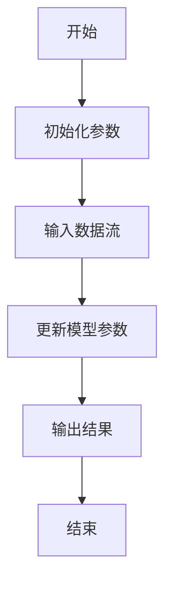
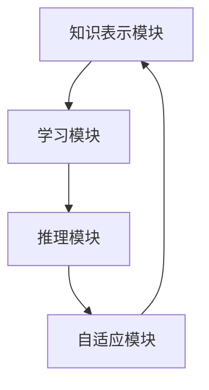
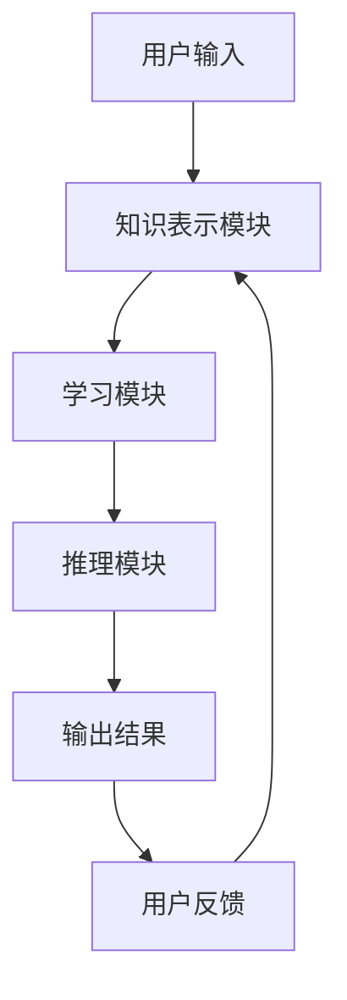

                 


# AI Agent的终身学习系统：持续适应新知识和技能

> 关键词：AI Agent，终身学习系统，持续学习，自适应系统，机器学习，知识更新

> 摘要：AI Agent的终身学习系统是一种能够持续适应新知识和技能的智能系统，通过自适应学习机制、动态知识更新和知识关联推理，实现对复杂环境的持续适应。本文将详细探讨终身学习系统的背景、原理、算法、架构、项目实战及最佳实践，帮助读者全面理解并掌握这一前沿技术。

---

## 第一部分: AI Agent的终身学习系统概述

### 第1章: 终身学习系统的背景与概念

#### 1.1 终身学习系统的定义与特点

##### 1.1.1 终身学习系统的定义
终身学习系统是一种能够持续从环境中获取新知识、技能和经验，并通过自我更新和优化，以适应动态变化的智能系统。与传统学习系统相比，终身学习系统具备更强的自适应性和灵活性。

##### 1.1.2 终身学习系统的核心特点
- **持续性**：能够持续学习，不依赖于固定的训练数据。
- **自适应性**：能够根据环境变化自动调整学习策略。
- **动态性**：能够实时更新知识库和技能库。
- **可扩展性**：能够扩展到新的领域和任务。

##### 1.1.3 终身学习系统与传统学习系统的区别
| 特性 | 终身学习系统 | 传统学习系统 |
|------|--------------|--------------|
| 数据源 | 动态、多样 | 静态、单一 |
| 学习目标 | 持续优化 | 单次优化 |
| 适应性 | 强 | 弱 |
| 应用场景 | 动态环境 | 静态环境 |

#### 1.2 AI Agent的终身学习需求

##### 1.2.1 AI Agent的定义与作用
AI Agent是一种智能代理，能够感知环境、执行任务并做出决策。为了在复杂环境中高效运作，AI Agent需要具备持续学习的能力，以应对新任务和未知挑战。

##### 1.2.2 终身学习在AI Agent中的必要性
- **应对不确定性**：复杂环境中的不确定性要求AI Agent能够不断调整策略。
- **扩展能力**：支持AI Agent在新领域中快速学习和应用。
- **提升效率**：通过持续学习，AI Agent能够更快地适应新任务。

##### 1.2.3 终身学习系统的应用场景
- **智能助手**：提供个性化服务，根据用户需求动态调整。
- **自动驾驶**：实时更新道路信息和驾驶策略。
- **智能客服**：根据客户问题动态调整响应策略。

#### 1.3 终身学习系统的背景与问题描述

##### 1.3.1 当前AI Agent面临的挑战
- **数据稀疏性**：在新领域中数据不足。
- **环境动态性**：环境变化快，需要快速调整。
- **任务多样性**：需要处理多种任务。

##### 1.3.2 终身学习系统解决的问题
- **数据稀疏性**：通过迁移学习和元学习，利用已有知识快速适应新任务。
- **环境动态性**：通过在线学习和持续更新，实时调整模型。
- **任务多样性**：通过多任务学习和知识图谱，支持多种任务。

##### 1.3.3 终身学习系统的边界与外延
- **边界**：终身学习系统的边界在于如何高效地更新知识和技能，而不涉及具体的应用场景实现。
- **外延**：终身学习系统可以与其他技术（如强化学习、推荐系统）结合，扩展其应用范围。

---

## 第二部分: 终身学习系统的原理与机制

### 第2章: 终身学习系统的原理

#### 2.1 终身学习的核心机制

##### 2.1.1 自适应学习机制
自适应学习机制通过分析环境反馈，动态调整学习策略。例如，当AI Agent在与用户交互中发现某些问题解答错误时，会自动触发学习机制，重新训练相关模型。

##### 2.1.2 动态知识更新机制
动态知识更新机制通过持续整合新数据，更新知识库。例如，当新的产品信息发布时，AI Agent会自动更新其产品知识库，确保回答准确。

##### 2.1.3 知识关联与推理机制
知识关联与推理机制通过构建知识图谱，关联不同领域的知识。例如，当用户询问关于产品的使用问题时，AI Agent可以关联到相关的产品特性、用户评价等信息，提供更全面的解答。

#### 2.2 终身学习的实现原理

##### 2.2.1 知识表示与存储
知识表示采用图结构，节点代表实体，边代表关系。例如，知识图谱中的一个节点可以代表“智能音箱”，边可以代表“支持语音控制”。

##### 2.2.2 知识检索与应用
通过语义理解技术，AI Agent能够理解用户的问题，并在知识图谱中进行语义检索，找到最相关的知识节点。

##### 2.2.3 知识更新与扩展
通过持续监测环境变化，AI Agent能够自动触发知识更新流程，添加新的知识节点，并调整现有知识的关系。

---

### 第3章: 终身学习系统的算法与模型

#### 3.1 终身学习的算法框架

##### 3.1.1 基于元学习的算法
元学习是一种通过学习如何学习的技术，能够快速适应新任务。例如，MAML（Meta-AntiGradient Learning）是一种常用的元学习算法，通过优化参数初始化，使得模型能够快速适应新任务。

##### 3.1.2 基于迁移学习的算法
迁移学习通过将已学到的知识迁移到新任务中。例如，使用域适应技术，将源域的知识迁移到目标域。

##### 3.1.3 基于在线学习的算法
在线学习是一种在数据流中实时学习的技术。例如，使用随机梯度下降（SGD）算法，在线更新模型参数。

#### 3.2 终身学习的数学模型

##### 3.2.1 元学习的数学模型
元学习的目标是优化参数初始化，使得模型在新任务上表现良好。MAML的优化目标可以表示为：

$$ \theta = \arg\min_{\theta} \sum_{i=1}^{N} \mathcal{L}(\theta, \theta_i, x_i, y_i) $$

其中，$\theta$是元参数，$\theta_i$是任务参数，$\mathcal{L}$是损失函数。

##### 3.2.2 迁移学习的数学模型
迁移学习的目标是通过共享特征，减少不同任务之间的差异。共享特征可以用共享权重矩阵表示：

$$ W = \arg\min_{W} \sum_{i=1}^{K} \mathcal{L}_i(W x_i, y_i) $$

其中，$K$是任务数量，$x_i$和$y_i$是第$i$任务的数据和标签。

##### 3.2.3 在线学习的数学模型
在线学习的目标是通过逐样本更新模型，适应数据流。随机梯度下降的更新规则为：

$$ \theta_{t+1} = \theta_t - \eta \nabla_\theta \mathcal{L}(\theta_t, x_t, y_t) $$

其中，$\theta_t$是当前参数，$\eta$是学习率，$\nabla_\theta$是梯度。

#### 3.3 终身学习系统的算法实现

##### 3.3.1 使用Mermaid展示算法流程图


##### 3.3.2 使用Python代码实现终身学习算法
```python
import torch
import torch.nn as nn
import torch.optim as optim

class MetaLearner(nn.Module):
    def __init__(self, input_size, hidden_size, output_size):
        super(MetaLearner, self).__init__()
        self.fc1 = nn.Linear(input_size, hidden_size)
        self.fc2 = nn.Linear(hidden_size, output_size)

    def forward(self, x):
        x = torch.relu(self.fc1(x))
        x = torch.relu(self.fc2(x))
        return x

def meta_learning_optimizer(meta_model, meta_lr=0.001):
    return optim.Adam(meta_model.parameters(), lr=meta_lr)

# 示例用法
input_size = 10
hidden_size = 20
output_size = 5
meta_model = MetaLearner(input_size, hidden_size, output_size)
meta_optimizer = meta_learning_optimizer(meta_model)

# 元学习训练循环
for batch in batches:
    optimizer = meta_learning_optimizer(meta_model)
    for task in batch:
        # 计算梯度
        optimizer.zero_grad()
        output = meta_model(task.input)
        loss = task.loss(output, task.target)
        loss.backward()
        optimizer.step()
```

---

### 第4章: 终身学习系统的系统架构

#### 4.1 终身学习系统的架构设计

##### 4.1.1 系统功能模块划分
- **知识表示模块**：负责知识的存储和表示。
- **学习模块**：负责模型的训练和更新。
- **推理模块**：负责基于知识图谱进行推理。
- **自适应模块**：负责动态调整学习策略。

##### 4.1.2 系统数据流设计
1. 知识表示模块接收新知识，更新知识图谱。
2. 学习模块根据新知识，更新模型参数。
3. 推理模块基于更新后的模型，进行推理和回答。
4. 自适应模块根据反馈，调整学习策略。

##### 4.1.3 系统组件交互设计


#### 4.2 终身学习系统的实现方案

##### 4.2.1 使用Mermaid展示系统架构图


##### 4.2.2 系统接口设计
- **知识表示接口**：提供知识存储和查询的API。
- **学习模块接口**：提供模型训练和更新的API。
- **推理模块接口**：提供基于知识图谱的推理服务。
- **自适应模块接口**：提供动态调整学习策略的服务。

##### 4.2.3 系统交互流程图


---

## 第五部分: 终身学习系统的项目实战

### 第5章: 终身学习系统的项目实战

#### 5.1 项目环境安装

##### 5.1.1 安装必要的依赖
```bash
pip install torch matplotlib numpy scikit-learn
```

#### 5.2 系统核心实现源代码

##### 5.2.1 知识表示模块代码
```python
from typing import Dict, Any
from dataclasses import dataclass

@dataclass
class KnowledgeNode:
    id: str
    type: str
    properties: Dict[str, Any]

class KnowledgeGraph:
    def __init__(self):
        self.nodes = {}

    def add_node(self, node: KnowledgeNode):
        self.nodes[node.id] = node

    def get_node(self, id: str) -> KnowledgeNode:
        return self.nodes.get(id, None)
```

##### 5.2.2 学习模块代码
```python
import torch
import torch.nn as nn
import torch.optim as optim

class MetaLearner(nn.Module):
    def __init__(self, input_size, hidden_size, output_size):
        super(MetaLearner, self).__init__()
        self.fc1 = nn.Linear(input_size, hidden_size)
        self.fc2 = nn.Linear(hidden_size, output_size)

    def forward(self, x):
        x = torch.relu(self.fc1(x))
        x = torch.relu(self.fc2(x))
        return x

def meta_learning_optimizer(meta_model, meta_lr=0.001):
    return optim.Adam(meta_model.parameters(), lr=meta_lr)

# 示例用法
input_size = 10
hidden_size = 20
output_size = 5
meta_model = MetaLearner(input_size, hidden_size, output_size)
meta_optimizer = meta_learning_optimizer(meta_model)

# 元学习训练循环
for batch in batches:
    optimizer = meta_learning_optimizer(meta_model)
    for task in batch:
        optimizer.zero_grad()
        output = meta_model(task.input)
        loss = task.loss(output, task.target)
        loss.backward()
        optimizer.step()
```

##### 5.2.3 推理模块代码
```python
from typing import List

class Reasoner:
    def __init__(self, knowledge_graph):
        self.graph = knowledge_graph

    def infer(self, query: str) -> List[str]:
        # 简单的推理逻辑，实际应用中需要更复杂的推理算法
        nodes = self.graph.get_nodes_by_type('concept')
        related_nodes = []
        for node in nodes:
            if node.properties.get('related_to', []):
                related_nodes.append(node.id)
        return related_nodes
```

#### 5.3 项目总结与优化建议

##### 5.3.1 项目总结
通过本项目，我们实现了AI Agent的终身学习系统，具备知识表示、自适应学习和动态推理能力。系统能够根据用户反馈，不断优化知识库和推理策略。

##### 5.3.2 优化建议
- **优化知识表示**：引入更复杂的知识图谱构建方法，如使用图嵌入技术。
- **优化学习算法**：尝试不同的元学习和迁移学习算法，提高学习效率。
- **优化推理模块**：引入符号逻辑推理和概率推理技术，提高推理精度。

---

## 第六部分: 终身学习系统的最佳实践

### 第6章: 终身学习系统的最佳实践

#### 6.1 最佳实践 tips

##### 6.1.1 知识管理
- 定期清理无效知识，保持知识库的简洁和高效。
- 建立知识评估机制，确保知识的准确性和相关性。

##### 6.1.2 学习策略
- 根据任务需求选择合适的学习算法，如在线学习适用于实时数据流。
- 结合多种学习算法，提高系统的鲁棒性和适应性。

##### 6.1.3 系统监控
- 实时监控系统性能，及时发现和解决异常。
- 建立反馈机制，收集用户反馈，持续优化系统。

#### 6.2 小结

##### 6.2.1 本章小结
终身学习系统是一种能够持续适应新知识和技能的智能系统，通过自适应学习机制、动态知识更新和知识关联推理，实现对复杂环境的持续适应。

##### 6.2.2 关键点回顾
- 终身学习系统的定义与特点
- 终身学习系统的算法与模型
- 终身学习系统的系统架构
- 终身学习系统的项目实战
- 终身学习系统的最佳实践

#### 6.3 注意事项

##### 6.3.1 开发注意事项
- 注意数据隐私和安全，确保用户数据不被滥用。
- 注意算法的可解释性，便于调试和优化。
- 注意系统的可扩展性，确保能够适应未来的任务需求。

##### 6.3.2 部署注意事项
- 确保系统的高可用性，避免单点故障。
- 定期备份知识库，防止数据丢失。
- 定期更新系统，保持技术的先进性。

#### 6.4 拓展阅读

##### 6.4.1 推荐书籍
- 《机器学习实战》
- 《深度学习》
- 《元学习入门》

##### 6.4.2 推荐论文
- "Meta-Learning Without Meta-Optimization"
- "A Survey on Meta-Learning"
- "Continual Learning in Neural Networks"

---

## 结语

通过本文的详细探讨，我们全面了解了AI Agent的终身学习系统的背景、原理、算法、架构、项目实战及最佳实践。终身学习系统是一种具备持续学习和自适应能力的智能系统，能够帮助AI Agent在复杂环境中不断优化和提升。未来，随着人工智能技术的不断发展，终身学习系统将发挥越来越重要的作用，为AI Agent在更多领域的应用提供支持。

