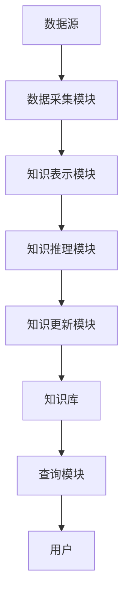

                 


# AI Agent的终身学习系统：构建LLM的动态知识库

> 关键词：AI Agent，终身学习系统，动态知识库，LLM，大语言模型，知识更新

> 摘要：本文系统地探讨了AI Agent的终身学习系统，重点介绍了如何构建和管理大语言模型（LLM）的动态知识库。通过分析AI Agent的核心概念、算法原理、系统架构和项目实战，本文为读者提供了一套完整的解决方案，帮助AI Agent能够持续适应不断变化的知识需求。

---

# 第一部分: AI Agent的终身学习系统概述

## 第1章: AI Agent与终身学习系统概述

### 1.1 AI Agent的基本概念

#### 1.1.1 AI Agent的定义与分类
AI Agent（人工智能代理）是指能够感知环境、自主决策并执行任务的智能实体。根据功能和应用场景的不同，AI Agent可以分为以下几类：
- **简单反射型Agent**：基于当前输入做出反应，不具备复杂的学习能力。
- **基于模型的反射型Agent**：通过内部模型感知环境并做出决策。
- **目标驱动型Agent**：根据预设目标执行任务。
- **效用驱动型Agent**：通过最大化效用函数来优化决策。

#### 1.1.2 AI Agent的核心特征
AI Agent的核心特征包括：
- **自主性**：能够自主决策和执行任务。
- **反应性**：能够实时感知环境并做出反应。
- **学习能力**：能够通过经验或数据不断优化自身能力。
- **适应性**：能够适应环境的变化和不确定性。

#### 1.1.3 AI Agent的应用场景
AI Agent广泛应用于多个领域，包括：
- **智能助手**：如Siri、Alexa等。
- **自动驾驶**：如自动驾驶汽车。
- **智能推荐系统**：如Netflix的内容推荐。
- **机器人**：如工业机器人和家庭服务机器人。

### 1.2 终身学习系统的基本概念

#### 1.2.1 终身学习的定义与特点
终身学习系统是指能够在不断变化的环境中持续学习和适应的系统。其特点包括：
- **持续性**：能够持续接收新数据并更新知识。
- **动态性**：能够根据新信息动态调整模型或策略。
- **自适应性**：能够根据环境变化自动优化自身性能。

#### 1.2.2 终身学习在AI Agent中的作用
终身学习系统在AI Agent中的作用包括：
- **提高适应性**：使AI Agent能够更好地应对复杂多变的环境。
- **增强决策能力**：通过持续学习，AI Agent能够做出更准确的决策。
- **扩展应用场景**：使AI Agent能够在更多领域中应用。

#### 1.2.3 终身学习系统的挑战与机遇
终身学习系统的挑战包括：
- **数据异构性**：不同来源的数据格式和质量差异较大。
- **计算资源限制**：持续学习需要大量计算资源。
- **模型漂移**：长期训练可能导致模型性能下降。

终身学习系统的机遇包括：
- **实时更新**：能够实时更新模型，适应环境变化。
- **个性化服务**：能够根据用户需求提供个性化服务。
- **多任务学习**：能够同时处理多个任务，提高效率。

### 1.3 动态知识库的必要性

#### 1.3.1 知识库的基本概念
知识库是AI Agent进行推理和决策的基础，它包含了AI Agent所需的所有知识，包括事实、规则、关系等。

#### 1.3.2 动态知识库的特点
动态知识库的特点包括：
- **实时更新**：能够根据最新数据实时更新知识库。
- **自适应性**：能够根据环境变化自动调整知识库结构。
- **高效查询**：能够快速检索所需知识。

#### 1.3.3 动态知识库在AI Agent中的应用
动态知识库在AI Agent中的应用包括：
- **实时问答**：能够根据最新知识回答用户问题。
- **智能推荐**：根据最新数据提供个性化推荐。
- **复杂决策**：结合最新信息做出更复杂的决策。

---

## 第2章: AI Agent的终身学习系统背景

### 2.1 当前AI Agent的发展现状

#### 2.1.1 AI Agent技术的发展历程
AI Agent技术的发展经历了以下几个阶段：
- **早期阶段**：基于规则的AI Agent，如专家系统。
- **发展阶段**：基于机器学习的AI Agent，如支持向量机、决策树等。
- **当前阶段**：基于深度学习的AI Agent，如神经网络、强化学习等。

#### 2.1.2 当前AI Agent技术的主要趋势
当前AI Agent技术的主要趋势包括：
- **多模态交互**：支持文本、语音、视觉等多种交互方式。
- **强化学习**：通过强化学习提高AI Agent的自主决策能力。
- **人机协作**：AI Agent与人类协同工作，提高效率。

#### 2.1.3 AI Agent技术面临的挑战
AI Agent技术面临的挑战包括：
- **复杂环境**：如何在复杂多变的环境中做出决策。
- **数据隐私**：如何在保护数据隐私的前提下进行学习。
- **计算资源**：如何在有限的计算资源下实现高效的决策。

### 2.2 终身学习系统在AI Agent中的必要性

#### 2.2.1 数据爆炸时代的知识更新需求
在数据爆炸的时代，知识更新速度越来越快，AI Agent需要能够实时更新知识库，以应对新的挑战。

#### 2.2.2 AI Agent的动态适应能力
AI Agent需要能够动态适应环境的变化，终身学习系统是实现这一目标的关键。

#### 2.2.3 终身学习系统的应用场景
终身学习系统在AI Agent中的应用场景包括：
- **智能客服**：能够根据最新知识库提供准确的客户服务。
- **医疗诊断**：能够根据最新的医学研究提供诊断建议。
- **金融分析**：能够根据最新的市场数据进行分析和预测。

### 2.3 动态知识库的必要性

#### 2.3.1 知识库的动态更新
动态知识库需要能够实时更新，以应对环境的变化。

#### 2.3.2 知识库的自适应性
动态知识库需要能够根据环境变化自动调整知识库结构。

#### 2.3.3 知识库的高效查询
动态知识库需要能够快速检索所需知识，以支持AI Agent的实时决策。

---

## 第3章: 动态知识库的构建与管理

### 3.1 动态知识库的基本结构

#### 3.1.1 知识库的组成要素
动态知识库的组成要素包括：
- **数据源**：知识库的数据来源，如数据库、API、文本文件等。
- **知识表示**：知识库中知识的表示方式，如图结构、向量表示等。
- **知识推理**：基于知识库进行推理的能力，如逻辑推理、关联推理等。
- **知识更新**：根据新数据更新知识库的能力。

#### 3.1.2 知识库的组织方式
知识库的组织方式包括：
- **层次化组织**：将知识按层次结构组织，如树状结构。
- **网状组织**：将知识按网状结构组织，如图结构。
- **分布式组织**：将知识分散存储在不同的节点中。

#### 3.1.3 知识库的更新机制
知识库的更新机制包括：
- **实时更新**：根据实时数据更新知识库。
- **周期性更新**：定期更新知识库，如每天、每周更新一次。
- **事件驱动更新**：根据特定事件触发知识库更新。

### 3.2 动态知识库的构建方法

#### 3.2.1 数据采集与处理
数据采集与处理包括：
- **数据源选择**：选择合适的数据源，如公开数据库、API、爬虫数据等。
- **数据清洗**：对数据进行清洗，去除噪声数据。
- **数据预处理**：对数据进行预处理，如归一化、特征提取等。

#### 3.2.2 知识表示与推理
知识表示与推理包括：
- **知识表示**：将知识表示为某种形式，如图结构、向量表示等。
- **知识推理**：基于知识库进行推理，如逻辑推理、关联推理等。

#### 3.2.3 知识更新与维护
知识更新与维护包括：
- **知识更新**：根据新数据更新知识库。
- **知识校验**：对知识库中的知识进行校验，确保准确性。
- **知识扩展**：根据需要扩展知识库，如增加新的知识点。

### 3.3 动态知识库的管理策略

#### 3.3.1 知识库的版本控制
知识库的版本控制包括：
- **版本记录**：记录知识库的版本信息。
- **版本回滚**：在需要时回滚到之前的版本。
- **版本合并**：将多个版本的知识库进行合并。

#### 3.3.2 知识库的访问控制
知识库的访问控制包括：
- **权限管理**：根据权限控制对知识库的访问。
- **访问日志**：记录对知识库的访问日志。
- **安全审计**：对知识库的访问进行安全审计。

#### 3.3.3 知识库的性能优化
知识库的性能优化包括：
- **索引优化**：对知识库进行索引优化，提高查询效率。
- **缓存优化**：对知识库进行缓存优化，减少重复查询。
- **分布式存储**：将知识库分布式存储，提高存储效率。

---

## 第4章: AI Agent的终身学习系统核心算法

### 4.1 强化学习算法

#### 4.1.1 强化学习的基本概念
强化学习是一种通过试错方式来学习最优策略的算法。其核心是通过与环境交互，不断优化策略，以最大化累积奖励。

#### 4.1.2 强化学习的算法实现
强化学习的算法实现包括：
- **Q-learning**：通过更新Q值表来学习最优策略。
- **Deep Q-Network (DQN)**：使用深度神经网络来近似Q值函数。
- **Policy Gradient**：通过优化策略的参数来最大化累积奖励。

#### 4.1.3 强化学习在动态知识库中的应用
强化学习在动态知识库中的应用包括：
- **动态决策**：根据环境变化动态调整决策策略。
- **知识更新**：通过强化学习优化知识更新策略。
- **任务执行**：通过强化学习提高任务执行效率。

### 4.2 监督学习算法

#### 4.2.1 监督学习的基本概念
监督学习是一种通过标注数据进行学习的算法。其核心是通过训练数据学习映射关系，以预测新数据的标签。

#### 4.2.2 监督学习的算法实现
监督学习的算法实现包括：
- **线性回归**：用于回归问题的预测。
- **支持向量机 (SVM)**：用于分类问题的预测。
- **随机森林**：通过集成学习提高模型的泛化能力。

#### 4.2.3 监督学习在动态知识库中的应用
监督学习在动态知识库中的应用包括：
- **知识抽取**：通过监督学习从文本中抽取知识。
- **知识分类**：通过监督学习对知识进行分类。
- **知识预测**：通过监督学习预测未来的知识。

### 4.3 迁移学习算法

#### 4.3.1 迁移学习的基本概念
迁移学习是一种将已学习的知识应用到新任务中的算法。其核心是通过共享特征或任务，减少新任务的学习成本。

#### 4.3.2 迁移学习的算法实现
迁移学习的算法实现包括：
- **直接迁移**：直接将源任务的模型应用到目标任务。
- **特征提取**：通过提取源任务的特征，用于目标任务的学习。
- **领域适配**：通过适配领域差异，提高迁移学习的效果。

#### 4.3.3 迁移学习在动态知识库中的应用
迁移学习在动态知识库中的应用包括：
- **跨领域知识更新**：将已学习的知识应用到新的领域。
- **多任务学习**：通过迁移学习同时处理多个任务。
- **知识融合**：通过迁移学习融合不同来源的知识。

---

## 第5章: 动态知识库的系统架构与实现

### 5.1 系统架构设计

#### 5.1.1 系统功能设计
动态知识库的系统功能设计包括：
- **数据采集**：从多种数据源采集数据。
- **知识表示**：将数据转化为知识表示。
- **知识推理**：基于知识表示进行推理。
- **知识更新**：根据新数据更新知识库。

#### 5.1.2 系统架构图
以下是一个动态知识库的系统架构图：



#### 5.1.3 系统交互设计
动态知识库的系统交互设计包括：
- **用户查询**：用户通过查询模块查询知识库。
- **知识更新**：知识更新模块根据新数据更新知识库。
- **系统反馈**：系统通过反馈模块向用户反馈查询结果。

### 5.2 系统实现细节

#### 5.2.1 数据采集模块
数据采集模块负责从多种数据源采集数据，包括：
- **数据库**：从关系型数据库中采集结构化数据。
- **API**：通过API接口采集半结构化数据。
- **文本文件**：从文本文件中采集非结构化数据。

#### 5.2.2 知识表示模块
知识表示模块负责将采集到的数据转化为知识表示，包括：
- **图结构表示**：将知识表示为图结构，如节点和边。
- **向量表示**：将知识表示为向量，用于相似性计算。
- **规则表示**：通过规则表示知识，如逻辑规则。

#### 5.2.3 知识推理模块
知识推理模块负责基于知识表示进行推理，包括：
- **逻辑推理**：通过逻辑推理得出结论。
- **关联推理**：通过关联推理发现知识之间的联系。
- **归纳推理**：通过归纳推理发现新的知识。

#### 5.2.4 知识更新模块
知识更新模块负责根据新数据更新知识库，包括：
- **数据清洗**：对新数据进行清洗，去除噪声数据。
- **知识融合**：将新数据与现有知识融合，更新知识库。
- **知识校验**：对更新后的知识进行校验，确保准确性。

---

## 第6章: 项目实战与经验分享

### 6.1 项目背景介绍

#### 6.1.1 项目目标
本项目的目标是构建一个动态知识库，支持AI Agent的终身学习系统。

#### 6.1.2 项目需求
本项目的具体需求包括：
- **实时更新**：知识库能够实时更新。
- **高效查询**：知识库能够快速响应查询请求。
- **自适应性**：知识库能够根据环境变化自动调整。

### 6.2 核心功能实现

#### 6.2.1 环境安装与配置
为了运行本项目，需要安装以下环境：
- **Python 3.8+**
- **TensorFlow 2.0+**
- **numpy**
- **pandas**

安装命令如下：

```bash
pip install numpy pandas tensorflow
```

#### 6.2.2 核心代码实现

##### 数据采集模块

```python
import requests
import json

def fetch_data(url):
    response = requests.get(url)
    if response.status_code == 200:
        return json.loads(response.text)
    else:
        return None
```

##### 知识表示模块

```python
from tensorflow.keras import layers

def build_knowledge_representation_model(input_shape):
    model = tf.keras.Sequential()
    model.add(layers.Dense(128, activation='relu', input_shape=input_shape))
    model.add(layers.Dense(64, activation='relu'))
    model.add(layers.Dense(1, activation='sigmoid'))
    model.compile(optimizer='adam', loss='binary_crossentropy', metrics=['accuracy'])
    return model
```

##### 知识推理模块

```python
def perform_reasoning(knowledge_base, query):
    # 在知识库中进行推理，返回结果
    pass
```

##### 知识更新模块

```python
def update_knowledge_base(knowledge_base, new_data):
    # 更新知识库，添加新数据
    pass
```

### 6.3 项目部署与测试

#### 6.3.1 系统部署
将系统部署到服务器上，配置好相关的依赖项。

#### 6.3.2 功能测试
对系统进行功能测试，包括：
- **数据采集测试**：测试数据采集模块是否能够正确采集数据。
- **知识表示测试**：测试知识表示模块是否能够正确表示知识。
- **知识推理测试**：测试知识推理模块是否能够正确推理。
- **知识更新测试**：测试知识更新模块是否能够正确更新知识库。

#### 6.3.3 性能测试
对系统进行性能测试，包括：
- **查询性能测试**：测试系统在高并发情况下的查询性能。
- **更新性能测试**：测试系统在高并发情况下的更新性能。
- **扩展性测试**：测试系统在数据量增加情况下的扩展性。

### 6.4 经验总结与优化建议

#### 6.4.1 经验总结
通过本项目，我们总结出以下经验：
- **数据质量**：数据的质量对知识库的准确性影响重大。
- **模型选择**：选择合适的模型能够显著提高系统的性能。
- **系统架构**：合理的系统架构能够提高系统的扩展性和维护性。

#### 6.4.2 优化建议
针对本项目，我们提出以下优化建议：
- **数据预处理**：增加数据预处理步骤，提高数据质量。
- **模型优化**：尝试不同的模型结构，找到最优模型。
- **系统优化**：优化系统架构，提高系统的扩展性和性能。

---

## 第7章: 最佳实践与未来展望

### 7.1 最佳实践

#### 7.1.1 小结
通过本文的探讨，我们了解到AI Agent的终身学习系统的核心在于动态知识库的构建与管理。动态知识库需要能够实时更新，支持高效的查询，并且能够根据环境变化自适应调整。

#### 7.1.2 注意事项
在实际应用中，需要注意以下几点：
- **数据隐私**：在构建动态知识库时，要注意保护数据隐私。
- **模型选择**：选择合适的模型能够显著提高系统的性能。
- **系统维护**：定期维护系统，确保系统的稳定性和可靠性。

#### 7.1.3 拓展阅读
推荐以下拓展阅读资料：
- **《深度学习》—— Ian Goodfellow**
- **《机器学习实战》—— 周志华**
- **《强化学习（Deep Reinforcement Learning）》—— 外部资料**

### 7.2 未来展望

#### 7.2.1 AI Agent的发展趋势
AI Agent的发展趋势包括：
- **多模态交互**：支持更多的交互方式，如语音、视觉等。
- **强化学习**：通过强化学习提高AI Agent的自主决策能力。
- **人机协作**：AI Agent与人类协同工作，提高效率。

#### 7.2.2 动态知识库的未来发展方向
动态知识库的未来发展方向包括：
- **知识图谱**：构建更复杂的知识图谱，支持更复杂的推理。
- **知识表示学习**：研究更高效的知识表示方法。
- **实时更新技术**：研究更高效的实时更新技术。

---

## 总结

通过本文的探讨，我们系统地了解了AI Agent的终身学习系统的核心概念、算法原理、系统架构和项目实现。我们还通过具体的代码实现和案例分析，深入理解了动态知识库的构建与管理。未来，随着AI技术的不断发展，AI Agent的终身学习系统将在更多领域得到应用，动态知识库也将变得更加智能和高效。

