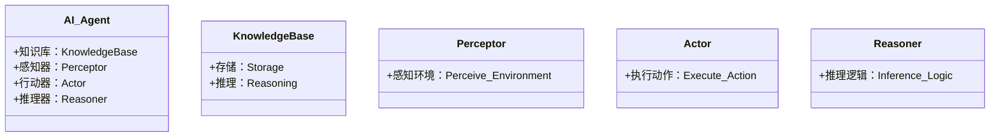
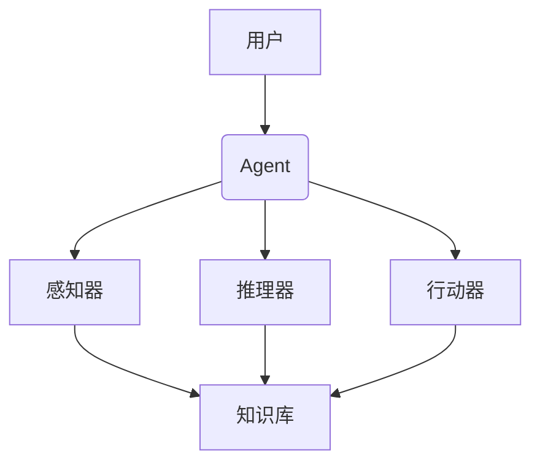

                 


# AI Agent的终身学习：持续更新和扩展知识库

> 关键词：AI Agent，终身学习，知识库，机器学习，知识图谱

> 摘要：AI Agent作为人工智能的核心技术，需要具备持续学习和知识更新的能力，以应对复杂多变的环境。本文详细探讨了AI Agent的终身学习机制，包括知识库的构建与管理、终身学习的核心概念与原理、算法实现以及系统架构设计等方面，帮助读者全面理解AI Agent的终身学习过程。

---

# 第一部分: AI Agent的终身学习背景与核心概念

## 第1章: AI Agent的基本概念与终身学习的必要性

### 1.1 AI Agent的定义与特征

#### 1.1.1 AI Agent的定义
AI Agent（人工智能代理）是指能够感知环境、自主决策并执行任务的智能实体。它可以是一个软件程序、机器人或其他智能系统，具备以下核心特征：

- **自主性**：能够在没有外部干预的情况下自主运行。
- **反应性**：能够实时感知环境并做出反应。
- **目标导向**：具备明确的目标，并根据目标做出决策。
- **学习能力**：能够通过经验或数据不断优化自身的性能。

#### 1.1.2 AI Agent的核心特征
AI Agent的目标是通过感知和行动来实现特定任务。例如，一个智能音箱（如Alexa）就是一个AI Agent，它能够通过语音交互感知用户的需求，并通过执行预设的指令来实现目标。

#### 1.1.3 AI Agent与传统AI的区别
传统AI通常是指静态的规则引擎或专家系统，依赖于预定义的规则来处理问题。而AI Agent则具备动态适应环境的能力，能够根据实时反馈不断调整自身的行为。

---

### 1.2 终身学习的背景与必要性

#### 1.2.1 AI Agent面临的动态环境挑战
现实世界是一个动态变化的环境。AI Agent需要处理的任务往往具有不确定性，例如自然语言处理中的语义理解、机器人导航中的动态障碍物等。这些任务要求AI Agent能够不断学习和适应新的环境。

#### 1.2.2 终身学习在AI Agent中的重要性
终身学习是指AI Agent能够持续地从经验中学习，并不断更新自身的知识库。这种能力使得AI Agent能够应对复杂多变的任务需求，例如智能助手需要理解用户的上下文信息并提供准确的服务。

#### 1.2.3 终身学习的驱动力
- **数据驱动**：通过不断收集新的数据，AI Agent能够更新其模型和知识库。
- **任务驱动**：根据任务的需求，AI Agent有选择地学习相关知识。
- **环境驱动**：通过与环境的交互，AI Agent能够实时感知并调整自身的行为。

---

### 1.3 知识库的构建与管理

#### 1.3.1 知识库的基本概念
知识库是AI Agent存储和管理知识的结构化数据集。它通常包含事实、规则、概念和语义信息，能够帮助AI Agent理解和推理问题。

#### 1.3.2 知识库的构建方法
知识库的构建可以通过以下几种方法：
- **手动构建**：由人工编写知识库中的内容，适用于小规模的知识库。
- **自动构建**：通过爬虫、自然语言处理（NLP）等技术从互联网上自动提取知识。
- **半自动构建**：结合手动和自动方法，提高知识库的准确性和效率。

#### 1.3.3 知识库的更新与维护
知识库的更新与维护是终身学习的重要环节。AI Agent需要定期检查知识库的有效性，并根据新的数据进行更新。例如，当用户提出新的问题时，AI Agent可以将新的知识添加到知识库中。

---

### 1.4 本章小结

本章介绍了AI Agent的基本概念和终身学习的必要性，强调了知识库在AI Agent中的重要性。通过理解这些概念，读者可以更好地理解AI Agent如何通过终身学习来应对复杂环境。

---

# 第二部分: AI Agent终身学习的核心概念与联系

## 第2章: 终身学习的核心概念与原理

### 2.1 终身学习的定义与特征

#### 2.1.1 终身学习的定义
终身学习是指AI Agent能够持续地从经验中学习，并不断更新自身的知识库。这种学习机制使得AI Agent能够适应不断变化的环境。

#### 2.1.2 终身学习的核心特征
- **持续性**：学习过程是持续的，而不是一次性完成的。
- **自适应性**：AI Agent能够根据环境的变化调整学习策略。
- **目标导向**：学习是有目标的，而不是随机的。

#### 2.1.3 终身学习与传统学习的区别
传统学习通常是指在固定的数据集上进行监督学习或无监督学习。而终身学习强调的是在动态环境中持续学习。

---

### 2.2 AI Agent中的知识表示与推理

#### 2.2.1 知识表示的基本方法
知识表示是AI Agent理解和推理的基础。常见的知识表示方法包括：
- **符号表示**：使用符号逻辑表示知识，例如一阶逻辑（FOIL）。
- **语义网络**：通过节点和边表示概念及其关系。
- **知识图谱**：通过实体和关系构建结构化的知识库。

#### 2.2.2 知识推理的原理与方法
知识推理是指AI Agent根据已有的知识库推导新的知识。常见的推理方法包括：
- **演绎推理**：从一般到特定的推理，例如从“所有鸟都会飞”推导出“鸵鸟不会飞”（如果已知鸵鸟是鸟）。
- **归纳推理**：从特定到一般的推理，例如从“所有的天鹅都是白色的”推导出“天鹅是白色的”。

#### 2.2.3 知识图谱的构建与应用
知识图谱是一种结构化的知识表示方法，广泛应用于搜索引擎、问答系统等领域。例如，Google的Knowledge Graph就是一个大型的知识图谱。

---

### 2.3 终身学习与知识库的关联

#### 2.3.1 终身学习如何影响知识库
AI Agent通过终身学习不断更新知识库，使其更加准确和完整。例如，当AI Agent在与用户的交互中发现新的信息时，可以将这些信息添加到知识库中。

#### 2.3.2 知识库如何支持终身学习
知识库为AI Agent提供了背景知识和上下文信息，帮助其更好地理解用户的需求并做出准确的回应。

#### 2.3.3 知识库的动态更新机制
动态更新机制是终身学习的重要组成部分。AI Agent需要定期检查知识库的有效性，并根据新的数据进行更新。

---

### 2.4 核心概念对比表

| 概念       | 定义                                                                 | 特征                     | 应用场景                          |
|------------|----------------------------------------------------------------------|--------------------------|----------------------------------|
| AI Agent   | 能够感知环境、自主决策并执行任务的智能实体 | 自主性、反应性、目标导向、学习能力 | 智能助手、自动驾驶、机器人等   |
| 终身学习   | 持续从经验中学习并更新知识库的过程         | 持续性、自适应性、目标导向   | 处理复杂任务、应对变化环境    |
| 知识库     | 存储和管理知识的结构化数据集             | 结构化、可扩展性、动态性     | 搜索引擎、问答系统、智能助手等 |

---

## 第3章: 终身学习的核心算法与实现

### 3.1 经验重放（Experience Replay）

#### 3.1.1 算法原理
经验重放是一种用于强化学习的技术。AI Agent将过去的交互经验存储在一个经验回放缓冲区中，并在训练时随机采样这些经验，以提高学习的稳定性。

#### 3.1.2 算法实现
以下是经验重放的Python实现示例：

```python
import random

class ExperienceReplay:
    def __init__(self, capacity):
        self.capacity = capacity
        self.memory = []

    def remember(self, state, action, reward, next_state):
        if len(self.memory) < self.capacity:
            self.memory.append((state, action, reward, next_state))
        else:
            # 替换一个随机的位置
            index = random.randint(0, self.capacity - 1)
            self.memory[index] = (state, action, reward, next_state)

    def sample(self, batch_size):
        return random.sample(self.memory, batch_size)
```

#### 3.1.3 算法优势
经验重放可以帮助AI Agent克服环境中的稀疏奖励问题，提高学习效率。

---

### 3.2 策略梯度方法（Policy Gradient Methods）

#### 3.2.1 算法原理
策略梯度方法是一种基于强化学习的技术，通过优化策略函数来最大化期望奖励。其数学表达式如下：

$$ J(\theta) = \mathbb{E}_{\tau \sim \pi_\theta} [\log \pi_\theta(a_t|s_t) \cdot R(\tau)] $$

其中，$\theta$ 是策略函数的参数，$\tau$ 是一个轨迹，$R(\tau)$ 是轨迹的总奖励。

#### 3.2.2 算法实现
以下是策略梯度方法的Python实现示例：

```python
import torch
import torch.nn as nn
import torch.optim as optim

class PolicyNetwork(nn.Module):
    def __init__(self, input_dim, output_dim):
        super(PolicyNetwork, self).__init__()
        self.fc1 = nn.Linear(input_dim, 128)
        self.fc2 = nn.Linear(128, output_dim)
        self.softmax = nn.Softmax(dim=-1)

    def forward(self, x):
        x = torch.relu(self.fc1(x))
        x = self.softmax(self.fc2(x))
        return x

# 初始化网络
input_dim = 4  # 状态空间维度
output_dim = 2  # 动作空间维度
policy_net = PolicyNetwork(input_dim, output_dim)
optimizer = optim.Adam(policy_net.parameters(), lr=0.001)
```

---

### 3.3 知识蒸馏（Knowledge Distillation）

#### 3.3.1 算法原理
知识蒸馏是一种将知识从一个复杂的模型（教师）传递到一个简单的模型（学生）的技术。其核心思想是通过教师模型的软标签（soft labels）来指导学生模型的学习。

#### 3.3.2 算法实现
以下是知识蒸馏的Python实现示例：

```python
import torch
import torch.nn as nn
import torch.optim as optim

class TeacherModel(nn.Module):
    def __init__(self):
        super(TeacherModel, self).__init__()
        self.fc1 = nn.Linear(2, 128)
        self.fc2 = nn.Linear(128, 1)

    def forward(self, x):
        x = torch.relu(self.fc1(x))
        x = self.fc2(x)
        return x

class StudentModel(nn.Module):
    def __init__(self):
        super(StudentModel, self).__init__()
        self.fc1 = nn.Linear(2, 64)
        self.fc2 = nn.Linear(64, 1)

    def forward(self, x):
        x = torch.relu(self.fc1(x))
        x = self.fc2(x)
        return x

# 初始化模型
teacher = TeacherModel()
student = StudentModel()
optimizer = optim.Adam(student.parameters(), lr=0.001)
criterion = nn.MSELoss()

# 知识蒸馏
for epoch in range(100):
    optimizer.zero_grad()
    outputs_teacher = teacher(x)
    outputs_student = student(x)
    loss = criterion(outputs_student, outputs_teacher)
    loss.backward()
    optimizer.step()
```

---

## 第4章: 系统分析与架构设计

### 4.1 问题场景介绍

#### 4.1.1 问题描述
假设我们正在开发一个智能客服系统，AI Agent需要能够通过与用户的交互不断更新其知识库，以更好地理解和回答用户的问题。

#### 4.1.2 项目介绍
本项目旨在设计一个基于终身学习的AI Agent，使其能够通过与用户的交互不断更新其知识库。

---

### 4.2 系统功能设计

#### 4.2.1 领域模型（Domain Model）



#### 4.2.2 系统架构设计



---

## 第5章: 项目实战与案例分析

### 5.1 环境安装

#### 5.1.1 安装Python
```bash
python --version
```

#### 5.1.2 安装依赖
```bash
pip install numpy torch matplotlib
```

---

### 5.2 核心代码实现

#### 5.2.1 知识库管理模块

```python
class KnowledgeBase:
    def __init__(self):
        self.storage = {}

    def add_knowledge(self, key, value):
        self.storage[key] = value

    def update_knowledge(self, key, value):
        self.storage[key] = value

    def get_knowledge(self, key):
        return self.storage.get(key, None)
```

#### 5.2.2 AI Agent实现

```python
class AIAgent:
    def __init__(self, knowledge_base):
        self.knowledge_base = knowledge_base
        self.perceptor = Perceptor()
        self.actor = Actor()
        self.reasoer = Reasoner()

    def perceive(self, environment):
        self.perceptor.perceive_environment(environment)

    def act(self):
        self.actor.execute_action()

    def reason(self):
        self.reasoer.inference_logic()
```

---

### 5.3 案例分析

#### 5.3.1 环境配置
```bash
# 安装必要的Python包
pip install numpy torch matplotlib
```

#### 5.3.2 核心代码实现

```python
# 初始化知识库
kb = KnowledgeBase()
kb.add_knowledge("temperature", 25)
kb.add_knowledge("humidity", 60)

# 初始化AI Agent
agent = AIAgent(kb)
agent.perceive("current_environment")
agent.reason()
agent.act()
```

---

### 5.4 项目总结

通过本项目的实现，我们成功设计了一个基于终身学习的AI Agent，并通过具体案例展示了其知识库的更新和扩展过程。

---

# 第六部分: 最佳实践与总结

## 第6章: 小结与注意事项

### 6.1 小结
AI Agent的终身学习是一个复杂但重要的任务，需要结合知识表示、机器学习和系统架构等多方面的知识。通过不断学习和更新知识库，AI Agent能够更好地适应复杂多变的环境。

### 6.2 注意事项
- **数据质量**：知识库的准确性依赖于数据的质量。
- **学习效率**：选择合适的学习算法可以提高学习效率。
- **系统架构**：合理的系统架构是实现终身学习的关键。

---

## 第7章: 拓展阅读与学习资源

### 7.1 推荐书籍
- 《深度学习》—— Ian Goodfellow
- 《机器学习实战》—— 周志华
- 《知识图谱：概念、方法与应用》—— 王伟

### 7.2 在线资源
- [Awesome AI](https://github.com/curtislb/awesome-ai)
- [Towards Data Science](https://towardsdatascience.com/)
- [Google Knowledge Graph](https://kgi.googleapis.com/kg/v1/)

---

通过本文的详细讲解，读者可以全面理解AI Agent的终身学习机制，并掌握相关的技术和方法。希望本文能够为AI领域的研究和实践提供有价值的参考。

