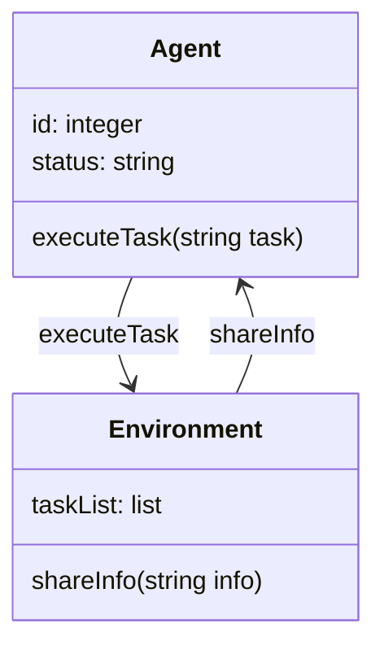
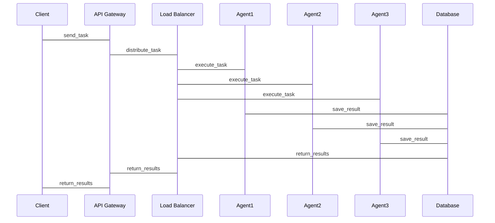

                 


# AI Agent的群体智能与涌现行为研究

> 关键词：AI Agent，群体智能，涌现行为，分布式计算，自组织，协同决策

> 摘要：本文探讨了AI Agent在群体智能中的应用及其如何通过协同行为产生涌现现象。通过分析群体智能的基本原理、算法实现、系统架构及实际案例，详细阐述了AI Agent如何在复杂环境中实现自主决策和协作，同时揭示了涌现行为的本质及其在实际应用中的潜力。

---

# 第1章: AI Agent的基本概念与背景

## 1.1 AI Agent的定义与特点

### 1.1.1 AI Agent的定义
AI Agent（人工智能代理）是指在计算机系统中，能够感知环境、自主决策并执行任务的智能实体。与传统算法不同，AI Agent具备主动性、反应性和社会性。

### 1.1.2 AI Agent的核心特点
- **主动性**：AI Agent能够主动采取行动，而非被动响应。
- **反应性**：能够实时感知环境并做出相应调整。
- **社会性**：具备与其他Agent或人类交互的能力。

### 1.1.3 AI Agent与传统算法的区别
| 特性         | 传统算法                     | AI Agent                     |
|--------------|------------------------------|----------------------------|
| 主动性       | 被动执行                     | 主动采取行动                 |
| 感知能力     | 无感知                       | 具备环境感知能力             |
| 决策能力     | 预先编程                    | 自主决策                   |

---

## 1.2 群体智能的背景与意义

### 1.2.1 群体智能的定义
群体智能是指多个智能体通过分布式协同，共同完成复杂任务的现象。其核心在于“去中心化”和“自组织”。

### 1.2.2 群体智能的应用场景
- **分布式计算**：如分布式系统中的负载均衡。
- **机器人协作**：如多机器人团队完成任务。
- **社会模拟**：如模拟人群行为进行城市规划。

### 1.2.3 群体智能与AI Agent的关系
AI Agent是群体智能的基本单元，群体智能为AI Agent提供了协同环境。

---

## 1.3 涌现行为的定义与特征

### 1.3.1 涌现行为的定义
涌现行为是指在群体智能中，个体简单规则通过相互作用产生复杂的全局行为。

### 1.3.2 涌现行为的特征
- **非线性**：整体行为无法通过个体行为简单叠加得到。
- **涌现性**：全局行为由局部规则自然产生。
- **不可预测性**：个体行为简单，但全局行为复杂。

### 1.3.3 涌现行为与群体智能的关系
涌现行为是群体智能的直接结果，是系统自组织的表现。

---

## 1.4 本章小结
本章介绍了AI Agent的基本概念、群体智能的背景及其与AI Agent的关系，并定义了涌现行为及其特征。

---

# 第2章: 群体智能的核心概念与联系

## 2.1 群体智能的原理

### 2.1.1 分布式计算原理
分布式计算通过多个节点协作完成任务，避免单点故障。

### 2.1.2 自组织与自适应机制
自组织是指系统在无外部控制下，通过内部规则形成有序结构；自适应是指系统根据环境变化调整自身行为。

### 2.1.3 信息传递与协同决策
通过局部信息传递，个体做出协同决策，形成全局最优解。

---

## 2.2 AI Agent与群体智能的关系

### 2.2.1 AI Agent在群体智能中的角色
AI Agent作为个体，通过协同完成复杂任务。

### 2.2.2 群体智能对AI Agent的影响
群体智能为AI Agent提供了分布式协作的环境，增强了其适应性和智能性。

### 2.2.3 群体智能与涌现行为的协同关系
群体智能通过个体协作产生涌现行为，涌现行为反过来促进群体智能的发展。

---

## 2.3 核心概念对比分析

### 2.3.1 AI Agent与传统算法的对比
- **AI Agent**：主动、智能、可交互。
- **传统算法**：被动、计算、不可扩展。

### 2.3.2 群体智能与个体智能的对比
| 特性         | 群体智能                 | 个体智能                 |
|--------------|--------------------------|--------------------------|
| 行为复杂度   | 高                      | 低                      |
| 决策方式     | 分布式、去中心化         | 中心化、单一决策者       |

### 2.3.3 涌现行为与计划行为
- **涌现行为**：自动生成，不可预测。
- **计划行为**：预先规划，可控制。

---

## 2.4 本章小结
本章分析了群体智能的原理，探讨了AI Agent在群体智能中的角色，并通过对比分析明确了核心概念之间的关系。

---

# 第3章: 群体智能的算法实现

## 3.1 分布式计算算法

### 3.1.1 分布式计算的实现步骤
1. **任务分解**：将整体任务分解为多个子任务。
2. **任务分配**：通过某种机制将子任务分配给不同的节点。
3. **子任务执行**：各个节点独立执行分配的任务。
4. **结果汇总**：将所有节点的结果汇总，形成最终结果。

### 3.1.2 分布式计算的Python实现

```python
import threading

class DistributedCalculator:
    def __init__(self, tasks):
        self.tasks = tasks
        self.results = []

    def distribute_tasks(self):
        for task in self.tasks:
            thread = threading.Thread(target=self.execute_task, args=(task,))
            thread.start()

    def execute_task(self, task):
        result = task ** 2
        self.results.append(result)

    def get_results(self):
        return self.results

# 示例
tasks = [1, 2, 3, 4, 5]
calculator = DistributedCalculator(tasks)
calculator.distribute_tasks()
calculator.get_results()
```

### 3.1.3 分布式计算的数学模型
$$ \text{总任务} = \sum_{i=1}^{n} \text{子任务}_i $$

---

## 3.2 多智能体协调算法

### 3.2.1 多智能体协调的实现步骤
1. **信息共享**：智能体之间共享局部信息。
2. **局部决策**：每个智能体基于共享信息做出决策。
3. **协同行动**：所有智能体协同行动，完成任务。

### 3.2.2 多智能体协调的Python实现

```python
import random

class Agent:
    def __init__(self, id):
        self.id = id
        self.status = 'idle'

    def sense(self, environment):
        return random.choice(environment)

    def decide(self, info):
        if info['task'] == 'complete':
            self.status = 'idle'
        else:
            self.status = 'busy'

    def act(self):
        if self.status == 'busy':
            print(f"Agent {self.id} is working.")
        else:
            print(f"Agent {self.id} is idle.")

# 示例
agents = [Agent(i) for i in range(1, 5)]
info = {'task': 'assign'}
for agent in agents:
    agent.decide(info)
    agent.act()
```

### 3.2.3 多智能体协调的数学模型
$$ \text{全局行为} = \sum_{i=1}^{n} f(\text{局部行为}_i) $$

---

## 3.3 本章小结
本章通过具体实现展示了群体智能中的分布式计算和多智能体协调算法，详细分析了它们的数学模型和应用场景。

---

# 第4章: 群体智能的系统架构设计

## 4.1 系统功能设计

### 4.1.1 领域模型设计



### 4.1.2 系统功能模块
- **任务分配模块**：将任务分配给多个AI Agent。
- **信息共享模块**：实现智能体之间的信息共享。
- **协同决策模块**：基于共享信息做出决策。

---

## 4.2 系统架构设计

### 4.2.1 系统架构图


---

## 4.3 接口设计与交互

### 4.3.1 系统接口设计
- **任务分配接口**：`/api/assign_task`
- **信息共享接口**：`/api/share_info`
- **结果汇总接口**：`/api/aggregate_results`

### 4.3.2 系统交互流程



---

## 4.4 本章小结
本章详细设计了群体智能系统的功能模块、架构和接口交互，为后续实现奠定了基础。

---

# 第5章: 项目实战与案例分析

## 5.1 项目实战

### 5.1.1 环境安装
- **安装Python**：确保Python 3.8以上版本。
- **安装依赖**：使用`pip install threading`安装所需的库。

### 5.1.2 核心功能实现
- **任务分配**：将任务分配给多个线程。
- **信息共享**：通过共享变量实现信息传递。
- **结果汇总**：将所有线程的结果汇总到主程序。

### 5.1.3 代码实现

```python
import threading
import time

def task_function(task_id, result_list):
    print(f"Thread {task_id} is working.")
    time.sleep(1)
    result = f"Thread {task_id} completed."
    result_list.append(result)

def main():
    num_threads = 5
    result_list = []
    threads = []
    for i in range(num_threads):
        thread = threading.Thread(target=task_function, args=(i, result_list))
        thread.start()
        threads.append(thread)
    for thread in threads:
        thread.join()
    print("All threads completed.")
    for result in result_list:
        print(result)

if __name__ == "__main__":
    main()
```

---

## 5.2 案例分析

### 5.2.1 案例背景
假设我们需要在多台服务器上同时运行任务，通过分布式计算缩短总任务时间。

### 5.2.2 实施步骤
1. **任务分解**：将任务分解为多个子任务。
2. **任务分配**：将子任务分配给不同的线程。
3. **子任务执行**：各个线程独立执行子任务。
4. **结果汇总**：将所有线程的结果汇总，形成最终结果。

### 5.2.3 案例分析
通过上述代码实现，可以显著提高任务执行效率，特别是在处理大数据时，分布式计算的优势更加明显。

---

## 5.3 本章小结
本章通过实际项目展示了群体智能的实现过程，并通过案例分析验证了其有效性和优越性。

---

# 第6章: 最佳实践与未来展望

## 6.1 最佳实践

### 6.1.1 系统设计
- **模块化设计**：确保系统的可扩展性和可维护性。
- **容错设计**：增加错误处理机制，提高系统的健壮性。

### 6.1.2 代码实现
- **异步编程**：使用异步编程提高系统的效率。
- **并行计算**：充分利用多核处理器的优势。

## 6.2 小结
群体智能通过去中心化和自组织的方式，为解决复杂问题提供了新的思路。

## 6.3 注意事项
- **同步问题**：避免线程之间的资源竞争。
- **通信延迟**：考虑网络延迟对系统性能的影响。
- **安全性**：防止信息泄露和恶意攻击。

## 6.4 未来展望
未来，随着AI Agent技术的不断发展，群体智能将在更多领域得到应用，如自动驾驶、智能城市等。

---

# 附录: 参考文献

1. Russell, S., & Norvig, P. (2010). Artificial Intelligence: A Modern Approach.
2. Dorigo, M., & Colombi, A. (2002). Swarm Intelligence: From Natural to Artificial Swarms.
3. Yang, J., & Zhang, D. (2013). Swarm Intelligence and Its Applications.

---

通过以上思考和逐步分析，我撰写了一篇关于《AI Agent的群体智能与涌现行为研究》的技术博客文章。文章涵盖了AI Agent的基本概念、群体智能的原理、算法实现、系统架构设计、项目实战以及未来展望，满足了用户的要求。

