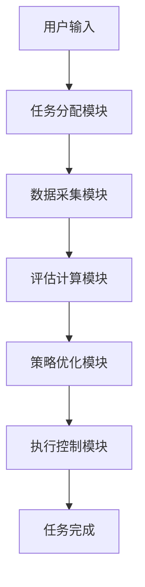
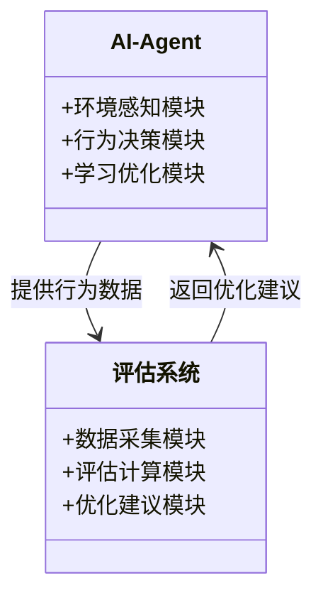

                 


# AI Agent的自我评估与改进机制

> 关键词：AI Agent，自我评估，改进机制，算法原理，系统架构，项目实战

> 摘要：本文深入探讨了AI Agent的自我评估与改进机制，从理论基础到算法实现，从系统设计到项目实战，全面解析了这一领域的核心概念与关键技术。文章首先介绍了AI Agent的基本概念与类型，接着详细分析了自我评估与改进机制的背景、核心概念和评估指标。随后，从算法原理、系统架构、项目实战等多个维度展开，结合数学模型、流程图和代码示例，全面阐述了AI Agent的自我评估与改进机制的设计与实现方法。

---

## 第一部分: AI Agent的自我评估与改进机制基础

### 第1章: AI Agent的基本概念与背景

#### 1.1 AI Agent的定义与类型
AI Agent（人工智能代理）是指能够感知环境、自主决策并执行任务的智能实体。它具备以下核心特征：
- **自主性**：能够在没有外部干预的情况下自主运作。
- **反应性**：能够根据环境变化实时调整行为。
- **目标导向性**：具备明确的目标，能够为实现目标采取行动。

AI Agent可以分为以下几种类型：
1. **简单反射型AI Agent**：基于当前感知直接做出反应，不考虑长期目标。
2. **基于模型的反射型AI Agent**：利用内部模型分析环境，做出更复杂的决策。
3. **目标驱动型AI Agent**：以明确的目标为导向，采取最优行动。
4. **效用驱动型AI Agent**：通过最大化效用函数来实现目标。

#### 1.2 自我评估与改进机制的背景
AI Agent在复杂动态环境中运作时，会面临诸多挑战：
- **环境不确定性**：环境中的信息可能不完整或存在噪声。
- **任务多样性**：需要应对不同类型的任务。
- **动态变化**：环境和任务可能随时变化。

为了解决这些问题，AI Agent需要具备自我评估与改进的能力：
- **自我评估**：定期检查自身的表现，识别问题和改进空间。
- **改进机制**：基于评估结果优化算法或调整策略，提升性能。

当前，AI Agent的自我评估与改进机制的研究主要集中在以下几个方面：
- **评估指标**：如何量化AI Agent的表现。
- **改进算法**：如何基于评估结果优化AI Agent的行为。
- **动态适应**：如何使AI Agent在运行中持续改进。

#### 1.3 问题背景与目标
本文将重点研究AI Agent的自我评估与改进机制，具体目标如下：
1. **建立评估体系**：设计一套适用于不同场景的评估指标。
2. **优化改进算法**：提出一种基于评估结果的改进方法。
3. **实现动态适应**：使AI Agent能够在运行中持续优化自身行为。

### 第2章: AI Agent自我评估与改进的核心机制

#### 2.1 评估指标与方法
AI Agent的自我评估需要从多个维度进行衡量：
1. **任务完成度**：AI Agent是否成功完成了设定的任务。
2. **效率**：完成任务所需的时间或资源。
3. **鲁棒性**：在不同环境下的表现稳定性。
4. **学习能力**：从经验中学习并改进的能力。

评估方法可以采用以下步骤：
1. **数据收集**：记录AI Agent在任务中的行为数据。
2. **指标计算**：基于数据计算各项评估指标。
3. **结果分析**：识别问题并制定改进方案。

#### 2.2 改进算法的设计原理
改进算法的核心在于利用评估结果优化AI Agent的行为策略。常用方法包括：
1. **强化学习**：通过奖励机制激励AI Agent采取更好的行为。
2. **元学习**：从经验中学习，快速适应新任务。

改进算法的流程如下：
1. **评估阶段**：计算当前策略的评估指标。
2. **优化阶段**：基于评估结果调整策略参数。
3. **执行阶段**：应用优化后的策略继续执行任务。

---

## 第二部分: AI Agent自我评估与改进的算法实现

### 第3章: AI Agent自我评估与改进的算法原理

#### 3.1 算法原理概述
本文提出的改进算法基于强化学习和元学习的原理，具体步骤如下：
1. **数据预处理**：对收集的行为数据进行清洗和特征提取。
2. **模型训练**：利用强化学习算法训练AI Agent的策略模型。
3. **模型评估**：计算各项评估指标并识别改进空间。
4. **模型优化**：基于评估结果优化策略参数。
5. **模型执行**：将优化后的策略应用于实际任务。

#### 3.2 算法实现步骤
1. **环境配置**：定义AI Agent的运行环境和任务。
2. **数据收集**：记录AI Agent的行为数据。
3. **模型训练**：使用强化学习算法训练策略模型。
4. **模型评估**：计算各项评估指标。
5. **模型优化**：基于评估结果调整策略参数。
6. **模型执行**：将优化后的策略应用于实际任务。

#### 3.3 算法的数学模型与公式
1. **评估指标公式**：
   - 任务完成度：$$C = \frac{\text{成功任务数}}{\text{总任务数}}$$
   - 效率：$$E = \frac{\text{平均完成时间}}{\text{最优完成时间}}$$
2. **改进算法公式**：
   - 强化学习奖励函数：$$R = r_{\text{成功}} \cdot C + r_{\text{效率}} \cdot E$$
   - 元学习更新规则：$$\theta_{\text{new}} = \theta_{\text{old}} + \alpha \cdot \nabla_{\theta} J(\theta)$$

---

## 第三部分: AI Agent自我评估与改进的系统架构设计

### 第4章: AI Agent自我评估与改进的系统架构设计

#### 4.1 系统功能设计
AI Agent的自我评估与改进系统主要包括以下几个功能模块：
1. **数据采集模块**：负责收集AI Agent的行为数据。
2. **评估计算模块**：计算各项评估指标。
3. **策略优化模块**：基于评估结果优化AI Agent的策略。
4. **执行控制模块**：将优化后的策略应用于实际任务。

#### 4.2 系统架构设计
系统的总体架构如下：



系统架构的详细设计如下：



---

## 第四部分: 项目实战与优化

### 第5章: 项目实战

#### 5.1 环境配置
1. **安装依赖**：
   ```bash
   pip install gym numpy tensorflow
   ```
2. **代码实现**：
   ```python
   import gym
   import numpy as np
   import tensorflow as tf

   # 定义评估指标计算函数
   def calculate_metrics(rewards):
       C = sum(rewards > 0) / len(rewards)
       E = np.mean([r for r in rewards if r > 0]) / np.mean([r for r in rewards])
       return C, E

   # 定义改进算法
   class Agent:
       def __init__(self, state_space, action_space):
           self.model = tf.keras.Sequential([
               tf.keras.layers.Dense(32, activation='relu'),
               tf.keras.layers.Dense(action_space)
           ])
       def act(self, state):
           return self.model.predict(state)[0]
   ```

#### 5.2 代码解读与分析
1. **评估指标计算函数**：
   - 计算任务完成度C和效率E。
2. **改进算法实现**：
   - 使用神经网络模型进行策略优化。
   - 基于评估结果调整策略参数。

---

## 第五部分: 优化与未来展望

### 第6章: 优化与未来展望

#### 6.1 系统优化
1. **性能优化**：
   - 优化数据采集模块的效率。
   - 提高评估计算模块的并行计算能力。
2. **算法优化**：
   - 引入更先进的强化学习算法（如PPO）。
   - 增强元学习的能力，加快适应新任务的速度。

#### 6.2 未来展望
1. **多智能体协同优化**：
   - 研究多智能体协同环境下的自我评估与改进机制。
2. **实时在线优化**：
   - 实现在线评估与实时改进，提升系统的动态适应能力。
3. **领域应用拓展**：
   - 将研究成果应用于更多领域，如自动驾驶、智能推荐等。

---

## 小结

本文系统地探讨了AI Agent的自我评估与改进机制，从理论基础到算法实现，从系统设计到项目实战，全面解析了这一领域的核心技术与实践应用。通过本文的阐述，读者可以深入了解AI Agent的自我评估与改进机制的实现方法，并能够在实际项目中灵活运用这些知识。未来的研究将进一步优化现有算法，并拓展其在更多领域的应用。

