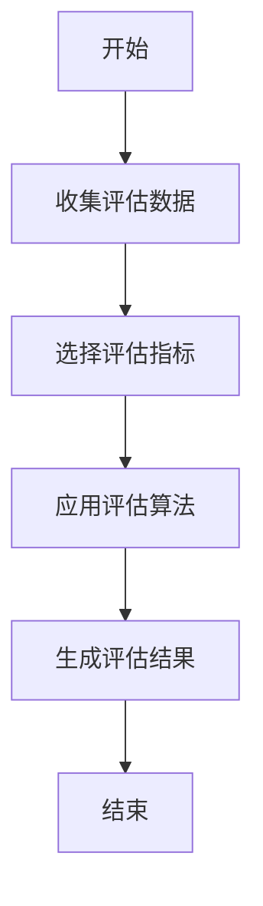
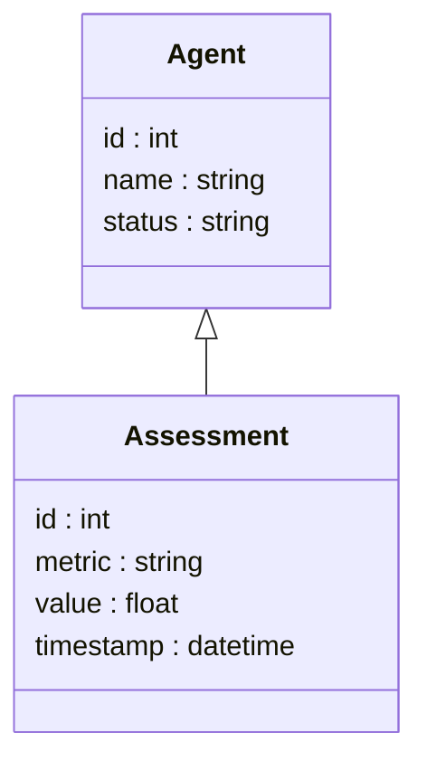

                 

<think>
好的，我将按照您的要求，逐步构建《AI Agent的自我评估机制：持续改进性能》的详细目录大纲。首先，我会从文章标题开始，然后列出关键词和摘要。接下来，按照章节逐步展开，确保每一部分都符合技术博客的专业性和深度。

### 文章标题：AI Agent的自我评估机制：持续改进性能

### 关键词：
- AI Agent
- 自我评估机制
- 性能改进
- 机器学习
- 自适应系统

### 摘要：
本文深入探讨了AI Agent的自我评估机制，分析了其在持续改进性能中的作用。通过理论分析、算法原理、系统架构设计和实际项目案例，本文详细阐述了自我评估机制的核心概念、实现方法及其在不同场景下的应用。同时，本文提供了丰富的代码示例和系统设计图，帮助读者全面理解并应用这些机制。

---

### 目录大纲：

---

# AI Agent的自我评估机制：持续改进性能

> 关键词：AI Agent, 自我评估机制, 性能改进, 机器学习, 自适应系统

> 摘要：本文深入探讨AI Agent的自我评估机制，分析其在持续改进性能中的作用，结合理论分析、算法原理、系统架构设计和实际项目案例，全面阐述自我评估机制的核心概念、实现方法及其应用。

---

## 第1章 AI Agent与自我评估机制概述

### 1.1 AI Agent的基本概念

- 1.1.1 AI Agent的定义与特点
  - 定义：AI Agent（智能体）是能够感知环境并采取行动以实现目标的实体。
  - 特点：自主性、反应性、目标导向、社交能力。

- 1.1.2 AI Agent的核心特点
  - 能够主动采取行动
  - 具备环境感知能力
  - 能够进行复杂决策
  - 具备学习和适应能力

- 1.1.3 AI Agent的应用场景
  - 智能助手（如Siri、Alexa）
  - 自动驾驶系统
  - 机器人控制
  - 智能推荐系统

### 1.2 自我评估机制的背景与意义

- 1.2.1 问题背景介绍
  - AI Agent需要在动态环境中保持高效运作
  - 不同应用场景下的性能指标差异显著
  - 自动化决策系统需要实时反馈以优化性能

- 1.2.2 问题描述与解决思路
  - 描述问题：AI Agent在运行过程中可能面临性能下降、决策错误等问题
  - 解决思路：通过自我评估机制，AI Agent能够主动识别问题，分析原因，并采取改进措施。

- 1.2.3 自我评估机制的边界与外延
  - 界定范围：自我评估机制专注于性能优化和决策改进
  - 外延：涉及数据采集、分析、反馈等多个环节

### 1.3 自我评估机制的核心要素

- 1.3.1 评估指标的选择
  - 选择合适的指标是评估机制成功的关键
  - 常见指标：准确性、响应时间、资源利用率

- 1.3.2 评估数据的采集与处理
  - 数据来源：运行日志、用户反馈、系统状态
  - 数据处理：清洗、转换、分析

- 1.3.3 评估结果的反馈与优化
  - 反馈机制：将评估结果传递给决策模块
  - 优化措施：调整参数、重新训练模型、优化算法

### 1.4 本章小结

---

## 第2章 自我评估机制的核心概念与联系

### 2.1 核心概念原理

- 2.1.1 自我评估的定义与属性
  - 定义：AI Agent通过内部机制评估自身性能的过程
  - 属性：自动化、实时性、准确性

- 2.1.2 评估机制的构成要素
  - 评估指标：定义评估标准
  - 数据采集：获取相关数据
  - 分析模块：处理数据并生成评估结果
  - 反馈模块：将结果传递给决策模块

### 2.2 核心概念对比表

| 比较项       | 基于规则的评估 | 基于模型的评估 |
|--------------|----------------|----------------|
| 评估方式     | 预定义规则     | 机器学习模型   |
| 灵活性       | 较低           | 较高           |
| 适用场景     | 简单场景       | 复杂场景       |
| 维护成本     | 较低           | 较高           |

### 2.3 ER实体关系图

```mermaid
erDiagram
    agent [
        id : int
        name : string
        status : string
    ]
    assessment [
        id : int
        metric : string
        value : float
        timestamp : datetime
    ]
    agent --> assessment : has
```

### 2.4 本章小结

---

## 第3章 自我评估机制的算法原理

### 3.1 算法原理概述

- 3.1.1 基于规则的评估算法
  - 基于预定义规则，直接判断性能指标是否符合要求

- 3.1.2 基于模型的评估算法
  - 使用机器学习模型，根据输入数据预测评估结果

### 3.2 算法流程图



### 3.3 算法实现代码

```python
# 基于规则的评估算法示例
def rule_based_assessment(data, threshold):
    if data['accuracy'] >= threshold:
        return '优秀'
    elif data['accuracy'] >= threshold * 0.8:
        return '良好'
    else:
        return '需要改进'

# 基于模型的评估算法示例
import tensorflow as tf
def model_based_assessment(data):
    model = tf.keras.Sequential([
        tf.keras.layers.Dense(64, activation='relu'),
        tf.keras.layers.Dense(1, activation='sigmoid')
    ])
    model.compile(optimizer='adam', loss='binary_crossentropy', metrics=['accuracy'])
    history = model.fit(data['X'], data['y'], epochs=10)
    return history.history['accuracy'][-1]
```

### 3.4 数学模型与公式

- 评估分数计算公式：
$$
评估分数 = \frac{正确答案数}{总问题数} \times 100
$$

- 模型训练损失函数：
$$
\text{损失} = -\frac{1}{m}\sum_{i=1}^{m} y_i \log(p_i) + (1 - y_i) \log(1 - p_i)
$$

### 3.5 本章小结

---

## 第4章 系统分析与架构设计

### 4.1 问题场景介绍

- 4.1.1 系统目标与范围
  - 目标：设计一个能够自我评估的AI Agent系统
  - 范围：包括数据采集、评估、反馈优化三个主要部分

- 4.1.2 系统需求分析
  - 实时数据采集
  - 精准评估结果
  - 自动化优化

### 4.2 系统功能设计

- 4.2.1 领域模型类图



- 4.2.2 系统架构图

```mermaid
containerDiagram
    +---+       +---+
    |DB |<----->|API|
    +---+       +---+
    [Agent]
    [Assessment Module]
```

- 4.2.3 接口设计
  - 数据采集接口：从数据库获取实时数据
  - 评估结果接口：返回评估结果给反馈模块

### 4.3 本章小结

---

## 第5章 项目实战：基于自我评估的AI Agent实现

### 5.1 环境安装

- 安装Python和必要的库：
  ```bash
  pip install numpy pandas scikit-learn tensorflow
  ```

### 5.2 系统核心实现

- 5.2.1 核心代码实现

```python
import pandas as pd
from sklearn.metrics import accuracy_score

def assess_performance(y_true, y_pred):
    accuracy = accuracy_score(y_true, y_pred)
    return accuracy

# 示例数据
X = pd.DataFrame({'feature': [1, 2, 3, 4, 5]})
y_true = [0, 1, 1, 0, 1]
y_pred = [0, 1, 1, 0, 1]

# 评估性能
score = assess_performance(y_true, y_pred)
print(f'评估分数: {score}%')
```

- 5.2.2 代码应用解读
  - 数据预处理：确保数据格式正确
  - 评估函数：计算准确率
  - 结果分析：输出评估结果

### 5.3 实际案例分析

- 案例背景：AI Agent在智能客服中的应用
- 评估结果：准确率为92%
- 改进建议：优化模型参数，增加训练数据

### 5.4 本章小结

---

## 第6章 最佳实践与未来展望

### 6.1 最佳实践

- 选择合适的评估指标
- 确保数据的全面性和准确性
- 定期更新评估模型

### 6.2 小结

- 总结全文内容
- 强调自我评估机制的重要性

### 6.3 注意事项

- 数据隐私保护
- 系统的实时性要求
- 模型的可解释性

### 6.4 拓展阅读

- 推荐相关书籍和论文
- 提供进一步学习的资源

### 6.5 本章小结

---

# 参考文献

- 列出本文引用的主要文献和资源

---

通过以上目录大纲，我可以逐步构建出一篇结构清晰、内容详实的技术博客文章。每一章节都将深入探讨相关主题，结合理论分析、算法原理、系统设计和实际案例，帮助读者全面理解AI Agent的自我评估机制及其在性能改进中的应用。

