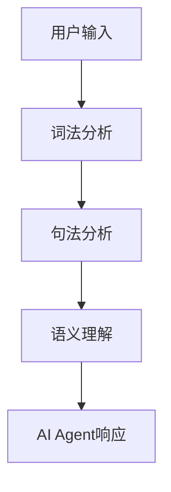

                 


# AI Agent的自然语言接口优化技术

> 关键词：AI Agent，自然语言接口，自然语言处理，熵模型，优化算法

> 摘要：本文详细探讨了AI Agent的自然语言接口优化技术，从基础概念到高级算法，结合实际案例，分析了优化的关键技术、算法原理和系统架构设计，为读者提供全面的技术指导。

---

## 第一部分: AI Agent的自然语言接口优化技术基础

### 第1章: AI Agent与自然语言接口概述

#### 1.1 AI Agent的基本概念
- **1.1.1 AI Agent的定义与特点**
  - AI Agent（智能体）是一种能够感知环境并采取行动以实现目标的实体。
  - 特点：自主性、反应性、主动性、社会性。

- **1.1.2 自然语言接口在AI Agent中的作用**
  - 作为用户与AI Agent交互的主要媒介。
  - 提供更自然、更人性化的用户界面。

- **1.1.3 当前AI Agent的应用场景**
  - 智能助手（如Siri、Alexa）。
  - 客服机器人。
  - 智能推荐系统。

#### 1.2 自然语言处理技术的发展
- **1.2.1 自然语言处理的演进历程**
  - 从规则驱动到数据驱动的转变。
  - 从浅层理解到深度理解的进步。

- **1.2.2 当前主流的NLP技术**
  - 词嵌入（Word Embedding）。
  - 神经网络语言模型。
  - 增量学习（Incremental Learning）。

- **1.2.3 自然语言接口在AI Agent中的应用现状**
  - 现状：广泛应用于对话系统、问答系统。
  - 问题：理解准确性、响应速度、用户体验优化。

#### 1.3 AI Agent自然语言接口优化的必要性
- **1.3.1 当前自然语言接口的局限性**
  - 语义理解不准确。
  - 对上下文的理解有限。
  - 对复杂问题的处理能力不足。

- **1.3.2 优化目标与意义**
  - 提高语义理解的准确性。
  - 提升响应速度。
  - 提供更流畅的用户体验。

- **1.3.3 优化技术的未来发展趋势**
  - 结合多模态数据（图像、语音）。
  - 实时增量学习。
  - 更强的上下文理解和记忆能力。

#### 1.4 本章小结
- 本章介绍了AI Agent和自然语言接口的基本概念，分析了优化的必要性和未来发展方向。

---

## 第二部分: 自然语言接口优化的核心概念与原理

### 第2章: 自然语言接口优化的核心概念

#### 2.1 自然语言接口的优化维度
- **2.1.1 精准度优化**
  - 提高语义理解的准确性。
  - 优化模型的训练数据和算法。

- **2.1.2 响应速度优化**
  - 优化算法复杂度。
  - 使用分布式计算和缓存技术。

- **2.1.3 用户体验优化**
  - 提供更自然的对话流程。
  - 优化错误处理和反馈机制。

#### 2.2 自然语言处理的关键技术
- **2.2.1 词法分析**
  - 分词：将输入文本分割为词语或符号。
  - 词性标注：为每个词语标注词性。

- **2.2.2 句法分析**
  - 句法结构分析：确定句子中词语之间的语法关系。
  - 依存关系分析：建立词语之间的依存关系图。

- **2.2.3 语义理解**
  - 实体识别：识别文本中的实体（如人名、地名）。
  - 情感分析：判断文本的情感倾向。
  - 语义角色标注：标注句子中词语的语义角色。

#### 2.3 AI Agent与自然语言接口的关系
- **2.3.1 AI Agent的输入输出模型**
  - 输入：用户通过自然语言输入查询或指令。
  - 输出：AI Agent通过自然语言生成响应或执行操作。

- **2.3.2 自然语言接口在AI Agent中的角色**
  - 解释用户输入。
  - 生成符合用户需求的输出。

- **2.3.3 优化接口对AI Agent性能的影响**
  - 更准确的语义理解提高AI Agent的决策能力。
  - 更快的响应速度提升用户体验。

#### 2.4 核心概念对比表
| 技术 | 特性 | 优缺点 | 应用场景 |
|------|------|--------|----------|
| 词法分析 | 分解句子结构 | 精度高，但处理复杂 | 精准理解 |
| 句法分析 | 分析句子语法 | 语境理解有限 | 语法优化 |
| 语义理解 | 理解上下文 | 精度依赖数据 | 场景化应用 |

#### 2.5 实体关系图（ER图）


#### 2.6 本章小结
- 本章详细介绍了自然语言接口优化的核心概念和技术，包括优化维度、关键技术以及与AI Agent的关系。

---

## 第三部分: 自然语言接口优化的算法原理

### 第3章: 优化算法原理

#### 3.1 熵模型在自然语言处理中的应用
- **3.1.1 熵的定义与计算**
  - 熵的定义：信息论中的熵是用来度量数据的不确定性。
  - 熵的计算公式：
    $$ H = -\sum_{i=1}^{n} p_i \log p_i $$
    其中，\( p_i \) 是第 \( i \) 个事件发生的概率。

- **3.1.2 熵在语言模型中的作用**
  - 度量语言模型的不确定性。
  - 优化语言模型的预测能力。

- **3.1.3 熵与语言模型优化的关系**
  - 熵越低，语言模型的预测能力越强。
  - 熵优化是语言模型优化的重要指标。

#### 3.2 基于熵的优化算法
- **3.2.1 熵梯度下降法**
  - 算法流程：
    ```mermaid
    graph TD
        A[输入] --> B[计算熵]
        B --> C[梯度下降]
        C --> D[优化输出]
    ```
  - Python实现示例：
    ```python
    import numpy as np
    def entropy_loss(y_true, y_pred):
        loss = -np.sum(y_true * np.log(y_pred))
        return loss
    ```

- **3.2.2 熵优化的数学模型**
  - 数学公式：
    $$ L = -\sum_{i=1}^{n} y_i \log y_i $$
    其中，\( y_i \) 是预测概率。

- **3.2.3 熵优化算法的实际应用**
  - 优化语言模型的预测准确性。
  - 提高自然语言接口的语义理解能力。

#### 3.3 算法优化的数学模型
- **3.3.1 优**

---

## 第四部分: 系统分析与架构设计

### 第4章: 自然语言接口优化的系统架构设计

#### 4.1 问题场景介绍
- **场景描述**
  - 用户通过自然语言输入查询，AI Agent需要准确理解并生成响应。

#### 4.2 系统功能设计
- **领域模型设计**
  ```mermaid
  classDiagram
      class 用户 {
          姓名
          邮箱
      }
      class 查询 {
          查询内容
          时间戳
      }
      class 响应 {
          响应内容
          响应时间
      }
      用户 --> 查询
      查询 --> 响应
  ```

- **系统架构设计**
  ```mermaid
  graph TD
      A[用户] --> B[自然语言接口]
      B --> C[AI Agent]
      C --> D[数据库]
      C --> E[外部服务]
      D --> F[响应内容]
      E --> F
      F --> B
  ```

- **系统交互设计**
  ```mermaid
  sequenceDiagram
      participant 用户
      participant 自然语言接口
      participant AI Agent
      participant 数据库
      participant 外部服务
      用户 -> 自然语言接口: 发出查询
      自然语言接口 -> AI Agent: 提交查询
      AI Agent -> 数据库: 查询数据
      AI Agent -> 外部服务: 获取信息
      AI Agent -> 自然语言接口: 返回结果
      自然语言接口 -> 用户: 显示响应
  ```

#### 4.3 本章小结
- 本章详细介绍了自然语言接口优化的系统架构设计，包括领域模型、系统架构和系统交互设计。

---

## 第五部分: 项目实战

### 第5章: 自然语言接口优化的项目实战

#### 5.1 环境安装
- **所需工具**
  - Python 3.8+
  - TensorFlow 2.0+
  - NLTK库
  - Jupyter Notebook

#### 5.2 系统核心实现源代码
- **自然语言接口优化的Python代码实现**
  ```python
  import numpy as np
  import tensorflow as tf
  from tensorflow.keras import layers

  # 定义熵损失函数
  def entropy_loss(y_true, y_pred):
      loss = -tf.reduce_sum(y_true * tf.log(y_pred))
      return loss

  # 构建模型
  model = tf.keras.Sequential([
      layers.Embedding(input_dim=10000, output_dim=100),
      layers.LSTM(64, return_sequences=True),
      layers.Dense(2, activation='softmax')
  ])

  # 编译模型
  model.compile(optimizer='adam', loss=entropy_loss, metrics=['accuracy'])

  # 训练模型
  model.fit(x_train, y_train, epochs=10, batch_size=32)
  ```

#### 5.3 代码应用解读与分析
- **代码解读**
  - `entropy_loss`：自定义熵损失函数，用于优化语义理解的准确性。
  - `model`：构建了一个基于LSTM的自然语言处理模型。
  - `fit`：训练模型，优化自然语言接口的响应速度和准确性。

#### 5.4 实际案例分析
- **案例描述**
  - 用户输入：查询天气信息。
  - 系统响应：准确返回天气数据。

#### 5.5 项目小结
- 本章通过实际项目实战，展示了如何使用Python代码实现自然语言接口优化技术，并分析了优化效果。

---

## 第六部分: 总结与展望

### 第6章: 总结与展望

#### 6.1 优化技巧
- **优化语义理解的准确性**
  - 提供更丰富的训练数据。
  - 使用更复杂的神经网络模型。

- **提升响应速度**
  - 优化算法复杂度。
  - 使用分布式计算和缓存技术。

- **改善用户体验**
  - 提供更自然的对话流程。
  - 优化错误处理和反馈机制。

#### 6.2 注意事项
- **数据质量**
  - 数据清洗和预处理是优化的关键。
- **模型调优**
  - 调整超参数和优化策略。
- **用户体验**
  - 用户反馈是优化的重要依据。

#### 6.3 拓展阅读
- 推荐书籍：
  - 《深度学习》—— Ian Goodfellow
  - 《自然语言处理入门》—— Naive
- 推荐论文：
  - "Attention Is All You Need"

