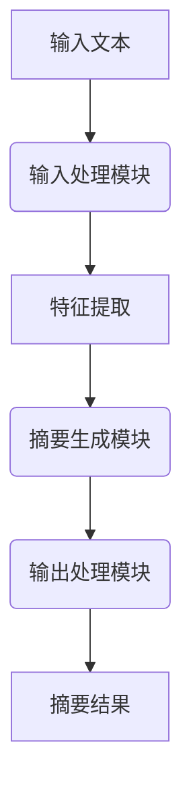
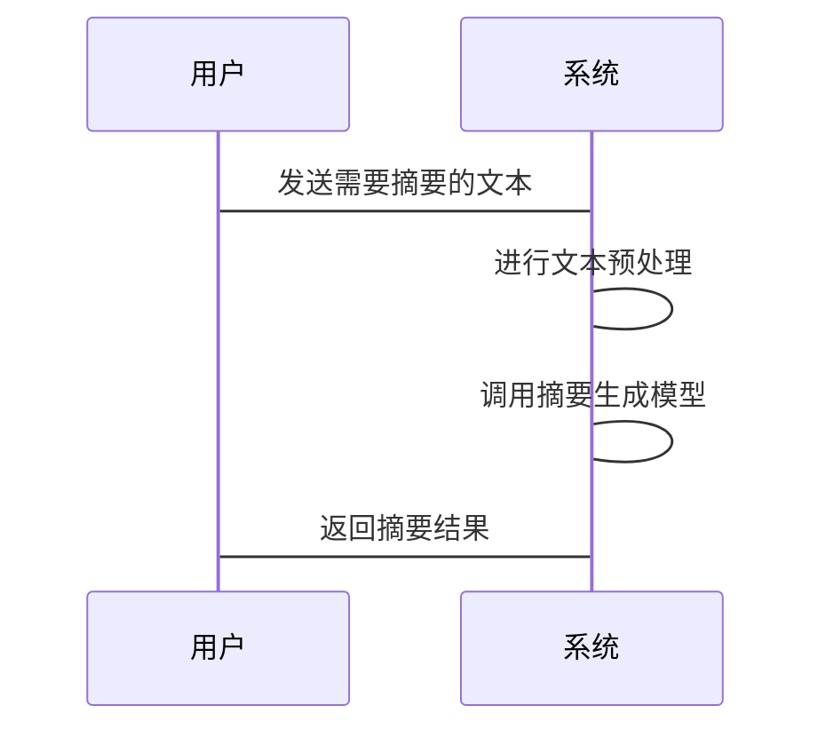

                 


# AI Agent的自然语言摘要生成技术

> 关键词：AI Agent, 自然语言处理, 摘要生成, 深度学习, Transformer模型

> 摘要：本文系统地介绍了AI Agent在自然语言摘要生成技术中的应用，探讨了摘要生成的核心概念、算法原理、系统架构以及实际项目实现。通过详细的理论分析和代码示例，深入剖析了当前技术的最新进展和未来发展方向，为读者提供了全面的技术指南。

---

## 第1章 AI Agent与自然语言处理概述

### 1.1 AI Agent的基本概念

#### 1.1.1 AI Agent的定义与特点
- AI Agent的定义
- AI Agent的核心特点（自主性、反应性、主动性）
- AI Agent的应用场景

#### 1.1.2 AI Agent的核心功能
- 信息处理与分析
- 决策与执行
- 人机交互

#### 1.1.3 自然语言处理在AI Agent中的作用
- 自然语言理解（NLU）
- 自然语言生成（NLG）

### 1.2 自然语言摘要生成技术的背景

#### 1.2.1 自然语言处理的发展历程
- 从规则驱动到数据驱动的转变
- 深度学习在NLP中的应用

#### 1.2.2 摘要生成技术的演变
- 早期统计方法
- 基于神经网络的摘要生成

#### 1.2.3 AI Agent与摘要生成技术的结合
- 摘要生成在对话系统中的应用
- 摘要生成在信息检索中的作用

### 1.3 本章小结
- 总结AI Agent与自然语言处理的关系
- 强调摘要生成技术的重要性

---

## 第2章 自然语言摘要生成的核心概念

### 2.1 摘要生成的定义与分类

#### 2.1.1 摘要生成的定义
- 摘要生成的定义与目标

#### 2.1.2 摘要生成的主要分类
- 基于提取的摘要生成
- 基于生成的摘要生成
- 混合式摘要生成

#### 2.1.3 摘要生成的关键指标与评估方法
- BLEU、ROUGE等指标的定义与计算方式

### 2.2 AI Agent中的摘要生成需求

#### 2.2.1 AI Agent对摘要生成的需求分析
- 摘要生成的实时性要求
- 摘要生成的准确性要求

#### 2.2.2 摘要生成在对话系统中的应用
- 响应摘要生成
- 历史对话摘要

#### 2.2.3 摘要生成在信息检索中的作用
- 文档摘要生成
- 多文档摘要生成

### 2.3 摘要生成的核心要素

#### 2.3.1 输入文本的特征分析
- 文本长度、领域、语言等特征

#### 2.3.2 摘要输出的语义要求
- 语义保留、语法正确性

#### 2.3.3 摘要生成的约束条件
- 长度限制、格式要求

---

## 第3章 自然语言摘要生成的算法原理

### 3.1 基于统计的摘要生成方法

#### 3.1.1 传统统计模型的基本原理
- 基于频率的统计方法
- 基于语言模型的概率方法

#### 3.1.2 基于关键词提取的摘要方法
- TF-IDF算法
- LDA主题模型

#### 3.1.3 基于句子重要性的排序方法
- TextRank算法

### 3.2 基于深度学习的摘要生成方法

#### 3.2.1 神经网络在摘要生成中的应用
- 基于编码器-解码器的摘要生成模型

#### 3.2.2 基于Transformer的摘要生成模型
- Transformer模型的基本结构
- 多头注意力机制

#### 3.2.3 深度学习模型的数学原理
- 编码器与解码器的数学模型
- 注意力机制的公式推导

### 3.3 案例分析与代码实现

#### 3.3.1 使用Python实现简单的摘要生成器
```python
import numpy as np
from tensorflow.keras.models import Model
from tensorflow.keras.layers import Dense, LSTM, Input
# 模型定义
input_layer = Input(shape=(max_sequence_length, embedding_dim))
encoder LSTM层
decoder LSTM层
# 编码器输出
encoder_output = encoder_lstm(input_layer)
# 解码器输入
decoder_input = Input(shape=(None, embedding_dim))
decoder_output = decoder_lstm(decoder_input)
# 输出层
dense_layer = Dense(vocabulary_size, activation='softmax')(decoder_output)
model = Model(inputs=[input_layer, decoder_input], outputs=dense_layer)
# 模型编译
model.compile(optimizer='adam', loss='sparse_categorical_crossentropy')
```

#### 3.3.2 基于预训练模型的摘要生成代码示例
```python
from transformers import BartForConditionalGeneration, BartTokenizer

tokenizer = BartTokenizer.from_pretrained('facebook/bart-large')
model = BartForConditionalGeneration.from_pretrained('facebook/bart-large')

input_text = "Detailed analysis of AI Agent's natural language processing techniques."
inputs = tokenizer.encode_plus(input_text, max_length=100, truncation=True, padding='max_length', return_tensors='pt')
summary_ids = model.generate(inputs['input_ids'], num_beams=5, max_length=50, early_stopping=True)
summary = tokenizer.decode(summary_ids[0], skip_special_tokens=True)
print(summary)
```

---

## 第4章 AI Agent的自然语言摘要生成系统架构与实现

### 4.1 系统架构设计

#### 4.1.1 系统功能模块划分
- 输入处理模块
- 摘要生成模块
- 输出处理模块

#### 4.1.2 系统架构图


#### 4.1.3 系统交互序列图


### 4.2 系统实现细节

#### 4.2.1 输入处理模块
- 文本预处理（分词、去停用词）
- 特征提取（文本长度、关键词提取）

#### 4.2.2 摘要生成模块
- 模型选择与训练
- 模型调优与优化

#### 4.2.3 输出处理模块
- 摘要结果的格式化
- 多样化生成策略

### 4.3 系统优化与调优

#### 4.3.1 模型选择与优化
- 预训练模型的选择与微调
- 超参数优化（学习率、批量大小）

#### 4.3.2 性能优化策略
- 并行计算加速
- 模型压缩与轻量化

#### 4.3.3 摘要结果的评估与优化
- 使用BLEU、ROUGE等指标评估摘要质量
- 优化算法以提高摘要的准确性和流畅性

---

## 第5章 项目实战：构建一个AI Agent摘要生成系统

### 5.1 项目背景与需求分析

#### 5.1.1 项目背景
- 简述项目目标和应用场景
- 分析用户需求和功能需求

### 5.2 系统设计与实现

#### 5.2.1 系统功能设计
- 用户界面设计
- 摘要生成流程设计

#### 5.2.2 系统架构实现
- 后端实现（使用Flask或Django）
- 前端实现（使用React或Vue.js）

#### 5.2.3 系统接口设计
- API设计与文档
- 接口调用与测试

### 5.3 代码实现与案例分析

#### 5.3.1 环境安装与配置
- 安装必要的Python库（如Transformers、TensorFlow等）
- 配置开发环境（IDE、虚拟环境）

#### 5.3.2 核心代码实现
```python
# 后端代码示例
from flask import Flask, request, jsonify
from transformers import BartForConditionalGeneration, BartTokenizer

app = Flask(__name__)
tokenizer = BartTokenizer.from_pretrained('facebook/bart-large')
model = BartForConditionalGeneration.from_pretrained('facebook/bart-large')

@app.route('/generate_summary', methods=['POST'])
def generate_summary():
    data = request.json
    input_text = data['text']
    inputs = tokenizer.encode_plus(input_text, max_length=100, truncation=True, padding='max_length', return_tensors='pt')
    summary_ids = model.generate(inputs['input_ids'], num_beams=5, max_length=50, early_stopping=True)
    summary = tokenizer.decode(summary_ids[0], skip_special_tokens=True)
    return jsonify({'summary': summary})

if __name__ == '__main__':
    app.run(debug=True)
```

#### 5.3.3 案例分析与结果展示
- 简单的输入输出案例
- 复杂场景下的摘要生成

### 5.4 项目总结与优化建议

#### 5.4.1 项目总结
- 总结项目实现的关键点
- 分析系统性能和用户体验

#### 5.4.2 系统优化建议
- 模型优化建议
- 系统性能优化建议

---

## 第6章 最佳实践与未来展望

### 6.1 最佳实践

#### 6.1.1 模型选择与调优
- 如何选择合适的预训练模型
- 如何进行有效的模型微调

#### 6.1.2 系统设计与实现
- 如何设计高效的系统架构
- 如何进行接口设计与优化

#### 6.1.3 摘要生成的多样化与个性化
- 如何生成多样化的摘要
- 如何实现个性化摘要生成

### 6.2 未来展望

#### 6.2.1 摘要生成技术的发展趋势
- 更加智能化与个性化的摘要生成
- 多模态摘要生成技术

#### 6.2.2 AI Agent的未来发展
- AI Agent在不同领域的应用扩展
- 更加智能和人性化的交互设计

### 6.3 小结

---

## 参考文献
- 列出相关书籍、论文和在线资源

---

## 附录
- 附录A：常见问题解答
- 附录B：代码示例汇总
- 附录C：模型与工具资源

---

以上是一个详细的技术博客文章目录大纲，涵盖了AI Agent的自然语言摘要生成技术的各个方面，从理论到实践，从算法到系统设计，为读者提供了全面的学习和参考路径。

