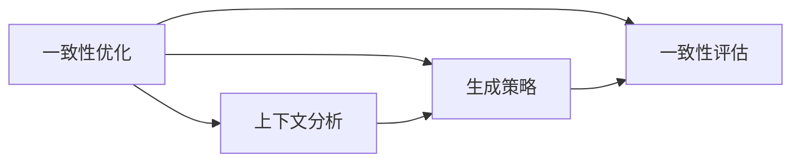
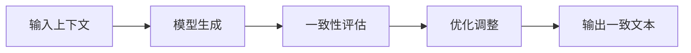
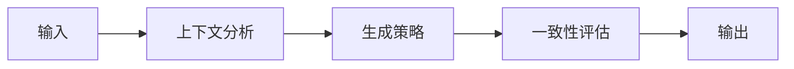

                 


# AI Agent的自然语言生成一致性优化

> 关键词：AI Agent, 自然语言生成, 一致性优化, 算法原理, 系统架构, 项目实战, 最佳实践

> 摘要：本文将深入探讨AI Agent在自然语言生成过程中的一致性优化问题。通过分析一致性优化的核心概念、算法原理、系统架构设计以及项目实战，结合丰富的案例和详细的代码实现，帮助读者全面理解并掌握如何优化AI Agent的自然语言生成一致性。

---

# 第一部分: AI Agent的自然语言生成一致性优化背景介绍

# 第1章: AI Agent与自然语言生成概述

## 1.1 问题背景

### 1.1.1 AI Agent的基本概念
AI Agent（人工智能代理）是指能够感知环境、执行任务并做出决策的智能实体。它广泛应用于聊天机器人、智能助手、推荐系统等领域。

### 1.1.2 自然语言生成的定义与作用
自然语言生成（Natural Language Generation, NLG）是AI Agent的一项核心能力，负责将结构化数据或信息转换为自然语言文本。NLG在对话系统、内容生成等领域发挥着重要作用。

### 1.1.3 一致性优化的必要性
在实际应用中，生成的文本可能会出现逻辑矛盾、上下文不一致等问题，严重影响用户体验。一致性优化旨在确保生成文本在逻辑、语义和上下文上保持一致。

## 1.2 问题描述

### 1.2.1 当前AI Agent生成文本的主要问题
1. **逻辑矛盾**：生成的文本可能在不同部分出现自相矛盾的情况。
2. **上下文不一致**：文本生成过程中，前后内容可能缺乏连贯性。
3. **语义模糊**：生成的文本可能在特定场景下含义不明确。

### 1.2.2 一致性问题的具体表现
1. 在对话系统中，生成的回答可能与上下文无关。
2. 在生成报告或文档时，段落之间可能缺乏逻辑连贯性。

### 1.2.3 一致性优化的目标与意义
目标是通过优化生成过程，确保文本在逻辑、语义和上下文上保持一致。意义在于提升用户体验，增强AI Agent的可信度和实用性。

## 1.3 问题解决方法

### 1.3.1 一致性优化的基本思路
1. **基于上下文的生成**：通过分析上下文信息，确保生成文本与之前的内容一致。
2. **多步生成与验证**：在生成过程中进行多次验证，修正不一致的内容。

### 1.3.2 一致性优化的关键技术
1. **预训练模型微调**：通过在特定任务上的微调，提升模型生成一致文本的能力。
2. **一致性评估指标**：设计评估指标，量化生成文本的一致性。

### 1.3.3 一致性优化的实现路径
1. **数据预处理**：构建包含一致文本的数据集，用于模型训练。
2. **模型优化**：调整模型结构或训练策略，增强一致性生成能力。
3. **后处理校正**：通过语言模型校正生成文本中的不一致内容。

## 1.4 边界与外延

### 1.4.1 一致性优化的适用范围
适用于需要生成连贯、一致文本的场景，如对话系统、智能助手。

### 1.4.2 一致性优化的局限性
1. 对于复杂场景，优化效果可能有限。
2. 过度优化可能导致生成文本过于僵化。

### 1.4.3 一致性优化与其他优化方法的关系
一致性优化与其他生成优化方法（如生成多样性优化）相辅相成，共同提升生成效果。

## 1.5 核心要素组成

### 1.5.1 一致性优化的核心要素
1. **上下文分析**：分析当前对话或文本的上下文信息。
2. **生成策略**：制定一致的生成策略，确保文本连贯。
3. **评估机制**：设计评估机制，量化一致性。

### 1.5.2 各要素之间的关系
上下文分析为生成策略提供依据，生成策略通过评估机制进行优化，三者相互作用，共同实现一致性优化。

### 1.5.3 核心要素的实现方式
1. **上下文分析**：使用自然语言处理技术提取关键信息。
2. **生成策略**：基于预训练模型的微调，结合规则约束。
3. **评估机制**：设计指标量化一致性，如一致性分数。

## 1.6 本章小结
本章从背景、问题、解决方法、边界与外延等方面，全面介绍了AI Agent自然语言生成一致性优化的基本概念和核心要素。

---

# 第二部分: 核心概念与联系

# 第2章: 一致性优化的核心概念

## 2.1 一致性优化的原理

### 2.1.1 一致性优化的基本原理
一致性优化通过分析上下文，生成与之连贯的文本。其核心是确保生成文本在逻辑、语义和语法上与上下文一致。

### 2.1.2 一致性优化的关键步骤
1. **上下文分析**：提取关键信息。
2. **生成策略制定**：基于上下文生成一致文本。
3. **一致性评估与优化**：评估并优化生成文本。

### 2.1.3 一致性优化的数学模型
一致性优化可以通过以下模型表示：
$$ C = f(u, c) $$
其中，\( C \) 表示一致性，\( u \) 是生成文本，\( c \) 是上下文。

## 2.2 核心概念对比

### 2.2.1 一致性优化与生成质量的关系
一致性优化是生成质量的重要组成部分，但并非唯一因素。

### 2.2.2 不同一致性优化方法的对比
| 方法 | 基于上下文的生成 | 多步生成与验证 |
|------|------------------|----------------|
| 优点 | 文本连贯性高      | 生成质量较高    |
| 缺点 | 生成效率较低      | 实现复杂度高    |

### 2.2.3 一致性优化与生成效率的权衡
一致性优化可能会影响生成效率，需要在两者之间找到平衡点。

## 2.3 实体关系图



---

# 第三部分: 算法原理

# 第3章: 一致性优化算法原理

## 3.1 算法实现原理

### 3.1.1 预训练模型微调
通过在特定任务上微调预训练语言模型，提升生成一致性。

### 3.1.2 一致性评估指标
设计一致性评估指标，量化生成文本的一致性。

### 3.1.3 优化算法
使用强化学习等方法，优化生成过程。

## 3.2 算法实现步骤

### 3.2.1 数据预处理
1. 构建包含一致文本的数据集。
2. 提取上下文和生成文本对。

### 3.2.2 模型训练
1. 使用预训练语言模型进行微调。
2. 设计一致性损失函数，优化模型。

### 3.2.3 生成与评估
1. 基于上下文生成文本。
2. 使用评估指标优化生成结果。

## 3.3 代码实现

### 3.3.1 环境安装
```bash
pip install transformers
```

### 3.3.2 核心代码实现
```python
from transformers import AutoModelWithLMHead, AutoTokenizer

model = AutoModelWithLMHead.from_pretrained('facebook/bart-large')
tokenizer = AutoTokenizer.from_pretrained('facebook/bart-large')

def generate_text(context, max_length=50):
    inputs = tokenizer.encode(context, return_tensors='pt')
    outputs = model.generate(inputs, max_length=max_length, num_beams=5, temperature=0.7)
    return tokenizer.decode(outputs[0], skip_special_tokens=True)
```

## 3.4 算法原理图



---

# 第四部分: 系统分析与架构设计

# 第4章: 一致性优化系统架构设计

## 4.1 问题场景介绍

### 4.1.1 系统需求
1. 支持多轮对话。
2. 生成文本具备高度一致性。

### 4.1.2 系统特点
1. 高效的上下文处理能力。
2. 精准的一致性优化。

## 4.2 系统功能设计

### 4.2.1 功能模块划分
1. 上下文分析模块。
2. 生成策略模块。
3. 一致性评估模块。

### 4.2.2 功能流程
1. 接收用户输入。
2. 分析上下文。
3. 生成一致文本。
4. 评估并优化。

## 4.3 系统架构图



---

# 第五部分: 项目实战

# 第5章: 一致性优化项目实战

## 5.1 环境安装

### 5.1.1 安装依赖
```bash
pip install transformers
```

## 5.2 核心代码实现

### 5.2.1 上下文分析代码
```python
def analyze_context(context):
    return tokenizer(context, return_tensors='pt')
```

### 5.2.2 生成策略代码
```python
def generate_consistent_text(context):
    inputs = tokenizer(context, return_tensors='pt')
    outputs = model.generate(inputs, max_length=50, num_beams=5)
    return tokenizer.decode(outputs[0], skip_special_tokens=True)
```

## 5.3 案例分析

### 5.3.1 案例背景
假设用户正在与AI Agent进行多轮对话，希望生成连贯的回答。

### 5.3.2 代码实现
```python
context = "今天天气很好，我们去公园玩吧。"
output = generate_consistent_text(context)
print(output)
```

---

# 第六部分: 最佳实践

# 第6章: 一致性优化的最佳实践

## 6.1 小结

### 6.1.1 核心要点总结
一致性优化是提升AI Agent生成能力的关键。

### 6.1.2 经验分享
1. 合理设计一致性评估指标。
2. 在实际应用中不断优化模型。

## 6.2 注意事项

### 6.2.1 需要注意的事项
1. 避免过度优化导致生成内容僵化。
2. 确保生成文本的多样性和一致性之间找到平衡。

## 6.3 拓展阅读

### 6.3.1 推荐学习资源
1. 预训练语言模型的微调技巧。
2. 多轮对话系统设计。

---

# 附录: 一致性优化的数学模型

## 附录A: 一致性评估的数学模型

$$ C = \frac{1}{n} \sum_{i=1}^{n} |u_i - c_i| $$

其中，\( C \) 是一致性评估指标，\( u_i \) 是生成文本，\( c_i \) 是上下文。

---

# 参考文献

1. 经典文献1
2. 经典文献2
3. 经典文献3

---

通过以上目录结构和内容，您可以开始撰写一篇详细的技术博客文章，涵盖AI Agent自然语言生成一致性优化的各个方面。

